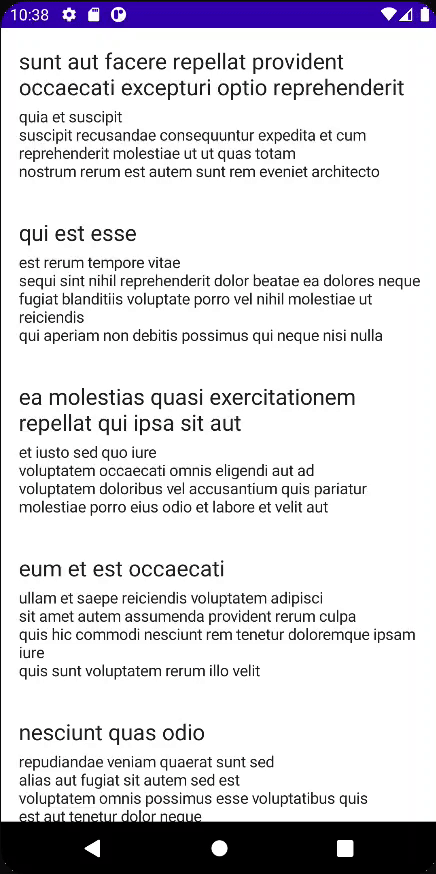

# How to Make HTTP Requests With Ktor-Client

코틀린으로 만들어진 Ktor-Client를 사용해보자. [여기서](https://github.com/philipplackner/KtorClientAndroid.git) Initial 프로젝트를
클론한다. [{JSON} Placeholder](https://jsonplaceholder.typicode.com/)에서 JSON을 가져다 사용할 것이다.

우선 `data.remote.dto` 패키지 생성 후 `PostResponse` data class를 만들어준다.

```kotlin
@Serializable
data class PostResponse(
        val body: String,
        val title: String,
        val id: Int,
        val userId: Int
)
```

동일한 패키지에 `PostRequest` data class도 생성해준다.

```kotlin
@Serializable
data class PostRequest(
        val body: String,
        val title: String,
        val userId: Int
)
```

`data/remote` 패키지에 `PostService` 인터페이스를 생성하고 작성해준다.

```kotlin
interface PostsService {

    suspend fun getPosts(): List<PostResponse>

    suspend fun createPost(postRequest: PostRequest): PostResponse?

    companion object {
        fun create(): PostsService {
            return PostsServiceImpl(
                    client = HttpClient(Android) {
                        install(Logging) {
                            level = LogLevel.ALL
                        }
                        install(JsonFeature) {
                            serializer = KotlinxSerializer()
                        }
                    }
            )
        }
    }
}
```

동일한 패키지에 `HttpRoutes`를 만들고 다음과 같이 Route를 작성해준다.

```kotlin
object HttpRoutes {

    private const val BASE_URL = "https://jsonplaceholder.typicode.com"
    const val POSTS = "${BASE_URL}/posts"
}
```

동일한 패키지에 `PostServiceImpl` 구현체를 생성하고 작성한다. 여기서 실제로 Ktor-Client를 사용해 데이터를 가져올 것이다.

```kotlin
class PostsServiceImpl(
        private val client: HttpClient
) : PostsService {
    override suspend fun getPosts(): List<PostResponse> {
        return try {
            client.get { url(HttpRoutes.POSTS) }
        } catch (e: RedirectResponseException) {
            // 3xx - response
            println("Error ${e.response.status.description}")
            emptyList()
        } catch (e: ClientRequestException) {
            // 4xx - response
            println("Error ${e.response.status.description}")
            emptyList()
        } catch (e: ServerResponseException) {
            // 5xx - response
            println("Error ${e.response.status.description}")
            emptyList()
        } catch (e: Exception) {
            println("Error ${e.message}")
            emptyList()
        }
    }

    override suspend fun createPost(postRequest: PostRequest): PostResponse? {
        return try {
            client.post<PostResponse> {
                url(HttpRoutes.POSTS)
                contentType(ContentType.Application.Json)
                body = postRequest
            }
        } catch (e: RedirectResponseException) {
            // 3xx - response
            println("Error ${e.response.status.description}")
            null
        } catch (e: ClientRequestException) {
            // 4xx - response
            println("Error ${e.response.status.description}")
            null
        } catch (e: ServerResponseException) {
            // 5xx - response
            println("Error ${e.response.status.description}")
            null
        } catch (e: Exception) {
            println("Error ${e.message}")
            null
        }
    }
}
```

마지막으로 `MainActivity`를 다음과 같이 작성해준다.

```kotlin
class MainActivity : ComponentActivity() {

    private val service = PostsService.create()

    override fun onCreate(savedInstanceState: Bundle?) {
        super.onCreate(savedInstanceState)
        setContent {
            val posts = produceState<List<PostResponse>>(
                    initialValue = emptyList(),
                    producer = {
                        value = service.getPosts()
                    }
            )
            KtorClientAndroidTheme {
                Surface(color = MaterialTheme.colors.background) {
                    LazyColumn {
                        items(posts.value) {
                            Column(
                                    modifier = Modifier
                                            .fillMaxWidth()
                                            .padding(16.dp)
                            ) {
                                Text(
                                        text = it.title,
                                        fontSize = 20.sp
                                )
                                Spacer(modifier = Modifier.height(4.dp))
                                Text(
                                        text = it.body,
                                        fontSize = 14.sp
                                )

                            }
                        }
                    }
                }
            }
        }
    }
}
```

<div align="center">

</div>

## References

* [How to Make HTTP Requests With Ktor-Client (Cooler Than Retrofit!) - Android Studio Tutorial](https://www.youtube.com/watch?v=3KTXD_ckAX0)