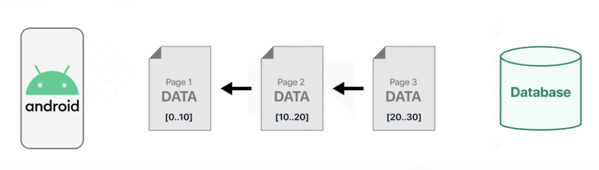
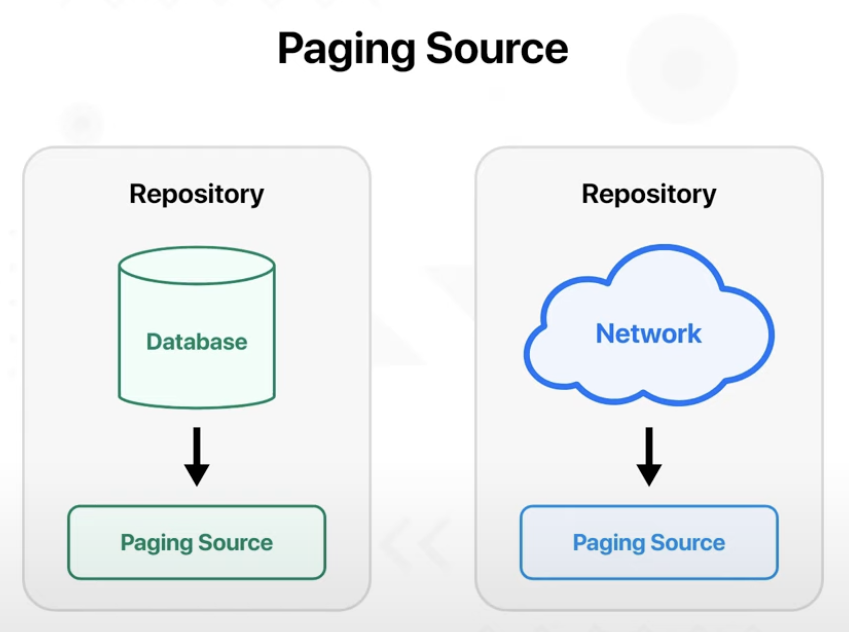
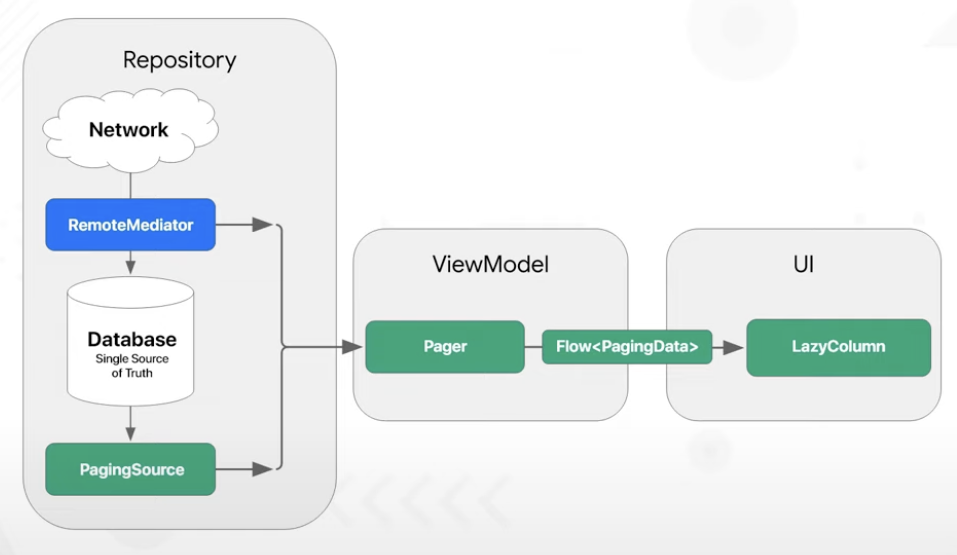
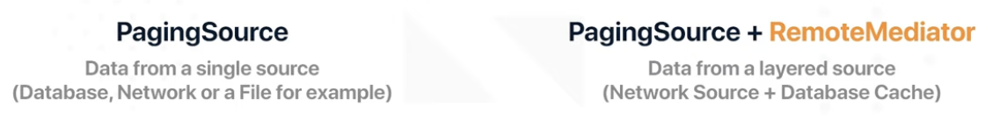

# Introduction

Jetpack Compose에서 Paging 3 라이브러리 사용하는 법을 알아보자. unsplash API를 이용해 서버로부터 이미지를 받아올 것이며 Paging 3 라이브러리를 이용해 paginate 할 것이다.
네트워크로부터 받은 데이터를 paginate하는 것과 Room 라이브러리에서 가져온 데이터를 paginate 하는 방법을 배울 것이다. remote mediator와 remote key를 이용해 서버로부터 받은
데이터를 로컬 디비에 캐싱하고 인터넷이 끊겼을 때 이 데이터에서 읽어오는 것도 알아본다.

## Paging 3 Description

다양한 데이터 소스로부터 데이터를 paginate 하는 것이다. paginate 한다는 것은 page by page로 데이터를 제공하는 것이다.

<div align="center">

</div>

데이터베이스의 모든 데이터를 한 번에 읽는 것이 아닌 페이지별로 읽어오는 것을 의미한다. 이렇게 하면 앱의 퍼포먼스를 높일 수 있다. 페이징 라이브러리는 다음 기능을 포함하고 있다.

- In-memory caching for your paged data.
    - page data로 작업할 때 시스템 리소스를 효율적으로 사용
- First-class support for Kotlin coroutines and Flow.
- Automatically requests the correct page when the user has scrolled to the end of the list.
- Ensures that multiple requests aren’t triggered at the same time.
- Offline caching.
- Tracks loading state.
- Allows you to execute common operations like map or filter.

### Paging Source

페이징 소스는 single data source로부터 받은 데이터를 의미한다.

<div align="center">

</div>

페이징 소스는 Key, Value 2개의 파라미터를 전달받는다. Value 파라미터는 로딩되고 사용자에게 보여지는 데이터의 타입이며, Key는 어떤 데이터의 페이지가 로드되어야 하는지를 의미한다. Key는 보통
Integer 값이며 page number를 의미한다.

Room 라이브러리는 Paging 3 라이브러리를 기본적으로 지원한다. 디비에서 읽어올 때 PagingSource를 반환하는 래퍼 클래스를 추가하기만 하면 된다.

```kotlin
@Query("SELECT * FROM my_table ORDER BY id ASC")
fun getAllItems(): PagingSource<Int, UnsplashImage>
```

### PagingData

페이징 데이터는 하나의 paged data 컨테이너다. 페이징 데이터는 페이징 소스에 데이터를 쿼리한다. LazyColumn에서 스크롤하면 페이징 데이터와 페이징 소스는 notified 되고, 새로운 페이지 데이터를
로딩한다.

### PagingConfig

PagingConfig 클래스는 페이징 데이터가 페이징 소스에 데이터를 어떻게 요청하는지를 정의한다. PagingConfig 클래스는 여러 파라미터를 전달받는다.

1. 첫 번째는 한 번에 얼만큼의 데이터를 가져올지를 정하는 Page Size, 이 크기는 화면에 보여지는 숫자보다 높아야 한다.
2. 두 번째 파라미터는 페이징 소스에서 최초 로드에 대해 요청된 로드 크기를 정의하는 Initial Load Size이다. 일반적으로 페이지 크기보다 더 크다. 앱에서 처음 데이터를 로딩할 때마다 로드되는 데이터가
   Page Size보다 더 많다. 일반적으로 Page Size * 3을 많이 사용한다.
3. 세 번째는 페이지를 삭제하기 전 PagingData에 로드할 수 있는 최대 아이템 수를 정의하는 Max Size이다. 유저가 스크롤백 하는 경우 캐싱해놓는 역할도 수행한다.

한 가지 더 중요한 파라미터는 RemoteMediator이다. RemoteMediator의 기능은 리모트 쿼리와 로컬 저장소를 결합하여 네트워크가 가능하지 않더라도 유저에게 일관되는 데이터를 보여주기 위함이다.
RemoteMediator를 사용하면 offline caching을 쉽게 구현할 수 있다.

<div align="center">

</div>

앱은 디비에 캐시된 데이터만 보여주게 된다. 네트워크에서 직접 UI에 보여주지 않는다. RemoteMediator는 데이터가 부족할 때 즉시 페이징 라이브러리에서 알려주므로 RemoteMediator는 신호로써
동작한다. 이 신호를 통해 네트워크에서 추가적인 데이터를 받아 로컬 디비에 저장한다.

하나의 데이터 소스로부터 페이징을 사용하는 경우 PagingSource만 사용하며, Layered Source에서 데이터를 로딩하려면 PagingSource + RemoteMediator를 사용한다.

<div align="center">

</div>

RemoteMediator에서 한 가지 중요한 부분인 RemoteKeys는 RemoteMediator가 백엔드 서비스에 어떤 데이터를 다음에 로드해야 할지 알려주기 위해 사용한다.

## References

* [Paging 3 & Jetpack Compose - Android Development | Part 1 - Introduction](https://www.youtube.com/watch?v=2Tj0LO5L2Dk&list=PLSrm9z4zp4mEWwyiuYgVMWcDFdsebhM-r&index=34)