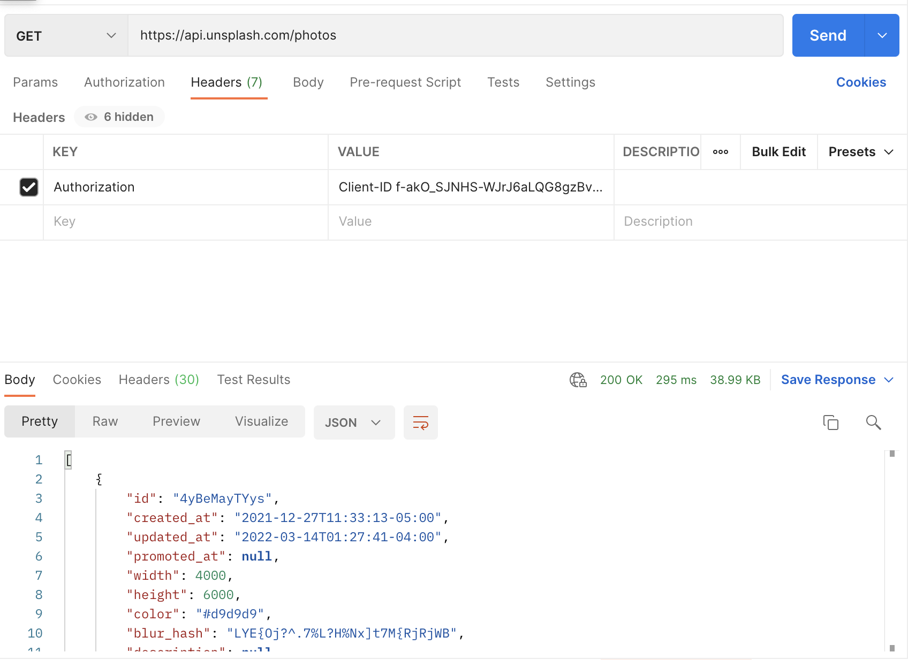

# Unsplash API, Endpoints, Model Classes

[unsplash](https://unsplash.com/) API를 사용하기 위해 계정을 생성하고 이 API를 사용해 데이터를 가져오도록
구현해보자. [여기로](https://unsplash.com/oauth/applications) 접근해 Demo 애플리케이션을 만든다. 그리고 Access Key와 Secret Key를 확인한다.

Header의 Authorization에 `Client-ID {Access Key}`를 넣고 /photos route로 요청해보자.

<div align="center">

</div>

## Setup Project

이제 프로젝트를 생성하고 디펜던시를 추가해보자.

```groovy
plugins {
    id 'com.android.application'
    id 'org.jetbrains.kotlin.android'
    id 'kotlin-kapt'
    id 'dagger.hilt.android.plugin'
    id 'kotlinx-serialization'
}

// ...

dependencies {

    // ...

    // Compose Navigation
    implementation("androidx.navigation:navigation-compose:2.4.0-rc01")

    // Retrofit
    implementation 'com.squareup.retrofit2:retrofit:2.9.0'
    implementation 'com.squareup.retrofit2:converter-gson:2.9.0'
    implementation("com.jakewharton.retrofit:retrofit2-kotlinx-serialization-converter:0.8.0")

    // KotlinX Serialization
    implementation "org.jetbrains.kotlinx:kotlinx-serialization-json:1.3.0"

    // Room components
    implementation "androidx.room:room-runtime:2.4.0"
    kapt "androidx.room:room-compiler:2.4.0"
    implementation "androidx.room:room-ktx:2.4.0"
    implementation "androidx.room:room-paging:2.4.0"

    // Paging 3.0
    implementation 'androidx.paging:paging-compose:1.0.0-alpha14'

    // Dagger - Hilt
    implementation "com.google.dagger:hilt-android:2.38.1"
    kapt "com.google.dagger:hilt-android-compiler:2.38.1"
    kapt 'androidx.hilt:hilt-compiler:1.0.0'
    implementation 'androidx.hilt:hilt-navigation-compose:1.0.0-rc01'

    // Coil
    implementation("io.coil-kt:coil-compose:1.3.2")
}
```

Color.kt 파일에 2가지 확장 함수를 추가했다.

```kotlin
// ...
val Colors.topAppBarContentColor: Color
    get() = if (isLight) Color.White else Color.LightGray

val Colors.topAppBarBackgroundColor: Color
    get() = if (isLight) Purple500 else Color.Black
```

Light, Dark themes.xml을 각각 만들어준다.

```xml

<resources xmlns:tools="http://schemas.android.com/tools">
    <!-- Base application theme. -->
    <style name="Theme.Paging3Demo" parent="Theme.MaterialComponents.DayNight.DarkActionBar">
        <!-- Primary brand color. -->
        <item name="colorPrimary">@color/purple_500</item>
        <item name="colorPrimaryVariant">@color/purple_700</item>
        <item name="colorOnPrimary">@color/white</item>
        <!-- Secondary brand color. -->
        <item name="colorSecondary">@color/teal_200</item>
        <item name="colorSecondaryVariant">@color/teal_700</item>
        <item name="colorOnSecondary">@color/black</item>
        <!-- Status bar color. -->
        <item name="android:statusBarColor" tools:targetApi="l">?attr/colorPrimaryVariant</item>
        <item name="android:navigationBarColor">?attr/colorPrimaryVariant</item>
        <!-- Customize your theme here. -->
    </style>

    <style name="Theme.Paging3Demo.NoActionBar">
        <item name="windowActionBar">false</item>
        <item name="windowNoTitle">true</item>
    </style>

    <style name="Theme.Paging3Demo.AppBarOverlay" parent="ThemeOverlay.AppCompat.Dark.ActionBar"/>

    <style name="Theme.Paging3Demo.PopupOverlay" parent="ThemeOverlay.AppCompat.Light"/>
</resource>
```

```xml
<?xml version="1.0" encoding="utf-8"?>
<resources xmlns:tools="http://schemas.android.com/tools">
    <!-- Base application theme. -->
    <style name="Theme.Paging3Demo" parent="Theme.MaterialComponents.DayNight.DarkActionBar">
        <!-- Primary brand color. -->
        <item name="colorPrimary">@color/purple_200</item>
        <item name="colorPrimaryVariant">@color/purple_700</item>
        <item name="colorOnPrimary">@color/black</item>
        <!-- Secondary brand color. -->
        <item name="colorSecondary">@color/teal_200</item>
        <item name="colorSecondaryVariant">@color/teal_200</item>
        <item name="colorOnSecondary">@color/black</item>
        <!-- Status bar color. -->
        <item name="android:statusBarColor" tools:targetApi="l">@color/black</item>
        <item name="android:navigationBarColor">@color/black</item>
        <!-- Customize your theme here. -->
    </style>
</resources>
```

그리고 다음 2개의 icon을 추가한다.

ic_heart.xml

```xml

<vector xmlns:android="http://schemas.android.com/apk/res/android"
        android:width="24dp"
        android:height="24dp"
        android:viewportWidth="24"
        android:viewportHeight="24">
    <path
            android:pathData="M12,21.35l-1.45,-1.32C5.4,15.36 2,12.28 2,8.5 2,5.42 4.42,3 7.5,3c1.74,0 3.41,0.81 4.5,2.09C13.09,3.81 14.76,3 16.5,3 19.58,3 22,5.42 22,8.5c0,3.78 -3.4,6.86 -8.55,11.54L12,21.35z"
            android:fillColor="#000000"/>
</vector>
```

drawable/ic_placeholder.xml

```xml

<vector xmlns:android="http://schemas.android.com/apk/res/android"
        android:width="190dp"
        android:height="190dp"
        android:viewportWidth="190"
        android:viewportHeight="190">
    <path
            android:pathData="M0,0h190v190h-190z"
            android:fillColor="#fff"/>
    <path
            android:pathData="M69.5,72 L93,113L46,113Z"
            android:strokeAlpha="0.5"
            android:fillColor="#d9d9d9"
            android:fillAlpha="0.5"/>
    <path
            android:pathData="M109,50 L145,113L73,113Z"
            android:strokeAlpha="0.5"
            android:fillColor="#d9d9d9"
            android:fillAlpha="0.5"/>
    <path
            android:pathData="M70,58m-5,0a5,5 0,1 1,10 0a5,5 0,1 1,-10 0"
            android:strokeAlpha="0.5"
            android:fillColor="#d9d9d9"
            android:fillAlpha="0.5"/>
</vector>
```

drawable-night/ic_placeholder.xml

```xml

<vector xmlns:android="http://schemas.android.com/apk/res/android"
        android:width="190dp"
        android:height="190dp"
        android:viewportWidth="190"
        android:viewportHeight="190">
    <path
            android:fillColor="#FF000000"
            android:pathData="M0,0h190v190h-190z"/>
    <path
            android:pathData="M69.5,72 L93,113L46,113Z"
            android:strokeAlpha="0.5"
            android:fillColor="#d9d9d9"
            android:fillAlpha="0.5"/>
    <path
            android:pathData="M109,50 L145,113L73,113Z"
            android:strokeAlpha="0.5"
            android:fillColor="#d9d9d9"
            android:fillAlpha="0.5"/>
    <path
            android:pathData="M70,58m-5,0a5,5 0,1 1,10 0a5,5 0,1 1,-10 0"
            android:strokeAlpha="0.5"
            android:fillColor="#d9d9d9"
            android:fillAlpha="0.5"/>
</vector>
```

## Setup Model

이제 본격적으로 API 응답으로 받은 데이터를 모델링해보자.

util 패키지를 생성하고 하위에 `Constants` 클래스를 생성한다.

```kotlin
object Constants {

    const val UNSPLASH_IMAGE_TABLE = "unsplash_image_table"
}
```

model 패키지를 생성하고 하위에 `UnsplashImage` data class를 생성한다.

```kotlin
@Serializable
@Entity(tableName = UNSPLASH_IMAGE_TABLE)
data class UnsplashImage(
    @PrimaryKey(autoGenerate = false) // id가 이미 unique 하다.
    val id: String,
    @Embedded
    val urls: Urls,
    val likes: Int,
    @Embedded
    val user: User
)
```

model 패키지에 `Urls` data class를 생성한다.

```kotlin
data class Urls(
    val regular: String
)
```

model 패키지에 `User` data class를 생성한다.

```kotlin
@Serializable
data class User(
    @SerialName("links")
    val userLinks: UserLinks,
    val username: String
)
```

model 패키지에 `UserLinks` data class를 생성한다.

```kotlin
@Serializable
data class UserLinks(
    val html: String
)
```

## Setup API

API_KEY를 gradle.properties에 저장해놓고 사용하도록 한다.

```
... 
API_KEY="f-akO_SJNHS-WJrJ6aLQG8gzBvu0ZpRgFHXksUHyjNY"
```

이를 적용하기 위해 build.gradle(app)에 다음과 같이 추가한다.

```groovy
android {
    // ...
    defaultConfig {
        // ...

        buildConfigField("String", "API_KEY", API_KEY)
    }
}
```

data/remote 패키지 생성 후 remote 하위에 `UnsplashApi` 인터페이스를 생성한다.

```kotlin
interface UnsplashApi {

    @Headers("Authorization: Client-ID ${BuildConfig.API_KEY}")
    @GET("/photos")
    suspend fun getAllImages(
        @Query("page") page: Int,
        @Query("per_page") perPage: Int,
    ): List<UnsplashImage>

    @Headers("Authorization: Client-ID ${BuildConfig.API_KEY}")
    @GET("/search/photos")
    suspend fun searchImages(
        @Query("query") query: String,
        @Query("per_page") perPage: Int,
    ): List<UnsplashImage>
}
```

## References

* [Paging 3 & Jetpack Compose - Android Development | Part 2 - Unsplash API, Endpoints, Model Classes](https://www.youtube.com/watch?v=LoBCF-2TtKw&list=PLSrm9z4zp4mEWwyiuYgVMWcDFdsebhM-r&index=35)