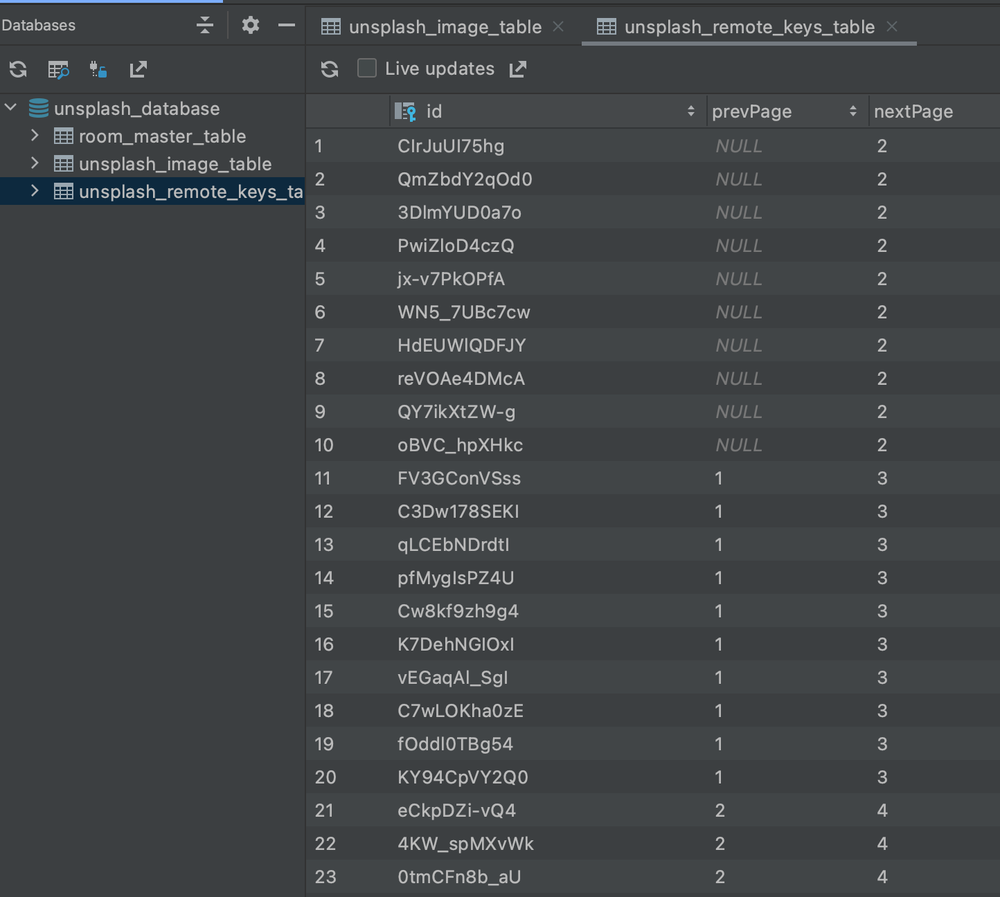
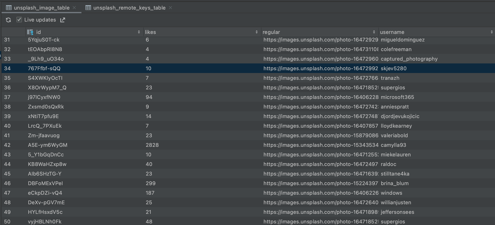
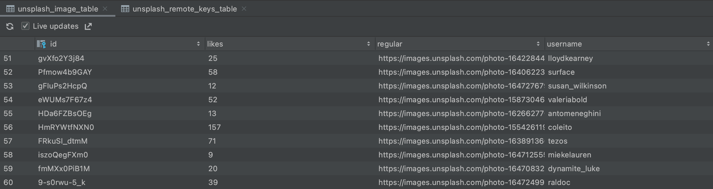
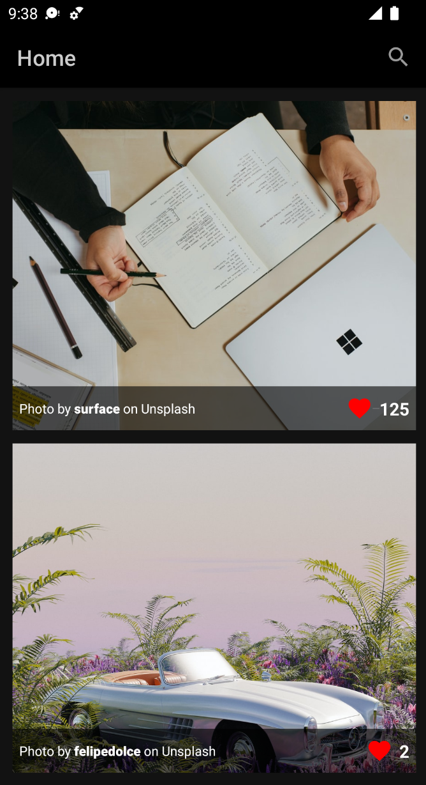

# Display Unsplash Images

실제 Unsplash API 요청 후 어떻게 페이징되는지 알아보자.

루트 패키지에 `navigation` 패키지 생성 후 `Screen` sealed class를 생성해준다.

```kotlin
sealed class Screen(val route: String) {
    object Home : Screen("home_screen")
    object Search : Screen("search_screen")
}
```

동일한 패키지에 NavGraph.kt 파일 생성 후 `SetupNavGraph` composable을 작성한다.

```kotlin
@ExperimentalPagingApi
@Composable
fun SetupNavGraph(navController: NavHostController) {
    NavHost(
        navController = navController,
        startDestination = Screen.Home.route
    ) {
        composable(route = Screen.Home.route) {
            HomeScreen(navController)
        }
        composable(route = Screen.Search.route) {
//            SearchScreen(navController)
        }
    }
}
```

`screens/common` 패키지를 생성하고 아이템을 보여줄 `ListContent` composable 및 하위 composable을 작성한다.

```kotlin
@ExperimentalCoilApi
@Composable
fun ListContent(items: LazyPagingItems<UnsplashImage>) {
    Log.d("Error", items.loadState.toString())
    LazyColumn(
        modifier = Modifier.fillMaxSize(),
        contentPadding = PaddingValues(all = 12.dp),
        verticalArrangement = Arrangement.spacedBy(12.dp)
    ) {
        items(
            items = items,
            key = { unsplashImage ->
                unsplashImage.id
            }
        ) { unsplashImage ->
            unsplashImage?.let { UnsplashItem(unsplashImage = it) }
        }
    }
}

@ExperimentalCoilApi
@Composable
fun UnsplashItem(unsplashImage: UnsplashImage) {
    val painter = rememberImagePainter(data = unsplashImage.urls.regular) {
        crossfade(durationMillis = 1000)
        error(R.drawable.ic_placeholder)
        placeholder(R.drawable.ic_placeholder)
    }
    val context = LocalContext.current
    Box(
        modifier = Modifier
            .clickable {
                val browserIntent = Intent(
                    Intent.ACTION_VIEW,
                    Uri.parse("https://unsplash.com/@${unsplashImage.user.username}?utm_source=DemoApp&utm_medium=referral")
                )
                startActivity(context, browserIntent, null)
            }
            .height(300.dp)
            .fillMaxWidth(),
        contentAlignment = Alignment.BottomCenter
    ) {
        Image(
            modifier = Modifier.fillMaxSize(),
            painter = painter,
            contentDescription = "Unsplash Image",
            contentScale = ContentScale.Crop
        )
        Surface(
            modifier = Modifier
                .height(40.dp)
                .fillMaxWidth()
                .alpha(ContentAlpha.medium),
            color = Color.Black
        ) {}
        Row(
            modifier = Modifier
                .height(40.dp)
                .fillMaxWidth()
                .padding(horizontal = 6.dp),
            verticalAlignment = Alignment.CenterVertically,
            horizontalArrangement = Arrangement.SpaceBetween
        ) {
            Text(
                text = buildAnnotatedString {
                    append("Photo by ")
                    withStyle(style = SpanStyle(fontWeight = FontWeight.Black)) {
                        append(unsplashImage.user.username)
                    }
                    append(" on Unsplash")
                },
                color = Color.White,
                fontSize = MaterialTheme.typography.caption.fontSize,
                maxLines = 1,
                overflow = TextOverflow.Ellipsis
            )
            LikeCounter(
                modifier = Modifier.weight(3f),
                painter = painterResource(id = R.drawable.ic_heart),
                likes = "${unsplashImage.likes}"
            )
        }
    }
}

@Composable
fun LikeCounter(
    modifier: Modifier,
    painter: Painter,
    likes: String
) {
    Row(
        modifier = modifier.fillMaxSize(),
        verticalAlignment = Alignment.CenterVertically,
        horizontalArrangement = Arrangement.End
    ) {
        Icon(
            painter = painter,
            contentDescription = "Heart Icon",
            tint = Color.Red
        )
        Divider(modifier = Modifier.width(6.dp))
        Text(
            text = likes,
            color = Color.White,
            fontSize = MaterialTheme.typography.subtitle1.fontSize,
            fontWeight = FontWeight.Bold,
            maxLines = 1,
            overflow = TextOverflow.Ellipsis
        )
    }
}

@ExperimentalCoilApi
@Composable
@Preview
fun UnsplashImagePreview() {
    UnsplashItem(
        unsplashImage = UnsplashImage(
            id = "1",
            urls = Urls(regular = ""),
            likes = 100,
            user = User(username = "Stevdza-San", userLinks = UserLinks(html = ""))
        )
    )
}
```

`screens/home` 패키지에 `HomeTopBar` composable을 작성한다.

```kotlin
@Composable
fun HomeTopBar(
    onSearchClicked: () -> Unit
) {
    TopAppBar(
        title = {
            Text(
                text = "Home",
                color = MaterialTheme.colors.topAppBarContentColor
            )
        },
        backgroundColor = MaterialTheme.colors.topAppBarBackgroundColor,
        actions = {
            IconButton(onClick = onSearchClicked) {
                Icon(
                    imageVector = Icons.Default.Search,
                    contentDescription = "Search Icon"
                )
            }
        }
    )
}

@Composable
@Preview
fun HomeTopBarPreview() {
    HomeTopBar {}
}
```

루트 패키지에 `screens/home` 패키지 생성 후 `HomeScreen`을 생성 및 작성한다.

```kotlin
@ExperimentalPagingApi
@Composable
fun HomeScreen(
    navController: NavController,
    homeViewModel: HomeViewModel = hiltViewModel()
) {
    val getAllImages = homeViewModel.getAllImages.collectAsLazyPagingItems()

    Scaffold(
        topBar = {
            HomeTopBar(
                onSearchClicked = {
                    navController.navigate(Screen.Search.route)
                }
            )
        },
    ) {
        ListContent(items = getAllImages)
    }
}
```

이제 `HomeViewModel`을 `screens/home` 패키지에 생성하고 구현한다.

```kotlin
@ExperimentalPagingApi
@HiltViewModel
class HomeViewModel @Inject constructor(
    repository: Repository
) : ViewModel() {
    val getAllImages = repository.getAllImages()
}
```

`AndroidManifest.xml`에 INTERNET 권한을 추가한다.

이제 앱을 실행시키고 DB를 확인해보자. 첫 실행이 수행되면 최초로 Page Size * 3이 요청된다. 지정한 크기인 10개씩 페이징되는 것을 확인할 수 있다.

<div align="center">

</div>

현재 40개의 이미지 정보가 DB에 저장되어 있으며, 스크롤 후 결과를 보자. 스크롤할수록 데이터가 쌓이는 것을 볼 수 있다.

<div align="center" class="column">
<div></div>
<div></div>
</div>

인터넷 연결을 끊고 재실행해보자. 기존에 캐싱된 데이터가 보여지는 것을 확인할 수 있다.

<div align="center">

</div>

일부 캐시되지 않은 이미지들은 placeholder가 보여질 수 있는데 인터넷을 연결하면 정상적으로 보여지게 된다.

또한 이미지를 클릭할 경우 해당 유저의 프로필이 브라우저에서 보여진다.

<div align="center">

</div>

## References

* [Paging 3 & Jetpack Compose - Android Development | Part 5 - Display Unsplash Images](https://www.youtube.com/watch?v=xIB4pRtNBjE&list=PLSrm9z4zp4mEWwyiuYgVMWcDFdsebhM-r&index=38)