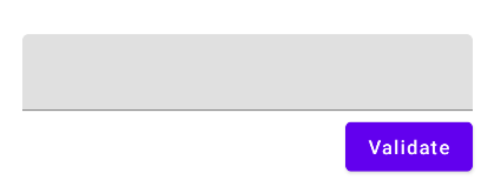

# How to Use String Resources In a ViewModel

ViewModel에서 String Resource를 어떻게 사용하는지 알아보자.

String Resource를 사용하려면 Context가 필요한데, ViewModel은 Context에 접근할 수 없다.

ViewModel로 Context를 전달할 수 있긴 하지만, 전달하는 순간 ViewModel은 Unit 테스트가 불가능하다. Context가 전달되는 경우 실제 안드로이드 기기에서 실행되는 환경인 Instrumented Unit Test를 수행해야 한다.

다음과 같이 텍스트를 입력받는 UI가 있다고 가정하자.

<div align="center">

</div>

문자열의 개수 3개 미만이면 에러를 띄워준다고 가정할 때, ViewModel에서 String Resource를 사용하는 방법을 알아보자.

우선 context를 통해 String Resource 값을 가져오도록 `UiText`를 작성한다.

```kotlin
sealed class UiText {
    data class DynamicString(val value: String): UiText() // Server API에서 전달되는 문자열
    class StringResource(
        @StringRes val resId: Int,
        vararg val args: Any
    ): UiText()

    @Composable
    fun asString():String {
        return when (this) {
            is DynamicString -> value
            is StringResource -> stringResource(resId, *args)
        }
    }

    fun asString(context: Context):String {
        return when (this) {
            is DynamicString -> value
            is StringResource -> context.getString(resId, *args)
        }
    }
}
```

ViewModel에서는 `UiText.StrintResource`를 String Resource 값과 같이 전달한다.

```kotlin
class MyViewModel: ViewModel() {

    private val errorChannel = Channel<UiText>()
    val errors = errorChannel.receiveAsFlow()

    var name by mutableStateOf("")

    fun onNameChange(newName: String) {
        name = newName
    }

    fun validateInputs() {
        viewModelScope.launch {
            if(name.length < MIN_NAME_LENGTH) {
                errorChannel.send(
                    UiText.StringResource(
                        resId = R.string.min_name_length_error,
                        MIN_NAME_LENGTH
                    )
                )
            }
        }
    }

    companion object {
        const val MIN_NAME_LENGTH = 3
    }
}
```

Screen에선 해당 값을 가져와 `asString`을 호출해 문자열을 얻을 수 있다. `LaunchedEffect`는 Context를 직접 참조할 수 없어 외부에 선언 후 context를 전달하는 방식을 이용한다. Composable의 경우 즉시 `asString()`을 사용해 문자열을 얻어올 수 있다.

```kotlin
class MainActivity : ComponentActivity() {
    override fun onCreate(savedInstanceState: Bundle?) {
        super.onCreate(savedInstanceState)
        setContent {
            UniversalStringResourcesTheme {
                val viewModel = viewModel<MyViewModel>()
                val scaffoldState = rememberScaffoldState()
                val context = LocalContext.current
                LaunchedEffect(key1 = scaffoldState) {
                    viewModel.errors.collect { error ->
                        scaffoldState.snackbarHostState.showSnackbar(
                            message = error.asString(context)
                        )
                    }
                }
                Scaffold(
                    scaffoldState = scaffoldState
                ) {
                    Column(
                        modifier = Modifier
                            .fillMaxSize()
                            .padding(horizontal = 32.dp),
                        horizontalAlignment = Alignment.CenterHorizontally,
                        verticalArrangement = Arrangement.Center
                    ) {
                        TextField(
                            value = viewModel.name,
                            onValueChange = viewModel::onNameChange,
                            modifier = Modifier.fillMaxWidth()
                        )
                        Spacer(modifier = Modifier.height(8.dp))
                        Button(
                            onClick = { viewModel.validateInputs() },
                            modifier = Modifier.align(Alignment.End)
                        ) {
                            Text(text = "Validate")
                        }
                    }
                }
            }
        }
    }
}
```

## References
* [How to Use String Resources In a ViewModel - Android Studio Tutorial](https://www.youtube.com/watch?v=mB1Lej0aDus)