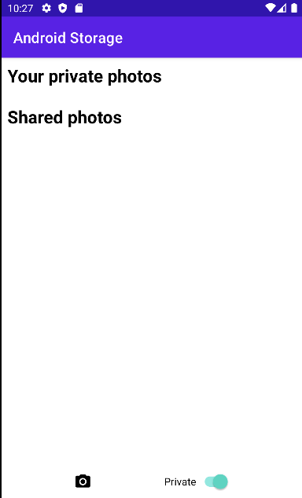
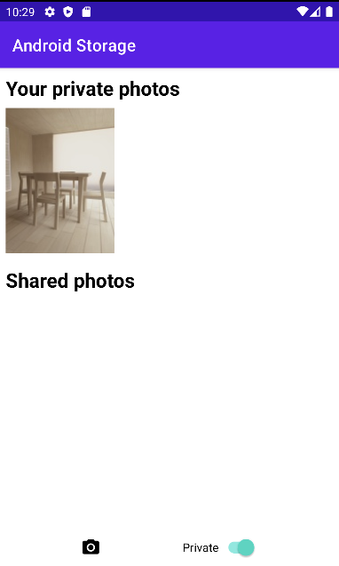

# How to Use Internal Storage (Save, Load, Delete)

내부 저장소는 기본적으로 앱의 private 한 저장소이다. 다른 앱들은 이 저장소에 접근할 수 없다. 외부 저장소와는 다르게 권한이 필요 없다.

시작하기 전 [이 레포](https://github.com/philipplackner/AndroidStorage/branches)에서 코드를 클론하자.

`InternalStoragePhoto`와 `InternalStoragePhotoAdapter`가 이미 구현되어 있다.

`MainActivity` 클래스를 다음과 같이 구현한다.

```kotlin
class MainActivity : AppCompatActivity() {

    private lateinit var binding: ActivityMainBinding

    private lateinit var internalStoragePhotoAdapter: InternalStoragePhotoAdapter

    override fun onCreate(savedInstanceState: Bundle?) {
        super.onCreate(savedInstanceState)
        binding = ActivityMainBinding.inflate(layoutInflater)
        setContentView(binding.root)

        internalStoragePhotoAdapter = InternalStoragePhotoAdapter {
            val isDeletionSuccessful = deletePhotoFromInternalStorage(it.name)
            if (isDeletionSuccessful) {
                loadPhotosFromInternalStorageIntoRecyclerView()
                Toast.makeText(this, "Photo successfully deleted", Toast.LENGTH_SHORT).show()
            } else {
                Toast.makeText(this, "Failed to deleter photo", Toast.LENGTH_SHORT).show()
            }
        }

        val takePhoto = registerForActivityResult(ActivityResultContracts.TakePicturePreview()) {
            val isPrivate = binding.switchPrivate.isChecked
            if (isPrivate) {
                val isSavedSuccessfully = savePhotoToInternalStorage(UUID.randomUUID().toString(), it)
                if (isSavedSuccessfully) {
                    loadPhotosFromInternalStorageIntoRecyclerView()
                    Toast.makeText(this, "Photo saved successfully", Toast.LENGTH_SHORT).show()
                } else {
                    Toast.makeText(this, "Failed to save photo", Toast.LENGTH_SHORT).show()
                }
            }
        }

        binding.btnTakePhoto.setOnClickListener {
            takePhoto.launch()
        }

        setupInternalStorageRecyclerView()
        loadPhotosFromInternalStorageIntoRecyclerView()
    }

    private fun setupInternalStorageRecyclerView() = binding.rvPrivatePhotos.apply {
        adapter = internalStoragePhotoAdapter
        layoutManager = StaggeredGridLayoutManager(3, RecyclerView.VERTICAL)
    }

    private fun loadPhotosFromInternalStorageIntoRecyclerView() {
        lifecycleScope.launch {
            val photos = loadPhotoFromInternalStorage()
            internalStoragePhotoAdapter.submitList(photos)
        }
    }

    private fun deletePhotoFromInternalStorage(filename: String): Boolean {
        return try {
            deleteFile(filename)
        } catch (e: Exception) {
            e.printStackTrace()
            false
        }
    }

    private suspend fun loadPhotoFromInternalStorage(): List<InternalStoragePhoto> {
        return withContext(Dispatchers.IO) {
            val files = filesDir.listFiles()
            files?.filter { it.canRead() && it.isFile && it.name.endsWith(".jpg") }?.map {
                val bytes = it.readBytes()
                val bmp = BitmapFactory.decodeByteArray(bytes, 0, bytes.size)
                InternalStoragePhoto(it.name, bmp)
            } ?: listOf()
        }
    }

    private fun savePhotoToInternalStorage(filename: String, bmp: Bitmap): Boolean {
        return try {
            // use 키워드는 write 또는 throw가 발생했을 때 자동적으로 close 해주는 유용한 키워드이다.
            openFileOutput("${filename}.jpg", MODE_PRIVATE).use { stream ->
                if (!bmp.compress(Bitmap.CompressFormat.JPEG, 95, stream)) {
                    throw IOException("Couldn't save bitmap.")
                }
            }
            true
        } catch (e: IOException) {
            e.printStackTrace()
            false
        }
    }
}
```

Private에 토글하고, 사진을 찍으면 내부 저장소에 저장된다.

<div align="center" class="row">


</div>

사진을 길게 누르면 삭제된다.

## References

* [How to Use Internal Storage (Save, Load, Delete) - Android Studio Tutorial](https://www.youtube.com/watch?v=EeLz1DPMsW8&list=PLQkwcJG4YTCR9jZq8O19nUL2hLqmLYX4M&index=2)