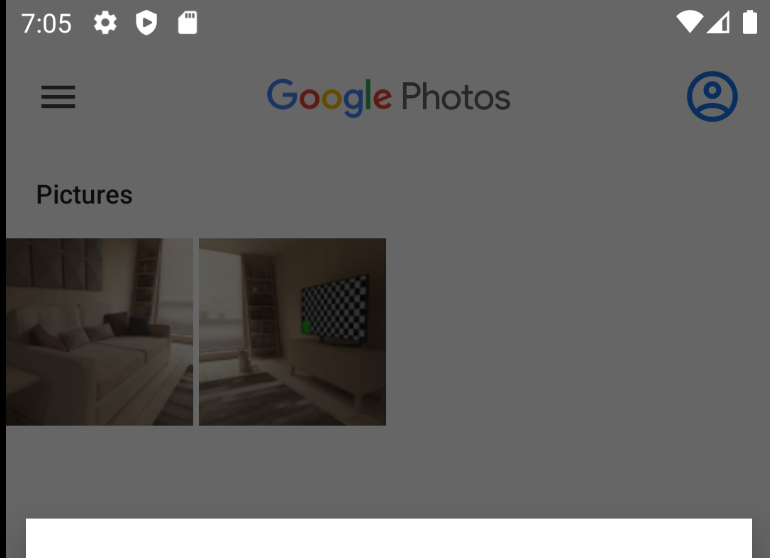

# Saving Files in External / Scoped Storage (API 30+)

외부 저장소에 있는 공유 저장소에 이미지를 어떻게 저장하는지 알아보자. 외부 저장소에 접근하기 위해 유저의 권한 승인이 필요하다. 다음과 같이 `AndroidManifest.xml`에 권한을 추가하자.

```xml
<uses-permission android:name="android.permission.READ_EXTERNAL_STORAGE"/>
<uses-permission android:name="android.permission.WRITE_EXTERNAL_STORAGE" 
                 android:maxSdkVersion="28"/>
```

`StorageUtil` 파일을 생성하고 다음과 같이 헬퍼 함수를 생성한다.

```kotlin
// sdk 29 이상이면 람다 실행
inline fun <T> sdk29AndUp(onSdk29: () -> T): T? {
    return if (Build.VERSION.SDK_INT >= Build.VERSION_CODES.Q) {
        onSdk29()
    } else null
}
```

`MainActivity`에서 권한을 요청하기 위한 다음과 같은 변수들을 추가해준다.

```kotlin
    // ...
    private lateinit var externalStoragePhotoAdapter: SharedPhotoAdapter

    private var readPermissionGranted = false
    private var writePermissionGranted = false
    private lateinit var permissionLauncher: ActivityResultLauncher<Array<String>>
    // ...
```

`updateOrRequestPermissions()` 함수를 만들어 권한이 없는 경우 요청하는 코드를 작성한다.

```kotlin
private fun updateOrRequestPermissions() {
    val hasReadPermission = ContextCompat.checkSelfPermission(
        this,
        Manifest.permission.READ_EXTERNAL_STORAGE
    ) == PackageManager.PERMISSION_GRANTED
    val hasWritePermission = ContextCompat.checkSelfPermission(
        this,
        Manifest.permission.WRITE_EXTERNAL_STORAGE
    ) == PackageManager.PERMISSION_GRANTED
    val minSdk29 = Build.VERSION.SDK_INT >= Build.VERSION_CODES.Q
    readPermissionGranted = hasReadPermission
    writePermissionGranted = hasWritePermission || minSdk29
    val permissionsToRequest = mutableListOf<String>()
    if(!writePermissionGranted) {
        permissionsToRequest.add(Manifest.permission.WRITE_EXTERNAL_STORAGE)
    }
    if(!readPermissionGranted) {
        permissionsToRequest.add(Manifest.permission.READ_EXTERNAL_STORAGE)
    }
    if(permissionsToRequest.isNotEmpty()) {
        permissionsLauncher.launch(permissionsToRequest.toTypedArray())
    }
}
```

그 후 외부 저장소에 이미지를 저장하는 로직을 구현한다.

```kotlin
private fun savePhotoToExternalStorage(displayName: String, bmp: Bitmap): Boolean {
    val imageCollection = sdk29AndUp {
        MediaStore.Images.Media.getContentUri(MediaStore.VOLUME_EXTERNAL_PRIMARY)
    } ?: MediaStore.Images.Media.EXTERNAL_CONTENT_URI
    val contentValues = ContentValues().apply {
        put(MediaStore.Images.Media.DISPLAY_NAME, "$displayName.jpg")
        put(MediaStore.Images.Media.MIME_TYPE, "image/jpeg")
        put(MediaStore.Images.Media.WIDTH, bmp.width)
        put(MediaStore.Images.Media.HEIGHT, bmp.height)
    }
    return try {
        contentResolver.insert(imageCollection, contentValues)?.also { uri ->
            contentResolver.openOutputStream(uri).use { outputStream ->
                if(!bmp.compress(Bitmap.CompressFormat.JPEG, 95, outputStream)) {
                    throw IOException("Couldn't save bitmap")
                }
            }
        } ?: throw IOException("Couldn't create MediaStore entry")
        true
    } catch(e: IOException) {
        e.printStackTrace()
        false
    }
}
```

`MainActivity`의 `onCreate()`에 다음과 같이 권한을 요청하는 `updateOrRequestPermissions()`를 호출하고 Private이 아닌 경우 외부 저장소에 저장하는 로직을 구현한다.

```kotlin
override fun onCreate(savedInstanceState: Bundle?) { 
    // ...
    externalStoragePhotoAdapter = SharedPhotoAdapter {
    }
    // ...
    updateOrRequestPermissions()
    val takePhoto = registerForActivityResult(ActivityResultContracts.TakePicturePreview()) {
        val isPrivate = binding.switchPrivate.isChecked
        val isSavedSuccessfully = when {
            isPrivate -> savePhotoToInternalStorage(UUID.randomUUID().toString(), it)
            writePermissionGranted -> savePhotoToExternalStorage(UUID.randomUUID().toString(), it)
            else -> false
        }
        if(isPrivate) {
            loadPhotosFromInternalStorageIntoRecyclerView()
        }
        if(isSavedSuccessfully) {
            Toast.makeText(this, "Photo saved successfully", Toast.LENGTH_SHORT).show()
        } else {
            Toast.makeText(this, "Failed to save photo", Toast.LENGTH_SHORT).show()
        }
    }
    // ...
}
```

사진을 찍고 구글포토에 보면 저장되어 있는 것을 확인할 수 있다.

<div align="center">

</div>

아직 외부 저장소의 이미지를 앱으로 가져와 보여주는 기능을 구현하지 않아 앱에서는 볼 수 없다.

## References

* [Saving Files in External / Scoped Storage (API 30+) - Android Studio Tutorial](https://www.youtube.com/watch?v=dEASm7nv7DA&list=PLQkwcJG4YTCR9jZq8O19nUL2hLqmLYX4M&index=3)