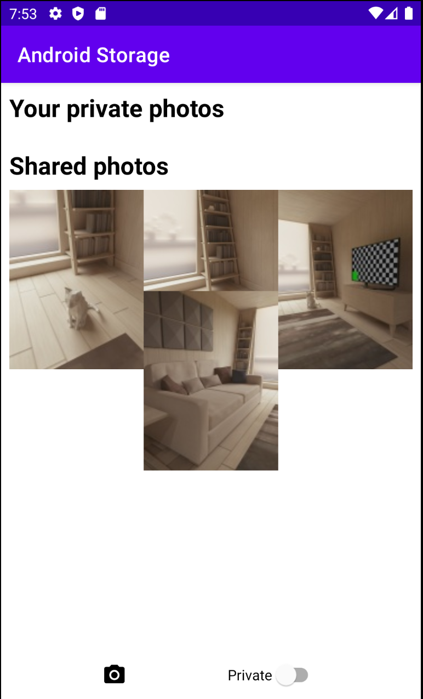

# Loading Files From External / Scoped Storage

이번엔 외부 저장소에서 이미지를 로딩해보자.

`loadPhotosFromExternalStorage()` 외부 저장소의 이미지를 불러오는 함수를 생성한다.

```kotlin
private suspend fun loadPhotosFromExternalStorage(): List<SharedStoragePhoto> {
    return withContext(Dispatchers.IO) {
        // 외부 저장소의 이미지를 쿼리하기 위해 collection 지정
        val collection = sdk29AndUp {
            MediaStore.Images.Media.getContentUri(MediaStore.VOLUME_EXTERNAL)
        } ?: MediaStore.Images.Media.EXTERNAL_CONTENT_URI
        // 원하는 컬럼 지정
        val projection = arrayOf(
            MediaStore.Images.Media._ID,
            MediaStore.Images.Media.DISPLAY_NAME,
            MediaStore.Images.Media.WIDTH,
            MediaStore.Images.Media.HEIGHT,
        )
        val photos = mutableListOf<SharedStoragePhoto>()
        contentResolver.query(
            collection,
            projection,
            null,
            null,
            "${MediaStore.Images.Media.DISPLAY_NAME} ASC"
        )?.use { cursor ->
            val idColumn = cursor.getColumnIndexOrThrow(MediaStore.Images.Media._ID)
            val displayNameColumn = cursor.getColumnIndexOrThrow(MediaStore.Images.Media.DISPLAY_NAME)
            val widthColumn = cursor.getColumnIndexOrThrow(MediaStore.Images.Media.WIDTH)
            val heightColumn = cursor.getColumnIndexOrThrow(MediaStore.Images.Media.HEIGHT)
            while (cursor.moveToNext()) {
                val id = cursor.getLong(idColumn)
                val displayName = cursor.getString(displayNameColumn)
                val width = cursor.getInt(widthColumn)
                val height = cursor.getInt(heightColumn)
                val contentUri = ContentUris.withAppendedId(
                    MediaStore.Images.Media.EXTERNAL_CONTENT_URI,
                    id
                )
                photos.add(SharedStoragePhoto(id, displayName, width, height, contentUri))
            }
            photos.toList()
        } ?: listOf()
    }
}
```

그 다음 외부 저장소의 이미지를 불러오고 보여주기 위한 RecyclerView를 설정해주는 함수를 생성한다.

```kotlin
// ...
private fun setupExternalStorageRecyclerView() = binding.rvPublicPhotos.apply {
    adapter = externalStoragePhotoAdapter
    layoutManager = StaggeredGridLayoutManager(3, RecyclerView.VERTICAL)
}

private fun loadPhotosFromExternalStorageIntoRecyclerView() {
    lifecycleScope.launch {
        val photos = loadPhotosFromExternalStorage()
        externalStoragePhotoAdapter.submitList(photos)
    }
}
// ...
```

이미지의 변경을 observe하기 위한 `contentObserver` 변수를 생성한다.

```kotlin
private lateinit var contentObserver: ContentObserver
```

`contentObserver`를 초기화하고 `contentResolver`에 등록해준다.

```kotlin
// ...
permissionsLauncher = registerForActivityResult(ActivityResultContracts.RequestMultiplePermissions()) { permissions ->
    readPermissionGranted = permissions[Manifest.permission.READ_EXTERNAL_STORAGE] ?: readPermissionGranted
    writePermissionGranted = permissions[Manifest.permission.WRITE_EXTERNAL_STORAGE] ?: writePermissionGranted

    if (readPermissionGranted) {
        loadPhotosFromExternalStorageIntoRecyclerView()
    } else {
        Toast.makeText(this, "Can't read files without permission.", Toast.LENGTH_LONG).show()
    }
} private fun initContentObserver() {
    contentObserver = object : ContentObserver(null) {
        override fun onChange(selfChange: Boolean) {
            if (readPermissionGranted) {
                loadPhotosFromExternalStorageIntoRecyclerView()
            }
        }
    }
    contentResolver.registerContentObserver(
        MediaStore.Images.Media.EXTERNAL_CONTENT_URI,
        true,
        contentObserver
    )
}
// ...
```

`onDestroy()`에서 observer를 unregister 해주어야 한다.

```kotlin
// ...
override fun onDestroy() {
    super.onDestroy()
    contentResolver.unregisterContentObserver(contentObserver)
}
// ...
```

`onCreate()`에 다음과 같이 초기화를 수행해준다.

```kotlin
override fun onCreate(savedInstanceState: Bundle?) {
    // ...
    setupExternalStorageRecyclerView()
    initContentObserver()

    // ...

    permissionLauncher =
        registerForActivityResult(ActivityResultContracts.RequestMultiplePermissions()) { permissions ->
            readPermissionGranted = permissions[Manifest.permission.READ_EXTERNAL_STORAGE] ?: readPermissionGranted
            writePermissionGranted = permissions[Manifest.permission.WRITE_EXTERNAL_STORAGE] ?: writePermissionGranted

            if (readPermissionGranted) {
                loadPhotosFromExternalStorageIntoRecyclerView()
            } else {
                Toast.makeText(this, "Can't read files without permission.", Toast.LENGTH_LONG).show()
            }
        }

    // ...
    loadPhotosFromExternalStorageIntoRecyclerView()
}
```

`MainActivity`의 저장, 삭제하는 함수를 suspend 함수로 변경해준다.

```kotlin
private suspend fun savePhotoToExternalStorage(displayName: String, bmp: Bitmap): Boolean {
    return withContext(Dispatchers.IO) {
        val imageCollection = sdk29AndUp {
            MediaStore.Images.Media.getContentUri(MediaStore.VOLUME_EXTERNAL_PRIMARY)
        } ?: MediaStore.Images.Media.EXTERNAL_CONTENT_URI
        val contentValues = ContentValues().apply {
            put(MediaStore.Images.Media.DISPLAY_NAME, "$displayName.jpg")
            put(MediaStore.Images.Media.MIME_TYPE, "image/jpeg")
            put(MediaStore.Images.Media.WIDTH, bmp.width)
            put(MediaStore.Images.Media.HEIGHT, bmp.height)
        }
        try {
            contentResolver.insert(imageCollection, contentValues)?.also { uri ->
                contentResolver.openOutputStream(uri).use { outputStream ->
                    if (!bmp.compress(Bitmap.CompressFormat.JPEG, 95, outputStream)) {
                        throw IOException("Couldn't save bitmap")
                    }
                }
            } ?: throw IOException("Couldn't create MediaStore entry")
            true
        } catch (e: IOException) {
            e.printStackTrace()
            false
        }
    }
}

// ...

private suspend fun deletePhotoFromInternalStorage(filename: String): Boolean {
    return withContext(Dispatchers.IO) {
        try {
            deleteFile(filename)
        } catch (e: Exception) {
            e.printStackTrace()
            false
        }
    }
}

// ...

private suspend fun savePhotoToInternalStorage(filename: String, bmp: Bitmap): Boolean {
    return withContext(Dispatchers.IO) {
        try {
            openFileOutput("$filename.jpg", MODE_PRIVATE).use { stream ->
                if (!bmp.compress(Bitmap.CompressFormat.JPEG, 95, stream)) {
                    throw IOException("Couldn't save bitmap.")
                }
            }
            true
        } catch (e: IOException) {
            e.printStackTrace()
            false
        }
    }
}
```

suspend 함수로 변경했으니 호출하는 부분에 `lifecycleScope.launch`에서 호출해주도록 하자.

```kotlin
internalStoragePhotoAdapter = InternalStoragePhotoAdapter {
    lifecycleScope.launch {
        val isDeletionSuccessful = deletePhotoFromInternalStorage(it.name)
        if (isDeletionSuccessful) {
            loadPhotosFromInternalStorageIntoRecyclerView()
            Toast.makeText(this@MainActivity, "Photo successfully deleted", Toast.LENGTH_SHORT).show()
        } else {
            Toast.makeText(this@MainActivity, "Failed to delete photo", Toast.LENGTH_SHORT).show()
        }
    }
}

// ...

val takePhoto = registerForActivityResult(ActivityResultContracts.TakePicturePreview()) {
    lifecycleScope.launch {
        val isPrivate = binding.switchPrivate.isChecked
        val isSavedSuccessfully = when {
            isPrivate -> savePhotoToInternalStorage(UUID.randomUUID().toString(), it)
            writePermissionGranted -> savePhotoToExternalStorage(UUID.randomUUID().toString(), it)
            else -> false
        }
        if (isPrivate) {
            loadPhotosFromInternalStorageIntoRecyclerView()
        }
        if (isSavedSuccessfully) {
            Toast.makeText(this@MainActivity, "Photo saved successfully", Toast.LENGTH_SHORT).show()
        } else {
            Toast.makeText(this@MainActivity, "Failed to save photo", Toast.LENGTH_SHORT).show()
        }
    }
}
```

사진을 찍으면 외부 저장소에 저장되는 것을 확인할 수 있다.

<div align="center">

</div>

## References

* [Loading Files From External / Scoped Storage - Android Studio Tutorial](https://www.youtube.com/watch?v=WYY6qIUUOAw&list=PLQkwcJG4YTCR9jZq8O19nUL2hLqmLYX4M&index=4)