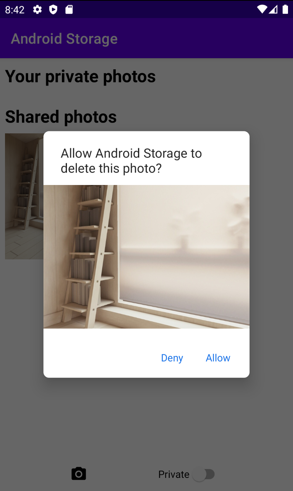

# Deleting Files in External / Scoped Storage (API 30+)

외부 저장소에서 파일을 지우는 방법을 알아보자. API 29 이상부터 앱이 소유하고 있지 않은 외부 저장소의 파일을 지우기 위해 유저의 권한이 필요하다.

권한 요청 다이얼로그를 띄우기 위해 `intentSenderLaucher` 변수를 생성한다

```kotlin
private lateinit var intentSenderLaucher: ActivityResultLauncher<IntentSenderRequest>
```

`deletePhotoFromExternalStorage()`를 생성한다.

```kotlin
		// ...
		private suspend fun deletePhotoFromExternalStorage(photoUri: Uri) {
		    withContext(Dispatchers.IO) {
		        try {
		            contentResolver.delete(photoUri, null, null)
		        } catch (e: SecurityException) {
		            val intentSender = when {
		                Build.VERSION.SDK_INT >= Build.VERSION_CODES.R -> {
		                    MediaStore.createDeleteRequest(contentResolver, listOf(photoUri)).intentSender
		                }
		                Build.VERSION.SDK_INT >= Build.VERSION_CODES.Q -> {
		                    val recoverableSecurityException = e as? RecoverableSecurityException
		                    recoverableSecurityException?.userAction?.actionIntent?.intentSender
		                }
		                else -> null
		            }
		            intentSender?.let { sender ->
		                intentSenderLauncher.launch(
		                    IntentSenderRequest.Builder(sender).build()
		                )
		            }
		        }
		    }
		}
		// ...
```

다음과 같이 `externalStoragePhotoAdapter`와 IntentSender의 결과를 처리해주는 코드를 작성한다.

```kotlin
override fun onCreate(savedInstanceState: Bundle?) {
		// ... 
		externalStoragePhotoAdapter = SharedPhotoAdapter {
        lifecycleScope.launch {
            deletePhotoFromExternalStorage(it.contentUri)
            deletedImageUri = it.contentUri
        }
    }
		// ...
		intentSenderLauncher = registerForActivityResult(ActivityResultContracts.StartIntentSenderForResult()) {
        if(it.resultCode == RESULT_OK) {
            if(Build.VERSION.SDK_INT == Build.VERSION_CODES.Q) {
                lifecycleScope.launch {
                    deletePhotoFromExternalStorage(deletedImageUri ?: return@launch)
                }
            }
            Toast.makeText(this@MainActivity, "Photo deleted successfully", Toast.LENGTH_SHORT).show()
        } else {
            Toast.makeText(this@MainActivity, "Photo couldn't be deleted", Toast.LENGTH_SHORT).show()
        }
    }
    // ...
}
```

API 28인 경우 별도의 승인 요청 없이 삭제할 수 있으며, API 30인 경우 삭제 시 유저에게 삭제 요청을 한다. API 29의 경우 삭제 요청이 발생하지만 즉시 삭제되는 것은 아니며, 다시 삭제를 수행할 때 그때 권한이 있으므로 삭제된다.

따라서 API 29의 경우 delete 한 번 더 해주도록 구현한다.

```kotlin
private var deleteImageUri: Uri? = null
```

```kotlin
override fun onCreate(savedInstanceState: Bundle?) {
		// ...
		externalStoragePhotoAdapter = SharedPhotoAdapter {
		    lifecycleScope.launch {
		        deletePhotoFromExternalStorage(it.contentUri)
		        deleteImageUri = it.contentUri
		    }
		}
		// ...

		intentSenderLaucher = registerForActivityResult(ActivityResultContracts.StartIntentSenderForResult()) {
		    if (it.resultCode == RESULT_OK) {
		        if (Build.VERSION.SDK_INT == Build.VERSION_CODES.Q) {
		            lifecycleScope.launch {
		                deletePhotoFromExternalStorage(deleteImageUri ?: return@launch )
		            }
		        }
		        Toast.makeText(this@MainActivity, "Photo deleted successfully", Toast.LENGTH_SHORT).show()
		    } else {
		        Toast.makeText(this@MainActivity, "Photo couldn't be deleted", Toast.LENGTH_SHORT).show()
		    }
		}
		// ... 
}
```

API 30의 경우 다음과 같이 삭제 요청 다이얼로그를 띄우게 된다.

<div align="center">

</div>


## References

* [Deleting Files in External / Scoped Storage (API 30+) - Android Studio Tutorial](https://www.youtube.com/watch?v=Y2lX-UNxwbE&list=PLQkwcJG4YTCR9jZq8O19nUL2hLqmLYX4M&index=5)