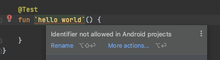

# Testing with @Before & @After

이번에는 안드로이드 컨텍스트와 같은 안드로이드 프레임워크가 필요한 테스트를 생성해 볼 것이다. 따라서 androidTest 디렉토리에 테스트를 생성할 것이다.

## Actual Function Implementation

`ResourceComparer` 클래스 생성 및 `isEqual` 함수를 생성하여 `resId`를 통해 얻은 문자열과 `string` 파라미터 문자열이 같은지 확인하는 코드를 작성한다.

```kotlin
class ResourceComparer {

    fun isEqual(context: Context, resId: Int, string: String): Boolean {
        return context.getString(resId) == string
    }
}
```

## Test Implementation

지난번에 `object`키워드를 사용해 싱글톤으로 만들어 테스트했지만, 이번에는 클래스로 만들었다. 따라서 이 클래스의 인스턴스가 필요하다.

다음과 같이 androidTest에 문자열로 생성할 수 없다. 따라서 일반적으로 함수를 만든다.

<div align="center">

</div>

우선 다음과 같이 멤버 변수에 `ResourceComparer()`를 통해 인스턴스를 생성하여 테스트 케이스를 작성한다.

```kotlin
class ResourceComparaerTest {
    private val resourceComparer = ResourceComparer()

    @Test
    fun stringResourceSameAsGivenString_returnsTrue() {
        val context = ApplicationProvider.getApplicationContext<Context>()
        val result = resourceComparer.isEqual(context, R.string.app_name, "Testing")
        assertThat(result).isTrue()
    }

    @Test
    fun stringResourceDifferentAsGivenString_returnsFalse() {
        val context = ApplicationProvider.getApplicationContext<Context>()
        val result = resourceComparer.isEqual(context, R.string.app_name, "Hello")
        assertThat(result).isFalse()
    }
}
```

위와 같이 전역 변수로 인스턴스를 생성할 경우 문제가 될 수 있다. 모든 테스트 케이스들은 독립적으로 실행되는데 전역 변수로 선언한 경우 각 테스트 케이스에서 동일한 인스턴스를 참조할 수 있기 때문이다. 그렇게 되면 더 이상 테스트가 독립적이지 않게 되어 정확한 테스트 결과를 알 수 없게 된다.

다음과 같이 각 테스트에 `ResourceComparer` 인스턴스를 생성 후 실행하게 되면 테스트가 독립적으로 실행된다.

```kotlin
class ResourceComparaerTest {
    private lateinit var resourceComparer: ResourceComparer

    @Test
    fun stringResourceSameAsGivenString_returnsTrue() {
        resourceComparer = ResourceComparer()
        val context = ApplicationProvider.getApplicationContext<Context>()
        val result = resourceComparer.isEqual(context, R.string.app_name, "Testing")
        assertThat(result).isTrue()
    }

    @Test
    fun stringResourceDifferentAsGivenString_returnsFalse() {
        resourceComparer = ResourceComparer()
        val context = ApplicationProvider.getApplicationContext<Context>()
        val result = resourceComparer.isEqual(context, R.string.app_name, "Hello")
        assertThat(result).isFalse()
    }
}
```

하지만 이렇게 인스턴스를 각 테스트마다 생성하게 되면 테스트 케이스가 많아질수록 보일러 플레이트 코드도 비례하여 증가한다. 이를 해결하기 위해 JUnit은 `@before`, `@after` 어노테이션을 사용해 테스트 전, 후 공통적으로 처리해야할 부분들을 처리할 수 있도록 해준다.

각 테스트 케이스의 인스턴스 생성 코드를 삭제하고 `setup()` 함수를 생성한다. 매 테스트 케이스에서 `setup()` 함수가 실행된다.

```kotlin
class ResourceComparaerTest {
    private lateinit var resourceComparer: ResourceComparer

    @Before
    fun setup() {
        resourceComparer = ResourceComparer()
    }

    @Test
    fun stringResourceSameAsGivenString_returnsTrue() {
        val context = ApplicationProvider.getApplicationContext<Context>()
        val result = resourceComparer.isEqual(context, R.string.app_name, "Testing")
        assertThat(result).isTrue()
    }

    @Test
    fun stringResourceDifferentAsGivenString_returnsFalse() {
        val context = ApplicationProvider.getApplicationContext<Context>()
        val result = resourceComparer.isEqual(context, R.string.app_name, "Hello")
        assertThat(result).isFalse()
    }
}
```

`@after` 어노테이션을 사용하여 테스트 후의 작업(Room DB close 등)을 수행할 수 있다.

## References

* [Testing Android Components, @Before & @After - Testing on Android](https://www.youtube.com/watch?v=PsoLeJOh30o&list=PLQkwcJG4YTCSYJ13G4kVIJ10X5zisB2Lq&index=4)