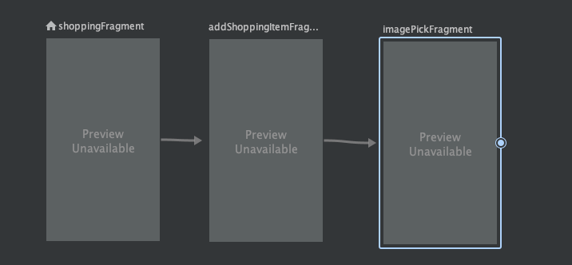

# Testing Navigation with Mockito & Espresso

`nav_graph`를 생성하여 다음과 같이 설정한다.

<div align="center">

</div>

그 후 `activity_main.xml`에서 nav_graph에 대한 설정을 추가한다.

```xml
<FrameLayout xmlns:android="http://schemas.android.com/apk/res/android"
    xmlns:app="http://schemas.android.com/apk/res-auto"
    xmlns:tools="http://schemas.android.com/tools"
    android:id="@+id/rootLayout"
    android:layout_width="match_parent"
    android:layout_height="match_parent"
    tools:context=".MainActivity">

    <fragment
        android:id="@+id/navHostFragment"
        android:name="androidx.navigation.fragment.NavHostFragment"
        android:layout_width="match_parent"
        android:layout_height="match_parent"
        app:defaultNavHost="true"
        app:navGraph="@navigation/nav_graph"/>

</FrameLayout>
```

`ShoppingFragment` 클래스와 `AddShoppingItemFragment`를 다음과 같이 작성한다.

```kotlin
class ShoppingFragment: Fragment(R.layout.fragment_shopping) {

    lateinit var viewModel: ShoppingViewModel

    override fun onViewCreated(view: View, savedInstanceState: Bundle?) {
        super.onViewCreated(view, savedInstanceState)
        viewModel = ViewModelProvider(requireActivity()).get(ShoppingViewModel::class.java)

        fabAddShoppingItem.setOnClickListener {
            findNavController().navigate(
                ShoppingFragmentDirections.actionShoppingFragmentToAddShoppingItemFragment()
            )
        }
    }
}
```

```kotlin
class AddShoppingItemFragment: Fragment(R.layout.fragment_add_shopping_item) {

    lateinit var viewModel: ShoppingViewModel

    override fun onViewCreated(view: View, savedInstanceState: Bundle?) {
        super.onViewCreated(view, savedInstanceState)
        viewModel = ViewModelProvider(requireActivity()).get(ShoppingViewModel::class.java)

        ivShoppingImage.setOnClickListener {
            findNavController().navigate(
                AddShoppingItemFragmentDirections.actionAddShoppingItemFragmentToImagePickFragment()
            )
        }

        val callback = object: OnBackPressedCallback(true) {
            override fun handleOnBackPressed() {
                viewModel.setCurrentImageUrl("")
                findNavController().popBackStack()
            }
        }
        requireActivity().onBackPressedDispatcher.addCallback(callback)
    }
}
```

`ShoppingFragmentTest` 테스트 케이스를 생성한다.

mockito를 사용하여 `NavController` 클래스에 대한 mock을 생성한다. 해당 mock을 통해 화면이 이동했는지 검증할 수 있다.

`onView` 파라미터로 `viewMatcher`를 전달하는데, 이는 espresso에게 어떤 뷰를 테스트할지 전달하는 것이다. 우리의 경우 fabAddShoppingItem이다. 그리고 `perform`을 사용해 `click()`을 실행한다고 알려준다.

```kotlin
@MediumTest
@HiltAndroidTest
@ExperimentalCoroutinesApi
class ShoppingFragmentTest {

    @get:Rule
    var hiltRule = HiltAndroidRule(this)

    @Before
    fun setup() {
        hiltRule.inject()
    }

    @Test
    fun clickAddShoppingItemButton_navigationToAddShoppingItemFragment() {
        val navController = mock(NavController::class.java)

        launchFragmentInHiltContainer<ShoppingFragment> {
            Navigation.setViewNavController(requireView(), navController)
        }

        onView(withId(R.id.fabAddShoppingItem)).perform(click())

        verify(navController).navigate(
            ShoppingFragmentDirections.actionShoppingFragmentToAddShoppingItemFragment()
        )
    }
}
```

`AddShoppingItemFragmentTest` 테스트 케이스를 생성한다. 뒤로가기 버튼이 눌렸을 경우 뒤로가기가 정상적으로 수행되었는지 테스트한다.

```kotlin
@MediumTest
@HiltAndroidTest
@ExperimentalCoroutinesApi
class AddShoppingItemFragmentTest {
    @get:Rule
    var hiltRule = HiltAndroidRule(this)

    @Before
    fun setup() {
        hiltRule.inject()
    }

    @Test
    fun pressBackButton_popBackStack() {
        val navController = mock(NavController::class.java)
        launchFragmentInHiltContainer<AddShoppingItemFragment> {
            Navigation.setViewNavController(requireView(), navController)
        }

        pressBack()

        verify(navController).popBackStack()
    }
}
```

## References

* [Testing Navigation with Mockito & Espresso - Testing in Android - Part 13](https://www.youtube.com/watch?v=uUmFfZDoOTY&list=PLQkwcJG4YTCSYJ13G4kVIJ10X5zisB2Lq&index=13)