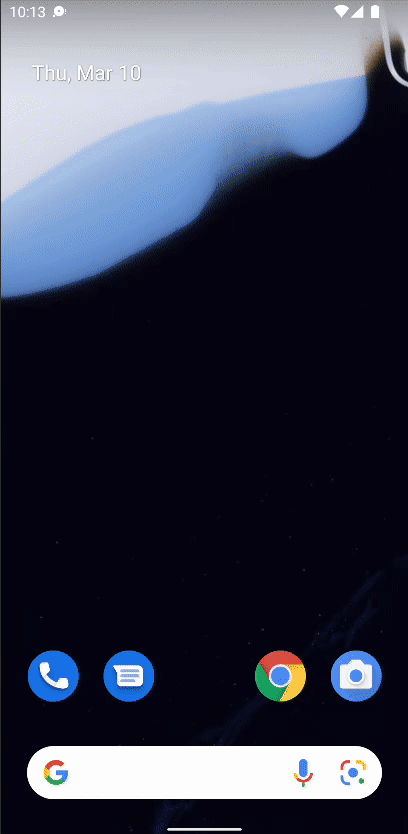
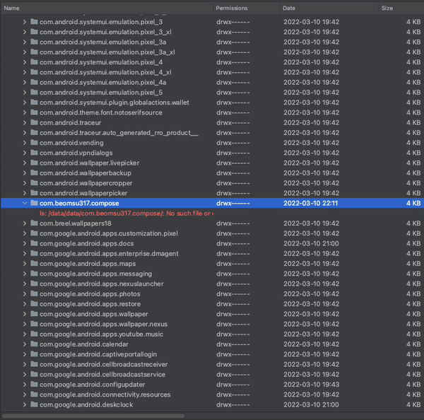

# The Ultimate Guide to WorkManager (with Jetpack Compose)

WorkManager가 무엇이고 언제 사용하는지에 대해 알아보자.

WorkManager는 Jetpack 라이브러리에 포함되어 있으며 앱에서 확실하게 실행되어야 할 때 사용된다. 앱이 종료되거나 디바이스가 재실행될 때, 앱에서 수행되어야 할 태스크를 스케줄링하는 것이다.

WorkManager는 일반적으로 immediately task, long running task, deferrable task 3가지 타입의 태스크가 있다. 한 번만 실행되도록 하거나, 주기적으로 실행되도록 할 수 있다. 모든 태스크들은 내부적으로 데이터베이스에 저장된다.

## WorkManager Implementation

`build.gradle`에 다음과 같이 디펜던시를 추가한다.

```groovy
dependencies {
    // ...
    // Compose dependencies
    implementation "androidx.lifecycle:lifecycle-viewmodel-compose:2.4.1"
    implementation 'androidx.compose.runtime:runtime-livedata:1.2.0-alpha03'

    // Coil
    implementation "io.coil-kt:coil-compose:1.4.0"

    // WorkManager with Coroutines
    implementation "androidx.work:work-runtime-ktx:2.7.1"

    // Retrofit
    implementation 'com.squareup.retrofit2:retrofit:2.9.0'
}
```

이미지를 받아오기 위한 `FileApi` 인터페이스를 생성한다.

```kotlin
interface FileApi {

    @GET("/wp-content/uploads/2022/02/220849-scaled.jpg")
    suspend fun downloadImage(): Response<ResponseBody>

    companion object {
        val instance by lazy {
            Retrofit.Builder()
                .baseUrl("https://pl-coding.com")
                .build()
                .create(FileApi::class.java)
        }
    }
}
```

Notification Channel을 생성하여 사용자에게 진행사항을 알려줄 수 있다. `Application` 클래스를 상속한 `DownloadApplication` 클래스를 생성하고 `onCreate`에 `NotificationChannel`을 생성한다. `AndroidManifest.xml`에 해당 Application을 선언해준다.

```kotlin
class DownloadApplication: Application() {

    override fun onCreate() {
        super.onCreate()
        if (Build.VERSION.SDK_INT >= Build.VERSION_CODES.O) {
            val channel = NotificationChannel(
                "download_channel",
                "File Download",
                NotificationManager.IMPORTANCE_HIGH
            )

            val notificationManager = getSystemService(NotificationManager::class.java)
            notificationManager.createNotificationChannel(channel)
        }
    }
}
```

`WorkerKeys` object class를 생성한 후 다음과 같이 작성한다.

```kotlin
object WorkerKeys {
    const val ERROR_MSG = "errorMsg"
    const val IMAGE_URI = "imageUri"
    const val FILTER_URI = "filterUri"
}
```

WorkManager task를 정의하는 `DownloadWorker`를 클래스를 생성한다. 반환되는 `Result`를 통해 나중에 다시 수행할지 여부를 결정할 수 있다.

```kotlin
class DownloadWorker(
    private val context: Context,
    private val workerParams: WorkerParameters
): CoroutineWorker(context, workerParams) {

    override suspend fun doWork(): Result {
        startForegroundService()
        delay(5000L)
        val response = FileApi.instance.downloadImage()
        response.body()?.let { body ->
            return withContext(Dispatchers.IO) {
                val file = File(context.cacheDir, "image.jpg")
                val outputStream = FileOutputStream(file)
                outputStream.use { stream ->
                    try {
                        stream.write(body.bytes())
                    } catch (e: IOException) {
                        return@withContext Result.failure(
                            workDataOf(
                                WorkerKeys.ERROR_MSG to e.localizedMessage
                            )
                        )
                    }
                }
                Result.success(
                    workDataOf(
                        WorkerKeys.IMAGE_URI to file.toUri().toString()
                    )
                )
            }
        }

        if (!response.isSuccessful) {
            if (response.code().toString().startsWith("5")) { // 서버 에러의 경우 재시도
                return Result.retry()
            }
            return Result.failure(
                workDataOf(
                    WorkerKeys.ERROR_MSG to "Network error"
                )
            )
        }
        return Result.failure(
            workDataOf(
                WorkerKeys.ERROR_MSG to "Unknown error"
            )
        )
    }

    private suspend fun startForegroundService() {
        setForeground(
            ForegroundInfo(
                Random.nextInt(),
                NotificationCompat.Builder(context, "download_channel")
                    .setSmallIcon(R.drawable.ic_launcher_background)
                    .setContentText("Downloading...")
                    .setContentTitle("Download in progress")
                    .build()
            )
        )
    }
}
```

이제 이 Worker를 다른 Worker와 체이닝해보자. `ColorFilterWorker` 클래스를 생성한 후 다음과 같이 작성한다.

```kotlin
class ColorFilterWorker(
    private val context: Context,
    private val workerParams: WorkerParameters
): CoroutineWorker(context, workerParams) {

    override suspend fun doWork(): Result {
        val imageFile = workerParams.inputData.getString(WorkerKeys.IMAGE_URI)
            ?.toUri()
            ?.toFile()
        delay(5000L)
        return imageFile?.let { file ->
            val bmp = BitmapFactory.decodeFile(file.absolutePath)
            val resultBmp = bmp.copy(bmp.config, true)
            val paint = Paint()
            paint.colorFilter = LightingColorFilter(0x08FF04, 1)
            val canvas = Canvas(resultBmp)
            canvas.drawBitmap(resultBmp, 0f, 0f, paint)

            withContext(Dispatchers.IO) {
                val resultImageFile = File(context.cacheDir, "new-image.jpg")
                val outputStream = FileOutputStream(resultImageFile)
                val successful = resultBmp.compress(
                    Bitmap.CompressFormat.JPEG,
                    90,
                    outputStream
                )
                if(successful) {
                    Result.success(
                        workDataOf(
                            WorkerKeys.FILTER_URI to resultImageFile.toUri().toString()
                        )
                    )
                } else Result.failure()
            }
        } ?: Result.failure()
    }
}
```

이제 이 Worker들이 언제 수행되어야 하고 어떤 순서로 수행되어야 하는지 정해야 한다. 배터리가 충전되고 있을 때, 인터넷이 연결되었을 때 등에 수행할 수 있다.

`MainActivity`를 다음과 같이 작성하자.

```kotlin
class MainActivity : ComponentActivity() {
    override fun onCreate(savedInstanceState: Bundle?) {
        super.onCreate(savedInstanceState)
        val downloadRequest = OneTimeWorkRequestBuilder<DownloadWorker>()
            .setConstraints(
                Constraints.Builder()
                    .setRequiredNetworkType(
                        NetworkType.CONNECTED
                    )
                    .build()
            )
            .build()

        val colorFilterRequest = OneTimeWorkRequestBuilder<ColorFilterWorker>()
            .build()
        val workManager = WorkManager.getInstance(applicationContext)

        setContent {
            ComposeTheme {
                // 유니크한 인스턴스 태스크 생성
                val workInfos = workManager.getWorkInfosForUniqueWorkLiveData("download")
                    .observeAsState()
                    .value
                val downloadInfo = remember(key1 = workInfos) {
                    workInfos?.find { it.id == downloadRequest.id }
                }
                val filterInfo = remember(key1 = workInfos) {
                    workInfos?.find { it.id == colorFilterRequest.id }
                }
                val imageUri by derivedStateOf {
                    val downloadUri = downloadInfo?.outputData?.getString(WorkerKeys.IMAGE_URI)
                        ?.toUri()
                    val filterUri = filterInfo?.outputData?.getString(WorkerKeys.FILTER_URI)
                        ?.toUri()
                    filterUri ?: downloadUri
                }
                Column(
                    modifier = Modifier.fillMaxSize(),
                    verticalArrangement = Arrangement.Center,
                    horizontalAlignment = Alignment.CenterHorizontally
                ) {
                    imageUri?.let { uri ->
                        Image(
                            painter = rememberImagePainter(data = uri),
                            contentDescription = null,
                            modifier = Modifier.fillMaxWidth()
                        )
                        Spacer(modifier = Modifier.height(16.dp))
                    }
                    Button(
                        onClick = {
                            workManager
                                .beginUniqueWork(
                                    "download",
                                    ExistingWorkPolicy.KEEP, // 이미 해당 id의 작업이 있는 경우 아무것도 수행하지 않음
                                    downloadRequest
                                )
                                .then(colorFilterRequest)
                                .enqueue()
                        },
                        enabled = downloadInfo?.state != WorkInfo.State.RUNNING
                    ) {
                        Text("Start download")
                    }
                    Spacer(modifier = Modifier.height(8.dp))
                    when (downloadInfo?.state) {
                        WorkInfo.State.RUNNING -> Text(text = "Downloading...")
                        WorkInfo.State.SUCCEEDED -> Text(text = "Download succeeded")
                        WorkInfo.State.FAILED -> Text(text = "Download failed")
                        WorkInfo.State.CANCELLED -> Text(text = "Download cancelled")
                        WorkInfo.State.ENQUEUED -> Text(text = "Download enqueued")
                        WorkInfo.State.BLOCKED -> Text(text = "Download blocked")
                    }
                    Spacer(modifier = Modifier.height(8.dp))
                    when (filterInfo?.state) {
                        WorkInfo.State.RUNNING -> Text(text = "Applying filter...")
                        WorkInfo.State.SUCCEEDED -> Text(text = "Filter succeeded")
                        WorkInfo.State.FAILED -> Text(text = "Filter failed")
                        WorkInfo.State.CANCELLED -> Text(text = "Filter cancelled")
                        WorkInfo.State.ENQUEUED -> Text(text = "Filter enqueued")
                        WorkInfo.State.BLOCKED -> Text(text = "Filter blocked")
                    }
                }
            }
        }
    }
}
```

<div align="center">

</div>

앱 실행 후 즉시 종료해도 태스크가 정상적으로 이루어지는 것을 확인할 수 있다.

<div align="center">

</div>

## References

* [The Ultimate Guide to WorkManager (with Jetpack Compose) - Android Studio Tutorial](https://www.youtube.com/watch?v=Psc2xyutE2U&t=17s)
* [Schedule tasks with WorkManager](https://developer.android.com/topic/libraries/architecture/workmanager)