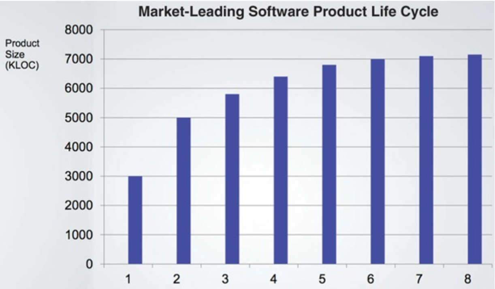
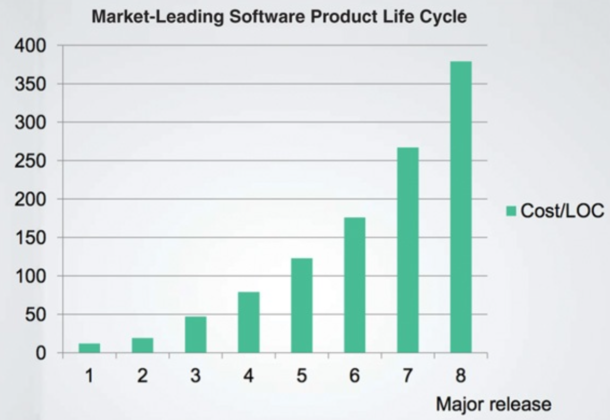
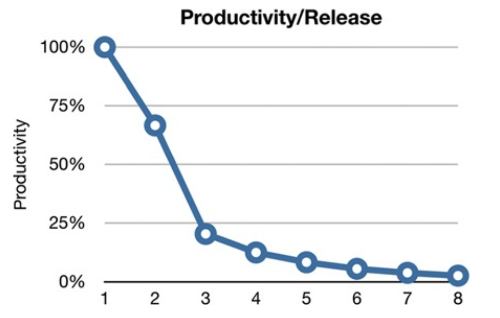
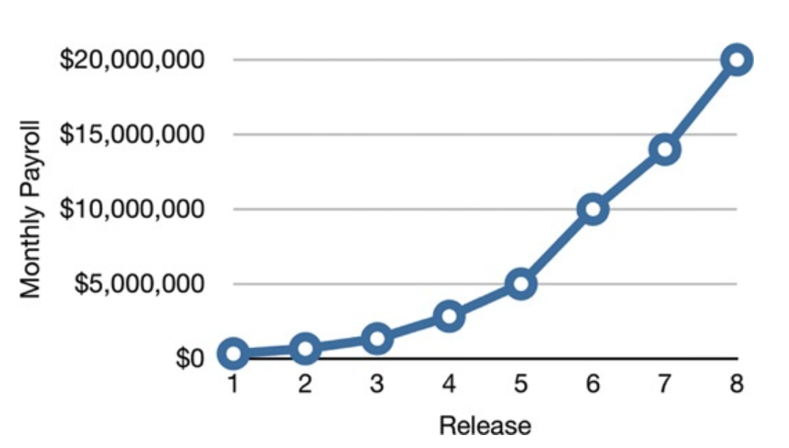
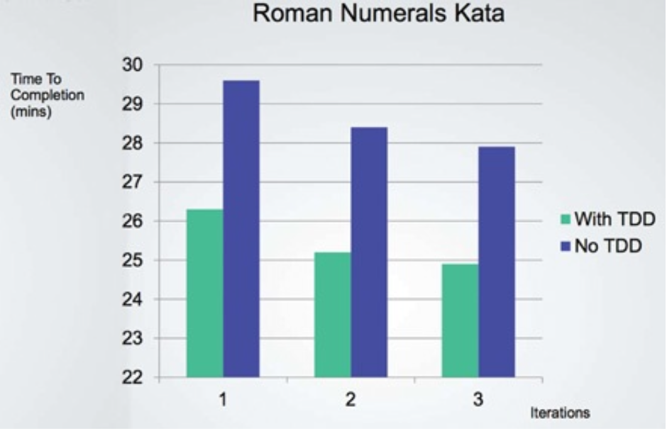

# WHAT IS DESIGN AND ARCHITECTURE?

## 목표는?

> 소프트웨어 아키텍처의 목표는 필요한 시스템을 만들고 유지보수하는 데 투입되는 인력을 최소화하는 데 있다.

설계 품질을 재는 척도는 고객의 요구를 만족시키는 데 드는 비용을 재는 척도와 다름없다.

## 사례 연구

다음은 특정 회사의 생산성을 보자. 생산성은 단순히 코드 라인 수로만 측정했다.

매번 새로운 기능을 출시할 때마다 개발자의 수는 증가하지만 코드 생산성은 한 곳으로 수렴하는 것처럼 보인다. 또한 같은 기간에 코드 한라인당 비용이 어떻게 변화했는지 보자.

이러한 비용 곡선은 사업 모델의 수익을 엄청나게 고갈시키며, 회사의 성장을 멈추게 하거나 심지어 완전히 망하게 만든다.

## 엉망진창이 되어 가는 신호

개발자의 생산성은 거의 100%로 시작했지만 출시할 때마다 하락하며, 결국 0으로 수렴한다.

개발자의 노력은 기능 개발보다는 엉망이 된 상황에 대처하는 데 소모되기 시작한다.

## 경영자의 시각

첫 출시에는 매 월 수십만 달러의 인건비만으로 제품을 전달했지만, 점점 증가하여 여덟 번째 출시에 월 인건비는 2천만 달러가 되고 계속 증가하고 있다.

## 무엇이 잘못되었나?

개발자는 생산성을 유지할 수 있다고 자신의 능력을 과신한다. 하지만 엉망진창인 코드가 쌓이면 생산성을 차츰 낮아지고, 코드가 엉망이 되는 추세는 멈추거나 수그러들지 않는다. 이대로 진행되면 생산성이 0에 수렴하게
된다.

`엉망으로 만들면 깔끔하게 유지할 때보다 항상 더 느리다.`

다음은 제이슨 고먼이 코드를 깔끔하게 유지하는 방법인 TDD를 적용해 정수를 로마 숫자로 변환하는 프로그램을 만들며 각 이터레이션 별 걸린 시간과 TDD 적용 여부 그래프이다.

날이 지날 수록 이전 날보다 빠르게 프로그램을 완성했으며, TDD를 적용한 날이 적용하지 않은 날보다 10% 빠르게 작업했다.

> 빨리 가는 유일한 방법은 제대로 가는 것이다.

이것이 경영자의 딜레마에 대한 해답이다.

> 자신을 과신하면 재설계하더라도 원래의 프로젝트와 똑같이 엉망으로 내몰린다.

## 결론

비용은 최소화하고 생산성은 최대화할 수 있는 설계와 아키텍처를 가진 시스템을 만들려면, 이러한 아키텍처가 지닌 속성을 알아야 한다. 