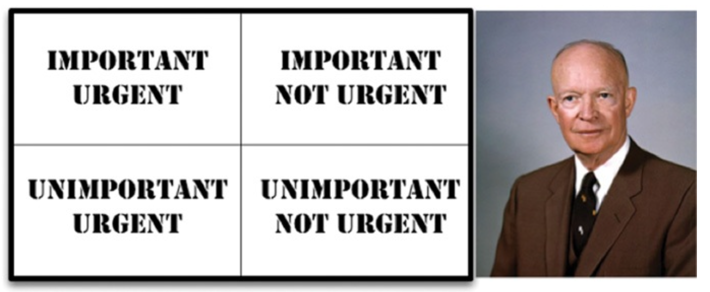

# A TALE OF TWO VALUES

모든 소프트웨어 시스템은 이해관계자에게 서로 다른 두 가지 가치를 제공하는데, 행위(behavior)와 구조(structure)이다. 개발자는 두 가지 가치 모두 높게 유지해야 하는 책임을 진다.

## 행위

소프트웨어의 첫 번째 가치는 `behavior`이다. 프로그래머를 고용하는 이유는 이해관계자를 위해 기계가 수익을 창출하거나 비용을 절약하도록 만들기 위해서다. 프로그래머는 이해관계자의 기계가 요구사항에 만족하도록
코드를 작성한다.

많이 프로그래머가 이러한 활동이 자신이 해야 할 일의 전부라 생각하지만 이는 틀렸다.

## 아키텍처

소프트웨어의 두 번째 가치는 아키텍처이며, `software`의 `soft`이다. 소프트웨어를 만든 이유는 기계의 행위를 쉽게 변경할 수 있도록 하기 위함이다. 이해관계자가 기능에 대한 생각을 바꾸면, 이러한
변경사항을 간단하고 쉽게 적용할 수 있어야 한다.

## 더 높은 가치

기능과 아키텍처 중 어떤 것의 가치가 더 높을까?

* 완벽하게 동작하지만 수정이 아예 불가능한 프로그램을 준다면, 이 프로그램은 요구사항이 변경될 때 동작하지 않게 되고, 결국 프로그램이 돌아가도록 만들 수 없게 된다. 따라서 이러한 프로그램은 거의 쓸모가 없다.
* 동작은 하지 않지만 변경이 쉬운 프로그램을 준다면, 프로그램이 돌아가도록 만들 수 있고, 변경사항이 발생하더라도 여전히 동작하도록 유지보수할 수 있다. 이러한 프로그램은 앞으로도 계속 유용한 채로 남는다.

## 아이젠하워 매트릭스

중요성과 긴급성에 관한 아이젠하워 매트릭스를 살펴보자.

소프트웨어의 첫 번째 가치인 행위는 긴급하지만 매번 높은 중요도를 가지는 것은 아니며, 소프트웨어의 두 번째 가치인 아키텍처는 중요하지만 즉각적인 긴급성을 필요로 하는 경우는 없다. 

1. 긴급하고 중요한
2. 긴급하지 않지만 중요한
3. 긴급하지만 중요하지 않은
4. 긴급하지도 중요하지도 않은

중요한 일은 이 항목의 가장 높은 두 순위를 차지하는 반면, 행위는 첫 번째와 세 번째에 위치한다. 즉, 아키텍처가 행위보다 더 높은 우선순위를 가진다는 의미이다.

## 아키텍처를 위해 투쟁하라

아키텍트는 특성과 기능을 개발하기 쉽고, 간편하게 수정할 수 있으며, 확장하기 쉬운 아키텍처를 만들어야 한다. 아키텍처가 후순위가 되면 시스템을 개발하는 비용이 더 많이 들고, 일부 또는 전체 시스템에 변경이 어려워진다. 