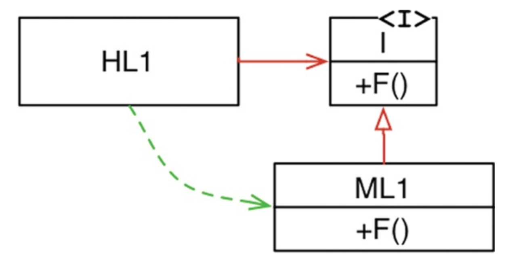
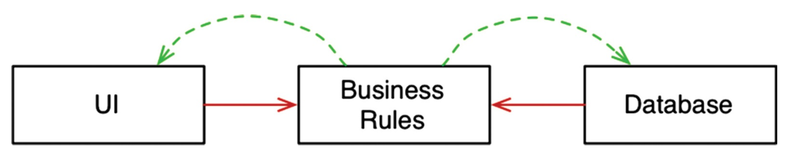

# OBJECT-ORIENTED PROGRAMMING

OO의 본질을 설명하기 위한 3가지가 있는데, 캡슐화(encapsulation), 상속(inheritance), 다형성(polymorphism)이다. 이 세 가지 개념을 조합한 것이거나, OO는 최소한 세 가지
요소를 반드시 지원해야 한다고 말한다.

## 캡슐화?

데이터와 함수를 쉽고 효과적으로 캡슐화하는 방법을 OO 언어가 제공한다. 이를 통해 데이터와 함수가 응집력 있게 구성된 집단을 서로 구분 지을 수 있다.

OO 뿐만 아니라 C 언어에서도 완변한 캡슐화가 가능하다.

```c
#include "point.h"
#include <stdlib.h>
#include <math.h>
struct Point {
  double x,y;
};
    
struct Point* makepoint(double x, double y) {
  struct Point* p = malloc(sizeof(struct Point));
  p->x = x;
  p->y = y;
return p; }
double distance(struct Point* p1, struct Point* p2) {
  double dx = p1->x - p2->x;
  double dy = p1->y - p2->y;
  return sqrt(dx*dx+dy*dy);
}
```

point.h를 사용하는 측에서 `struct Point` 멤버에 접근할 방법이 전혀 없다. 이것은 완벽한 캡슐화라 할 수 있다.

C++의 등장으로 C가 제공하던 완벽한 캡슐화가 깨지게 되었다. C++은 기술적인 이유로 클래스의 멤버 변수를 헤더 파일에 선언해야 하는데, 이들 멤버 변수의 이름이 바뀐다면 다시 컴파일해야 한다. 즉, 캡슐화가
깨졌다고 할 수 있다.

자바와 C#은 헤더와 구현체를 분리하는 방식을 모두 버렸고, 이로 인해 캡슐화는 더욱 훼손되었다.

OO 프로그래밍은 프로그래머가 올바르게 행동함으로써 캡슐화된 데이터를 우회해서 사용하지 않을 것이라는 믿음을 기반으로 한다. 하지만 OO를 제공한다고 주장한 언어들이 실제로 C 언어에서 누렸던 완벽한 캡슐화를
약화시켜 왔다.

## 상속?

OO 언어가 상속만큼은 확실히 제공했다. OO 언어가 완전히 새로운 개념을 만들진 못했지만, 데이터 구조에 가면을 씌우는 일을 상당히 편리한 방식으로 제공했다고 볼 수 있다.

## 다형성?

기존에도 다형적 행위를 수행하기 위해 함수를 가리키는 포인터를 사용해 왔었기 때문에, OO 언어는 다형성을 제공하지는 못했지만, 다형성을 좀 더 안전하고 더욱 편리하게 사용할 수 있게 해준다.

함수 포인터를 직접 사용해 다형적 행위를 만드는 방식은 이들 포인터를 초기화하는 관례와 포인터를 통해 모든 함수를 호출해야 하는 관례를 지켜야 한다. OO 언어에서는 이러한 관례를 없애주므로 실수할 위험이 없다.

## 다형성이 가진 힘

플러그인 아키텍처는 입출력 장치 독립성을 지원하기 위해 만들어졌고, 등장 이후 거의 모든 운영체제에 구현되었다. OO의 등장으로 언제 어디서든 플러그인 아키텍처를 적용할 수 있게 되었다.

## 의존성 역전

모든 호출 함수는 피호출 함수가 포함된 모듈의 이름을 명시적으로 지정해야 한다. 제어흐름은 시스템 행위에 따라 결정되며, 소스 코드 의존성은 제어흐름에 따라 결정된다.

하지만 다형성이 끼어들면 특별한 일이 일어난다.

<div align="center">

</div>

HL1 모듈은 ML1 모듈의 F() 함수를 호출한다. 소스 코드에서는 HL1 모듈은 인터페이스를 통해 F() 함수를 호출한다. 이 인터페이스는 런타임에 존재하지 않는다. HL1은 단순히 ML1 모듈의 함수 F()를
호출할 뿐이다.

하지만 ML1과 I 인터페이스 사이 소스 코드 의존성(상속 관계)이 제어흐름과 반대인 점을 주목하자. 이를 의존성 역전이라 부른다. OO 언어가 다형성을 안전하고 편리하게 제공한다는 사실은 소스 코드 의존성을
어디서든 역전시킬 수 있다는 뜻이기도 하다.

이것이 OO가 제공하는 힘이며, 지향하는 것이다. 이를 통해 데이터베이스와 사용자 인터페이스가 업무 규칙에 의존하도록 설계할 수 있다.

<div align="center">

</div>

UI와 데이터베이스가 업무 규칙의 플러그인이 된다는 뜻이다. 다시 말하면 업무 규칙의 소스 코드에서는 UI나 데이터베이스를 호출하지 않는다.

## 결론

OO란 다형성을 이용해 전체 시스템의 모든 소스 코드 의존성에 대한 절대적인 제어 권한을 획득할 수 있는 능력이다. OO를 사용해 플러그인 아키텍처를 구성할 수 있고, 이를 통해 고수준 정책을 포함하는 모듈은 저수준
세부사항을 포함하는 모듈에 대해 독립성을 보장할 수 있다.