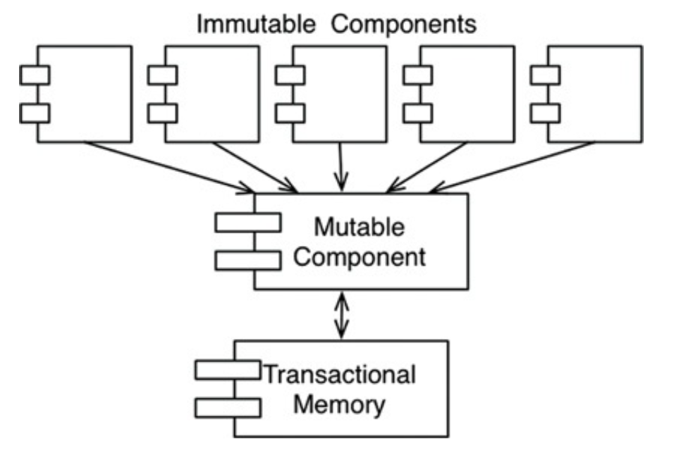

# FUNCTIONAL PROGRAMMING

함수형 프로그래밍의 기반은 람다 계산법이다.

## 정수를 제곱하기

정수를 제곱하는 프로그램을 자바와 클로저(함수형 언어)로 프로그램을 만들고 확인해보면 함수형 언어에서 변수는 변경되지 않는다는 사실을 알 수 있다.

## 불변성과 이키텍처

가변성으로 인해 Race condition, deadlock, concurrent update 문제가 발생된다. 만약 어떠한 변수도 갱신되지 않는다면 이러한 문제가 발생하지 않는다.

## 가변성의 분리

가변성을 분리하기 위해 앱 내부의 서비스를 가변 컴포넌트와 불변 컴포넌트로 분리한다. 불변 컴포넌트는 순수 함수로만 작업이 처리되며, 가변 변수를 사용하지 않는다. 불변 컴포넌트는 변수의 상태를 변경할 수 있는 순수
함수 컴포넌트가 아닌 하나 이상의 다른 컴포넌트와 통신한다. 상태 변경은 트랜잭션 메모리와 같은 방법을 통해 race condition과 concurrent update 문제로부터 가변 변수를 보호한다.

현명한 아키텍트라면 가능한 한 많은 처리를 불변 컴포넌트로 옮겨야하고, 가변 컴포넌트에는 가능한 많은 코드를 빼내야 한다.

## 이벤트 소싱

이벤트 소싱은 상태가 아닌 트랜잭션을 저장하자는 전략이다. 상태가 필요해지면 단순히 상태의 시작점부터 모든 트랜잭션을 처리한다.