# Design Principles

SOLID 원칙은 함수와 데이터 구조를 클래스로 배치하는 방법, 그리고 이들 클래스를 서로 결합하는 방법을 설명해준다. SOLID 원칙은 중간 수준 소프트웨어 구조가 다음과 같도록 만드는 데 있다.

* 변경에 유연한다.
* 이해하기 쉽다.
* 많은 소프트웨어 시스템에 사용될 수 있는 컴포넌트의 기반이 된다.

`중간 수준`은 프로그래머가 이 원칙을 모듈 수준에서 작업할 때 적용할 수 있다는 의미이다.

1. SRP: 단일 책임의 원칙
    * 각 소프트웨어 모듈은 변경의 이유가 하나여야 한다.
2. OCP: 개방-폐쇄 원칙
    * 기존 코드를 수정하기보다 새로운 코드를 추가하는 방식으로 시스템의 행위를 변경할 수 있도록 설계해야 소프트웨어 시스템을 쉽게 변경할 수 있다.
3. LSP: 리스코프 치환 법칙
    * 상호 대체 가능한 구성요소를 이용해 소프트웨어 시스템을 만들 수 있으려면, 이들 구성요소는 반드시 서로 치환 가능해야 한다.
4. ISP: 인터페이스 분리 법칙
    * 사용하지 않은 것에 의존하지 않아야 한다.
5. DIP: 의존성 역전 법칙
    * 고수준 정책을 구현하는 코드는 저수준 세부사항을 구현하는 코드에 절대로 의존해서는 안된다. 대신 세부사항이 정책에 의존해야 한다.

## SRP: THE SINGLE RESPONSIBILITY PRINCIPLE

> 단일 모듈은 변경의 이유가 하나, 오직 하나뿐이여야 한다.

여기서 `변경의 이유`란 사용자와 이해관계자를 가리킨다.

> 하나의 모듈은 하나의, 오직 하나의 사용자 또는 이해관계자에 대해서만 책임져야 한다.

변경을 요청하는 한 명 이상의 사람들을 액터라 부른다.

> 하나의 모듈은 하나의, 오직 하나의 액터에 대해서만 책임져야 한다.

`모듈`의 단순한 정의는 소스 파일이다. 소스 파일이 없는 경우 함수와 데이터 구조로 구성된 응집된 집합으로 정의한다.

### 징후 1: 우발적 중복

급여 애플리케이션의 Employee 클래스가 있다고 가정한다. 이 클래스에는 `calculatePay()`, `reportHours()`, `save()`를 가지고 있다.

* `calculatePay()` : 회계팀에서 기능을 정의하며, CFO 보고를 위해 사용
* `reportHours()` : 인사팀에서 기능을 정의하고 사용하며, COO 보고를 위해 사용
* `save()` : DBA가 기능을 정의하고, CTO 보고를 위해 사용

이 3가지 메서드를 단일 클래스에 배치하여 3개의 액터가 결합되었다. 이 결합으로 인해 CFO 팀에서 결정한 조치가 COO 팀이 의존하는 무언가에 영향을 줄 수 있다.

예를 들어 `calculatePay()`와 `reportHours()`가 초과 근무를 제외한 업무 시간을 계산하는 알고리즘을 공유한다고 가정하며, 이를 `regularHours()` 메서드로 정의한다고 해보자.

<div align="center">
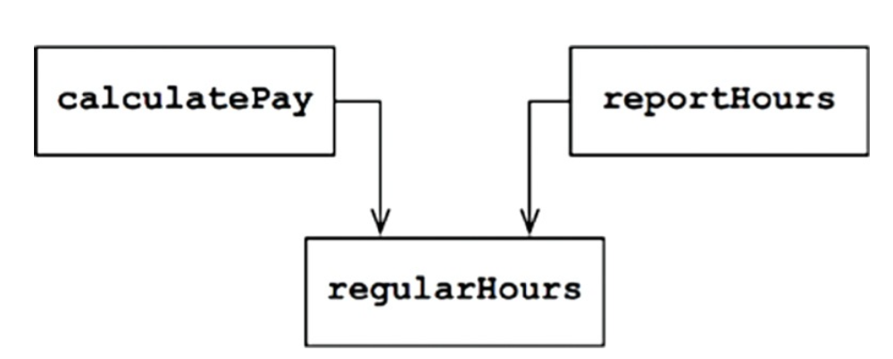
</div>

이제 CFO 팀에서 초과 근무를 제외한 업무 시간을 계산하는 방식을 약간 수정하기로 결정했다고 하자. 하지만 인사를 담당하는 COO 팀에서는 초과근무를 제외한 업무 시간을 CFO 팀과는 다른 목적으로 사용하기
때문에, 이와 같은 변경을 원치 않는다고 해보자.

개발자는 `calculatePay()`가 편의 메서드인 `regularHours()`를 호출하는 사실을 발견하지만, `reportHours()`에서 호출된다는 사실은 눈치채지 못한다. 따라서 COO
팀은 `reportHours()` 메서드가 생성된 보고서를 여전히 이용한다. 하지만 이 보고서에 포함된 수치들은 엉터리이다.

이러한 문제는 서로 다른 액터가 의존하는 코드를 너무 가까이 배치했기 때문에 발생한다. SRP는 서로 다른 액터가 의존하는 코드를 서로 분리하라고 말한다.

### 징후 2: 병합

예를 들어 DBA가 속한 CTO 팀에서 데이터베이스의 Employee 테이블 스키마를 약간 수정하기로 결정한다. 이와 동시에 인사 담당자가 속한 COO 팀에서는 `reportHours()` 메서드의 보고서 포맷을
변경하기로 결정했다고 가정해보자.

서로 다른 팀에 속한 두 명의 서로 다른 개발자가 Employee 클래스를 체크아웃 받은 후 변경사항을 적용하면, 이들 변경사항은 서로 충돌한다. 결과적으로 병합이 발생한다.

이 징후는 여러 사람이 서로 다른 목적으로 동일한 소스 파일을 변경하는 경우에 발생한다. 이를 해결하는 방법은 서로 다른 액터를 뒷받침하는 코드를 서로 분리하는 것이다.

### 해결책

이 문제의 해결책은 다양한데, 모두가 메서드를 각 다른 클래스로 이동시키는 방식이다.

가장 확실한 해결책은 데이터와 메서드를 분리하는 방식이다. 즉, 메서드가 없는 데이터 구조인 EmployeeData 클래스를 만들고 세 개의 클래스가 공유하도록 한다. 각 클래스는 자신에게 필요한 소스 코드만을
포함하며, 세 클래스 간 서로의 존재를 몰라야 한다.

<div align="center">
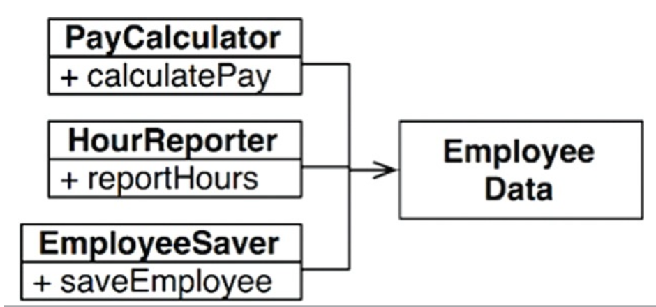
</div>

이 해결책은 세 가지 클래스를 인스턴스화하고 추적해야 한다는 단점이 있다. 이를 해결하기 위해 facade 패턴이 있다.

<div align="center">
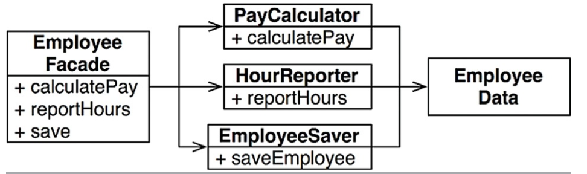
</div>

EmployeeFacade 클래스는 세 클래스의 객체를 생성하고 요청된 메서드를 가지는 객체로 위임하는 일을 책임진다.

중요한 업무 규칙을 데이터와 가깝게 배치하는 방식을 선호하면, 중요한 메서드를 기존의 Employee 클래스에 유지하되 덜 중요한 클래스는 나머지 메서드들에 대한 facade로 사용할 수 있다.

<div align="center">
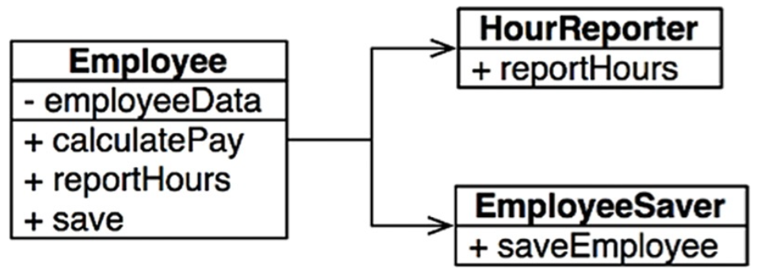
</div>

### 결론

SRP는 메서드와 클래스 수준의 원칙이다.

## OCP: THE OPEN-CLOSED PRINCIPLE

> 소프트웨어 개체(artifact)는 확장에 열려 있어야 하고, 변경에는 닫혀 있어야 한다.

즉, 소프트웨어 개체의 행위는 확장할 수 있어야 하지만, 개체를 변경해서는 안된다.

### 사고 실험

재무제표를 웹 페이지로 보여주는 시스템이 있다고 가정하자. 이제 이해관계자가 동일한 정보를 보고서 형태로 변환해서 흑백 프린터로 출력을 요청했다고 하자.

SRP를 적용하면 데이터 흐름을 다음과 같은 형태로 만들 수 있다.

<div align="center">
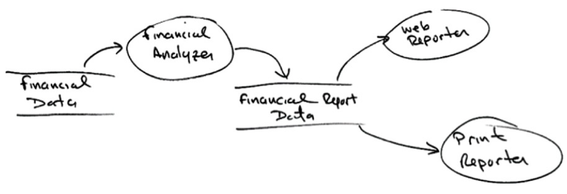
</div>

보고서 생성이 두 개의 책임으로 분리된다. 이처럼 책임을 분리했다면, 두 책임 중 하나에서 변경이 발생하더라도 다른 하나는 변경되지 않도록 소스 코드 의존성도 조직화해야 한다. 또한 새로 조직화한 구조에서는 행위가
확장될 때 변경이 발생하지 않음을 보장해야 한다.

이러한 목적 달성을 위해 처리 과정을 클래스 단위로 분할하고, 이들 클래스를 다음과 같은 컴포넌트 단위로 구분해야 한다.

<div align="center">
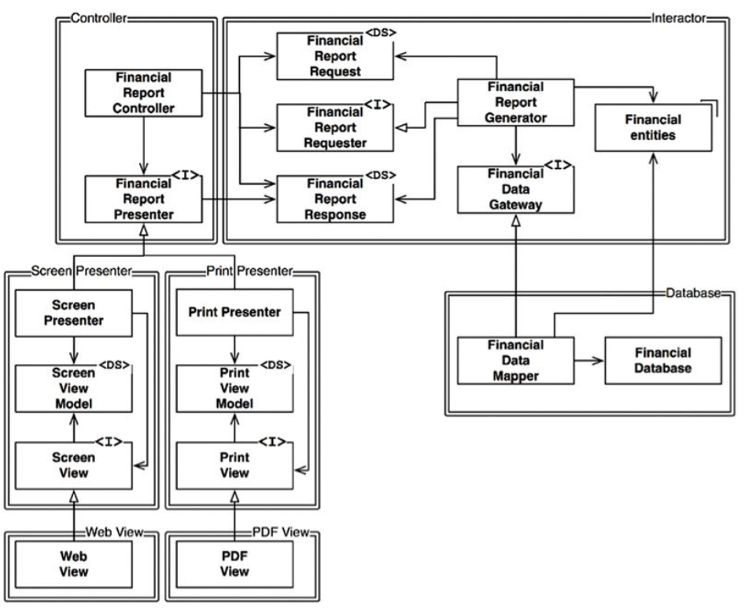
</div>

화살표가 A 클래스에서 B 클래스로 향한다면, A 클래스에서는 B 클래스를 호출하지만, B 클래스는 A 클래스를 전혀 호출하지 않음을 뜻한다. 따라서 FinancialDataMapper는
FinancialDataGateway를 알고 있지만, FinancialDataGateway는 FinancialDataMapper를 알지 못한다.

여기서 한 가지 더 주목해야 할 점은 모든 컴포넌트트 관계는 단방향으로 이루어진다는 점이다. 이 화살표는 변경으로부터 보호하려면 컴포넌트를 향하도록 그려진다.

<div align="center">
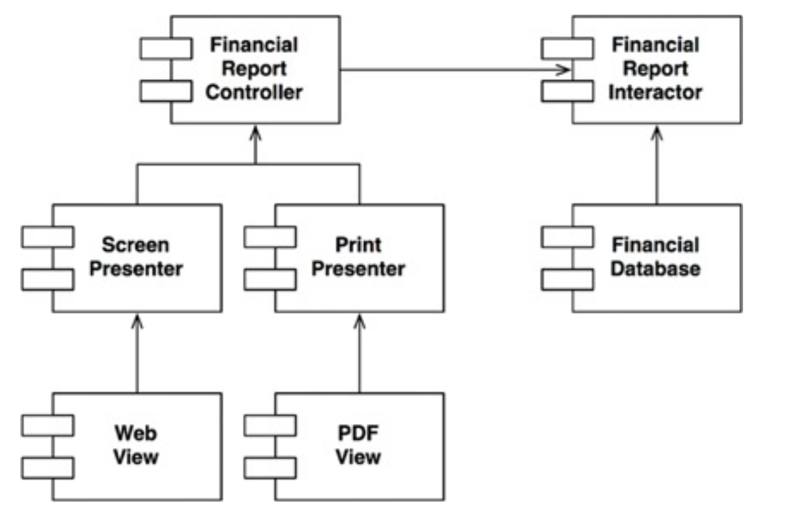
</div>

즉, A 컴포넌트에서 발생한 변경으로부터 B 컴포넌트를 보호하려면 반드시 A 컴포넌트가 B 컴포넌트에 의존해야 한다. 위 예제의 경우 Presenter에서 발생한 변경으로부터 Controller를 보호하고자 하며,
View에서 발생한 변경으로부터 Presenter를 보호하고자 한다. Interactor는 모든 것에서 발생한 변경으로부터 보호하고자 한다.

Interactor가 업무 규칙을 포함하기 때문에 모든 변경으로부터 보호되어야 한다. Interactor는 애플리케이션에서 가장 높은 수준의 정책을 포함한다. 다른 컴포넌트는 주변적인 문제를 담당하며, 가장 중요한
문제는 Interactor가 담당한다.

컴포넌트 계층구조를 이와 같이 조직화하면 저수준 컴포넌트에서 발생한 변경으로부터 고수준 컴포넌트를 보호할 수 있다.

### 방향성 제어

위 컴포넌트 그림에서 FinancialDataGateway 인터페이스는 FinancialReportGenerator와 FinancialDataMapper 사이에 위치하는데, 이는 의존성을 역전시키기 위함이다.
FinancialDataGateway가 없었다면 Interactor 컴포넌트에서 Database 컴포넌트로 바로 향하게 된다.

### 정보 은닉

FinancialReportRequester 인터페이스는 방향성 제어와는 다른 목적을 가진다. FinancialReportController가 Interactor 내부에 대해 너무 많이 알지 못하도록 막기 위해
존재한다. 이 인터페이스가 없었다면, Controller는 FinancialEntities에 대해 추이 종속성을 가지게 된다.

> 추이 종속성은 A 클래스가 B 클래스에 의존하고, B 클래스가 C 클래스에 의존한다면, A 클래스는 C 클래스에 의존하는 것을 의미한다.

추이 종속성을 가지게 되면 소프트웨어 엔티티는 `자신이 직접 사용하지 않는 요소에는 절대로 의존해서는 안 된다`는 소프트웨어 원칙에 위배된다. 즉, Controller에서 발생한 변경으로부터 Interactor를
보호하는 우선순위가 가장 높지만, 반대로 Interactor에서 발생한 변경으로부터 Controller로 보호되어야 한다. 이를 위해 Interactor 내부를 은닉한다.

### 결론

OCP는 시스템을 확장하기 쉬운 동시에 변경으로 인해 시스템이 너무 많이 영향을 받지 않도록 하는데 있다. 이를 위해 컴포넌트 단위로 분리하고, 저수준 컴포넌트에서 발생한 변경으로부터 고수준 컴포넌트를 보호할 수
있는 형태의 의존성 계층 구조가 만들어져야 한다.

## LSP: THE LISKOV SUBSTITUTION PRINCIPLE

> S 타입의 객체 01 각각에 대응하는 T 타입 객체 02가 있고, T 타입을 이용해 정의한 모든 프로그램 P에서 02의 자리에 01을 치환하더라도 P의 행위가 변하지 않는다면, S는 T의 하위 타입이다.

### 상속을 사용하도록 가이드하기

다음과 같이 License를 상속하는 2개의 하위 타입이 존재한다고 가정하자. 각각 다른 알고리즘을 이용해 라이선스 비용을 계산한다.

<div align="center">
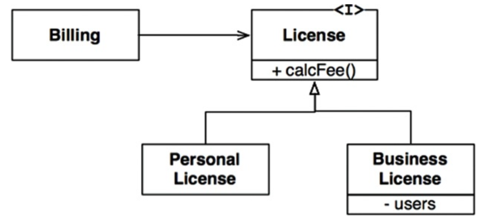
</div>

Billing 애플리케이션의 행위가 License 하위 타입 중 무엇을 사용하는지에 전혀 의존하지 않기 때문에 이 설계는 LSP를 준수한다. 이들 하위 타입은 모두 License 타입을 치환할 수 있다.

### 정사각형/직사각형 문제

LSP를 위반하는 문제로 정사각형/직사각형 문제가 있다.

<div align="center">
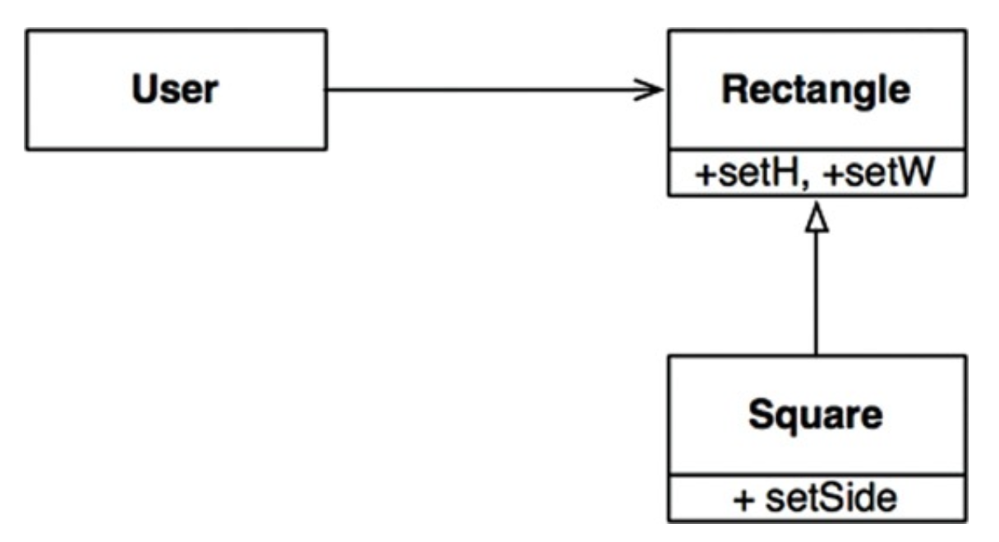
</div>

이 예제에서 Square는 Rectangle의 하위 타입으로는 적합하지 않은데, Rectangle의 높이와 너비는 서로 독립적인 반면, Square의 높이와 너비는 반드시 같이 변경되어야 하기 때문이다. User는
대화하고 있는 상대가 Rectangle이라 생각하므로 혼동이 생길 수 있다. 다음 코드를 보자.

```
Rectangle r = ...
r.setW(5);
r.setH(52);
assert(r.area() == 10)
```

여기서 Square를 생성하면 assert는 실패한다. 이를 막기 위해 if 문 등을 이용해 Rectangle이 실제 Square인지 검사하는 메커니즘을 User에 추가하는 것이다. 하지만 User의 행위가 사용하는
타입에 의존하게 되므로 결국 타입을 서로 치환할 수 없게 된다.

### LSP와 아키텍처

여기서 말하는 인터페이스는 여러 형태로 나타나는데, 자바스러운 언어라면 인터페이스 하나와 이를 구현하는 여러 개의 클래스로 구성되며, 루비라면 동일한 메서드 시그니처를 공유하는 여러 개의 클래스로 구성된다. 또한
REST 인터페이스에 응답하는 서비스 집단일 수도 있다. 이외의 상황에도 LSP를 적용할 수 있다. 잘 정의된 인터페이스와 이 인터페이스의 구현체끼리 상호 치환 가능성에 기대는 사용자들이 존재하기 때문이다.

### LSP 위반 사례

택시 파견 서비스를 통합하는 애플리케이션을 만들고 있다고 가정하자. 고객은 어느 택시업체인지 신경쓰지 않고 자신의 상황에 가장 적합한 택시를 찾는다.

택시 파견 REST 서비스의 URI가 운전기사 데이터베이스에 저장되어 있다고 가정하자. 예를 들어, 택시기사인 Bob의 택시 파견 URI는 다음과 같다.

```
purplecab.com/driver/Bob
```

시스템은 이 URI에 필요한 정보를 추가해 다음과 같이 PUT 방식으로 호출한다.

```
purplecab.com/driver/Bob
             /pickupAddress/24 Maple St.
             /pickupTime/153
             /destination/ORD
```

이 예제에서 파견 서비스를 만들 때 다양한 택시업체에서 동일한 REST 인터페이스를 준수하도록 만들어야 한다는 사실이다.

만약 어떤 업체에서 destination 필드를 dest로 축약해서 사용하였고, destination을 사용하라 강제할 수 없다고 가정하자. 그렇다면 이 예외 사항을 처리하는 로직을 추가해야 할 것이다.

### 결론

LSP는 아키텍처 수준까지 확장할 수 있고, 반드시 확장해야 한다. 치환 가능성을 조금이라도 위배하면 시스템 아키텍처가 오염되어 상당의 별도 메커니즘을 추가해야 할 수도 있다.

## ISP: THE INTERFACE SEGREGATION PRINCIPLE

ISP는 다음 다이어그램에서 유래했다.

<div align="center">
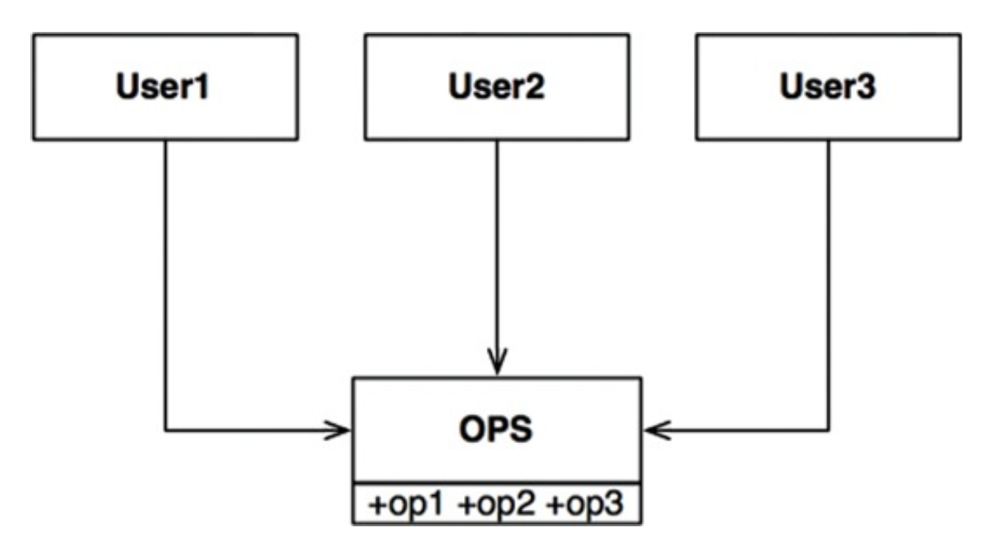
</div>

User1은 op1만을, User2는 op2만을, User3는 op3만을 사용하고, OPS가 정적 타입 언어로 작성된 클래스라 가정해보자. 이 경우 User1에서는 op2, op3를 전혀 사용하지 않음에도
User1의 소스 코드는 이 두 메서드에 의존하게 된다. 이러한 의존성으로 인해 OPS 클래스에 op2 코드가 변경되면 User1과 관련된 코드는 하나도 변경되지 않았음에도 다시 컴파일된다.

이는 오퍼레이션을 인터페이스 단위로 분리하여 해결할 수 있다. User1의 소스 코드는 U1Ops와 op1에 의존하지만 OPS에는 의존하지 않아 OPS에서 발생된 변경이 User1과 관계없는 변경이면 User1이
다시 컴파일되지 않는다.

<div align="center">
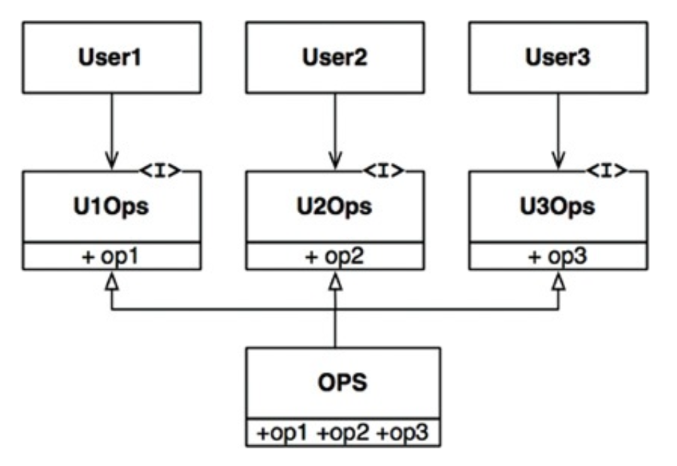
</div>

### ISP와 언어

정적 타입 언어는 사용자가 import, use 또는 include 같은 타입 선언문을 사용하도록 강제해 소스 코드 의존성이 발생하고, 이로 인해 재컴파일이 강제되는 상황이 발생한다. 루비나 파이썬과 같은 동적 타입
언어는 런타임에 추론이 발생한다. 따라서 소스 코드 의존성이 아예 없으며 정적 타입 언어를 사용할 때보다 유연하며 결합도가 낮은 시스템을 만들 수 있는 이유이다. 때문에 ISP는 언어와 관련된 문제라 결론내릴 여지가
있다.

### ISP와 아키텍처

S 시스템 구축에 참여하는 아키텍트가 있다고 가정하자. 아키텍트는 F 프레임워크를 시스템에 도입하기를 원한다. 그리고 F 프레임워크 개발자는 특정한 D 데이터베이스를 반드시 사용하라 만들었다고 가정해보자. 즉, S는
F에 의존하고 F는 다시 D에 의존하게 된다.

F에서는 불필요한 기능, 따라서 S와는 전혀 관계없는 기능이 D에 포함된다고 가정하자. 때문에 D 내부가 변경되면 F를 재배포해야 할 수도 있고, 따라서 S까지 재배포해야 할 수도 있다. 심지어 D의 내부 기능 중
F와
S에서 불필요한 기능에 문제가 발생하면 F와 S에도 영향을 준다는 사실이다.

### 결론

여기서 알아야 할 점은 불필요한 짐을 실은 무언가에 의존하면 예상치 못한 문제에 빠질 수 있다는 점이다.

## DIP: THE DEPENDENCY INVERSION PRINCIPLE

DIP에서 말하는 `유연성이 극대화된 시스템`이란 소스 코드 의존성이 추상에 의존하며 구체에는 의존하지 않는 시스템이다.

자바와 같은 정적 타입 언어에서 use, import, include 구문은 오직 인터페이스나 추상 클래스 같은 추상적인 선언만을 참조해야 한다는 뜻이다. 구체적인 대상에는 절대 의존해서는 안 된다.

하지만 소프트웨어 시스템이라면 구체적인 많은 클래스에 의존하기 때문에 비현실적이다. 예를 들어 자바의 String은 구체 클래스이며 이를 추상 클래스로 만들려는 시도는 현실성이 없다. java.lang.String
구체 클래스에 대한 의존성을 벗어날 수 없고, 벗어나서도 안 된다.

반면 String 클래스는 매우 안정적이며, 변경되는 일도 거의 없고, 변경되더라도 엄격하게 통제된다. 이러한 이유로 DIP를 논할 때 운영체제나 플랫폼 같이 안정성이 보장된 환경에 대해서는 무시하는 편이다.

우리가 의존하지 않도록 피하고자 하는 것은 변동성이 큰 구체적인 요소이다. 즉, 우리가 개발하는 모듈들을 의미한다.

### 안정된 추상화

인터페이스에 변경이 생기면 구현체들도 따라서 수정해야 한다. 반대로 구현체에 변경이 생겨도 구현체가 구현하는 인터페이스는 대부분 변경될 필요가 없다. 즉, 안정된 소프트웨어 아키텍처란 변동성이 큰 구현체에 의존하는
일은 지양하고, 안정된 추상 인터페이스를 선호하는 아키텍처라는 뜻이다.

다음과 같이 매우 구체적인 코딩 실천법으로 요약할 수 있다.

* 변동성이 큰 구체 클래스를 참조하지 말라.
    * 대신 추상 인터페이스를 참조하라. 이 규칙은 객체 생성 방식을 강하게 제약하며, 일반적으로 추상 팩토리를 사용하도록 강제한다.
* 변동성이 큰 구체 클래스로부터 파생하지 말라.
    * 상속은 소스 코드에 존재하는 모든 관계 중 가장 강력한 동시에 뻣뻑해서 변경하기 어려우므로 신중하게 사용해야 한다.
* 구체 함수를 오버라이드 하지 말라.
    * 대체로 구체 함수는 소스 코드 의존성을 필요로 한다. 구체 함수를 오버라이드 하면 이러한 의존성을 제거할 수 없게 되며, 실제로 그 의존성을 상속하게 된다.
* 구체적이며 변동성이 크다면 절대로 그 이름을 언급하지 말라.

### 팩토리

이 규칙들을 준수하려면 변동성이 큰 구체적인 객체는 주의해서 생성해야 한다.

다음 그림에서 추상 팩토리를 사용한 구조를 볼 수 있다. Application은 Service 인터페이스를 통해 ConcreteImpl을 사용하지만, Application에서는 어떤 식으로든 ConcreteImpl의
인스턴스를 생성해야 한다고 하자. ConcreteImplt에 대해 소스 코드 의존성을 만들지 않으면서 이 목적을 이루기 위해 Application은 ServiceFactory 인터페이스의 makeSvc 메서드를
호출한다. 이 메서드는 ServiceFactory로부터 파생된 ServiceFactoryImpl에서 구현된다. 긜고 ServiceFactoryImpl 구현체가 ConcreteImpl 인스턴스를 생성한 후
Service 타입으로 반환한다.

<div align="center">
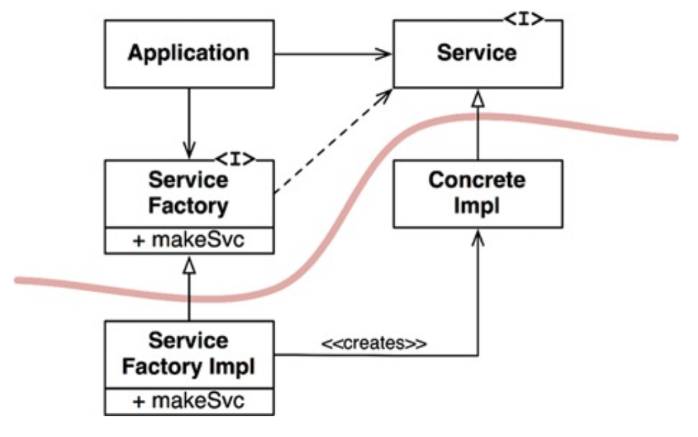
</div>

곡선은 아키텍터의 경계를 뜻한다. 이 곡선은 구체적인 것들로부터 추상적인 것들을 분리한다. 모두 추상적인 방향으로 향한다.

곡선은 두 가지 컴포넌트로 분리한다. 하나는 추상 컴포넌트, 하나는 구체 컴포넌트이다. 추상 컴포넌트는 애플리케이션의 모든 고수준 업무 규칙을 포함하며, 구체 컴포넌트는 업무 규칙을 다루기 위해 필요한 모든
세부사항을 포함한다.

제어흐름은 소스 코드 의존성과는 반대 방향으로 곡선을 가로지르는 점에 주목하자. 다시 말해 소스 코드 의존성은 제어흐름과는 반대로 역전된다. 이러한 이유로 이 원칙을 의존성 역전이라 부른다.

### 구체 컴포넌트

위 그림의 구체 컴포넌트에는 구체적인 의존성이 하나 있으므로(ServiceFactoryImpl이 ConcreteImpl 구체 클래스에 의존) DIP에 위배된다. 이는 일반적으로 발생하며 모든 DIP 위배를 없앨 수
없다. 하지만 DIP를 위배하는 클래스들은 적은 수의 구체 컴포넌트 내부로 모을 수 있고 이를 통해 시스템의 나머지 부분과 분리할 수 있다.

### 결론

의존성은 위에 설명한 곡선을 경계로 더 추상적인 엔티티가 있는 쪽으로만 향한다. 추후 이 규칙은 의존성 규칙이라 부른다.