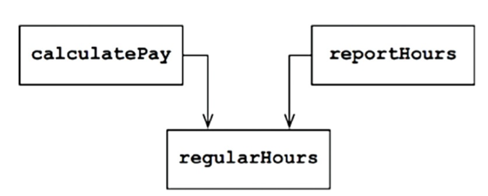
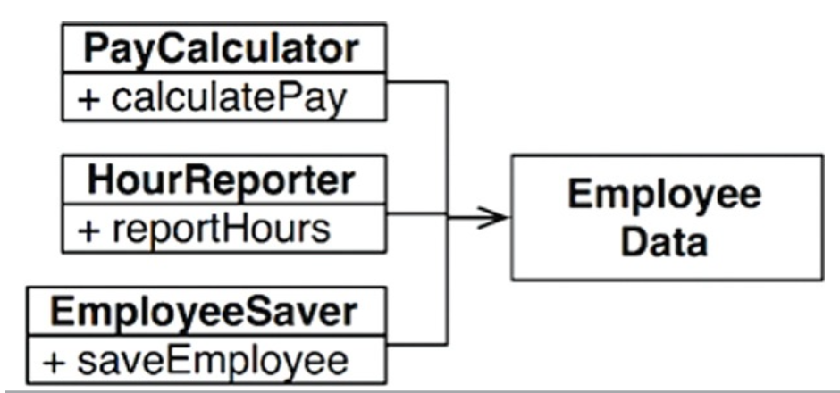
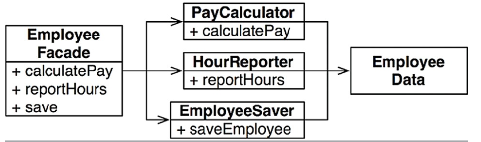
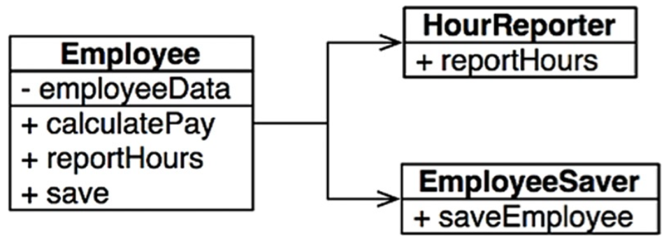

# SRP: THE SINGLE RESPONSIBILITY PRINCIPLE

> 단일 모듈은 변경의 이유가 하나, 오직 하나뿐이여야 한다.

여기서 `변경의 이유`란 사용자와 이해관계자를 가리킨다.

> 하나의 모듈은 하나의, 오직 하나의 사용자 또는 이해관계자에 대해서만 책임져야 한다.

변경을 요청하는 한 명 이상의 사람들을 액터라 부른다.

> 하나의 모듈은 하나의, 오직 하나의 액터에 대해서만 책임져야 한다.

`모듈`의 단순한 정의는 소스 파일이다. 소스 파일이 없는 경우 함수와 데이터 구조로 구성된 응집된 집합으로 정의한다.

## 징후 1: 우발적 중복

급여 애플리케이션의 Employee 클래스가 있다고 가정한다. 이 클래스에는 `calculatePay()`, `reportHours()`, `save()`를 가지고 있다.

* `calculatePay()` : 회계팀에서 기능을 정의하며, CFO 보고를 위해 사용
* `reportHours()` : 인사팀에서 기능을 정의하고 사용하며, COO 보고를 위해 사용
* `save()` : DBA가 기능을 정의하고, CTO 보고를 위해 사용

이 3가지 메서드를 단일 클래스에 배치하여 3개의 액터가 결합되었다. 이 결합으로 인해 CFO 팀에서 결정한 조치가 COO 팀이 의존하는 무언가에 영향을 줄 수 있다.

예를 들어 `calculatePay()`와 `reportHours()`가 초과 근무를 제외한 업무 시간을 계산하는 알고리즘을 공유한다고 가정하며, 이를 `regularHours()` 메서드로 정의한다고 해보자.

이제 CFO 팀에서 초과 근무를 제외한 업무 시간을 계산하는 방식을 약간 수정하기로 결정했다고 하자. 하지만 인사를 담당하는 COO 팀에서는 초과근무를 제외한 업무 시간을 CFO 팀과는 다른 목적으로 사용하기
때문에, 이와 같은 변경을 원치 않는다고 해보자.

개발자는 `calculatePay()`가 편의 메서드인 `regularHours()`를 호출하는 사실을 발견하지만, `reportHours()`에서 호출된다는 사실은 눈치채지 못한다. 따라서 COO
팀은 `reportHours()` 메서드가 생성된 보고서를 여전히 이용한다. 하지만 이 보고서에 포함된 수치들은 엉터리이다.

이러한 문제는 서로 다른 액터가 의존하는 코드를 너무 가까이 배치했기 때문에 발생한다. SRP는 서로 다른 액터가 의존하는 코드를 서로 분리하라고 말한다.

## 징후 2: 병합

예를 들어 DBA가 속한 CTO 팀에서 데이터베이스의 Employee 테이블 스키마를 약간 수정하기로 결정한다. 이와 동시에 인사 담당자가 속한 COO 팀에서는 `reportHours()` 메서드의 보고서 포맷을
변경하기로 결정했다고 가정해보자.

서로 다른 팀에 속한 두 명의 서로 다른 개발자가 Employee 클래스를 체크아웃 받은 후 변경사항을 적용하면, 이들 변경사항은 서로 충돌한다. 결과적으로 병합이 발생한다.

이 징후는 여러 사람이 서로 다른 목적으로 동일한 소스 파일을 변경하는 경우에 발생한다. 이를 해결하는 방법은 서로 다른 액터를 뒷받침하는 코드를 서로 분리하는 것이다.

## 해결책

이 문제의 해결책은 다양한데, 모두가 메서드를 각 다른 클래스로 이동시키는 방식이다.

가장 확실한 해결책은 데이터와 메서드를 분리하는 방식이다. 즉, 메서드가 없는 데이터 구조인 EmployeeData 클래스를 만들고 세 개의 클래스가 공유하도록 한다. 각 클래스는 자신에게 필요한 소스 코드만을
포함하며, 세 클래스 간 서로의 존재를 몰라야 한다.

이 해결책은 세 가지 클래스를 인스턴스화하고 추적해야 한다는 단점이 있다. 이를 해결하기 위해 facade 패턴이 있다.

EmployeeFacade 클래스는 세 클래스의 객체를 생성하고 요청된 메서드를 가지는 객체로 위임하는 일을 책임진다.

중요한 업무 규칙을 데이터와 가깝게 배치하는 방식을 선호하면, 중요한 메서드를 기존의 Employee 클래스에 유지하되 덜 중요한 클래스는 나머지 메서드들에 대한 facade로 사용할 수 있다.

## 결론

SRP는 메서드와 클래스 수준의 원칙이다.

