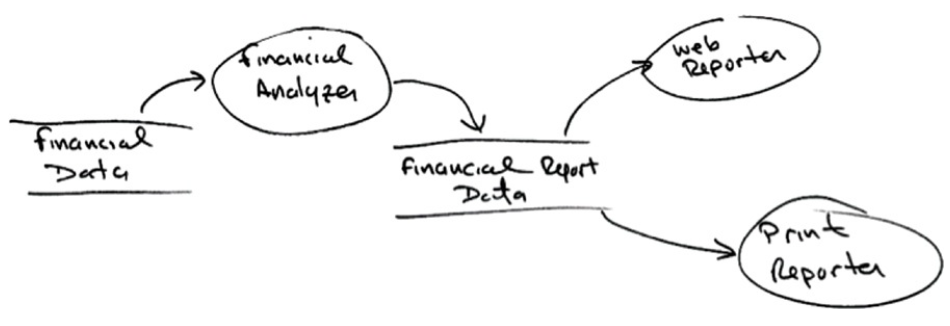
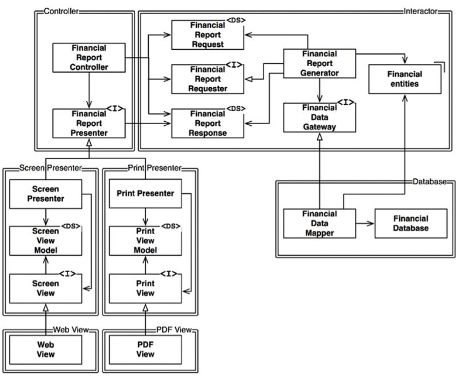
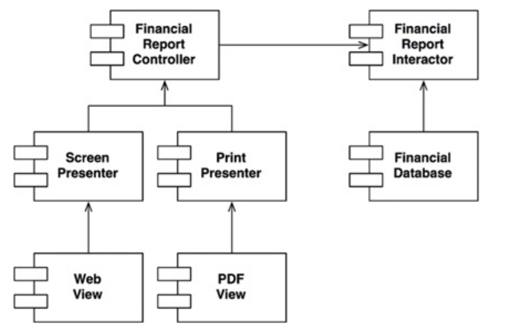

# OCP: THE OPEN-CLOSED PRINCIPLE

> 소프트웨어 개체(artifact)는 확장에 열려 있어야 하고, 변경에는 닫혀 있어야 한다.

즉, 소프트웨어 개체의 행위는 확장할 수 있어야 하지만, 개체를 변경해서는 안된다.

## 사고 실험

재무제표를 웹 페이지로 보여주는 시스템이 있다고 가정하자. 이제 이해관계자가 동일한 정보를 보고서 형태로 변환해서 흑백 프린터로 출력을 요청했다고 하자.

SRP를 적용하면 데이터 흐름을 다음과 같은 형태로 만들 수 있다.

보고서 생성이 두 개의 책임으로 분리된다. 이처럼 책임을 분리했다면, 두 책임 중 하나에서 변경이 발생하더라도 다른 하나는 변경되지 않도록 소스 코드 의존성도 조직화해야 한다. 또한 새로 조직화한 구조에서는 행위가
확장될 때 변경이 발생하지 않음을 보장해야 한다.

이러한 목적 달성을 위해 처리 과정을 클래스 단위로 분할하고, 이들 클래스를 다음과 같은 컴포넌트 단위로 구분해야 한다.

화살표가 A 클래스에서 B 클래스로 향한다면, A 클래스에서는 B 클래스를 호출하지만, B 클래스는 A 클래스를 전혀 호출하지 않음을 뜻한다. 따라서 FinancialDataMapper는
FinancialDataGateway를 알고 있지만, FinancialDataGateway는 FinancialDataMapper를 알지 못한다.

여기서 한 가지 더 주목해야 할 점은 모든 컴포넌트트 관계는 단방향으로 이루어진다는 점이다. 이 화살표는 변경으로부터 보호하려면 컴포넌트를 향하도록 그려진다.

즉, A 컴포넌트에서 발생한 변경으로부터 B 컴포넌트를 보호하려면 반드시 A 컴포넌트가 B 컴포넌트에 의존해야 한다. 위 예제의 경우 Presenter에서 발생한 변경으로부터 Controller를 보호하고자 하며,
View에서 발생한 변경으로부터 Presenter를 보호하고자 한다. Interactor는 모든 것에서 발생한 변경으로부터 보호하고자 한다.

Interactor가 업무 규칙을 포함하기 때문에 모든 변경으로부터 보호되어야 한다. Interactor는 애플리케이션에서 가장 높은 수준의 정책을 포함한다. 다른 컴포넌트는 주변적인 문제를 담당하며, 가장 중요한
문제는 Interactor가 담당한다.

컴포넌트 계층구조를 이와 같이 조직화하면 저수준 컴포넌트에서 발생한 변경으로부터 고수준 컴포넌트를 보호할 수 있다.

## 방향성 제어

위 컴포넌트 그림에서 FinancialDataGateway 인터페이스는 FinancialReportGenerator와 FinancialDataMapper 사이에 위치하는데, 이는 의존성을 역전시키기 위함이다.
FinancialDataGateway가 없었다면 Interactor 컴포넌트에서 Database 컴포넌트로 바로 향하게 된다.

## 정보 은닉

FinancialReportRequester 인터페이스는 방향성 제어와는 다른 목적을 가진다. FinancialReportController가 Interactor 내부에 대해 너무 많이 알지 못하도록 막기 위해
존재한다. 이 인터페이스가 없었다면, Controller는 FinancialEntities에 대해 추이 종속성을 가지게 된다.

> 추이 종속성은 A 클래스가 B 클래스에 의존하고, B 클래스가 C 클래스에 의존한다면, A 클래스는 C 클래스에 의존하는 것을 의미한다.

추이 종속성을 가지게 되면 소프트웨어 엔티티는 `자신이 직접 사용하지 않는 요소에는 절대로 의존해서는 안 된다`는 소프트웨어 원칙에 위배된다. 즉, Controller에서 발생한 변경으로부터 Interactor를
보호하는 우선순위가 가장 높지만, 반대로 Interactor에서 발생한 변경으로부터 Controller로 보호되어야 한다. 이를 위해 Interactor 내부를 은닉한다.

## 결론

OCP는 시스템을 확장하기 쉬운 동시에 변경으로 인해 시스템이 너무 많이 영향을 받지 않도록 하는데 있다. 이를 위해 컴포넌트 단위로 분리하고, 저수준 컴포넌트에서 발생한 변경으로부터 고수준 컴포넌트를 보호할 수
있는 형태의 의존성 계층 구조가 만들어져야 한다.
