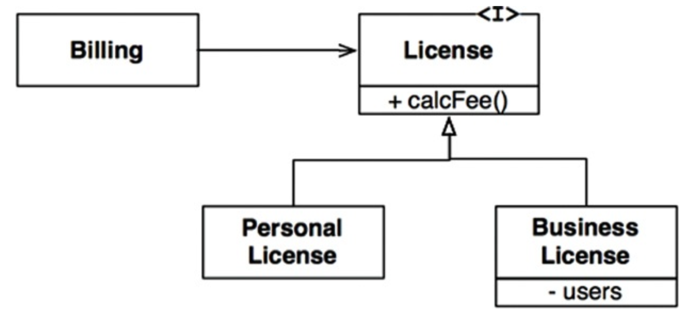
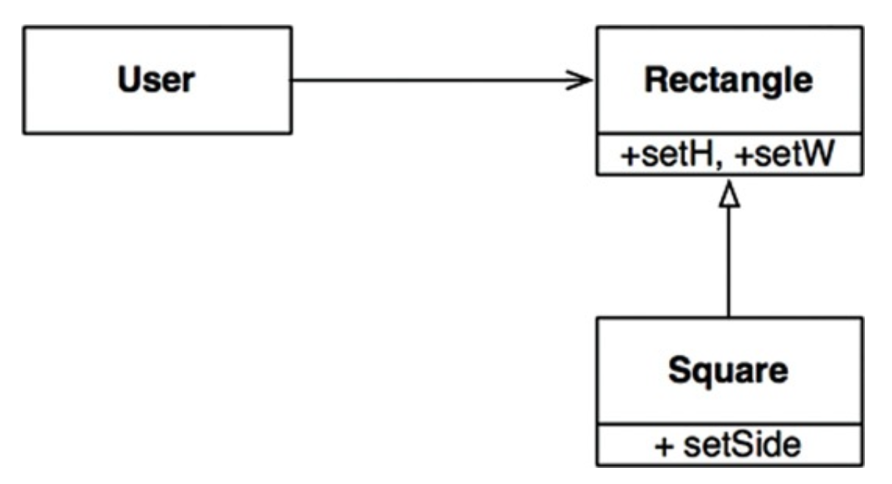

# LSP: THE LISKOV SUBSTITUTION PRINCIPLE

> S 타입의 객체 01 각각에 대응하는 T 타입 객체 02가 있고, T 타입을 이용해 정의한 모든 프로그램 P에서 02의 자리에 01을 치환하더라도 P의 행위가 변하지 않는다면, S는 T의 하위 타입이다.

## 상속을 사용하도록 가이드하기

다음과 같이 License를 상속하는 2개의 하위 타입이 존재한다고 가정하자. 각각 다른 알고리즘을 이용해 라이선스 비용을 계산한다.

<div align="center">

</div>

Billing 애플리케이션의 행위가 License 하위 타입 중 무엇을 사용하는지에 전혀 의존하지 않기 때문에 이 설계는 LSP를 준수한다. 이들 하위 타입은 모두 License 타입을 치환할 수 있다.

## 정사각형/직사각형 문제

LSP를 위반하는 문제로 정사각형/직사각형 문제가 있다.

<div align="center">

</div>

이 예제에서 Square는 Rectangle의 하위 타입으로는 적합하지 않은데, Rectangle의 높이와 너비는 서로 독립적인 반면, Square의 높이와 너비는 반드시 같이 변경되어야 하기 때문이다. User는
대화하고 있는 상대가 Rectangle이라 생각하므로 혼동이 생길 수 있다. 다음 코드를 보자.

```
Rectangle r = ...
r.setW(5);
r.setH(2);
assert(r.area() == 10)
```

...에서 Square를 생성한다면 assert는 실패한다. 이를 막기 위해 if 문 등을 이용해 Rectangle이 실제 Square인지 검사하는 메커니즘을 User에 추가하는 것이다. 하지만 User의 행위가 사용하는
타입에 의존하게 되므로 결국 타입을 서로 치환할 수 없게 된다.

## LSP와 아키텍처

여기서 말하는 인터페이스는 여러 형태로 나타나는데, 자바스러운 언어라면 인터페이스 하나와 이를 구현하는 여러 개의 클래스로 구성되며, 루비라면 동일한 메서드 시그니처를 공유하는 여러 개의 클래스로 구성된다. 또한
REST 인터페이스에 응답하는 서비스 집단일 수도 있다. 이외의 상황에도 LSP를 적용할 수 있다. 잘 정의된 인터페이스와 이 인터페이스의 구현체끼리 상호 치환 가능성에 기대는 사용자들이 존재하기 때문이다.

## LSP 위반 사례

택시 파견 서비스를 통합하는 애플리케이션을 만들고 있다고 가정하자. 고객은 어느 택시업체인지 신경쓰지 않고 자신의 상황에 가장 적합한 택시를 찾는다.

택시 파견 REST 서비스의 URI가 운전기사 데이터베이스에 저장되어 있다고 가정하자. 예를 들어, 택시기사인 Bob의 택시 파견 URI는 다음과 같다.

```
purplecab.com/driver/Bob
```

시스템은 이 URI에 필요한 정보를 추가해 다음과 같이 PUT 방식으로 호출한다.

```
purplecab.com/driver/Bob
             /pickupAddress/24 Maple St.
             /pickupTime/153
             /destination/ORD
```

이 예제에서 파견 서비스를 만들 때 다양한 택시업체에서 동일한 REST 인터페이스를 준수하도록 만들어야 한다는 사실이다.

만약 어떤 업체에서 destination 필드를 dest로 축약해서 사용하였고, destination을 사용하라 강제할 수 없다고 가정하자. 그렇다면 이 예외 사항을 처리하는 로직을 추가해야 할 것이다.

## 결론

LSP는 아키텍처 수준까지 확장할 수 있고, 반드시 확장해야 한다. 치환 가능성을 조금이라도 위배하면 시스템 아키텍처가 오염되어 상당의 별도 메커니즘을 추가해야 할 수도 있다.
