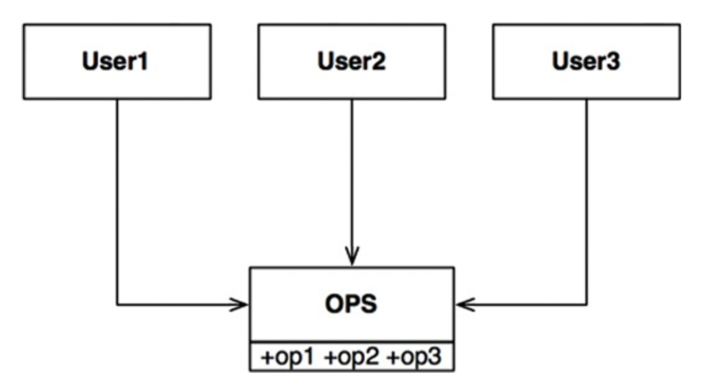
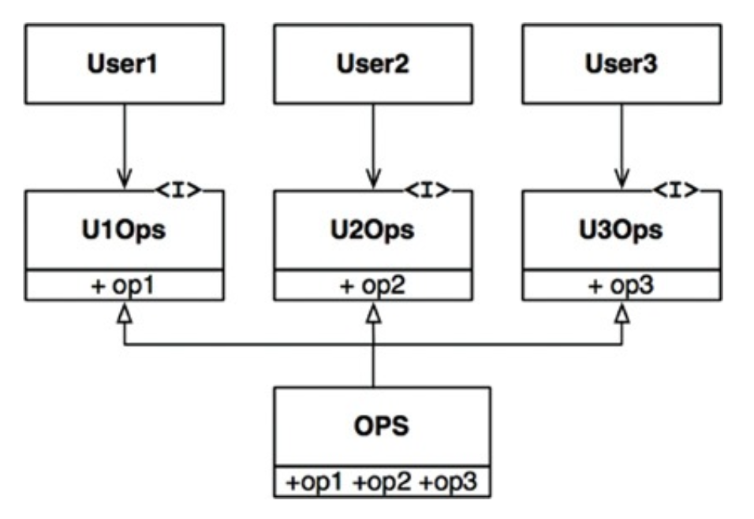

# ISP: THE INTERFACE SEGREGATION PRINCIPLE

ISP는 다음 다이어그램에서 유래했다.

User1은 op1만을, User2는 op2만을, User3는 op3만을 사용하고, OPS가 정적 타입 언어로 작성된 클래스라 가정해보자. 이 경우 User1에서는 op2, op3를 전혀 사용하지 않음에도
User1의 소스 코드는 이 두 메서드에 의존하게 된다. 이러한 의존성으로 인해 OPS 클래스에 op2 코드가 변경되면 User1과 관련된 코드는 하나도 변경되지 않았음에도 다시 컴파일된다.

이는 오퍼레이션을 인터페이스 단위로 분리하여 해결할 수 있다. User1의 소스 코드는 U1Ops와 op1에 의존하지만 OPS에는 의존하지 않아 OPS에서 발생된 변경이 User1과 관계없는 변경이면 User1이
다시 컴파일되지 않는다.

## ISP와 언어

정적 타입 언어는 사용자가 import, use 또는 include 같은 타입 선언문을 사용하도록 강제해 소스 코드 의존성이 발생하고, 이로 인해 재컴파일이 강제되는 상황이 발생한다. 루비나 파이썬과 같은 동적 타입
언어는 런타임에 추론이 발생한다. 따라서 소스 코드 의존성이 아예 없으며 정적 타입 언어를 사용할 때보다 유연하며 결합도가 낮은 시스템을 만들 수 있는 이유이다. 때문에 ISP는 언어와 관련된 문제라 결론내릴 여지가
있다.

## ISP와 아키텍처

S 시스템 구축에 참여하는 아키텍트가 있다고 가정하자. 아키텍트는 F 프레임워크를 시스템에 도입하기를 원한다. 그리고 F 프레임워크 개발자는 특정한 D 데이터베이스를 반드시 사용하라 만들었다고 가정해보자. 즉, S는
F에 의존하고 F는 다시 D에 의존하게 된다.

F에서는 불필요한 기능, 따라서 S와는 전혀 관계없는 기능이 D에 포함된다고 가정하자. 때문에 D 내부가 변경되면 F를 재배포해야 할 수도 있고, 따라서 S까지 재배포해야 할 수도 있다. 심지어 D의 내부 기능 중
F와
S에서 불필요한 기능에 문제가 발생하면 F와 S에도 영향을 준다는 사실이다.

## 결론

여기서 알아야 할 점은 불필요한 짐을 실은 무언가에 의존하면 예상치 못한 문제에 빠질 수 있다는 점이다.
