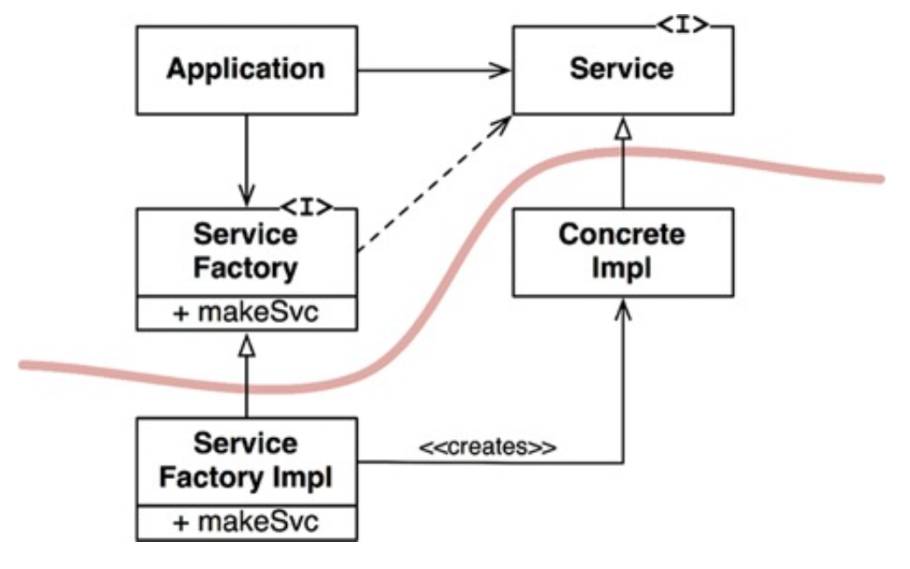

# DIP: THE DEPENDENCY INVERSION PRINCIPLE

DIP에서 말하는 `유연성이 극대화된 시스템`이란 소스 코드 의존성이 추상에 의존하며 구체에는 의존하지 않는 시스템이다.

자바와 같은 정적 타입 언어에서 use, import, include 구문은 오직 인터페이스나 추상 클래스 같은 추상적인 선언만을 참조해야 한다는 뜻이다. 구체적인 대상에는 절대 의존해서는 안 된다.

하지만 소프트웨어 시스템이라면 구체적인 많은 클래스에 의존하기 때문에 비현실적이다. 예를 들어 자바의 String은 구체 클래스이며 이를 추상 클래스로 만들려는 시도는 현실성이 없다. java.lang.String
구체 클래스에 대한 의존성을 벗어날 수 없고, 벗어나서도 안 된다.

반면 String 클래스는 매우 안정적이며, 변경되는 일도 거의 없고, 변경되더라도 엄격하게 통제된다. 이러한 이유로 DIP를 논할 때 운영체제나 플랫폼 같이 안정성이 보장된 환경에 대해서는 무시하는 편이다.

우리가 의존하지 않도록 피하고자 하는 것은 변동성이 큰 구체적인 요소이다. 즉, 우리가 개발하는 모듈들을 의미한다.

## 안정된 추상화

인터페이스에 변경이 생기면 구현체들도 따라서 수정해야 한다. 반대로 구현체에 변경이 생겨도 구현체가 구현하는 인터페이스는 대부분 변경될 필요가 없다. 즉, 안정된 소프트웨어 아키텍처란 변동성이 큰 구현체에 의존하는
일은 지양하고, 안정된 추상 인터페이스를 선호하는 아키텍처라는 뜻이다.

다음과 같이 매우 구체적인 코딩 실천법으로 요약할 수 있다.

* 변동성이 큰 구체 클래스를 참조하지 말라.
    * 대신 추상 인터페이스를 참조하라. 이 규칙은 객체 생성 방식을 강하게 제약하며, 일반적으로 추상 팩토리를 사용하도록 강제한다.
* 변동성이 큰 구체 클래스로부터 파생하지 말라.
    * 상속은 소스 코드에 존재하는 모든 관계 중 가장 강력한 동시에 뻣뻑해서 변경하기 어려우므로 신중하게 사용해야 한다.
* 구체 함수를 오버라이드 하지 말라.
    * 대체로 구체 함수는 소스 코드 의존성을 필요로 한다. 구체 함수를 오버라이드 하면 이러한 의존성을 제거할 수 없게 되며, 실제로 그 의존성을 상속하게 된다.
* 구체적이며 변동성이 크다면 절대로 그 이름을 언급하지 말라.

## 팩토리

이 규칙들을 준수하려면 변동성이 큰 구체적인 객체는 주의해서 생성해야 한다.

다음 그림에서 추상 팩토리를 사용한 구조를 볼 수 있다. Application은 Service 인터페이스를 통해 ConcreteImpl을 사용하지만, Application에서는 어떤 식으로든 ConcreteImpl의
인스턴스를 생성해야 한다고 하자. ConcreteImplt에 대해 소스 코드 의존성을 만들지 않으면서 이 목적을 이루기 위해 Application은 ServiceFactory 인터페이스의 makeSvc 메서드를
호출한다. 이 메서드는 ServiceFactory로부터 파생된 ServiceFactoryImpl에서 구현된다. 긜고 ServiceFactoryImpl 구현체가 ConcreteImpl 인스턴스를 생성한 후
Service 타입으로 반환한다.

곡선은 아키텍터의 경계를 뜻한다. 이 곡선은 구체적인 것들로부터 추상적인 것들을 분리한다. 모두 추상적인 방향으로 향한다.

곡선은 두 가지 컴포넌트로 분리한다. 하나는 추상 컴포넌트, 하나는 구체 컴포넌트이다. 추상 컴포넌트는 애플리케이션의 모든 고수준 업무 규칙을 포함하며, 구체 컴포넌트는 업무 규칙을 다루기 위해 필요한 모든
세부사항을 포함한다.

제어흐름은 소스 코드 의존성과는 반대 방향으로 곡선을 가로지르는 점에 주목하자. 다시 말해 소스 코드 의존성은 제어흐름과는 반대로 역전된다. 이러한 이유로 이 원칙을 의존성 역전이라 부른다.

## 구체 컴포넌트

위 그림의 구체 컴포넌트에는 구체적인 의존성이 하나 있으므로(ServiceFactoryImpl이 ConcreteImpl 구체 클래스에 의존) DIP에 위배된다. 이는 일반적으로 발생하며 모든 DIP 위배를 없앨 수
없다. 하지만 DIP를 위배하는 클래스들은 적은 수의 구체 컴포넌트 내부로 모을 수 있고 이를 통해 시스템의 나머지 부분과 분리할 수 있다.

## 결론

의존성은 위에 설명한 곡선을 경계로 더 추상적인 엔티티가 있는 쪽으로만 향한다. 추후 이 규칙은 의존성 규칙이라 부른다.