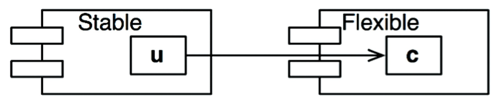

# COMPONENT PRINCIPLES

SOLID 원칙이 벽과 방에 벽돌을 배치하는 방법을 알려준다면, 컴포넌트 원칙은 빌딩에 방을 배치하는 방법을 설명한다.

## COMPONENTS

컴포넌트는 시스템의 구성 요소로 배포할 수 있는 가장 작은 단위이다. 자바의 경우 .jar 파일이 컴포넌트이다. 여러 컴포넌트를 링크하여 실행 가능한 단위 파일로 생성할 수 있다. 또는 여러 컴포넌트를 서로 묶어
.war 파일과 같은 단일 아카이브로 만들 수도 있다. 또는 각각 .jar, .dll 같이 동적으로 로드할 수 있는 플러그인이나 .exe 파일로 만들어 배포할 수도 있다. 잘 설계된 컴포넌트라면 독립적으로 배포
가능한, 즉 독립적으로 개발 가능한 능력을 갖춰야 한다.

### 컴포넌트의 간략한 역사

초장기에는 프로그램을 로드할 메모리의 위치를 정하는 것이 프로그래머가 가장 먼저 결정해야 하는 사항 중 하나였다. 프로그램의 위치가 한 번 결정되면, 재배치가 불가했다. 이 때 라이브러리 함수에 접근하기 위해
프로그래머가 라이브러리 함수의 소스 코드를 애플리케이션에 직접 포함해 단일 프로그램으로 컴파일했다. 라이브러리는 소스 코드 형태로 유지되었다. 이 시대의 장치는 느리고 메모리는 너무 비싸서 자원이 한정적이었기에,
컴파일러는 소스 코드 전체를 여러 번 읽어야 했다. 이 과정은 오래걸렸다.

컴파일 시간을 단축하기 위해 함수 라이브러리의 소스 코드를 애플리케이션의 코드로부터 분리했다. 함수 라이브러리를 개별적으로 컴파일하고, 컴파일된 라이브러리를 메모리의 특정 위치에 로드했다. 함수 라이브러리에 대한
심볼 테이블을 생성 후 이를 이용해 애플리케이션 코드를 컴파일했다. 애플리케이션을 실행하면 함수 라이브러리를 로드한 후 애플리케이션을 로드했다.

애플리케이션이 메모리에서 0000-1777 사이 주소 공간에 들어갈 수 있다면 잘 동작했지만, 점점 커지면 결국 할당 공간을 넘어서게 된다. 이를 해결하기 위해 두 개의 주소 세그먼트로 분리하여 함수 라이브러리
공간을 사이에 두고 오가며 동작하게 배치했다.

여기서 함수 라이브러리도 점점 커지게 되면 결국 할당된 메모리를 넘게 되고, 추가 공간을 할당해야 한다.

### 재배치성

해결책은 재배치가 가능한 바이너리였다. 지능적인 로더를 사용해 메모리에 재배치할 수 있는 형태의 바이너리를 생성하도록 컴파일러를 수정하는 것이다. 이 때 로더는 재배치 코드가 자리할 위치 정보를 전달받았다. 그리고
재배치 코드는 로드한 데이터에서 어느 부분을 수정해야 정해진 주소에 로드할 수 있는지를 알려주는 플래그가 삽입되었다. 이제 프로그래머는 함수 라이브러리를 로드할 위치와 애플리케이션을 로드할 위치를 로더에게 지시할 수
있게 되었다.

또한 컴파일러는 재배치 가능한 바이너리 안의 함수 이름을 메타데이터 형태로 생성하도록 수정되었다. 만약 프로그램이 라이브러리 함수를 호출한다면 컴파일러는 라이브러리 함수 이름을 외부 참조(external
reference)로 생성하고, 라이브러리 함수를 정의하는 프로그램이라면 컴파일러는 해당 이름을 외부 정의(external definition)로 생성했다. 따라서 외부 정의를 로드할 위치가 정해지면 로더가
외부 참조를 외부 정의에 링크시킬 수 있게 된다. 이렇게 링킹 로더가 탄생했다.

### 링커

링킹 로더의 등장으로 프로그램의 개별적으로 컴파일하고 로드할 수 있는 단위로 분할할 수 있게 되었다. 하지만 프로그램이 커짐에 따라 링킹 로더는 수백개의 라이브러리를 읽고 외부 참조를 해석해야 했다.

결국 로드와 링커가 두 단계로 분리되었다. 프로그래머가 느린 부분, 즉 링크 과정을 맡았는데, 링커라는 별도의 애플리케이션으로 이 작업을 처리하도록 만들었다. 링커는 링크가 완료된 재배치 코드를 만들어 주었고, 이
덕분에 로더의 로딩 과정이 빨라졌다.

소스 모듈은 .c 파일에서 .o 파일로 컴파일 된 후, 링커로 전달되어 빠르게 로드될 수 있는 형태의 실행 파일로 만들어졌다. 각 모듈을 컴파일하는 과정은 상대적으로 빨랐지만, 전체 모듈을 컴파일하는 것은 시간이 꽤
걸렸다.

하지만 디스크는 작아지기 시작했고 빨라졌다. 메모리는 저렴해져 디스크에 저장된 데이터를 모두 램에 캐싱할 수 있을 정도였다. 컴퓨터의 클록 속도고 증가했다. 따라서 프로그램을 성장시키는 속도보다 링크 시간이 줄어드는
속도가 더 빨라지게 되었다. 이렇게 액티브 X와 공유 라이브러리 시대가 열렸고, .jar 파일도 등장하기 시작했다. 다수의 .jar 파일 또는 다수의 공유 라이브러리를 순식간에 링크할 수 있게 되었다. 이렇게
컴포넌트 플러그인 아키텍처가 탄생했다.

### 결론

런타임에 플러그인 형태로 결합할 수 있는 동적 링크 파일이 여기서 말하는 소프트웨어 컴포넌트에 해당한다.

## 컴포넌트 응집도

여기선 다음 세 가지 원칙을 논의한다.

* REP(Reuse/Release Equivalence Principle): 재사용/릴리즈 등가 원칙
* 폐(Common Closure Principle): 공통 폐쇄 원칙
* CRP(Common Reuse Principle): 공통 재사용 원칙

### REP: 재사용/릴리즈 등가 원칙

> 재사용 단위는 릴리스 단위와 같다.

릴리스 번호가 없다면 재사용 컴포넌트들이 서로 호환되는지 보증할 방법이 없다. 또한 새로운 버전이 언제 출시되고 무엇이 변했는지를 소프트웨어 개발자들이 알아야 한다.

이 원칙을 소프트웨서 설계와 아키텍처 관점에서 보면 단일 컴포넌트는 응집성 높은 클래스와 모듈들로 구성되어야 함을 뜻한다. 컴포넌트를 구성하는 모든 모듈은 서로 공유하는 중요한 테마나 목적이 있어야 한다.

### CCP: 공통 폐쇄 원칙

> 동일한 이유로 동일한 시점에 변경되는 클래스를 같은 컴포넌트로 묶어라. 서로 다른 시점에 다른 이유로 변경되는 클래스는 다른 컴포넌트로 분리하라.

이 원칙은 SRP 컴포넌트 관점에서 쓴 것이다. SRP에서 단일 클래스는 변경의 이유가 어려 개 있어서는 안 된다고 하듯이, CCP도 마찬가지로 단일 컴포넌트는 변경의 이유가 하나여야 한다고 말한다.

CCP는 변경될 가능성이 있는 클래스는 모두 한 곳으로 묶을 것을 권한다. 물리적 또는 개념적으로 강하게 결합되어 함께 변경되는 클래스들은 하나의 컴포넌트에 속해야 한다. 이를 통해 릴리스, 재검증, 배포하는 일과
관련된 작업량을 최소화할 수 있다.

이는 OCP와도 밀접하게 관련되어 있다. OCP의 C와 CCP의 C는 뜻이 같다. CCP에서는 동일한 유형의 변경에 대해 닫혀 있는 클래스들을 하나의 컴포넌트로 묶음으로써 OCP를 확대하여 적용한다. 따라서 변경이
필요한 요구사항이 발생했을 때, 그 변경이 영향을 주는 컴포넌트들이 최소한으로 한정될 가능성이 높아진다.

#### SRP와의 유사성

CCP는 컴포넌트 수준의 SRP이다. CCP는 서로 다른 이유로 변경되는 클래스를 서로 다른 컴포넌트로 분리하라고 한다.

> 동일한 시점에 동일한 이유로 변경되는 것들을 한데 묶어라. 서로 다른 시점에 다른 이유로 변경되는 것들은 서로 분리하라.

### CRP: 공통 재사용 원칙

> 컴포넌트 사용자들을 필요하지 않는 것에 의존하게 강요하지 말라.

CRP에서는 같이 재사용되는 경향이 있는 클래스와 모듈들은 같은 컴포넌트에 포함해야 한다고 말한다.

간단한 예로 컨테이너(container) 클래스와 해당 클래스의 이터레이터(iterator) 클래스를 들 수 있다. 이들 클래스는 서로 강하게 결합되어 있기 때문에 함께 재사용된다. 따라서 이들 클래스는 반드시
동일한 컴포넌트에 위치해야 한다.

만약 어떤 컴포넌트가 다른 컴포넌트를 사용하면, 두 컴포넌트 사이에 의존성이 발생한다. 이 같은 의존성으로 사용되는(used) 컴포넌트가 변경될 때마다, 사용하는(using) 컴포넌트도 변경해야 할 가능성이 높다.
또는 사용하는 컴포넌트를 변경하지 않더라도 재컴파일, 재검증, 재배포를 해야 하는 가능성은 여전히 남아 있다.

따라서 의존하는 컴포넌트가 있다면 해당 컴포넌트의 모든 클래스에 대해 의존함을 확실히 인지해야 한다. 다시 말하면 한 컴포넌트에 속한 클래스들은 더 작게 그룹지울 수 없다. 즉, 그중 일부 클래스에만 의존하고 다른
클래스와는 독립적일 수 없음을 확실히 인지해야 한다.

따라서 CRP는 어떤 클래스를 한데 묶어도 되는지보다, 어떤 클래스를 한데 묶어서는 안 되는지에 대해 더 많이 이야기한다. CRP는 강하게 결합되지 않은 클래스들을 동일한 컴포넌트에 위치시켜서는 안 된다고 말한다.

#### ISP와의 관계

CRP는 ISP의 포괄적인 버전이다. ISP는 사용하지 않은 메서드가 있는 클래스에 의존하지 말라고 말한다. CRP는 사용하지 않는 클래스를 가진 컴포넌트에 의존하지 말라고 말한다.

> 필요하지 않은 것에 의존하지 말라.

### 컴포넌트 응집도에 대한 균형 다이어그램

응집도에 관한 세 원칙이 서로 상충된다. REP와 CCP는 포함(inclusive) 원칙이다. CRP는 배제(exclusive) 원칙이다.

다음은 응집도에 관한 세 원칙이 어떻게 상호작용하는지 보여준다.

오로지 REP와 CRP에 중점을 두면 사소한 변경이 생겼을 때, 많은 컴포넌트에 영향을 미친다. 반대로 CRP와 REP에만 중점을 두면 불필요한 릴리스가 너무 빈번해진다.

초기에는 CCP가 REP보다 훨씬 중요한데 개발 가능성이 재사용성보다 더 중요하기 때문이다. 일반적으로 프로젝트는 삼각형의 오른쪽에서 시작하는 편이며, 이 때는 재사용성만 희생하면 된다. 프로젝트가 커짐에 따라 점점
왼쪽으로 이동한다. 즉, 컴포넌트 구조는 시간과 성숙도에 따라 변하게 된다.

### 결론

어느 클래스들을 묶어 컴포넌트로 만들지 결정할 때, 재사용성과 개발 가능성이라는 상충하는 힘을 반드시 고려해야 한다. 이들 사이에서 애플리케이션의 요구에 맞게 균형을 잡아야 한다.

## COMPONENT COUPLING

여기서 다룰 세 가지 원칙은 컴포넌트 사이 관계를 설명한다. 여기서도 개발 가능성과 논리적 설계 사이 균형을 다룬다.

### ADP(ACYCLIC DEPENDENCIES PRINCIPLE): 의존성 비순환 원칙

> 컴포넌트 의존성 그래프에 순한이 있어서는 안된다.

동일한 소스 파일을 수정하는 환경에서 `숙취 증후군`이 발생한다. `숙취 증후군`이란 의존하고 있던 무언가를 수정하여 작동하지 않는 것이다.

이에 대한 해결책은 `주 단위 빌드`와 `의존성 비순환 원칙`이다.

#### 주 단위 빌드(Weekly Build)

개발자는 일주일의 첫 4일 동안은 서로 신경쓰지 않는다. 모두 코드를 개인적으로 복사하여 작업하며, 전체적인 기준에서 작업을 어떻게 통합할지는 걱정하지 않는다. 금요일이 되면 변경된 코드를 모두 통합하여 시스템을
빌드한다. 안타깝게도 프로젝트가 커지면 통합은 금요일 하루 만에 끝내는 것이 불가능하다. 통합에 필요한 시간이 늘어감에 따라 팀의 효율성도 나빠진다. 이를 해결하기 위해 빌드 일정을 계속 늘리지만, 빌드 주기가
늦어질수록 프로젝트가 감수할 위험은 커진다.

#### 순환 의존성 제거하기

위 문제의 해결책은 개발 환경을 릴리스 가능한 컴포넌트 단위로 분리하는 것이다. 이를 통해 컴포넌트는 단일 개발팀이 책임질 수 있는 작업 단위가 된다. 개발자는 해당 컴포넌트가 동작하도록 만들고, 해당 컴포넌트를
릴리스하여 다른 개발자가 사용할 수 있도록 한다.

따라서 어떤 팀도 다른 팀에 의해 좌우되지 않는다. 특정 컴포넌트가 변경되더라도 다른 팀에 즉각 영향을 주지 않는다. 뿐만 아니라 통합은 작고 점진적으로 이뤄진다. 특정 시점에 모든 개발자가 한데 모여 통합하는
과정은 사라진다.

이 절차가 성공적으로 동작하려면 컴포넌트 사이 의존성 구조를 반드시 관리해야 한다. 의존성 구조에 순환이 있어서는 안된다. 의존성 구조에 순환이 생기면 `숙취 증후군`을 피해갈 수 없다.

다음은 컴포넌트를 조립하여 애플리케이션을 만드는 전형적인 구조이다. 여기서 주목할 점은 어느 컴포넌트에서 시작하더라도 의존성 관계를 따라가면서 최초의 컴포넌트로 되돌아갈 수 없다는 것이다. 즉, 이 구조는 비순환
방향 그래프(DAG: Directed Acyclic Graph)이다.

Presenters를 담당하는 팀에서 이 컴포넌트의 새 릴리스를 만들면 View와 Main 컴포넌트에 영향을 받는다. 이 두 컴포넌트를 개발하는 개발자라면 Presenters의 새로운 릴리스와 자신의 작업물을 언제
통합할지 결정해야 한다.

또한 Main은 새로 릴리스되더라도 시스템에 영향받는 컴포넌트가 전혀 없다는 사실에 주목하자. 즉, Main이 변경되더라도 미치게 되는 영향은 거의 작다는 의미이다.

Presenters 컴포넌트를 만드는 개발자가 이를 테스트하려면, 현재 사용중인 버전의 Interactors와 Entities를 이용해 Presenters 자체 버전을 빌드하면 된다. 나머지 컴포넌트와는 전혀 관련이
없다. 즉, 해당 개발자는 테스트를 구성할 때 대체로 적은 노력이 든다는 뜻이다.

시스템 전체를 릴리스할 때가 오면 절차는 상향식으로 진행된다. 먼저 Entities 컴포넌트를 컴파일하고, 테스트하고, 릴리스한다. 그러고 Database와 Interactors도 동일한 과정을 거친다. Main은
마지막에 처리한다. 이처럼 컴포넌트 간 의존성을 파악하고 있으면 시스템을 빌드하는 방법을 알 수 있다.

#### 순환이 컴포넌트 의존성 그래프에 미치는 영향

새로운 요구사항이 발생해 Entities에 포함된 클래스 하나가 Authorizer에 포함된 클래스 하나를 사용하도록 변경할 수밖에 없다고 가정하자.

이렇게 되면 순환 의존성이 발생한다. Database 컴포넌트를 만드는 개발자는 컴포넌트를 릴리스하려면 Entities 컴포넌트와 반드시 호환되어야 한다. 하지만 Entities 컴포넌트에 순환이 있으므로,
Database 컴포넌트는 또한 Authorizer와도 호환되어야 한다. 그러나 Authorizer는 Interactors에 의존한다. 이로 인해 Database는 릴리스하기 훨씬 어려워진다. Entities,
Authorizer, Interactors는 사실상 하나의 컴포넌트가 되어버린다.

Entities 컴포넌트를 테스트할 때도 Authorizer와 Interactors까지도 반드시 빌드하고 통합해야 한다.

이처럼 순환이 생기면 컴포넌트 분리하기가 상당히 어려워진다. 테스트도 어려워지며, 에러도 쉽게 발생한다. 더욱이 모듈의 개수가 늘어감에 따라 빌드 관련 이슈는 기하급수적으로 증가한다. 또한 순환이 생기면 어떤 순서로
빌드해야 올바른지 파악이 어려워진다.

#### 순환 끊기

컴포넌트 사이 순환을 끊고 의존성을 다시 DAG로 원상복구하는 일은 언제라도 가능한다.

1. DIP를 이용한다. 다음과 같이 User가 필요한 메서드를 제공하는 인터페이스를 생성한다. 그리고 이 인터페이스는 Entities에 위치시키고, Authorizer에서 이 인터페이스를 상속받아 의존성을 역전시켜
   순환을 끊을 수 있다.

2. Entities와 Authorizer가 모두 의존하는 새로운 컴포넌트를 만든다. 그리고 두 컴포넌트가 모두 의존하는 클래스들을 새로운 컴포넌트로 이동시킨다.

#### 흐트러짐(Jitters)

두 번째 해결책은 요구사항이 변경되면 컴포넌트 구조도 변경될 수 있다는 사실이다. 의존성 구조는 서서히 흐트러지며 또 성장하므로, 의존성 구조에 순환이 발생하는지 항상 관찰해야 한다.

### SDP: 안정된 의존성 법칙

> 안정성의 방향으로(더 안정된 쪽에) 의존하라.

컴포넌트 중 일부는 변동성을 지니도록 설계된다. 변동성을 지니도록 설계한 컴포넌트는 언젠가 변경되리라고 예상한다.

변경이 쉽지 않은 컴포넌트가 변동이 예상되는 컴포넌트에 의존하게 만들면 안 된다. 한번 의존하게 되면 변동성이 큰 컴포넌트도 결국 변경이 어려워진다.

SRP(Stable Dependencies Principle)을 준수하면 변경하기 어려운 모듈이 변경하기 쉽게 만들어진 모듈에 의존하지 않도록 설계할 수 있다.

#### 안정성

소프트웨어 컴포넌트르 변경하기 어렵게 만드는 데는 많은 요인이 존재하며, 예로는 크기, 복잡도, 간결함 등을 들 수 있다. 이러한 요인들은 무시하고, 좀 더 특이한 요인에 주목해보자. 소프트웨어 컴포넌트를 변경하기
어렵게 만드는 확실한 방법 중 하나는 수많은 컴포넌트가 해당 컴포넌트에 의존하게 만드는 것이다.

컴포넌트 X는 안정된 컴포넌트이다. 이 경우 X는 세 컴포넌트를 책임진다고 할 수 있다. X는 어디에도 의존하지 않으므로 X가 변경되도록 만들 수 있는 외적인 영향이 없다. 이 경우 X는 독립적이라고 한다.

Y는 불안정한 컴포넌트이다. 어떤 컴포넌트도 Y에 의존하지 않으므로 책임성이 없다고 할 수 있다. Y는 세 개의 컴포넌트에 의존하므로 변경이 발생할 수 있는 외부 요인이 세 가지이다. 이 경우 Y는 의존적이라고
한다.

#### 안정성 지표

컴포넌트로 들어오고 나가는 의존성 개수를 세어 보는 방식으로 컴포넌트의 안정성 측정을 할 수 있다. 이를 통해 컴포넌트가 위치상 어느 정도의 안정성을 가지는지 계산할 수 있다.

* *Fan-in*: 안으로 들어오는 의존성. 이 지표는 컴포넌트 내부 클래스에 의존하는 컴포넌트 외부의 클래스 개수를 나타낸다.
* *Fan-out*: 바깥으로 나가는 의존성. 이 지표는 컴포넌트 외부의 클래스에 의존하는 컴포넌트 내부의 클래스 개수를 나타낸다.
* *I(불안정성)*: *I = Fan-out / (Fan-in + Fan-out)*. 이 지표는 [0, 1] 범위를 갖는다. *I=0*이면 안정된 컴포넌트이며 *I=1*이면 불안정한 컴포넌트라는 뜻이다.

*Fan-in*과 *Fan-out* 지표는 특정 컴포넌트 내부의 클래스에 의존하는, 컴포넌트 외부에 위치한 클래스의 개수를 세어 계산할 수 있다.

Cc 컴포넌트의 안정성을 계산해보자. Cc 내부의 클래스에 의존하며 Cc 외부에 있는 클래스는 3개이다. 따라서 *Fan-in = 3*이다. 소스 파일이 클래스당 하나가 되도록 구조화하면 *I* 지표는 쉽게 계산할
수 있다. 자바의 경우 *I* 지표는 import 구문과 완전한 클래스 이름의 개수를 세어 계산할 수 있다.

*I=1*이면 어떤 컴포넌트도 해당 컴포넌트에 의존하지 않지만(*Fan-in = 0*), 해당 컴포넌트는 다른 컴포넌트에 의존한다(*Fan-out > 0*)는 뜻이다. 이는 컴포넌트가 가질 수 있는 최고로 불안정한
상태이다. 이 컴포넌트가 다른 컴포넌트에 의존한다는 사실은 언젠가 해당 컴포넌트를 변경해야 할 이유가 있다는 뜻이다.

반대로 *I=0*이면 해당 컴포넌트에 의존하는 다른 컴포넌트가 있지만(*Fan-in > 0*), 해당 컴포넌트 자체는 다른 컴포넌트에 의존하지 않는다(*Fan-out = 0*)는 뜻이다. 이러한 컴포넌트는 다른
컴포넌트를 책임지며 독립적이다. 따라서 최고로 안정된 상태라 볼 수 있다. 해당 컴포넌트는 변경하기 어렵지만, 해당 컴포넌트를 변경하도록 강제하는 의존성은 갖지 않는다.

SDP에서 컴포넌트의 *I* 지표는 그 컴포넌트가 의존하는 다른 컴포넌트들의 *I*보다 커야 한다고 말한다. 즉, 의존성 방향으로 갈수록 *I* 지표 값이 감소해야 한다.

#### 모든 컴포넌트가 안정적이여야 하는 것은 아니다

모든 컴포넌트가 최고로 안정적인 시스템이라면 변경이 불가능하다. 이는 바람직한 상황이 아니다. 컴포넌트 구조를 설계할 때 기대하는 것은 불안정한 컴포넌트도 있고 안정된 컴포넌트도 존재하는 상태이다. 다음 다이어그램은
세 컴포넌트로 구성된 시스템이 가질 수 있는 이상적인 구조이다.

위쪽에는 변경 가능한 컴포넌트가 보이고, 아래의 안정된 컴포넌트에 의존한다. 다이어그램에서 불안정한 컴포넌트는 관례적으로 위쪽에 두는데, 이렇게 위치하는 경우 위로 향하는 화살표가 있으면 SDP를 위배(ADP도
위반)하는 상태가
되는 것을 바로 알 수 있다.

다음 다이어그램은 SDP가 위배되는 것을 보여준다. Flexible은 변경하기 쉽도록 설계한 컴포넌트이다.

Stable 컴포넌트에서 작업하던 개발자가 Flexible에 의존성을 걸게 되었다. 이로 인해 SDP를 위배하는데, Stable의 *I* 지표는 Flexible의 *I* 지표보다 더 작기 때문이다. Flexible은
변경하기 어렵게 되었다.

이 문제를 해결하려면 Stable의 Flexible에 대한 의존성을 끊어야 한다. 만약 Stable 내부 클래스가 Flexible 내부 클래스 C를 사용한다고 가정해보자.

DIP를 도입하면 이 문제를 해결할 수 있다. 인터페이스를 생성한 후 UServer에 넣는다. 이 때 US 인터피에스에 U가 사용하는 메서드가 모두 선언되어 있어야 한다. 그 다음 C가 해당 인터페이스를 구현하도록
만든다. 이를 통해 Flexible에 대한 의존성을 끊을 수 있고 두 컴포넌트는 모두 UServer에 의존하도록 강제한다. UServer는 매우 안정된 상태이며(*I=0*), Flexible은 자신에게 맞는
불안정성(*I=1*)을 그대로 유지할 수 있다. 이제 모든 의존성은 *I*가 감소하는 방향으로 향한다.

#### 추상 컴포넌트

오로지 인터페이스만 포함하는 컴포넌트(UServer)를 생성하느 방식이 이상할 수 있지만, 실제로는 많이 사용되는 전략이다. 이러한 추상 컴포넌트는 상당히 안정적이며, 덜 안정적인 컴포넌트가 의존할 수 있는 이상적인
대상이다.

### SAP: 안정된 추상화 원칙

> 컴포넌트는 안정된 정도만큼만 추상화되어야 한다.

#### 고수준 정책을 어디에 위치시켜야 하는가?

시스템에는 고수준 아키텍처나 정책 결정과 관련된 소프트웨어 같은 자주 변경되어서는 안 되는 소프트웨어도 있다. 따라서 시스템에서 고수준 정책을 캡슐화하는 소프트웨어는 반드시 안정된 컴포넌트(*I=0*)에 위치해야
한다. 불안정한 컴포넌트(*I=1*)는 반드시 변동성이 큰 소프트웨어, 즉 쉽고 빠르게 변경될 수 있는 소프트웨어만 포함해야 한다.

하지만 고수준 정책을 안정된 컴포넌트에 위치시키면, 그 정책을 포함하는 소스 코드는 수정하기 어려워진다. OCP를 통해 컴포넌트가 안정된 상태이면서도(*I=0*) 동시에 변경에 대응할 수 있도록 유연하게 만들 수
있다.

#### 안정된 추상화 원칙

SAP는 안정성과 추상화 정도(abstractness) 사이의 관계를 정의한다. 이 원칙은 안정된 컴포넌트는 추상 컴포넌트여야 한다는 의미이다. 다르게 말하면, 불안정한 컴포넌트는 반드시 구체 컴포넌트여야 한다는
뜻이다.

따라서 안정적인 컴포넌트라면 반드시 인터페이스와 추상 클래스로 구성되어 쉽게 확장할 수 있어야 한다. 안정된 컴포넌트가 확장이 가능해지면 유연성을 얻게 되고 아키텍처를 과도하게 제약하지 않는다.

SAP와 SDP를 결합하면 컴포넌트에 대한 DIP나 마찬가지가 된다. 실제로 SDP에서는 의존성이 반드시 안정성의 방향으로 향해야 한다고 말하며, SAP에서는 안정성이 결국 추상화를 의미한다고 말하기 떄문이다. 즉,
의존성의 방향은 추상화의 방향으로 향하게 된다.

하지만 DIP는 클래스에 대한 원칙이며 클래스의 경우 중간은 존재하지 않는다. 즉, 클래스는 추상적이거나 아니거나, 둘 중 하나이다. SDP와 SAP의 조합은 컴포넌트에 대한 원칙이며, 컴포넌트는 어떤 부분은
추상적이면서 다른 부분은 안정적일 수 있다.

#### 추상화 정도 측정하기

*A* 지표는 컴포넌트의 추상화 정도를 측정한 값이다. 이 값은 컴포넌트의 클래스 총 수 대비 인터페이스와 추상 클래스의 개수를 단순 계산한 값이다.

* *Nc*: 컴포넌트의 클래스 개수
* *Na*: 컴포넌트의 추상 클래스와 인터페이스의 개수
* *A*: 추상화 정도. *A = Na / Nc*

*A* 지표는 0과 1 사이 값을 갖는다. *A*가 0이면 컴포넌트에 추상 클래스가 하나도 없다는 뜻이다. *A*가 1이면 컴포넌트는 오로지 추상 클래스만을 포함한다는 뜻이다.

#### 주계열

이제 안정성(*I*)과 추상화 정도(*A*) 사이 관계를 정의해야 한다. *A*를 수직축에, *I*를 수평축에 두는 그래프를 그린다.

대체로 컴포넌트는 추상화와 안정화의 정도가 다양하다. 예를 들어 추상 클래스는 흔히 다른 추상 클래스로부터 파생해서 만들곤 한다. 이러한 파생 클래스는 추상적이지만 의존성을 가진다. 따라서 이 클래스는 추상적이지만
안정적인 것은 아니다. 의존성으로 인해 안정성이 감소하기 때문이다.

*A/I* 그래프 상 컴포넌트가 위치할 수 있는 합리적인 지점을 정의하는 궤적이 있다. 이 궤적은 컴포넌트가 절대 위치해서는 안 되는 영역, 다시 말해 배제할 구역을 찾는 방식으로 추론할 수 있다.

#### The Zone of Pain

(0, 0) 주변 구역에 위치한 컴포넌트를 살펴보자. 이 컴포넌트는 매우 안정적이며 구체적이다. 이러한 컴포넌트는 뻣뻣한 상태이며 바람직한 상태가 아니다. 추상적이지 않으므로 확장할 수 없고, 안정적이므로 변경하기가
어렵다. 따라서 해당 구역은 배제해야 할 구역이며 Zone of Pain이라 부른다.

일부 소프트웨어 엔티티는 이 구역에 위치하곤 한다. 데이터베이스 스키마가 한 예이다. 데이터베이스 스키마는 변동성이 높고, 극단적으로 구체적이며, 많은 컴포넌트가 여기에 의존한다. 이러한 이유로 OO 애플리케이션과
데이터베이스 사이 위치한 인터페이스는 관리하기 어려우며, 스키마가 변경되면 고통을 수반한다.

다른 예로 유틸리티 라이브러리를 들 수 있다. 이러한 라이브러리는 *I* 지표가 1이라도, 실제로는 변동성이 거의 없다. 예를 들어 String 컴포넌트를 생각해보자. 이 컴포넌트에 속한 클래스는 모두 구체
클래스다. 하지만 이 컴포넌트는 광범위하게 사용되고 있기 때문에 수정해버리면 혼란을 초래할 수 있다. 따라서 String은 변동성이 없다.

변동성이 없는 컴포넌트는 (0, 0) 구역에 위치해도 해롭지 않다. 이러한 이유로 Zone of Pain에서 문제가 되는 경우는 소프트웨어 컴포넌트이다. 이 구역에 위치한 컴포넌트가 변동성이 크면 클수록 수반되는
고통은 더욱 고통스럽다.

#### The Zone of Uselessness

(1, 1) 주변 컴포넌트를 생각해보자. 여기 위치한 컴포넌트는 최고로 추상적이지만, 누구도 이 컴포넌트에 의존하지 않기 때문이다. 이러한 컴포넌트는 쓸모가 없기 때문에 Zone of Uselessness이라
부른다.

#### 배제 구역 벗어나기

따라서 변동성이 큰 컴포넌트 대부분은 두 배제 구역으로부터 가능한 멀리 떨어뜨려야 한다. 가장 멀리 떨어진 점의 궤적은 (1, 0)과 (0, 1)을 잇는 선분이다. 이 선분을 주계열(Main Sequence)라
부른다.

주계열에 위치한 컴포넌트는 자신의 안정성에 비해 `너무 추상적`이지도 않고, 추상화 정도에 비해 `너무 불안정`하지도 않다. 컴포넌트가 추상화된 수준에 어울릴 정도로만 다른 컴포넌트가 의존하며, 구체화된 수준에
어울릴 정도로만 다른 컴포넌트에 의존한다.

컴포넌트가 위치할 수 있는 가장 바람직한 지점은 주계열의 두 종점이다. 현실적으로 이는 불가능하므로 주계열에 가깝게 위치할 때 가장 이상적이다.

#### 주계열과의 거리

여기서 세 번째 지표가 도출된다. 컴포넌트가 주계열 가까이 있는 것이 바람직하다면, 이 같은 이상적인 상태로부터 컴포넌트가 얼마나 떨어져 있는지 측정하는 지표를 만들어 볼 수 있다.

* *D*: 거리. D = |A + I - 1|. 이 지표의 유효범위는 [0, 1]이다. *D*가 0이면 컴포넌트가 주계열 가까이 위치한다는 뜻이며, 1이면 주계열로부터 가장 멀리 위치한다는 뜻이다.

이를 계산하여 설계를 통계적으로 분석할 수 있게 된다. 컴포넌트에 대한 *D* 지표의 평균과 분산을 구한다. 주계열에 일치하도록 설계되었다면 평균과 분산은 0에 가까워진다. 그리고
분산은 `관리 한계(control limit)`를 결정하기 위한 목적으로 사용할 수 있다.

다음 그림에서 보듯이 대부분의 컴포넌트가 주계열을 따라 위치하지만 일부 컴포넌트는 표준편차가 1(Z=1)인 영역을 벗어나 있다. 이처럼 이상한 컴포넌트는 좀 더 면밀히 검토해볼 가치가 있다.

*D* 지표를 활용하는 다른 방법으로, 각 컴포넌트의 *D* 값을 시간에 따라 그려볼 수 있다. 다음 그림을 보면 마지막 몇 개의 릴리스에서 Payroll 컴포넌트에 이상한 의존성이 조금씩 스며들어왔다는 사실을 알
수 있다. 이 도표에서 관리 한계는 D = 0.1인 지점이다.

### 결론

의존성 관리 지표는 설계의 의존성과 추상화 정도가 `훌륭한` 패턴이라고 생각하는 수준에 얼마나 잘 부합하는지를 측정한다.