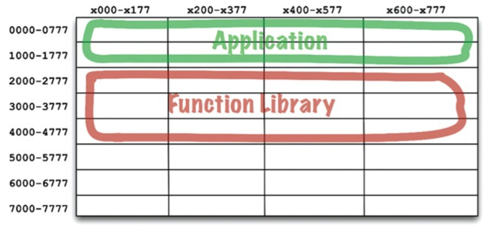
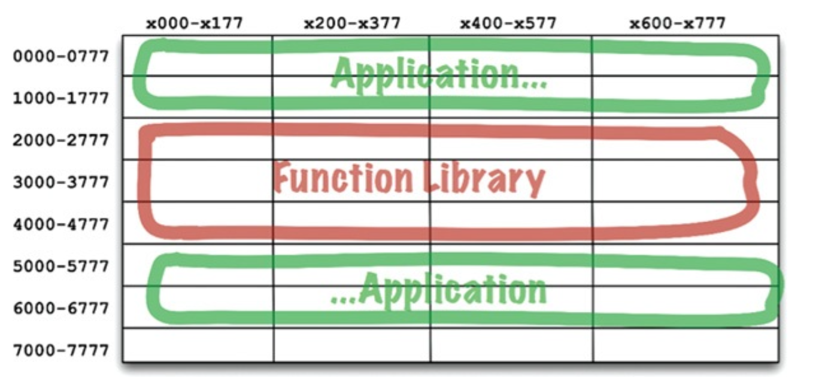

# COMPONENTS

컴포넌트는 시스템의 구성 요소로 배포할 수 있는 가장 작은 단위이다. 자바의 경우 .jar 파일이 컴포넌트이다. 여러 컴포넌트를 링크하여 실행 가능한 단위 파일로 생성할 수 있다. 또는 여러 컴포넌트를 서로 묶어
.war 파일과 같은 단일 아카이브로 만들 수도 있다. 또는 각각 .jar, .dll 같이 동적으로 로드할 수 있는 플러그인이나 .exe 파일로 만들어 배포할 수도 있다. 잘 설계된 컴포넌트라면 독립적으로 배포
가능한, 즉 독립적으로 개발 가능한 능력을 갖춰야 한다.

## 컴포넌트의 간략한 역사

초장기에는 프로그램을 로드할 메모리의 위치를 정하는 것이 프로그래머가 가장 먼저 결정해야 하는 사항 중 하나였다. 프로그램의 위치가 한 번 결정되면, 재배치가 불가했다. 이 때 라이브러리 함수에 접근하기 위해
프로그래머가 라이브러리 함수의 소스 코드를 애플리케이션에 직접 포함해 단일 프로그램으로 컴파일했다. 라이브러리는 소스 코드 형태로 유지되었다. 이 시대의 장치는 느리고 메모리는 너무 비싸서 자원이 한정적이었기에,
컴파일러는 소스 코드 전체를 여러 번 읽어야 했다. 이 과정은 오래걸렸다.

컴파일 시간을 단축하기 위해 함수 라이브러리의 소스 코드를 애플리케이션의 코드로부터 분리했다. 함수 라이브러리를 개별적으로 컴파일하고, 컴파일된 라이브러리를 메모리의 특정 위치에 로드했다. 함수 라이브러리에 대한
심볼 테이블을 생성 후 이를 이용해 애플리케이션 코드를 컴파일했다. 애플리케이션을 실행하면 함수 라이브러리를 로드한 후 애플리케이션을 로드했다.

애플리케이션이 메모리에서 0000-1777 사이 주소 공간에 들어갈 수 있다면 잘 동작했지만, 점점 커지면 결국 할당 공간을 넘어서게 된다. 이를 해결하기 위해 두 개의 주소 세그먼트로 분리하여 함수 라이브러리
공간을 사이에 두고 오가며 동작하게 배치했다.

여기서 함수 라이브러리도 점점 커지게 되면 결국 할당된 메모리를 넘게 되고, 추가 공간을 할당해야 한다.

## 재배치성

해결책은 재배치가 가능한 바이너리였다. 지능적인 로더를 사용해 메모리에 재배치할 수 있는 형태의 바이너리를 생성하도록 컴파일러를 수정하는 것이다. 이 때 로더는 재배치 코드가 자리할 위치 정보를 전달받았다. 그리고
재배치 코드는 로드한 데이터에서 어느 부분을 수정해야 정해진 주소에 로드할 수 있는지를 알려주는 플래그가 삽입되었다. 이제 프로그래머는 함수 라이브러리를 로드할 위치와 애플리케이션을 로드할 위치를 로더에게 지시할 수
있게 되었다.

또한 컴파일러는 재배치 가능한 바이너리 안의 함수 이름을 메타데이터 형태로 생성하도록 수정되었다. 만약 프로그램이 라이브러리 함수를 호출한다면 컴파일러는 라이브러리 함수 이름을 외부 참조(external
reference)로 생성하고, 라이브러리 함수를 정의하는 프로그램이라면 컴파일러는 해당 이름을 외부 정의(external definition)로 생성했다. 따라서 외부 정의를 로드할 위치가 정해지면 로더가
외부 참조를 외부 정의에 링크시킬 수 있게 된다. 이렇게 링킹 로더가 탄생했다.

## 링커

링킹 로더의 등장으로 프로그램의 개별적으로 컴파일하고 로드할 수 있는 단위로 분할할 수 있게 되었다. 하지만 프로그램이 커짐에 따라 링킹 로더는 수백개의 라이브러리를 읽고 외부 참조를 해석해야 했다.

결국 로드와 링커가 두 단계로 분리되었다. 프로그래머가 느린 부분, 즉 링크 과정을 맡았는데, 링커라는 별도의 애플리케이션으로 이 작업을 처리하도록 만들었다. 링커는 링크가 완료된 재배치 코드를 만들어 주었고, 이
덕분에 로더의 로딩 과정이 빨라졌다.

소스 모듈은 .c 파일에서 .o 파일로 컴파일 된 후, 링커로 전달되어 빠르게 로드될 수 있는 형태의 실행 파일로 만들어졌다. 각 모듈을 컴파일하는 과정은 상대적으로 빨랐지만, 전체 모듈을 컴파일하는 것은 시간이 꽤
걸렸다.

하지만 디스크는 작아지기 시작했고 빨라졌다. 메모리는 저렴해져 디스크에 저장된 데이터를 모두 램에 캐싱할 수 있을 정도였다. 컴퓨터의 클록 속도고 증가했다. 따라서 프로그램을 성장시키는 속도보다 링크 시간이 줄어드는
속도가 더 빨라지게 되었다. 이렇게 액티브 X와 공유 라이브러리 시대가 열렸고, .jar 파일도 등장하기 시작했다. 다수의 .jar 파일 또는 다수의 공유 라이브러리를 순식간에 링크할 수 있게 되었다. 이렇게
컴포넌트 플러그인 아키텍처가 탄생했다.

## 결론

런타임에 플러그인 형태로 결합할 수 있는 동적 링크 파일이 여기서 말하는 소프트웨어 컴포넌트에 해당한다.
