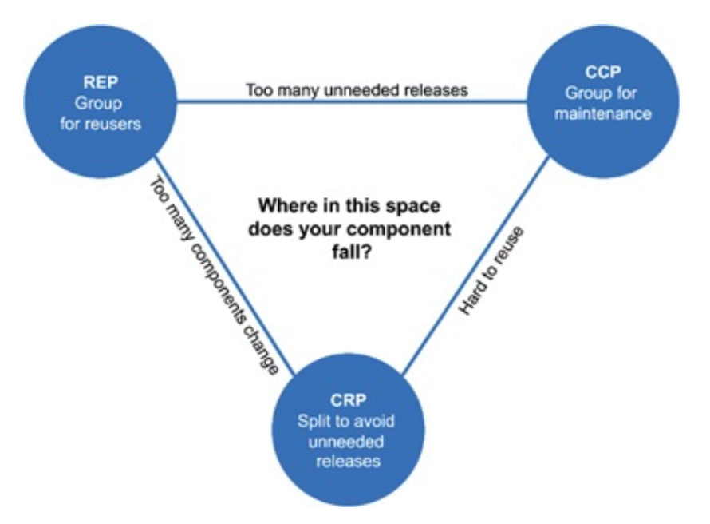

# 컴포넌트 응집도

여기선 다음 세 가지 원칙을 논의한다.

* REP(Reuse/Release Equivalence Principle): 재사용/릴리즈 등가 원칙
* 폐(Common Closure Principle): 공통 폐쇄 원칙
* CRP(Common Reuse Principle): 공통 재사용 원칙

## REP: 재사용/릴리즈 등가 원칙

> 재사용 단위는 릴리스 단위와 같다.

릴리스 번호가 없다면 재사용 컴포넌트들이 서로 호환되는지 보증할 방법이 없다. 또한 새로운 버전이 언제 출시되고 무엇이 변했는지를 소프트웨어 개발자들이 알아야 한다.

이 원칙을 소프트웨서 설계와 아키텍처 관점에서 보면 단일 컴포넌트는 응집성 높은 클래스와 모듈들로 구성되어야 함을 뜻한다. 컴포넌트를 구성하는 모든 모듈은 서로 공유하는 중요한 테마나 목적이 있어야 한다.

## CCP: 공통 폐쇄 원칙

> 동일한 이유로 동일한 시점에 변경되는 클래스를 같은 컴포넌트로 묶어라. 서로 다른 시점에 다른 이유로 변경되는 클래스는 다른 컴포넌트로 분리하라.

이 원칙은 SRP 컴포넌트 관점에서 쓴 것이다. SRP에서 단일 클래스는 변경의 이유가 어려 개 있어서는 안 된다고 하듯이, CCP도 마찬가지로 단일 컴포넌트는 변경의 이유가 하나여야 한다고 말한다.

CCP는 변경될 가능성이 있는 클래스는 모두 한 곳으로 묶을 것을 권한다. 물리적 또는 개념적으로 강하게 결합되어 함께 변경되는 클래스들은 하나의 컴포넌트에 속해야 한다. 이를 통해 릴리스, 재검증, 배포하는 일과
관련된 작업량을 최소화할 수 있다.

이는 OCP와도 밀접하게 관련되어 있다. OCP의 C와 CCP의 C는 뜻이 같다. CCP에서는 동일한 유형의 변경에 대해 닫혀 있는 클래스들을 하나의 컴포넌트로 묶음으로써 OCP를 확대하여 적용한다. 따라서 변경이
필요한 요구사항이 발생했을 때, 그 변경이 영향을 주는 컴포넌트들이 최소한으로 한정될 가능성이 높아진다.

### SRP와의 유사성

CCP는 컴포넌트 수준의 SRP이다. CCP는 서로 다른 이유로 변경되는 클래스를 서로 다른 컴포넌트로 분리하라고 한다.

> 동일한 시점에 동일한 이유로 변경되는 것들을 한데 묶어라. 서로 다른 시점에 다른 이유로 변경되는 것들은 서로 분리하라.

## CRP: 공통 재사용 원칙

> 컴포넌트 사용자들을 필요하지 않는 것에 의존하게 강요하지 말라.

CRP에서는 같이 재사용되는 경향이 있는 클래스와 모듈들은 같은 컴포넌트에 포함해야 한다고 말한다.

간단한 예로 컨테이너(container) 클래스와 해당 클래스의 이터레이터(iterator) 클래스를 들 수 있다. 이들 클래스는 서로 강하게 결합되어 있기 때문에 함께 재사용된다. 따라서 이들 클래스는 반드시
동일한 컴포넌트에 위치해야 한다.

만약 어떤 컴포넌트가 다른 컴포넌트를 사용하면, 두 컴포넌트 사이에 의존성이 발생한다. 이 같은 의존성으로 사용되는(used) 컴포넌트가 변경될 때마다, 사용하는(using) 컴포넌트도 변경해야 할 가능성이 높다.
또는 사용하는 컴포넌트를 변경하지 않더라도 재컴파일, 재검증, 재배포를 해야 하는 가능성은 여전히 남아 있다.

따라서 의존하는 컴포넌트가 있다면 해당 컴포넌트의 모든 클래스에 대해 의존함을 확실히 인지해야 한다. 다시 말하면 한 컴포넌트에 속한 클래스들은 더 작게 그룹지울 수 없다. 즉, 그중 일부 클래스에만 의존하고 다른
클래스와는 독립적일 수 없음을 확실히 인지해야 한다.

따라서 CRP는 어떤 클래스를 한데 묶어도 되는지보다, 어떤 클래스를 한데 묶어서는 안 되는지에 대해 더 많이 이야기한다. CRP는 강하게 결합되지 않은 클래스들을 동일한 컴포넌트에 위치시켜서는 안 된다고 말한다.

### ISP와의 관계

CRP는 ISP의 포괄적인 버전이다. ISP는 사용하지 않은 메서드가 있는 클래스에 의존하지 말라고 말한다. CRP는 사용하지 않는 클래스를 가진 컴포넌트에 의존하지 말라고 말한다.

> 필요하지 않은 것에 의존하지 말라.

## 컴포넌트 응집도에 대한 균형 다이어그램

응집도에 관한 세 원칙이 서로 상충된다. REP와 CCP는 포함(inclusive) 원칙이다. CRP는 배제(exclusive) 원칙이다.

다음은 응집도에 관한 세 원칙이 어떻게 상호작용하는지 보여준다.

오로지 REP와 CRP에 중점을 두면 사소한 변경이 생겼을 때, 많은 컴포넌트에 영향을 미친다. 반대로 CRP와 REP에만 중점을 두면 불필요한 릴리스가 너무 빈번해진다.

초기에는 CCP가 REP보다 훨씬 중요한데 개발 가능성이 재사용성보다 더 중요하기 때문이다. 일반적으로 프로젝트는 삼각형의 오른쪽에서 시작하는 편이며, 이 때는 재사용성만 희생하면 된다. 프로젝트가 커짐에 따라 점점
왼쪽으로 이동한다. 즉, 컴포넌트 구조는 시간과 성숙도에 따라 변하게 된다.

## 결론

어느 클래스들을 묶어 컴포넌트로 만들지 결정할 때, 재사용성과 개발 가능성이라는 상충하는 힘을 반드시 고려해야 한다. 이들 사이에서 애플리케이션의 요구에 맞게 균형을 잡아야 한다.
