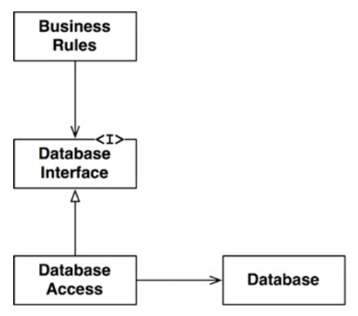
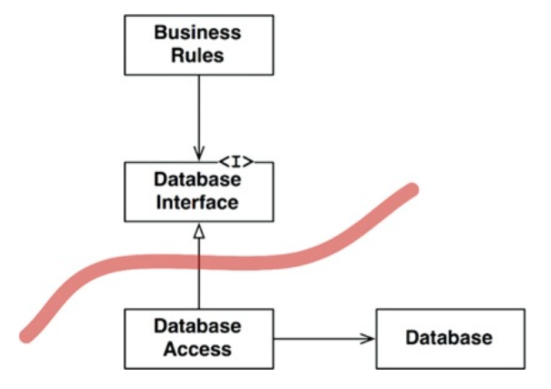
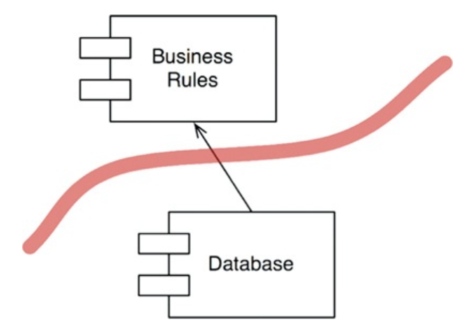
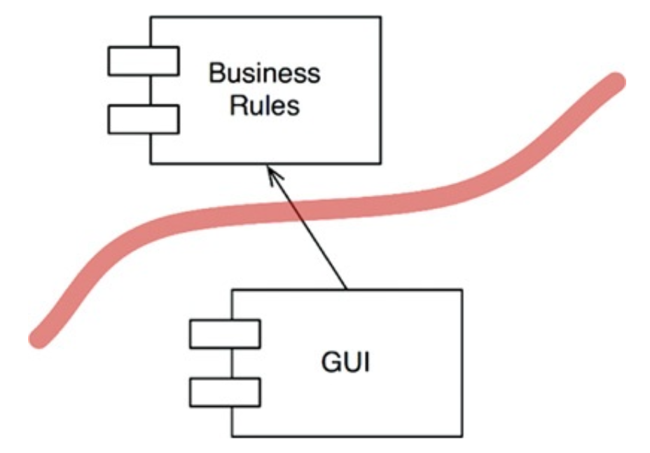
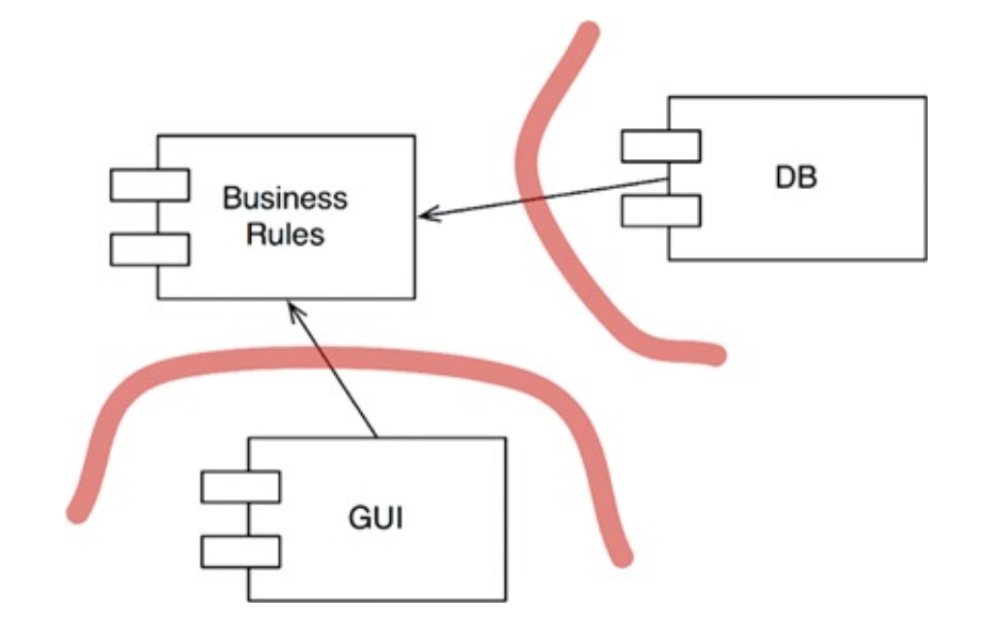
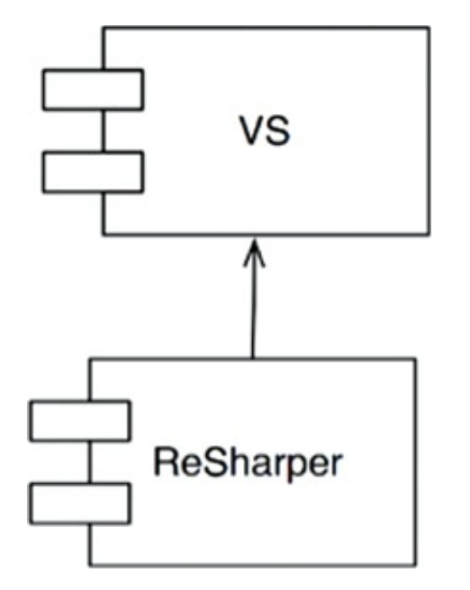

# BOUNDARIES: DRAWING LINES

소프트웨어 아키텍처는 선을 긋는 기술이며, 이를 경계(boundaries)라 부른다. 경계는 소프트웨어 요소를 서로 분리하고, 경계 한편에 있는 요소가 반대편에 있는 요소를 알지 못하도록 한다.

아키텍트의 목표는 필요한 시스템을 만들고 유지하는 데 드는 인적 자원을 최소화하는 것이며, 결합(coupling)은 인적 자원의 효율성을 떨어뜨린다. 특히 일찍 내려진 결정에 따른 결합이다.

좋은 시스템 아키텍처는 이러한 결정이 부수적이며, 결정을 연기할 수 있는 아키텍처이며, 이러한 결정적인 순간에 내릴 수 있게 해주며, 결정의 영향이 크지 않게 만든다.

## 두 가지 슬픈 이야기

P사는 데스크톱 애플리케이션을 웹으로 변환하는 프로젝트를 수행한다. 모든 도메인 객체가 세 가지 인스턴스를 가져야 한다고 너무 이른 결정을 내린다. 기존 레코드에 새로운 필드를 추가하는 기능을 구현할 때, 해당
필드를 세 티어에 있는 클래스 모두와 티어 간 메시지 다수에 추가하는 등 많은 작업을 수행하게 된다. 이렇게 너무 이른 결정을 내림으로써 개발 비용을 가중시켰다.

W사는 서비스 지향 아키텍처를 위해 거대한 도메인 모델을 생성했고, 이들 도메인 객체를 관리하기 위한 서비스들의 묶음을 설계했다. 이를 테스트하려면 필요한 서비스들을 하나씩 구동시키고, 메시지 버시와 BPel(
Business Process Execution Language) 서버 등을 작동시켜야 한다. 그리고 메시지들은 서비스에서 서비스로 이동하고, 각 서비스의 큐 안에서 대기하므로 전달 지연도 발생한다. 새로운 기능을
추가하려면, 모든 서비스 사이 결합으로 인해 엄청난 양의 WSDL(Web Services Description Language)을 변경해야 하며, 변경에 영향받는 모든 것을 다시 배포해야 할 것이다.

## FitNesse

FitNesse를 만들 때 어떤 데이터베이스를 사용하더라도 상관없는 형태로 설계했다. 데이터 접근 메서드들에 대해 인터페이스를 두어 관리했다. 영속성을 구현하는 시점에 첫 번째로 플랫(flat) 파일에 저장하도록
구현했다. 고객사의 요구로 MySQL에 저장해야 하는 일이 발생한다. 하지만 데이터베이스에 대한 결정을 연기할 수 있게 만들어준 인터페이스를 보여주었고, 하루만에 시스템이 MySQL에서 동작하도록 만들었다.

결국 경계선을 긋는 행위는 결정을 늦추고 연기하는 데 도움이 되었고, 시간을 엄청 절약하였으며, 테스트 시 데이터베이스 관련된 문제가 없었다.

## 어떻게 선을 그을까? 그리고 언제 선을 그을까?

관련이 있는 것과 없는 것 사이에 선을 긋는다. GUI, 업무 규칙, 데이터베이스 서로 간 관련이 없기 때문에, 이 셋 사이에는 반드시 선이 있어야 한다.

BusinessRules는 Database Interface를 사용해 데이터를 로드하고 저장한다. DatabaseAccess는 DatabaseInterface를 구현하며, Database를 실제 조작하는 일을
맡는다.

경계선은 상속 관계를 횡단하면서 DatabaseInterface 바로 아래에 그려진다.

DatabaseAccess에서 출발하는 두 화살표는 모두 바깥쪽으로 향한다. 즉, 이 도표에서 DatabaseAccess가 존재하는 사실을 알고 있는 클래스는 없다는 의미이다.

컴포넌트 단위로 살펴보자.

Database는 BunsinessRules에 대해 알고 있다. 하지만 BunsinessRules는 Database를 알지 못한다. DatabaseInterface 클래스는 BunsinessRules에 속하며
DatabaseAccess는 Database 컴포넌트에 속한다는 사실을 의미한다. 이를 통해 Database는 BunsinessRules 없이는 존재할 수 없다는 사실을 알 수 있다.

결국 이러한 사실은 데이터베이스에 대한 결정을 연기할 수 있으며, 데이터베이스를 결정하기에 앞서 업무 규칙을 먼저 작성하고 테스트하는 데 집중할 수 있음을 의미한다.

## 입력과 출력은?

GUI와 BunsinessRules 컴포넌트가 경계선에 의해 분리된다. 관련성 낮은 컴포넌트가 관련성 높은 컴포넌트에 의존한다는 사실을 다시 한번 볼 수 있다. GUI가 BunsinessRules를 신경쓴다고 볼 수
있다.

GUI는 다른 종류의 인터페이스로 얼마든지 교체할 수 있으며 BunsinessRules는 전혀 개의치 않는다는 사실을 알 수 있다.

## 플러그인 아키텍처

데이터베이스와 GUI에 내린 두 결정을 하나로 합쳐보면 컴포넌트 추가와 관련한 일종의 패턴이 만들어진다. 선택적이거나 수많은 다양한 형태로 구현될 수 있는 나머지 컴포넌트로부터 핵심적인 업무 규칙은 분리되어 있으며
독립적이다.

이 설계에서 사용자 인터페이스와 데이터베이스는 플러그인 형태로 고려되었기에, 수많은 종류의 사용자 인터페이스/데이터베이스를 플러그인 형태로 연결할 수 있다.

## 플러그인에 대한 논의

ReSharper와 비주얼 스튜디오의 관계를 보면 ReSharper가 비주얼 스튜디오의 소스 코드에 의존한다. 따라서 ReSharper 팀은 절대 비주얼 스튜디오 팀을 건드릴 수 없지만, 비주얼 스튜디오 팀은
언제든지 ReSharper 팀을 무력화할 수 있다.

시스템 플러그인 아키텍처로 배치하여 변경이 전파될 수 없는 방화벽을 만들 수 있다. 이 역시도 SRP에 해당한다. SRP는 어디에 경계를 그어야 할지 알려준다.

## 결론

소프트웨어 아키텍처에서 경계선을 그리려면 먼저 시스템 컴포넌트 단위로 분할해야 한다. 핵심 업무 규칙 컴포넌트와 이와 직접적인 관련이 없는 컴포넌트는 플러그인으로 구성하여 화살표가 핵심 업무을 향하도록 컴포넌트의
소스를 배치한다. 이는 DIP와 SAP 원칙을 응용한 것이다. 의존성 화살표는 저수준 세부사항에서 고수준의 추상화를 향하도록 배치된다.
