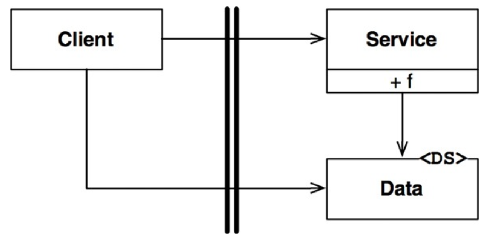

# BOUNDARY ANATOMY

시스템 아키텍처는 일련의 소프트웨어 컴포넌트와 그 컴포넌트들을 분리하는 경계에 의해 정의된다.

## 경계 횡단하기

`런타임에 경계를 횡단한다` 함은 그저 경계 한쪽에 있는 기능에서 반대편 기능을 호출하여 데이터를 전달하는 일에 불과하다. 적절한 위치에서 경계를 횡단하는 비결은 소스 코드 의존성 관리에 있다.

## 두려운 단일체

아키텍처 경계 중 가장 단순하며 흔한 형태는 물리적으로 엄격하게 구분되지 않는 형태이다. 이 형태는 함수와 데이터가 단일 프로세서에서 같은 주소 공간을 공유하며 그저 나름의 규칙에 따라 분리되어 있을 뿐이다.

배포 관점에서 보면 이는 단일체(monolith)라 불리는 단일 실행 파일에 지나지 않는다. 이러한 아키텍처는 특정한 동적 다형성에 의존해 내부 의존성을 관리한다. 이 때문에 객체 지향 개발이 아주 중요한 패러다임이
될 수 있었다.

가장 단순한 경계 횡단은 저수준 클라이언트에서 고수준 서비스로 향하는 함수 호출이다. 이 겨우 런타임 의존성과 컴파일타임 의존성은 모두 같은 방향, 즉 저수준 컴포넌트에서 고수준 컴포넌트로 향한다.

다음 그림을 보면 왼쪽에서 오른쪽으로 경계를 횡단한다. Client는 Service의 함수 f()를 호출한다. 이 때 Client는 Data 인스턴스를 전달한다. 주목할 점은 경계에서 호출되는 쪽에 Data 정의가
위치하는 것이다.

고수준 클라이언트가 저수준 서비스를 호출해야 한다면 동적 다형성을 사용하여 제어흐름과 반대 방향으로 의존성을 역전시킬 수 있다. 이렇게 하면 런타임 의존성은 컴파일타임 의존성과는 반대가 된다.

다음 그림은 이전과 마찬가지로 왼쪽에서 오른쪽으로 경계를 횡단한다. 고수준 Client는 Service 인터페이스를 통해 저수준 ServiceImpl의 함수 f()를 호출한다. 하지만 경계를 횡단할 때 의존성은 모두
오른쪽에서 왼쪽으로, 즉 고수준 컴포넌트를 향한다는 점이다. 또한 데이터 구조 정의가 호출하는 쪽에 위치하는 점도 주목하자.

이처럼 규칙적인 방식으로 구조를 분리하면 프로젝트 개발, 테스트, 배포하는 작업에 큰 도움이 된다. 팀들은 자신만의 컴포넌트를 독립적으로 작업할 수 있다. 고수준 컴포넌트는 저수준 세부사항으로부터 독립적으로
유지된다.

단일체를 배포하는 일은 일반적으로 컴파일과 정적 링크 작업을 수반하므로, 대체로 이러한 시스템에서 컴포넌트는 소스 코드 형태로 전달된다.

## 배포형 컴포넌트

아키텍처의 경계가 물리적으로 드러날 수도 있는데 가장 단순한 형태가 동적 링크 라이브러리다. .NET DLL, 자바 .jar 등이 그 예이다.

배포 과정에서만 차이가 있으며, 배포 수준의 컴포넌트는 단일체와 동일하다. 일반적으로 모든 함수가 동일한 프로세서와 주소 공간에 위치하며, 컴포넌트를 분리하거나 컴포넌트 간 의존성을 관리하는 전략도 단일체와
동일하다.

## 스레드

단일체와 배포형 컴포넌트는 모두 스레드를 활용할 수 있다. 모든 스레드가 단 하나의 컴포넌트에 포함될 수 있고, 많은 컴포넌트에 걸쳐 분산될 수도 있다.

## 로컬 프로세스

훨씬 강한 물리적 형태를 띠는 아키텍처 경계로 로컬 프로세스가 있다. 로컬 프로세스는 주로 명령행이나 이와 유사한 시스템 호출을 통해 생성된다. 로컬 프로세스는 여러 프로세서들에서 실행되지만, 각각 독립된 주소
공간에서 실행된다. 대개의 경우 소켓, 메일박스, 메시지 큐와 같이 운영체제에서 제공하는 통신 기능을 이용해 서로 통신한다.

각 로컬 프로세스는 정적으로 링크된 단일체이거나 동적으로 링크된 여러 개의 컴포넌트로 구성될 수 있다.

로컬 프로세스 간 분리 전략은 단일체나 바이너리 컴포넌트와 동일하다. 소스 코드 의존성의 화살표는 단일체나 바이너리 컴포넌트와 동일한 방향으로 경계를 횡단한다. 즉, 항상 고수준 컴포넌트를 향한다.

로컬 프로세스 경계를 지나는 통신에는 운영체제 호출, 데이터 마샬링 및 언마샬링, 프로세스 간 문맥 교환 등이 있으며, 이들은 비싼 작업에 속한다.

## 서비스

물리적 형태를 띄는 가장 강력한 경계는 바로 서비스다. 서비스는 프로세스로, 일반적으로 명령행 또는 이와 유사한 시스템 호출을 통해 구동된다. 서비스들은 모든 통신이 네트워크를 통해 이루어진다고 가정한다.

서비스 경계를 지나는 통신은 함수 호출에 비해 매우 느리다. 이를 제외하고는 로컬 프로세스에 적용한 규칙이 서비스에도 그대로 적용된다. 저수준 서비스는 반드시 고수준 서비스에 플러그인이 되어야 한다.

## 결론

단일체를 제외한 대다수의 시스템은 한 가지 이상의 경계 전략을 사용한다. 서비스 경계를 활용하는 시스템이라면 로컬 프로세스 경계도 일부 포함하고 있을 수 있다. 또한 개별 서비스 또는 로컬 프로세스는 소스 코드
컴포넌트로 구현된 단일체이거나, 동적으로 링크된 배포형 컴포넌트의 집합이다.

즉, 대체로 한 시스템 안에서도 통신이 빈번한 로컬 경계와 지연을 중요하게 고려해야 하는 경계가 혼합되어 있음을 의미한다.