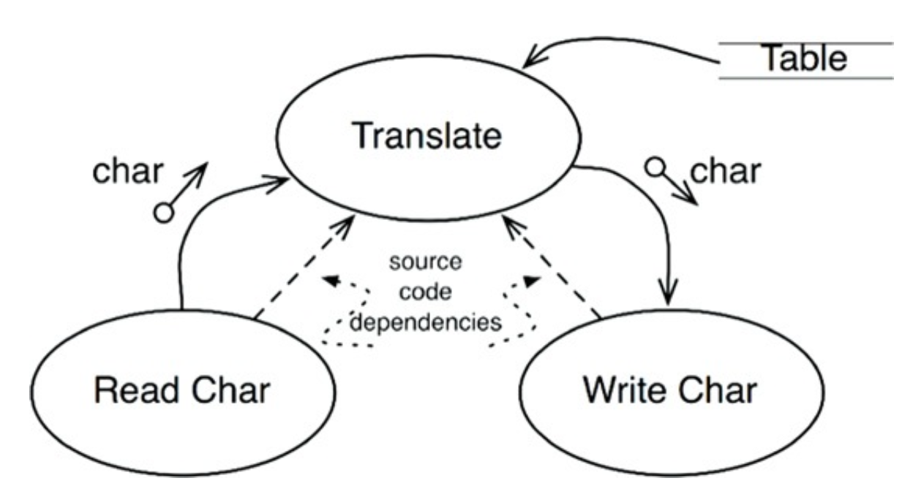
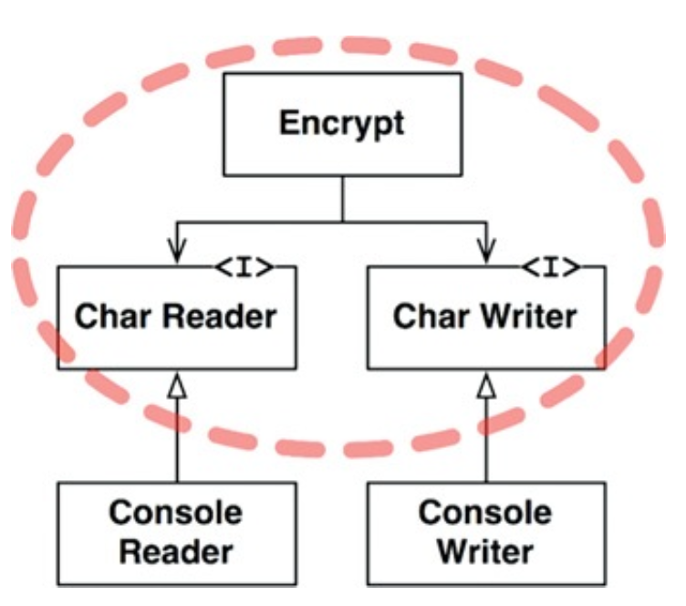
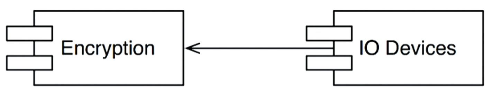

# POLICY AND LEVEL

소프트웨어 시스템이란 정책을 기술한 것이다. 즉, 컴퓨터 프로그램은 각 입력을 출력으로 변환하는 정책을 상세하게 설명한 기술서다.

하나의 정책은 이 정책을 서술하는 여러 개의 조그만 정책들로 쪼갤 수 있다. 예를 들어 특정 보고서를 어떤 포맷으로 만들지 또는 입력 데이터를 어떻게 검증할지 등의 정책이 있을 수 있다.

동일한 이유로 동일한 시점에 변경되는 정책은 동일한 수준에 위치하며, 동일한 컴포넌트에 속해야 한다. 그래프에서 정점은 동일한 수준의 정책을 포함하는 컴포넌트에 해당하며, 간선은 컴포넌트 사이의 의존성을 의미한다.

이러한 의존성은 소스 코드, 컴파일타임의 의존성이다. 자바의 경우 import가 해당한다.

좋은 아키텍처라면 각 컴포넌트를 연결할 때 의존성 방향이 컴포넌트의 수준을 기반으로 연결되도록 만들어야 한다. 즉, 저수준 컴포넌트가 고수준 컴포넌트에 의존하도록 설계되어야 한다.

## 수준

`수준(level)`을 엄밀히 정의하면 `입력과 출력까지의 거리`다. 시스템의 입력과 출력 모두로부터 멀리 위치할수록 정책의 수준은 높아진다.

다음은 간단한 암호화 프로그램의 흐름도를 그린 것이다. 데이터 흐름은 굽은 실선 화살표로 표시했다. 프로그램을 제대로 설계했다면 의존성은 점선처럼 표시되어야 한다.

<div align="center">

</div>

주목할 점은 데이터 흐름과 소스 코드 의존성이 항상 같은 방향을 가리키지 않는다는 것이다. 소스 코드 의존성은 그 수준에 따라 결합되어야 하며, 데이터 흐름 기준으로 결합되어선 안 된다.

```
function encrypt() {
  while(true)
    writeChar(translate(readChar()));
}
```

이는 잘못된 아키텍처이다. 고수준인 encrypt 함수가 저수준인 readChar와 writeChar 함수에 의존하기 때문이다.

다음은 이 시스템의 아키텍처를 개선한 모습이다. 주목할 부분은 Encrypt, CharWriter와 CharReader 인터페이스를 둘러싸고 있는 점선으로 된 경계이다. 이 경계로 묶인 영역이 이 시스템에서 최고
수준의 컴포넌트이다.

<div align="center">

</div>

고수준 암호화 정책을 저수준의 입력/출력 정책으로부터 분리시켰다. 정책을 컴포넌트로 묶는 기준은 정책이 변경되는 방식에 달려있다. SRP와 CCP에 따르면 동일한 시점에 변경되는 정책은 함께 묶인다. 

이처럼 모든 소스 코드 의존성의 방향이 고수준 정책을 향할 수 있도록 분리했다면 변경의 영향도를 줄일 수 있다.

이러한 논의는 저수준 컴포넌트가 고수준 컴포넌트에 플러그인되어야 한다는 관점으로 볼 수도 있다. Encryption 컴포넌트는 IO Devices 컴포넌트를 전혀 알지 못한다. 

<div align="center">

</div>

## 결론

여기선 SRP, OCP, CCP, DIP, SDP, SAP를 모두 포함한다.  