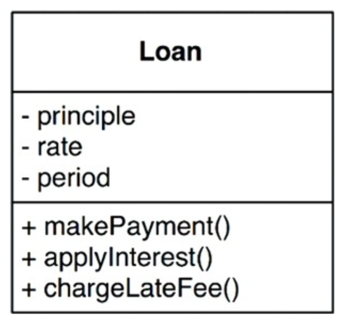

# BUSINESS RULES

애플리케이션을 업무 규칙과 플러그인으로 구분하려면 업무 규칙이 실제로 무엇인지 이해해야 한다. 엄밀히 말하면 사업적으로 수익을 얻거나 비용을 줄일 수 있는 규칙 또는 절차이다.

대출에 *N*%의 이자를 부과한다는 사실은 은행이 돈을 버는 업무 규칙이다. 이러한 사실은 컴퓨터 프로그램으로 계산하든, 직원이 주판으로 계산하든 상관없다.

이러한 규칙을 핵심 업무 규칙(Critical Business Rule)이라 부를 것이다. 이들 규칙은 사업 자체에 핵심적이기 때문이다. 핵심 업무 규칙은 보통 데이터를 요구한다. 예를 들어 대출에는 대출 잔액,
이자율, 지급 일정이 필요하다.

이러한 데이터를 핵심 업무 데이터(Critical Business Data)라 부를 것이다.

핵심 규칙과 핵심 데이터는 본질적으로 결합되어 있기 때문에 객체로 만들기 좋은 후보이다. 이러한 유형의 객체를 엔티티(Entity)라 하겠다.

## 엔티티

엔티티는 컴퓨터 시스템 내부의 객체로서, 핵심 업무 데이터를 기반으로 동작하는 일련의 조그만 핵심 업무 규칙을 구체화한다.

다음은 Loan 엔티티가 UML 클래스로 어떻게 표현되는지 보여준다.

업무에서 핵심적인 개념을 구현하는 소프트웨어는 한데 모으고, 구축 중인 자동화 시스템의 나머지 모든 고려사항과 분리시킨다. 이 클래스는 업무의 대표자로서 독립적으로 존재한다.

## 유스케이스

유스케이스는 자동화된 시스템이 사용되는 방법을 설명한다. 유스케이스는 사용자가 제공해야 하는 입력, 사용자에게 보여줄 출력, 그리고 해당 출력을 생성하기 위한 처리 단계를 기술한다. 엔티티 내 핵심 업무 규칙과는
반대로, 유스케이스는 애플리케이션에 특화된 업무 규칙을 설명한다.

유스케이스는 엔티티 내부의 핵심 업무 규칙을 어떻게, 그리고 언제 호출하지를 명시하는 규칙을 담는다.

유스케이스는 시스템이 사용자에게 어떻게 보이는지 설명하지 않는다. 이보다는 애플리케이션에 특화된 규칙을 설명하며, 이를 통해 사용자와 엔티티 사이 상호작용을 규정한다.

유스케이스는 객체이다. 유스케이스는 애플리케이션에 특화된 업무 규칙을 구현하는 하나 이상의 함수를 제공한다. 또한 입력 데이터, 출력 데이터, 유스케이스가 상호작용하는 엔티티에 대한 참조 데이터 등의 데이터 요소를
포함한다.

엔티티는 고수준이며 유스케이스는 저수준이므로 엔티티는 유스케이스에 대해 알지 못한다.

## 요청 및 응답 모델

유스케이스는 입력 데이터를 받아 출력 데이터를 생성한다. 제대로된 유스케이스 객체라면 데이터를 사용자나 또 다른 컴포넌트와 주고 받는 방식에 대해 알지 못해야 한다.

이처럼 의존성을 제거하는 일은 매우 중요하다. 요청 및 응답 모델이 독립적이지 않다면, 그 모델에 의존하는 유스케이스도 결국 해당 모델이 수반하는 의존성에 간접적으로 결합되어 버린다.

엔티티 객체를 가리키는 참조를 요청 및 응답 데이터 구조에 포함하려는 유혹을 받을 수 있지만, 이 두 객체의 목적은 완전히 다르다. 시간이 지나면 두 객체는 완전히 다른 이유로 변경될 것이다. 따라서 두 객체를 묶는
행위는 CCP와 SRP를 위배하게 된다.

## 결론

업무 규칙은 소프트웨어 시스템이 존재하는 이유이며 핵심적인 기능이다. 업무 규칙은 시스템에서 가장 독립적이며 가장 많이 재사용할 수 있는 코드여야 한다.