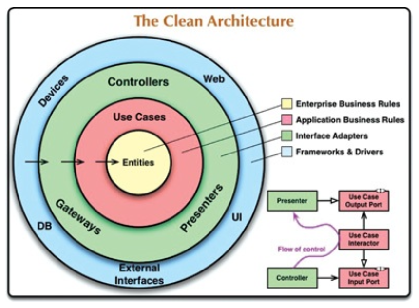
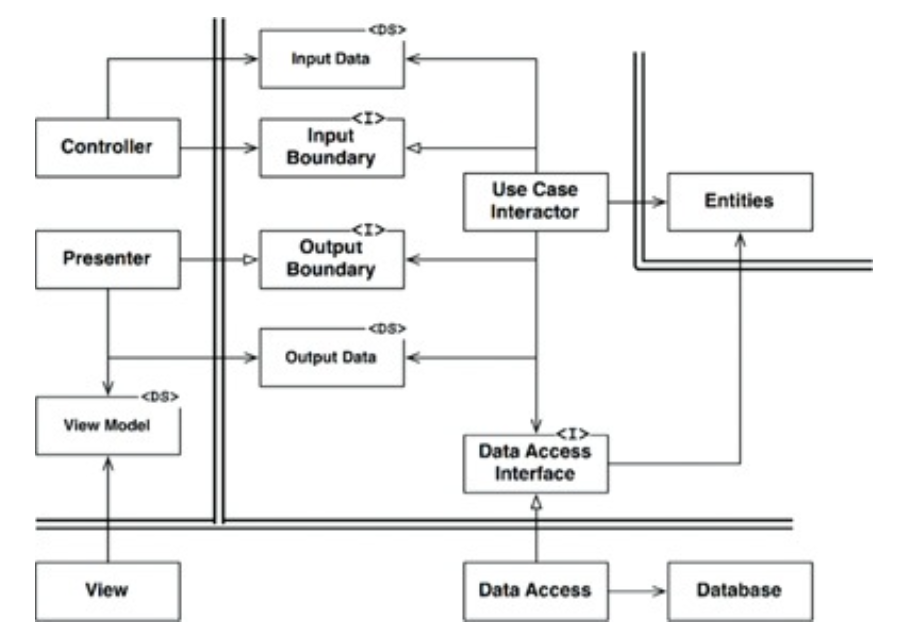

# THE CLEAN ARCHITECTURE

시스템 아키텍처와 관련된 여러 가지 아이디어를 봐왔다. 다음 내용을 보자.

* Hexagonal Architecture: 포트와 어댑터라고도 알려져 있다.
* Data, Context and Interaction
* Boundary-Control-Entity

이들 아키텍처의 목표는 모두 관심사의 분리이다. 이들 모두 소프트웨어를 계층으로 분리함으로써 관심사의 분리라는 목표를 달성할 수 있었다. 이들 아키텍처 모두 다음과 같은 특징을 지닌다.

* 프레임워크 존재 여부에 의존하지 않는다.
* 테스트 용이성. 업무 규칙은 UI, 데이터베이스 등 외부 요소 없이도 테스트할 수 있다.
* UI 독립성. 시스템의 나머지 부분을 변경하지 않고도 UI를 쉽게 변경할 수 있다.
* 데이터베이스 독립성. 데이터베이스를 쉽게 교체할 수 있다.
* 모든 외부 에이전시에 대한 독립성. 실제로 업무 규칙은 외부 세계와 인터페이스에 대해 전혀 알지 못한다.

다음은 이들 아키텍처 전부를 실행 가능한 하나의 아이디어로 통합하려는 시도이다.

그림의 각 계층을 살펴보자.

## 의존성 규칙

내부로 들어갈수록 고수준의 소프트웨어가 된다. 이러한 아키텍처가 동작하도록 하는 가장 중요한 규칙은 의존성 규칙이다.

> 소스 코드 의존성은 반드시 안쪽이로, 고수준의 정책을 향해야 한다.

내부 원에 속한 코드는 외부 원에 선언된 어떤 것에 대해서도 언급해서는 안 된다.

### 엔티티

엔티티는 전사적인 핵심 업무 규칙을 캡슐화한다. 메서드를 가지는 객체이거나 일련의 데이터 구조와 함수의 집합일 수 있다.

### 유스케이스

유스케이스 계층 소프트웨어는 애플리케이션에 특화된 업무 규칙을 포함한다. 또한 유스케이스 계층 소프트웨어는 시스템의 모든 유스케이스를 캡슐화하고 구현한다. 엔티티로 들어오고 나가는 데이터 흐름을 조정하며, 엔티티가
자신의 핵심 업무 규칙을 사용해 유스케이스의 목적을 달성하도록 이끈다.

### 인터페이스 어댑터

인터페이스 어댑터 계층은 일련의 어댑터들로 구성된다. 어댑터는 데이터를 유스케이스와 엔티티에게 편리한 형식에서 데이터베이스나 웹 같은 외부 에이전시에게 편리한 형식으로 변환한다. 이 계층은 GUI의 MVC 아키텍처를
모두 포괄한다. 프레젠터, 뷰, 컨트롤러는 모두 인터페이스 어댑터 계층에 속한다. 모델은 데이터 구조 정도이며, 컨트롤러에서 유스케이스로 전달되고, 다시 유스케이스에서 프레젠터와 뷰로 되돌아간다. 또한 이 계층에는
데이터를 외부 서비스와 같은 외부적인 형식에서 유스케이스나 엔티티에서 사용되는 내부적인 형식으로 변환하는 또 다른 어댑터가 필요하다.

### 프레임워크와 드라이버

가장 바깥쪽 계층이며, 일반적으로 데이터베이스나 웹 프레임워크 같은 프레임워크나 도구들로 구성된다. 이 계츨은 모든 세부사항이 위치하는 곳이다.

### 원은 네 개여야만 하나?

항상 네 개만 사용해야 한다는 규칙은 없지만, 어떤 경우에도 소스 코드 의존성은 안쪽으로 향해야 한다.

### 경계 횡단하기

그림의 우측 하단을 보면 원의 경계를 횡단하는 방법을 보여주는 예시가 있다.

제어흐름은 컨트롤러에서 시작해 유스케이스를 지난 후 프레젠터에서 실행되면서 마무리된다. 소스 코드 의존성은 유스케이스를 향해 안쪽을 가리킨다. 이처럼 제어 흐름이 명백히 반대여야 하는 경우, 대체로 의존성 역전
원칙을 사용해 해결한다.

동적 다형성을 이용해 소스 코드 의존성을 제어흐름과 반대로 만들 수 있고, 이를 통해 제어흐름이 어느 방향으로 흐르더라도 의존성 규칙을 준수할 수 있다.

### 경계를 횡단하는 데이터는 어떤 모습인가

경계를 가로지르는 데이터는 흔히 간단한 데이터 구조(구조체나 DTO 등)로 이루어져 있다. 중요한 점은 격리되어 있는 간단한 데이터 구조가 경계를 가로질러 전달된다는 사실이다.

만약 엔티티 객체나 데이터베이스의 행을 전달하게 되면 데이터 구조가 의존성을 가지게 되므로 의존성 규칙을 위배하게 된다. 따라서 경계를 가로질러 데이터를 전달해야 할 때 데이터는 항상 내부의 원에서 사용하기 가장
편리한 형태를 가져야 한다.

## 전형적인 시나리오

다음은 데이터베이스를 사용하는 웹 기반 자바 시스템의 전형적인 시나리오를 보여준다. 웹 서버는 사용자로부터 입력 데이터를 모아 좌측 상단의 Controller로 전달한다. Controller는 데이터를 POJO로
묶은 후 InputBoundary 인터페이스를 통해 UseCaseInteractor로 전달한다. UseCaseInteractor는 이 데이터를 해석해 Entities가 어떻게 처리될지를 제어하는데 사용된다. 또한
UseCaseInteractor는 DatabaseAccessInterface 클래스를 사용해 Entities가 사용할 데이터를 데이터베이스에서 불러와 메모리로 로드한다. Entities가 완성되면
UseCaseInteractor는 Entities로부터 데이터를 모아 또 다른 POJO인 OutputData를 구성한다. 그리고 OutputData는 OutputBoundary 인터페이스를 통해 Presenter로 전달된다. 

## 결론

소프트웨어를 계층으로 분리하고 의존성 규칙을 준수한다면 본질적으로 테스트하기 쉬운 시스템을 만들게 될 것이며, 그에 따른 이점을 누릴 수 있다.

