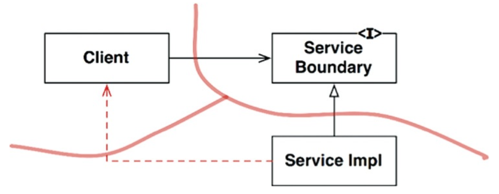

# PARTIAL BOUNDARIES

아키텍처 경계를 완벽하게 만드는 데는 비용이 많이 든다. 쌍방향의 다형적 Boundary 인터페이스, Input과 Output을 위한 데이터 구조를 만들어야 할 뿐만 아니라, 두 영역을 독립적으로 컴파일하고 배포할
수 있는 컴포넌트로 격리하는데 필요한 모든 의존성을 관리해야 한다.

이러한 경우 부분적 경계(partial boundary)를 구현해볼 수 있다.

## 마지막 단계를 건너뛰기

부분적 경계를 생성하는 방법 중 하나는 독립적으로 컴파일하고 배포할 수 있는 컴포넌트를 만들기 위한 작업은 모두 수행한 후, 단일 컴포넌트에 그대로 모아두는 것이다. 쌍방향 인터페이스 및 입출력 데이터 구조도 모두
포함해서 말이다. 이 모두를 단일 컴포넌트로 컴파일해서 배포한다.

이처럼 부분적 경계를 만들기 위해 완벽한 경계를 만들 때 만큼의 코드량과 사전 설계가 필요하다. 하지만 다수 컴포넌트를 관리하는 작업이 필요하지 않는 장점이 있다.

## 일차원 경계

완벽한 형태의 아키텍처 경계는 양방향으로 격리된 상태를 유지해야 하므로 쌍방향 Boundary 인터페이스를 사용한다. 이를 유지하려면 초기 설정할 때나 지속적으로 유지할 때도 비용이 많이 든다.

추후 완벽한 형태의 경계로 확장할 수 있는 공간을 확보하고자 할 때 다음 구조를 활용할 수 있다. 이는 Strategy 패턴을 사용한 전형적인 사례이다.

이러한 분리는 다이어그램의 점선 화살표에서 보듯이 빠르게 붕괴될 수 있다는 점도 분명하다.

## 퍼사드

이보다 훨씬 단순한 경계는 퍼사드(Facade) 패턴으로 다음과 같다. 이 경우 의존성 역전까지 희생한다. 경계는 Facade 클래스로만 간단히 정의된다. Facade 클래스에는 모든 서비스 클래스를 메서드 형태로
정의하고, 서비스 호출이 발생하면 해당 서비스 클래스로 호출을 전달한다. 클라이언트는 이들 서비스에 직접 접근할 수 없다.

하지만 Client가 모든 서비스 클래스들에 추이 종속성을 가지게 된 것을 주목하자. 서비스 클래스 중 하나의 소스 코드가 변경되면 Client도 무조건 재컴파일해야 한다. 

## 결론

이러한 아키텍처 경계를 부분적으로 구현하는 방식은 각각 나름의 장단점을 가진다. 각 접근법은 완벽한 형태의 경계를 담기 위한 공간으로써, 적절하게 사용할 수 있는 상황이 서로 다르다. 

아키텍처 경계가 언제, 어디에 존재해야 할지, 그리고 그 경계를 완벽하게 구현할지 아니면 부분적으로 구현할지 결정하는 일 또한 아키텍트의 역할이다.

