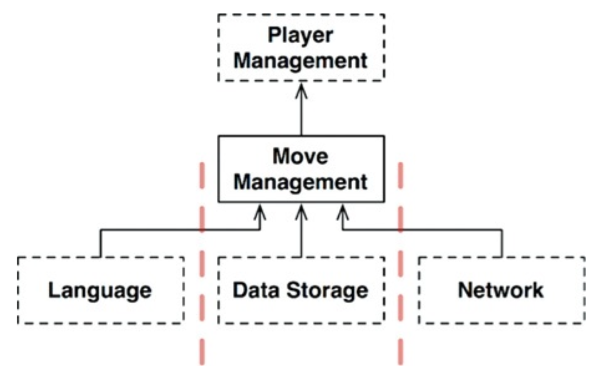

# LAYERS AND BOUNDARIES

대다수의 시스템은 UI, 업무 규칙, 데이터베이스 외에 다른 컴포넌트도 존재한다.

## 움퍼스 사냥 게임

움퍼스 사냥 게임이 있고 텍스트 기반 UI는 그대로 유지하되, 게임 규칙과 UI를 분리해 여러 시장에서 다양한 언어로 발매할 수 있도록 만든다고 가정해보자. 게임 규칙은 언어 독립적인 API를 사용해 UI 컴포넌트와
통신할 것이고, UI는 API를 사람이 이해할 수 있는 언어로 변환할 것이다.

다음과 같이 소스 코드 의존성을 적절히 관리하면, UI 컴포넌트가 어떤 언어를 사용하더라도 게임 규칙을 재사용할 수 있다. 또한 게임 상태를 영속적인 저장소에 유지한다고 가정해보자. 그게 플래시 메모리나
클라우드 또는 RAM일 수도 있다. 이 또한 API를 사용해 게임 규칙이 저장소 컴포넌트와 통신하도록 만든다.

 

## 클린 아키텍처?

위 텍스트를 보여주는 것 외에도 텍스트를 주고받는 메커니즘을 다양하게 만들고 싶을 수 있다. 이러한 변경에 의해 정의되는 아키텍처 경계가 잠재되어 있을 수도 있다. 따라서 언어를 통신 메커니즘으로부터 격리하는
API를 생성해야 할 수도 있다. 이러한 아이디어를 다음 그림에서 볼 수 있다.

 

점선으로 된 테두리는 API를 정의하는 추상 컴포넌트를 가리키며, 해당 API는 추상 컴포넌트 위 또는 아래의 컴포넌트가 구현한다.

GameRules는 GameRules가 정의하고 Language가 구현하는 API를 이용해 Language와 통신한다. 마찬가지로 Language는 Language가 정의하고 TextDelivery가 구현하는
API를 이용해 TextDelivery와 통신한다. API는 구현하는 쪽이 아닌 사용하는 쪽에 정의되고 소속된다.

GameRules를 보면 GameRules 내부 코드에서 사용하고 Language 내부 코드에서 구현하는 다형적 Boundary 인터페이스와 Language에서 사용하고 GameRules 내부 코드에서 구현하는
다형적 Boundary 인터페이스(GameRules 내부를 숨기기 위함)도 발견할 수 있다.

순전히 API 컴포넌트만 집중하면 다음과 같이 다이어그램을 단순화할 수 있다.

 

GameRules는 취상위 수준의 정책을 가지는 컴포넌트로 최상위에 놓이게 된다. 이러한 구성은 두 개의 흐름을 효과적으로 분리하는데, 왼쪽의 흐름은 사용자와의 통신을 관여하며, 오른쪽의 흐름은 데이터 영속성에
관여한다. 두 흐름은 GameRules에서 서로 만나며 두 흐름이 모두 거치게 되는 데이터에 대한 최종적인 처리가 된다.

## 흐름 횡단하기

만약 게임에서 여러 사람이 함께 플레이할 수 있게 만든다고 가정하자. 이 경우 네트워크 컴포넌트를 추가해야 한다. 이 구성은 데이터 흐름을 세 개로 분리하며, 이 흐름 모두 GameRules가 제어한다.

 

즉, 시스템이 복잡해질수록 컴포넌트 구조는 더 많은 흐름으로 분리될 것이다.

## 흐름 분리하기

이렇게 되면 모든 흐름이 결국 상단의 단일 컴포넌트에서 서로 만난다고 생각할 수 있다. 하지만 현실은 이보다 더 복잡하다.

게임 규칙 중 일부는 지도와 관련된 메커니즘을 처리한다. 이는 동굴이 어떻게 연결될지, 각 동굴에 어떤 물체가 위치할지 등을 알고 있다. 하지만 이보다 더 높은 수준에는 또 다른 정책 집합이 존재한다. 즉,
플레이어의 생명력, 그리고 특정 사건을 해결하는 비용과 얻게 될 소득 등이 이러한 정책이다. 저수준 정책에서 이러한 고수준 정책에게 FoundFood(식량 발견)나 FellInFit(구덩이에 빠짐)과 같은 사건이
발생했음을 알린다. 고수준 정책에서는 플레이어의 상태를 관리한다.

 

대규모의 플레이어가 동시에 플레이할 수 있는 버전의 움퍼스 사냥 게임이 있다고 가정하자. MoveManagement는 플레이어의 컴퓨터에서 직접 처리되지만 PlayerManagement는 서버에서 처리된다.
PlayerManagement는 접속된 모든 MoveManagement 컴포넌트에 마이크로서비스 API를 제공한다. MoveManagement와 PlayerManagement 사이 완벽한 형태의 아키텍처 경계가
존재한다.

 

## 결론

이를 보았을 때 아키텍처 경계는 어디에나 존재한다는 사실을 알 수 있다. 아키텍트로서 아키텍처 경계가 언제 필요한지 신중히 파악해야 한다. 또한 이러한 경계를 제대로 구현하려면 비용이 많이 든다는 사실도 인지하고
있어야 하며, 이러한 경계가 무시되었다면 나중에 추가하는 비용이 크다는 사실도 알아야 한다. 
