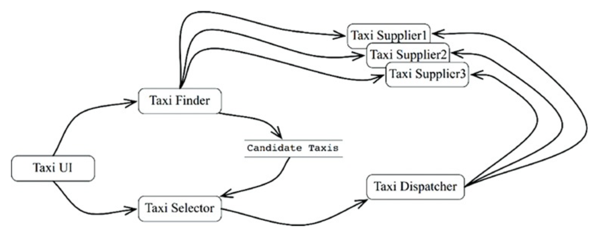
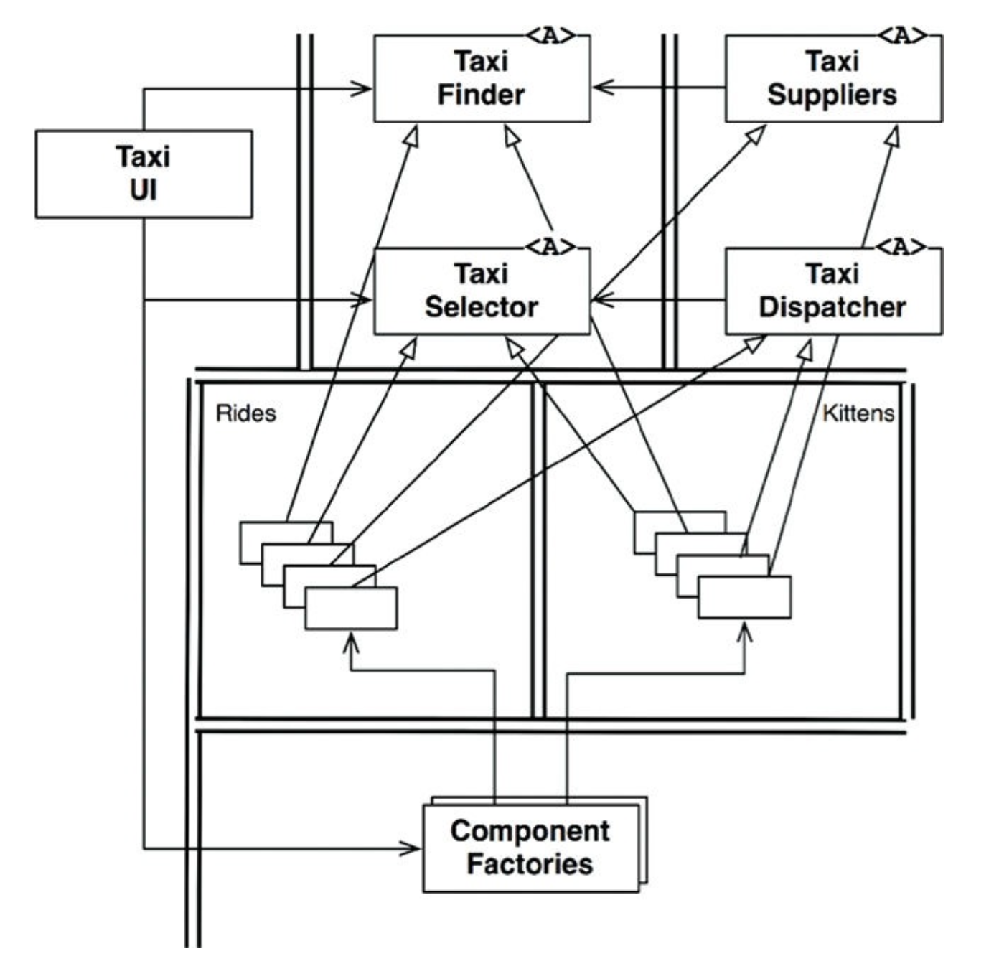
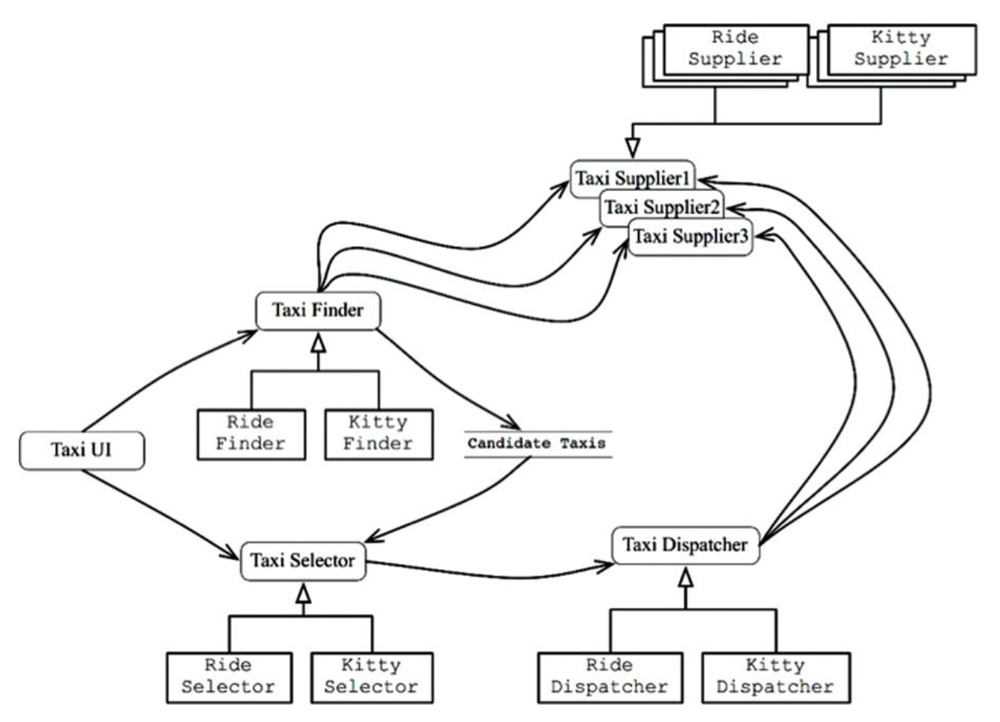
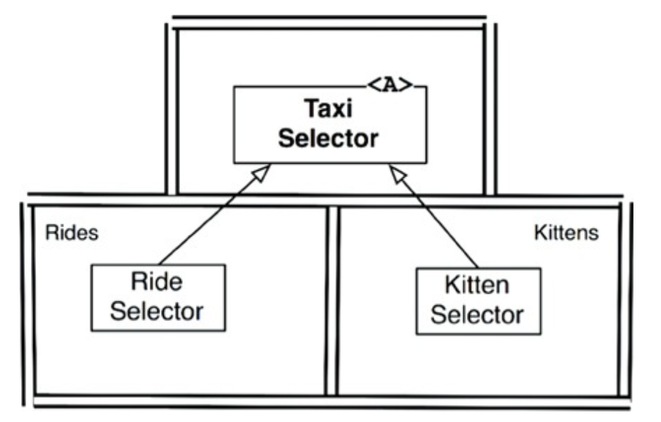

# SERVICES: GREAT AND SMALL

* 서비스를 사용하면 상호 결합이 철저하게 분리되는 것처럼 보이지만 일부만 맞는 말이다.
* 서비스를 사용하면 개발과 배포 독립성을 지원하는 것처럼 보이지만 이것도 일부만 맞는 말이다.

## 서비스 아키텍처?

서비스를 사용한다는 것이 본질적으로는 아키텍처에 해당하지 않는다. 단순히 애플리케이션의 행위를 분리할 뿐인 서비스라면 값비싼 함수에 불과하며, 아키텍처 관점에서는 꼭 중요하다 볼 수 없다. 모든 서비스가 아키텍처
관점에서 중요해야만 하는 뜻은 아니다. 기능을 프로세스나 플랫폼에 독립적이 되게끔 서비스를 생성하면 의존성 규칙 준수 여부에 상관없이 도움이 될 때가 많다.

아키텍처를 정의하는 요소는 바로 의존성 규칙을 따르며 아키텍처 경계를 넘나드는 함수 호출들이다.

아키텍처적으로 중요한 서비스도 있지만, 중요하지 않은 서비스도 존재한다. 이 장에서 우리가 관심을 가지는 서비스는 전자이다.

## 서비스의 이점?

### 결합 분리의 오류

시스템을 서비스로 분리하여 얻는 이점은 서비스 사이 결합이 확실히 분리된다는 점이 있으며, 서비스는 다른 서비스의 변수에 직접 접근할 수 없다. 인터페이스는 반드시 잘 정의되어 있어야 한다.

이는 일리가 있지만 꼭 그렇지만은 않다. 개별 변수 수준에서는 결합이 분리되지만, 프로세스 내 또는 네트워크 상의 공유 자원 때문에 결합될 가능성이 있다. 예를 들어 서비스 사이를 오가는 데이터 레코드에 새로운
필드를 추가한다면, 이 필드를 사용해 동작하는 모든 서비스는 반드시 변경되어야 한다. 즉, 이 데이터 레코드에 강하게 결합되고, 서비스 간 간접적으로 결합되어 버린다.

인터페이스가 잘 정의되어 있어야 하는 이점에 대해서도 사실이지만, 함수의 경우에도 전혀 다르지 않다. 서비스 인터페이스가 함수 인터페이스보다 더 엄밀하거나, 더 엄격하거나, 더 잘 정의되는 것은 아니다.

### 개발 및 배포 독립성의 오류

서비스를 사용하면 전담팀이 서비스를 소유하고 운영하는 점이다. 전담팀에서 서비스를 작성하고, 유지보수하며, 운영하는 책임을 질 수 있다. 이러한 개발 및 배포 독립성은 확장 가능한(scalable) 것으로 간주된다.
시스템의 개발, 유지보수, 운영 또한 비슷한 수의 독립적인 팀 단위로 분할할 수 있다고 여긴다.

이도 일리가 있지만, 극히 일부일 뿐이다.

1. 대규모 엔터프라이즈 시스템은 서비스 기반 시스템 외 모노리틱 시스템이나 컴포넌트 기반 시스템으로도 구축할 수 있다.
2. `결합 분리의 오류`에 따르면 서비스라 해서 항상 독립적으로 개발, 배포, 운영할 수 있는 것은 아니다.

## 야옹이 문제

[LSP](contents/design/clean-architecture/part-03-design-principles/chapter-09-the-liskov-substitution-principle/README.md)
에서 예로 들었던 택시 통합 시스템을 다시 보자.

확장 가능한 시스템을 구축하고 싶었기에, 수많은 작은 마이크로서비스를 기반으로 구축하기로 결정했다. 개발팀 직원을 많은 소규모 팀으로 세분화했고, 각 팀 규모에 맞게 서비스를 개발하고, 유지보수하며, 운영하는 책임을
지도록 했다.

고객은 모바일 기기를 통해 택시를 호출한다. TaxiFinder 서비스는 TaxiSupplier의 현황을 검토 후 사용자에게 적합한 택시 후보들을 선별한다. TaxiFinder 서비스는 해당 사용자에 할당된 단기
데이터 레코드에 후보 택시들의 정보를 저장한다. TaxiSelector 서비스는 사용자가 지정한 비용, 시간 등의 조건을 기초로 후보 택시 중 적절한 택시를 선택한다. TaxiSelector 서비스는 해당 택시에
배차 지시를 한다.

이 시스템에서 야옹이를 배달하는 서비스를 제공한다고 가정해보자. 사용자는 자신의 집이나 사무실로 야옹이를 배달해달라고 요청할 수 있다.

회사는 도시 전역에 야옹이를 태울 다수의 승차 지점을 설정해야 할 것이다. 야옹이 배달 요청이 오면, 근처의 택시가 선택되고, 승차 지점 중 한 곳에서 야옹이를 태운 후 배달한다.

어떤 운전자는 고양이 알러지가 있을 수 있기 때문에, 이 서비스에서 제외되어야 한다. 또한 일반 승객 역시 비슷한 알러지를 일으킬 수 있으므로, 배차를 신청한 고객이 알러지가 있다고 밝히면 지난 3일 사이 야옹이를
배달했던 차량은 배차되지 않아야 한다.

결국 이 서비스들은 모두 결합되어 있어 독립적으로 개발하고, 배포하거나, 유지될 수 없다. 이것이 바로 횡단 관심사(cross-cutting concern)가 지닌 문제이다. 모든 소프트웨어 시스템은 서비스 지향이든
아니든 이 문제에 직면하기 마련이다. 다이어그램에서 묘사된 것과 같은 종류의 기능적 분해는 새로운 기능이 기능적 행위를 횡단하는 상황에 매우 취약하다.

## 객체가 구출하다.

SOLID 설계 원칙을 보면, 다형적으로 확장할 수 있는 클래스의 집합을 생성해 새로운 기능을 처리하도록 함을 알 수 있다. 다음 다이어그램의 경계를 주목하자.

원래 서비스 로직 중 대다수가 이 객체 모델의 기반 클래스로 녹아들었다. 하지만 배차에 특화된 로직은 부분은 Rides 컴포넌트로 추출되고, 야옹이에 대한 신규 기능은 Kittens 컴포넌트에 들어갔다. 이 두
컴포넌트는 기존 컴포넌트에 있는 추상 기반 클래스를 템플릿 메서드(Template Method)나 전략(Strategy) 패턴 등을 이용해 오버라이드한다.

Rides와 Kittens가 의존성 규칙을 준수하는 점에 주목하자. 또한 이 기능들을 구현하는 클래스들은 UI의 제어하에 팩토리(Factories)가 생성한다는 점에도 주목하자.

이 전략을 사용하더라도 TaxiUI는 어쩔 수 없이 변경해야 하지만, 그 외의 것들은 필요 없다. 야옹이 기능을 구현한 새로운 jar 파일이나, Gem, DLL을 시스템에 추가하고, 런타임에 동적으로 로드하면 된다.

즉, 야옹이 기능은 결합이 분리되며, 독립적으로 개발하여 배포할 수 있다.

## 컴포넌트 기반 서비스

서비스는 SOLID 원칙대로 설계할 수 있으며 컴포넌트 구조를 갖출 수도 있다. 이를 통해 기존 컴포넌트들을 변경하지 않고 새로운 컴포넌트를 추가할 수 있다.

자바의 경우, 서비스를 하나 이상의 jar 파일에 포함되는 추상 클래스들의 집합이라고 생각하라. 새로운 기능 추가 혹은 기능 확장은 새로운 jar 파일로 만든다. 이 때 새로운 jar 파일을 구성하는 클래스들은 기존
jar 파일에 정의된 추상 클래스들을 확장해서 만들어진다. 그러면 새로운 기능 배포는 서비스 재배포가 아니라, 서비스를 로드하는 경로에 단순히 새로운 jar 파일을 추가하는 문제가 된다. 즉, OCP를 준수하게
된다.

다음 다이어그램에서 각 서비스 내부는 자신만의 컴포넌트 설계로 되어 있어 파생 클래스를 만드는 방식으로 신규 기능을 추가할 수 있다. 파생 클래스는 각자의 컴포넌트 내부에 놓인다.

## 횡단 관심사

지금까지 확인한 것은 아키텍처 경계가 서비스 사이에 있지 않다는 사실이다. 모든 주요 시스템이 직면하는 횡단 관심사를 처리하려면, 서비스 내부는 의존성 규칙을 준수하는 컴포넌트 아키텍처로 설계해야 한다. 이
서비스들은 시스템의 아키텍처 경계를 정의하지 않는다. 아키텍처 경계를 정의하는 것은 서비스 내 위치한 컴포넌트이다.

## 결론

서비스는 시스템의 확장성과 개발 가능성 측면에서 유용하지만, 그 자체로는 아키텍처적으로 중요한 요소는 아니다. 아키텍처는 시스템 내부에 그어진 경계와 경계를 넘나드는 의존성에 의해 정의된다. 