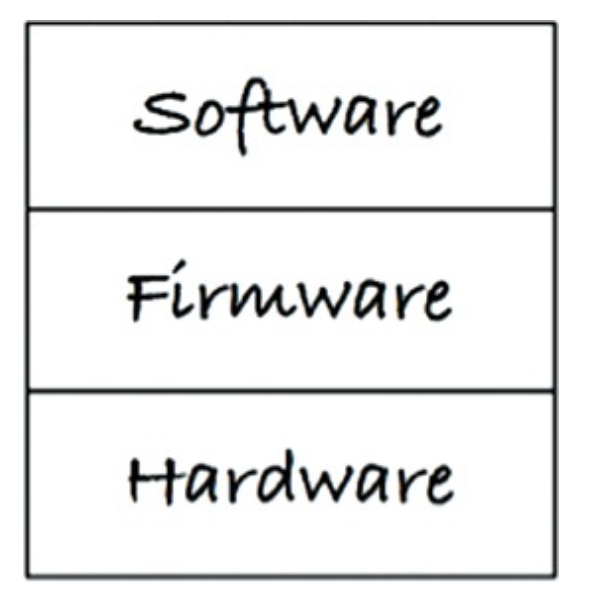
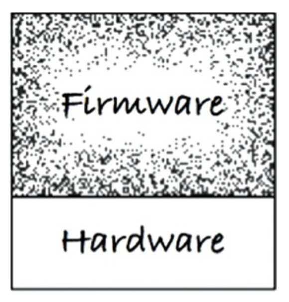
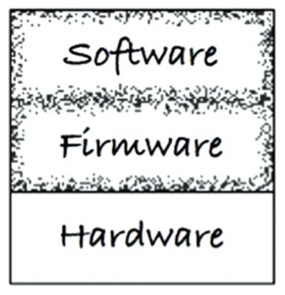
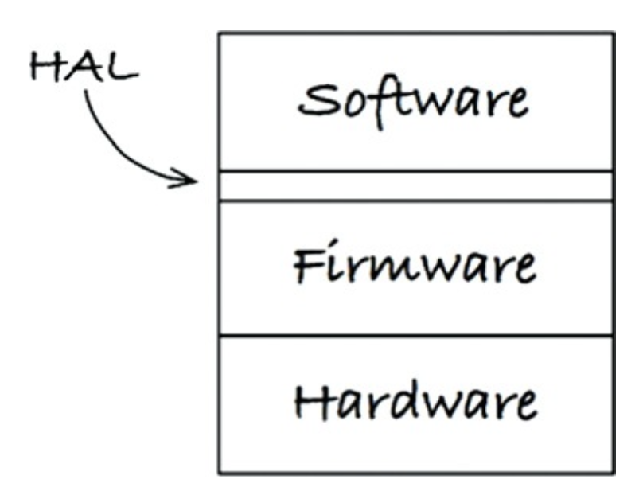
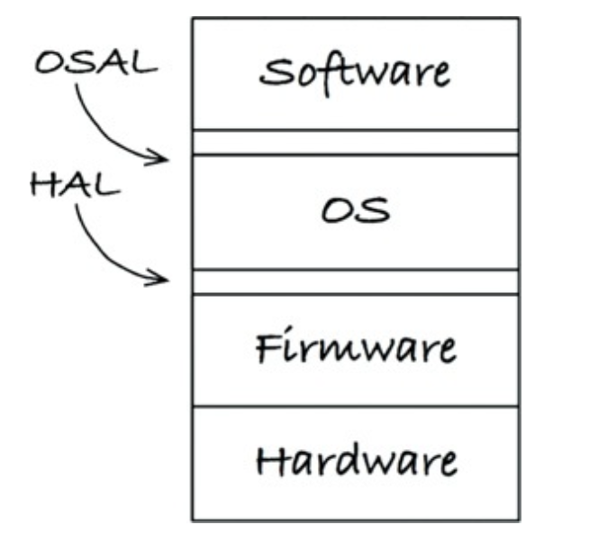

# CLEAN EMBEDDED ARCHITECTURE

> 소프트웨어는 닳지 않지만, 펌웨어와 하드웨어에 대한 의존성을 관리하지 않으면 안으로부터 파괴될 수 있다.

* 펌웨어는 ROM, EPROM 혹은 플래시 메모리 같은 비휘발성 메모리에 유지된다.
* 펌웨어는 하드웨어 장치에 프로그래밍된 소프트웨어 프로그램 혹은 명령어 집합이다.
* 펌웨어는 개별 하드웨어에 내장되는 소프트웨어이다.
* 펌웨어는 ROM에 쓰여진 소프트웨어(프로그램이나 데이터)이다.

임베디드 엔지니어가 아닌 엔지니어들 또한 펌웨어를 작성한다. 임베디드 엔지니어가 아닌 사람도 코드에 개발하는 코드 전반에 플랫폼 의존성을 퍼뜨린다면, 본질적으로 펌웨어를 작성하는 셈이다. 안드로이드 앱 개발자 역시
업무 로직을 안드로이드 API로부터 분리하지 않는다면 펌웨어를 작성하는 셈이다.

어떻게 임베디드 소프트웨어 아키텍처를 깔끔하게 유지할 수 있는지, 그래서 소프트웨어가 오랫동안 유용하게 살아남을 가능성을 높일 수 있는지를 알아보자.

## 앱-티튜드 테스트

앱이 동작하도록 만드는 것을 개발자용 앱-티튜드 테스트(App-titude test)라 부른다. 프로그래머가 오직 앱이 동작하도록 만드는 일만 신경 쓰는 것이다. 이는 제품과 고융주에게 몹쓸 짓을 하는 것과 같다.
프로그래밍에는 단순히 앱을 동작하도록 만드는 것보다 중요한 것이 많다.

다음으 앱-티튜드 테스트를 통과하기 위한 코드의 예다. 이러한 코드는 특정 임베디드 장치에서만 테스트할 수 있음을 암시하는 파일 구조를 포함하고 있다. 코드를 특정 툴 체인과 마리크로프로세서에 구속해
버리는 `확장된` C 언어 구조를 사용했기 때문이다.

```c
ISR(TIMER1_vect) { ... }
ISR(INT2_vect) { ... }
void btn_Handler(void) { ... }
float calc_RPM(void) { ... }
static char Read_RawData(void) { ... }
void Do_Average(void) { ... }
void Get_Next_Measurement(void) { ... }
void Zero_Sensor_1(void) { ... }
void Zero_Sensor_2(void) { ... }
void Dev_Control(char Activation) { ... }
char Load_FLASH_Setup(void) { ... }
void Save_FLASH_Setup(void) { ... }
void Store_DataSet(void) { ... }
float bytes2float(char bytes[4]) { ... }
void Recall_DataSet(void) { ... }
void Sensor_init(void) { ... }
void uC_Sleep(void) { ... 
```

다른 하드웨어 환경에서 이식될 가능성이 없다면 몰라도, 이 코드는 유효수명을 길게 유지할 방법이 없다. 따라서 이 애플리케이션이 클린 아키텍처를 가진다고 하기는 어렵다.

## 타깃-하드웨어 병목현상

임베티드가 지닌 특수한 문제 중 하나는 타깃-하드웨어 병목현상(target-hardware bottleneck)이다. 임베디드 코드가 클린 아키텍처 원칙과 실천법을 따리지 않고 작성된다면, 대개의 경우 코드를
테스트할 수 있는 환경이 해당 특정 타깃으로 국한될 것이다. 그리고 그 타깃이 테스트가 가능한 유일한 장소라면 타깃-하드웨어 병목현상이 발생해 진척이 느려질 것이다.

### 클린 임베디드 아키텍처는 테스트하기 쉬운 임베디드 아키텍처다

#### 계층

다음 3개의 계층을 보자. 하드웨어는 기술의 발전에 따라 변할 것이다. 부품은 낡게 되고, 새로운 부품은 적은 전력을 사용하면서도 더 나은 성능을 제공하며, 더 저렴할 것이다. 이처럼 불가피하게 하드웨어를 변경해야
하는 시점이 닥쳤을 떄, 임베디드 엔지니어로서 필요 이상의 작업을 하기 원치 않는다.

<div align="center">

</div>

최소한 하드웨어가 정의된 이후라면 하드웨어와 나머지 시스템 사이 분리는 주어진다. 이 상태에서 앱-티튜드 테스트를 해보면 대체로 문제가 발생한다. 하드웨어 관련 정보가 코드 전체를 오염시키지 못하게 막을 방법이
없다.

<div align="center">

</div>

소프트웨어와 펌웨워가 서로 섞이는 일은 안티 패턴(anti-pattern)이다. 이러한 안티 패턴을 보이는 코드는 변화에 저항한다. 변경하기 어려울 뿐더러 변경하는 일 자체가 위험하며, 때로는 의도치 않은 결과를
불러온다.

#### 하드웨어는 세부사항이다.

다음 그림에서 보이듯 소프트웨어와 펌웨어 사이 경계는 코드와 하드웨어 사이 경계와는 달리 잘 정의하기가 대체로 힘들다.

<div align="center">

</div>

임베디드 소프트웨어 개발자가 해야 할 일 하나는 이 경계를 분명하기 만드는 것이다. 소프트웨어와 펌웨어 사이 경계는 하드웨어 추상화 계층(HAL: Hardware Abstraction Layer)이라 부른다.

HAL의 API는 소프트웨어의 필요에 맞게 만들어져야 한다. 예를 들어 펌웨어는 바이트 또는 바이트 배열을 플래시 메모리에 저장할 수 있다. 반대로 애플리케이션에서는 이름/값과 같이 쌍으로 된 데이터를 영속성 장치에
저장하거나 읽을 수 있어야 한다. 소프트웨어는 이름/값 쌍이 플래시 메모리에 저장되는지, 하드디스크에 저장되는지, 클라우드에 저장되는지, 아니면 코어 메모리에 저장되는지 알 필요가 없다. 이러한 서비스를 HAL이
제공하며, 어떻게 저장하는지에 대해 소프트웨어에게 드러내지 않는다. 어떻게 저장되는지는 소프트웨어로부터 반드시 숨겨야 할 세부사항이다.

<div align="center">

</div>

### HAL 사용자에게 하드웨어 세부사항을 드러내지 말라

클린 임베디드 아키텍처로 설계된 소프트웨어는 타깃 하드웨어에 관계없이 테스트가 가능하다.

#### 프로세서는 세부사항이다

임베디드 애플리케이션이 특수한 툴 체인을 사용한다면, 이러한 툴 체인은 도움되는 헤더 파일을 제공할 때가 많다. 이런 툴 체인의 컴파일러는 C 언어를 변경하여 해당 업체의 프로세스 기능에 접근할 수 있는 새로운
키워드를 제공한다. 그렇다면 이는 C처럼 보이지만, 더 이상 C가 아니다. 따라서 C를 확장한 요소를 아는 파일을 제한해야 한다.

ACME 사의 DSP 제품군으로 설계된 다음 헤더 파일(acmetypes.h)을 보자.

```c
#if defined(_ACME_X42)
    typedef unsigned int        Uint_32;
    typedef unsigned short      Uint_16;
    typedef unsigned char       Uint_8;
    typedef int                 Int_32;
    typedef short               Int_16;
    typedef char                Int_8;
#elif defined(_ACME_A42)
    typedef unsigned long       Uint_32;
    typedef unsigned int        Uint_16;
    typedef unsigned char       Uint_38;
    typedef long                Int_32;
    typedef int                 Int_16;
    typedef char                Int_8;
#else
    #error <acmetypes.h> is not supported for this environment
#endif

#endif
```

acmetypes.h 헤더 파일은 절대 직접 사용해선 안 된다. 직접 사용하면 이 ACME의 DSP 중 하나에 종속되어 버린다. 따라서 acmetypes.h를 사용하기보다는 더 표준화된 stdint.h를 사용하려고
노력해야 한다. 타깃 컴파일러에서 stdint.h를 제공하지 않는다면 직접 작성할 수 있다. stdint.h는 다음과 같이 acmetypes.h를 사용해 타깃에서 컴파일 할 수 있도록 해준다.

```c
#ifndef _STDINT_H_
#define _STDINT_H_

#include <acmetypes.h>

typedef Uint_32 uint32_t;
typedef Uint_16 uint16_t;
typedef Uint_8  uint8_t;

typedef Int_32  int32_t;
typedef Int_16  int16_t;
typedef Int_8   int8_t;
#endif
```

모든 소프트웨어는 반드시 프로세서에 독립적이여야 하지만, 모든 펌웨어가 그럴 수는 없다. 다음 코드는 특수한 C 확장 기능을 활용해 마이크로 컨트롤러 내부 주변장치에 접근한다.

```c
void say_hi()
{
    IE = 0b11000000;
    SBUF0 = (0x68);
    while(TI_0 == 0);
    TI_0 = 0;
    SBUF0 = (0x69);
    while(TI_0 == 0);
    TI_0 = 0;
    SBUF0 = (0x0a);
    while(TI_0 == 0);
    TI_0 = 0;
    SBUF0 = (0x0d);
    while(TI_0 == 0);
    TI_0 = 0;
    IE = 0b11010000;
}
```

위 코드의 대문자 변수들은 마이크로 컨트롤러에 내장된 주변장치에 접근한다. 하지만 이 코드는 C가 아니다.

클린 임베디드 아키텍처라면 장치 접근 레지스터를 직접 사용하는 코드는, 순전히 펌웨어로만 한정시켜야 한다. 이들 레지스터를 알고 있는 것은 모두 펌웨어가 되어야 하며, 따라서 실리콘 칩에 종속된다. 코드를 프로세서와
직접적으로 묶어버리면 안정적인 하드웨어가 출시되기 전 코드를 실행시키고자 할 때 어려움을 겪을 수 있으며, 또한 임베디드 애플리케이션을 새로운 프로세서로 이식할 때도 곤란해질 것이다.

이러한 마이크로 컨트롤러를 사용할 때, 펌웨어가 저수준 함수들을 프로세서 추상화 계층(PAL: Processor Abstraction Layer)의 형태로 격리시켜줄 수 있다. PAL 상위에 위치하는 펌웨어는
타깃-하드웨어에 관계없이 테스트할 수 있어, 펌웨어 자체도 덜 딱딱해질 수 있다.

#### 운영체제는 세부사항이다

HAL은 필수적이다. 하지만 임베디드 시스템에서 실시간 운영체제(RTOS)를 사용하거나, 임베디드 버전의 리눅스/윈도우를 사용하는 경우 작성한 코드의 수명을 늘리려면, 무조건 운영체제를 세부사항으로 취급하고
운영체제에 의존하는 일을 막아야 한다.

OS는 소프트웨어를 펌웨어로부터 분리하는 계층이다. OS를 직접 사용한다면, 새로운 OS가 제공하는, 이전 OS와 다른 기능과 시스템 명령어에 맞게 의미 자체를 조정해야 할 가능성이 높다.

클린 임베디드 아키텍처는 운영체제 추상화 계층(OSAL: Operating System Abstraction Layer)을 통해 소프트웨어를 운영체제로부터 격리시킨다.

<div align="center">

</div>

소프트웨어가 OS에 직접적으로 의존하는 대신, OSAL에 의존한다면, 이식 작업의 대부분은 기존 OSAL과 호환되도록 새로운 OSAL을 작성하는 데 소요될 것이다. 코드 비대화 문제가 염려될 수도 있다. 실제로
OSAL은 OS를 사용하는 데 따른 수많은 중복이 격리되어 있는 장소다. 하지만 이러한 중복이 큰 비용을 초래하지 않는다. OSAL을 정의하는 일은 결국 애플리케이션에서도 공통 구조를 가지도록 힘쓰는 일이기도 하다.
예를 들어 메시지 전달 메커니즘을 만들어, 모든 스레드가 동시성 모델을 일일이 처리하지 않도록 할 수도 있다.

OSAL은 테스트 지점을 만드는 데 도움이 되며, 그 덕분에 소프트웨어 계층의 애플리케이션 코드를 타깃이나 OS에 관계없이 테스트할 수 있다.

### 인터페이스를 통하고 대체 가능성을 높이는 방향으로 프로그래밍하라

모든 주요 계층(소프트웨어, OS 펌웨어, 하드웨어) 내부에는 여기서 설명한 원칙들을 적용해야 한다. 이들 원칙은 관심사를 분리시키고, 인터페이스를 활용해, 대체 가능성을 높이는 방향으로 프로그래밍하도록 유도한다.

인터페이스 정의는 헤더 파일에 해야 한다. 이 헤더 파일엔 함수 선언과 그 함수에서 사용하는 상수와 구조체 이름만 포함시켜야 한다. 구현체에서만 필요한 데이터 구조, 상수, 타입 정의들은 인터페이스 헤더 파일에
포함되선 안 된다. 이는 복잡해질 뿐 아니라 원치 않는 의존성을 만들어 낼 가능성이 있다. 따라서 구현 세부사항의 가시성을 제한하라.

클린 임베디드 아키텍처에서는 모듈들이 인터페이스를 통해 상호작용하기 때문에 각 계층 내부에서 테스트가 가능하다.

### DRY(Don't Repeat Yourself) 원칙: 조건부 컴파일 지시자를 반복하지 말라

조건부 컴파일을 사용해 특정 코드 블록을 활성화하거나 비활성화한다. `#ifdef BOARD_V2` 구문이 한 번 나타난다면 문제가 되지 않지만, 수천 번이나 사용되면 엄청난 문제다. 임베디드 시스템의 경우
타깃-하드웨어의 유형을 식별하는 조건부 컴파일을 반복해 사용할 때가 많다.

HAL이 있다면 하드웨어 유형은 HAL 뒤에 가려진 세부사항이 될 것이다. 만약 이 HAL이 조건부 컴파일 대신 사용할 수 있는 일련의 인터페이스를 제공한다면, 링커 또는 어떤 형태의 실시간 바인딩을 사용해
소프트웨어를 하드웨어와 연결할 수 있다.

## 결론

클린 임베디드 아키텍처는 제품이 장기간 생명력을 유지하는 데 도움을 준다.

## 결론