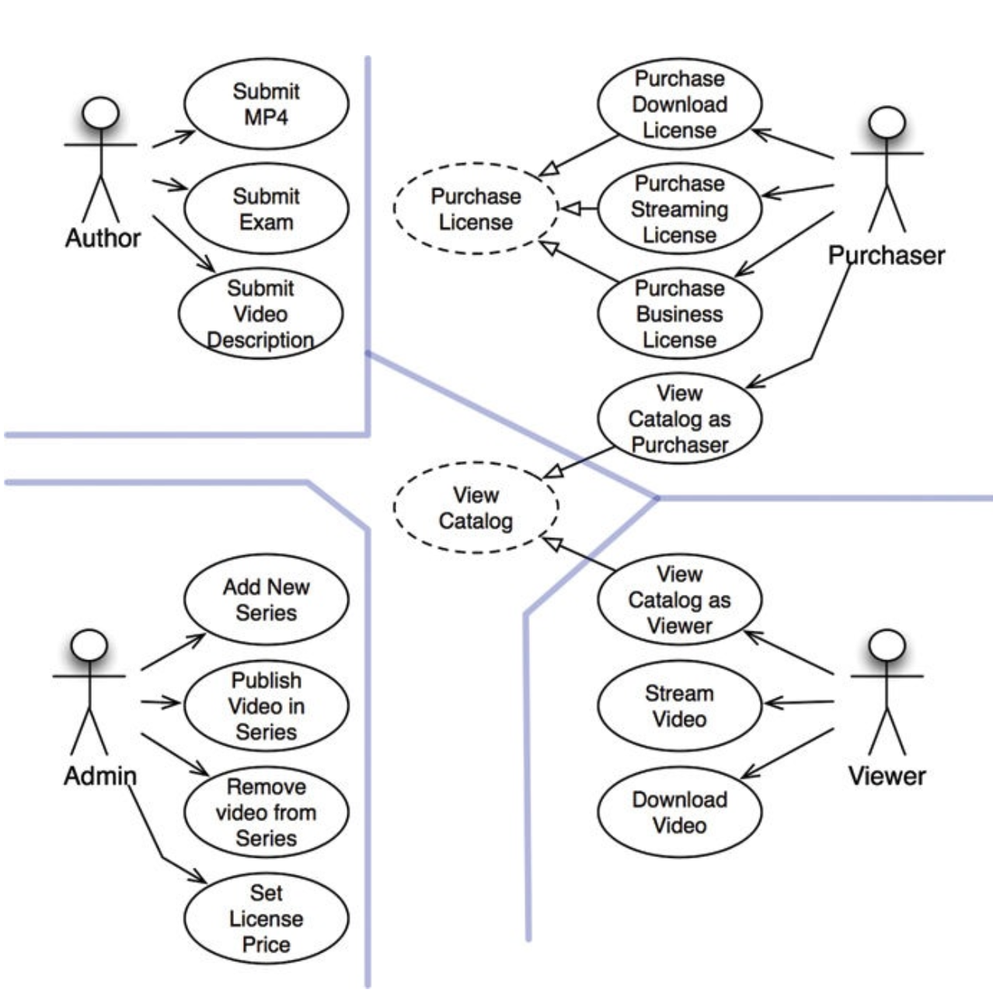
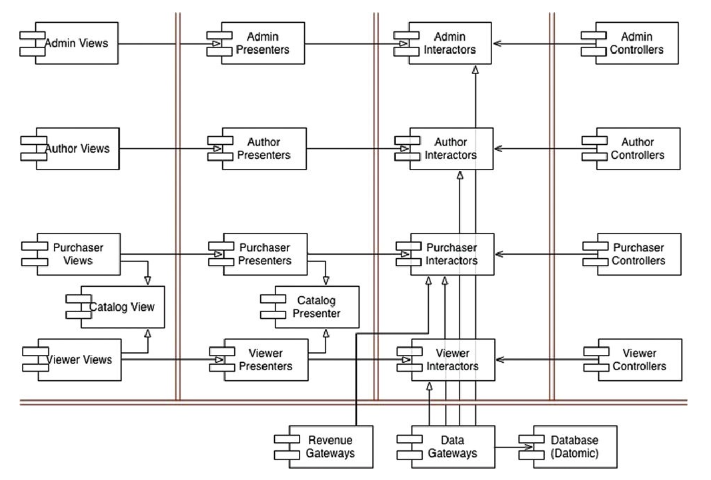

# CASE STUDY: VIDEO SALES

지금까지 살펴본 아키텍처에 대한 규칙과 견해를 종합해 사례 연구로 적용해보자.

## 제품

웹 사이트에서 비디오를 판매하는 소프트웨어다. 이 소프트웨어의 기본적은 발상은 단순하다. 판매하길 원하는 비디어들이 있고, 그걸 개인과 기업에게 웹을 통해 판매한다. 개인은 단품 가격을 지불해 스트리밍으로 보거나,
더 높은 가격을 내고 비디오를 다운로드해서 영구 소장할 수도 있다. 기업용 라이센스는 스트리밍 전용이며, 대량 구매를 하면 할인받을 수 있다.

일반적으로 개인은 시청자인 동시에 구매자다. 반면 기업은 사람들이 시청할 비디오를 구매하는 사람이 따로 있다.

비디오 제작자는 비디오 파일과 비디오에 대한 설명서, 부속 파일을 제공해야 한다.

관리자는 신규 비디오 시리즈물을 추가하거나 기존 시리즈물에 비디오를 추가 또는 삭제하며, 다양한 라이센스에 맞춰 가격을 책정한다.

시스템의 초기 아키텍처를 결정하는 첫 단계는 액터와 유스케이스를 식별하는 일이다.

## 유스케이스 분석

네 개의 주요 액터는 분명하다. SRP에 따르면 이들 네 액터가 시스템이 변경되어야 할 주요 원인이 된다. 신규 기능을 추가하거나 기존 기능을 변경해야 한다면 이유는 반드시 이들 액터 중 하나에게 해당 기능을
제공하기 위해서다. 따라서 시스템을 분할하여, 특정 액터를 위한 변경이 나머지 액터에게는 전혀 영향을 미치지 않게 만들어야 한다.

중앙의 점선으로 된 유스케이스는 추상 유스케이스다. 추상 유스케이스는 범용적인 정책을 담고 있으며, 다른 유스케이스에서 이를 구체화한다.

추상 유스케이스를 다이어그램에서 없애더라도 전체 제품의 기능을 조금도 손상시키진 않짐나, 이들 두 유스케이스는 너무 비슷하기 때문에, 유사성을 식별해 분석 초기에 통합하는 방법을 찾는 편이 현망하다고 판단했다.

## 컴포넌트 아키텍처

다음은 예비 단게의 컴포넌트 아키텍처이다.

이중으로 된 선은 아키텍처 경계를 나타낸다. View, Presenter, Interactor, Controller로 분리되었으며, 대응하는 액터에 따라 카테고리를 분리했다.

각 컴포넌트는 단일 .jar 파일 또는 단일 .dll 파일에 해당한다. 이들 컴포넌트 각각은 자신에게 할당된 뷰, 프레젠터, 인터랙터, 컨트롤러를 포함한다.

CatalogView와 CatalogPresenter는 카탈로그 조회하기라는 추상 유스케이스를 처리하는 필자만의 방식이다. 이 뷰와 프레젠터는 해당 컴포넌트 내부에 추상 클래스로 코드화될 것이며, 상속받는
컴포넌트에서는 이들 추상 클래스로부터 상속받은 뷰와 프레젠터 클래스들을 포함한다.

위 그럼처럼 분할한 경우 총 다섯 개의 .jar 파일로 합칠 수 있을 것이다. 즉, 뷰, 프레젠터, 인터랙터, 컨트롤러, 유틸리티 각각을 하나의 .jar 파일로 만들 수 있다. 그러면 서로 독립적으로 변경될 가능성이
큰 컴포넌트들을 독립적으로 배포할 수 있다.

뷰와 프레젠터를 합쳐 같은 .jar에 두고, 인터랙터, 컨트롤러, 유틸리티는 개별 .jar 파일에 두는 방식도 있다.

이처럼 각 컴포넌트를 독립적으로 컴파일하고 빌드할 수 있는 환경을 구성하면, 후에 시스템이 변경되는 양상에 맞춰 시스템 배포 방식을 조절할 수 있다.

## 의존성 관리

위 그림에서 제어흐름은 오른쪽에서 왼쪽으로 이동한다. 입력이 컨트롤러에서 발생하면 인터랙터에 의해 처리되어 결과가 만들어진다. 그런 후 프레젠터가 결과의 포맷을 변경하고, 뷰가 화면에 표시된다.

모든 화살표가 오른쪽에서 왼쪽을 가리키지 않는다는 점을 주목하자. 대부분의 화살표는 왼쪽에서 오른쪽으로 향한다. 이는 아키텍처가 의존성 규칙을 준수하기 때문이다. 모든 의존성은 경계선을 한 방향으로만 가로지르는 데,
항상 더 높은 수준의 정책을 포함하는 컴포넌트를 향한다.

사용 관계(열린 화살표)는 제어흐름과 같은 방향을 가리키며, 상속 관계(닫힌 화살표)는 제어흐름과 반대 방향을 가리킴에 주목하자. 이는 OCP를 적용했음을 보여준다.

## 결론

아키텍처 다이어그램은 두 가지 서로 다른 차원의 분리 개념을 포함한다. 첫 번째는 SRP에 기반한 액터의 분리이며, 두 번째는 의존성 규칙이다. 이 두 차원은 모두 서로 다른 이유로, 서로 다른 속도로 변경되는
컴포넌트를 분리하는데 목적이 있다. 서로 다른 이유는 액터와 관련이 있으며, 서로 다른 속도는 정책 수준과 관련이 있다.

