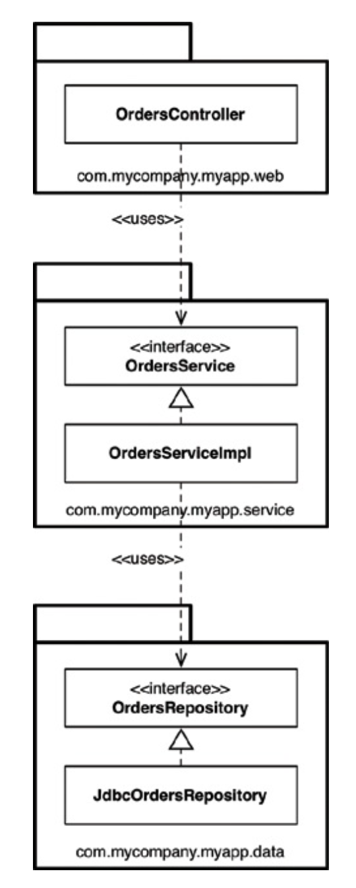
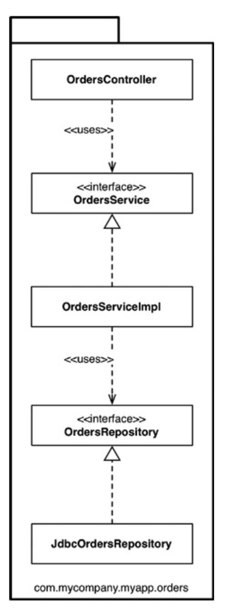
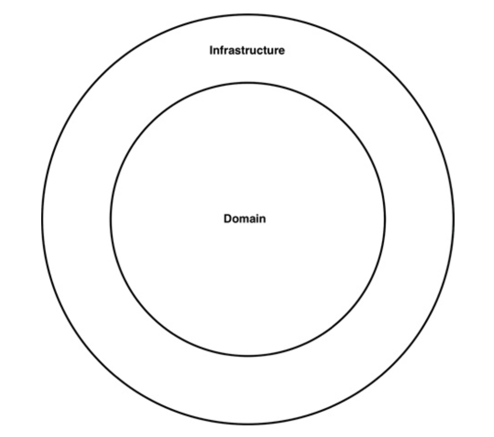
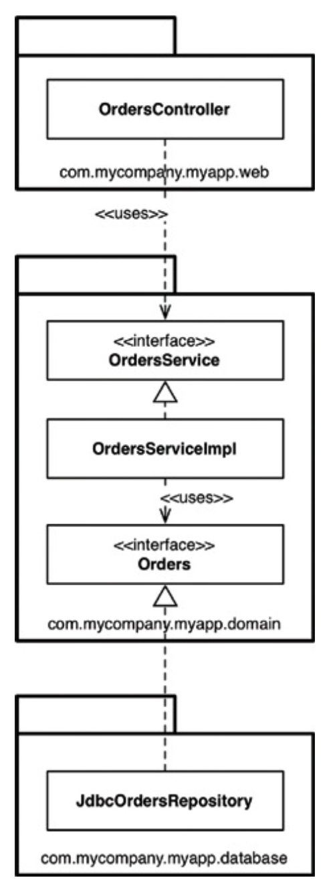
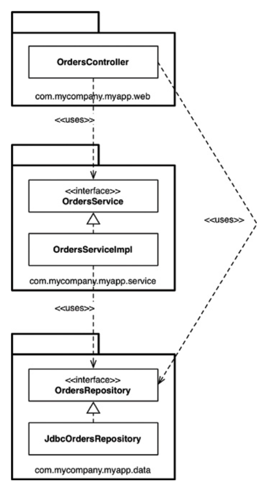
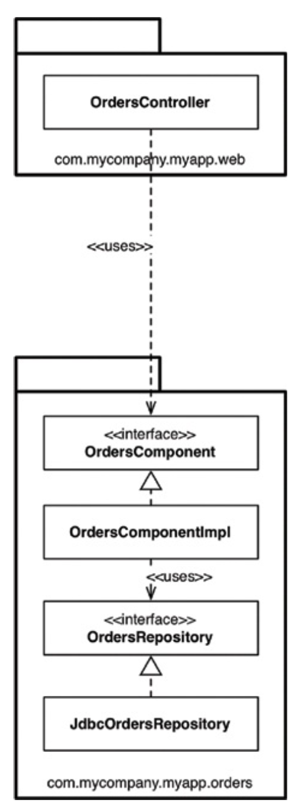
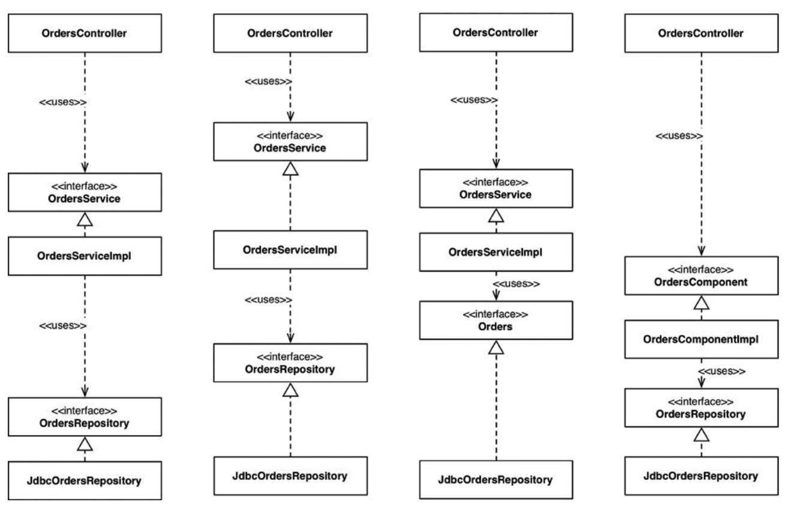
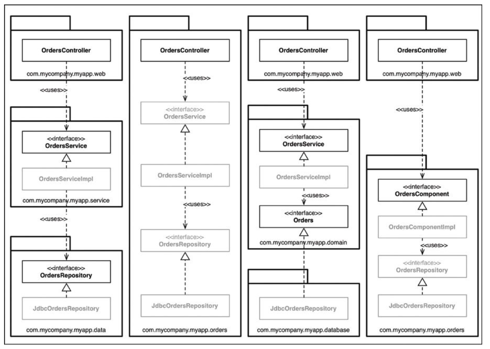
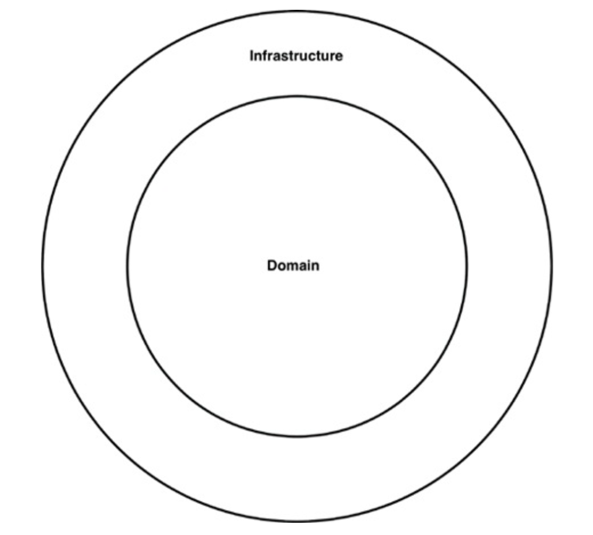

# THE MISSING CHAPTER

올바르게 정의된 경계, 명확한 책임, 긜고 통제된 의존성을 가진 클래스와 컴포넌트로 구성되면 더 나은 소프트웨어를 설계할 수 있을 것이다. 하지만 악마는 항상 세부사항에 있으며, 이를 심사숙고하지 않는다면 마지막
고비에 걸려 넘어지기 십상이다.

온라인 서점을 구축하고 있으며, 고객이 주문 상태를 조회할 수 있는 유스케이스를 구현해야 한다고 가정하자.

## 계층 기반 패키지

가장 단순한 설계 방식은 전통적인 수평 계층형 아키텍처다. 해당 코드가 하는 일에 기반해 그 코드를 분할한다. 이러한 방식을 `계층 기반 패키지`라 부른다.

이 전형적인 계층형 아키텍처에는 웹, `업무 규칙`, 영속성 코드를 위해 계층이 각각 하나씩 존재한다. `엄격한 계층형 아키텍처`의 경우 계층은 반드시 바로 아래 계층에만 의존해야 한다.

* OrdersController: 웹 컨트롤러이며, 웹 기반 요청을 처리한다. Spring MVC 컨트롤러 등이 여기 해당한다.
* OrdersService: 주문 관련 `업무 규칙`을 정의하는 인터페이스
* OdersServiceImpl: OrdersService 인터페이스의 구현체
* OrdersRepository: 영구 저장된 주문 정보에 접근하는 방법을 정의하는 인터페이스
* JdbcOrdersRepository: OrdersRepository 인터페이스의 구현체

이 아키텍처는 엄청난 복잡함을 겪지 않고도 무언가 작동시켜주는 아주 빠른 방법이다. 하지만 소프트웨어가 커지고 복잡해지기 시작하면, 머지 않아 큰 그릇 세 개만으로는 모든 코드를 담기엔 부족하다. 또한 이 아키텍처는
업무 도메인에 대해 아무것도 말해주지 않는다는 문제도 있다.

## 기능 기반 패키지

서로 연관된 기능, 도메인 개념, 또는 Aggregate Root(데이터 변경의 단위로 다루는 연관 객체의 묶음)에 기반하여 수직의 얇은 조각으로 코드를 나누는 `기능 기반 패키지` 구조도 있다. 모든 타입이 하나의
자바 패키지에 속하며, 패키지 이름은 그 안에 담긴 개념을 반영해 짓는다.

다음 그림에서 보듯이 등장하는 인터페이스와 클래스는 이전과 같지만, 모두가 하나의 패키지에 속한다. 이제 코드의 상위 수준 구조가 업무 도메인에 대해 무언가를 알려주게 된다. 이 코드 베이스가 웹, 서비스,
레포지토리가 아니라 주문과 관련한 무언가를 한다는 것을 볼 수 있다.

또 다른 이점으로, `주문 조회하기` 유스케이스가 변경될 경우 변경해야 할 코드를 모두 찾는 작업이 더 쉬워질 것이다. 변경해야 할 코드가 한 패키지에 담겨 있기 때문이다. 하지만 지금까지 설명한 두 접근법 모두
차선책이다.

## 포트와 어댑터

엉클 밥에 따르면 `포트와 어댑터(Ports and Adapters)` 또는 `육각형 아키텍처(Hexagonal Architectrue)`, `경계, 컨트롤러, 엔티티(BCE)` 등의 방식으로 접근하는 이유는
업무/도메인에 초점을 둔 코드가 프레임워크나 데이터베이스 같은 기술적인 세부 구현과 독립적이며 분리된 아키텍처를 만들기 위해서다.

`내부` 영역은 도메인 개념을 모두 포함하는 반면, `외부` 영역은 외부 세계(UI, 데이터베이스 등)와의 상호작용을 포함한다. 중요한 점은 `외부`가 `내부`에 의존하며, 반대는 허용하지 않는다는 점이다.

다음은 `주문 조회하기` 유스케이스를 이 방식으로 구현한 모습이다.

com.mycompany.myapp.domain 패키지가 `내부`이며, 나머지 패키지는 `외부`이다. `내부`를 향해 흐르는 모습에 주목해라. OrdersRepository가 Orders라는 간단한 이름으로 바뀐
것을 확인할 수 있다. 이는 도메인 주도 설계라는 세계관에서 비롯된 명명법으로, `내부`에 존재하는 모든 것의 이름은 반드시 `유비쿼터스 도메인 언어(ubiquitous domain language)` 관점에서
기술하라고 조언한다. 즉, 도메인에 대해 논의할 때 우리는 `주문`에 대해 말하는 것이지, `주문 레포지토리`에 대해 말하는 것이 아니다.

이 그림은 UML 클래스 다이어그램을 간소화할 때 어떻게 표현할 수 있는지를 보여주기도 한다. 인터랙터가 빠졌고, 의존성 경계를 가로질러 데이터를 마샬링하는 객체 등이 누락되었다.

## 컴포넌트 기반 패키지

계층형 아키텍처의 목적은 기능이 같은 코드끼리 서로 분리하는 것이다. 각 계층은 일반적으로 자바 패키지에 해당한다. 코드의 접근성 관점에서 OrdersController가 OrdersService 인터페이스에
의존하려면 OrdersService는 반드시 public로 선언되어야 한다. 또한 OrdersRepository 인터페이스도 public이어야만 OrdersServiceImplt 클래스에서 접근할 수 있다.

예를 들어 신규 인력을 고용해 주문과 관련된 또 다른 유스케이스를 구현하라고 지시했다고 가정해보자. 이 사람은 OrdersController 클래스가 이미 존재한다는 사실을 발견하고 신규 코드를 추가할 위치라고
결정한다. 그런데 데이터베이스로부터 주문과 관련된 몇 가지 데이터가 필요해져, OrdersRepository 인터페이스를 통해 컨트롤러에 의존성을 주입한다. 하지만 이 결과로 만들어진 UML 다이어그램은 다음과
같다.

이러한 조직화는 인접한 계층(들)을 건너뛰는 일이 허용되기 때문에 흔히 완화된 계층형 아키텍처(relaxed layered architecture)라 부른다. 경우에 따라 의도된 결과이기도 한데, 예를 들어
CQRS(Command Query Responsibility Segregation: 데이터를 변경하고 조회하는 패턴을 서로 분리) 패턴을 지키려고 시도하는 경우다. 이외의 경우는 업무 로직 계층을 우회하는 일은
바람직하지 못하다. 특히 개별 레코드에 대해 인증된 접근만을 허용하는 일을 업무 로직이 책임지는 경우라면 더욱 그렇다.

여기서 필요한 것은 지침(아키텍처 원칙)으로, "웹 컨트롤러는 절대로 레포지토리에 직접 접근해서는 안 된다"와 같은 원칙이 필요하다.

* 규율, 코드 리뷰를 통해 이 원칙을 강제하는 방법이 있다.
* 정적 분석 도구(예: NDepend, Structure 101, Checkstyle)을 사용해 아키텍처적인 위반 사항이 없는지를 검사하여 자동으로 강제할 수 있다. 이들 규칙은 컴파일 단계가 끝난 후 실행된다.

이 두 접근법 모두 오류가 있을 수 있으며, 결과를 알게 되는 주기가 필요 이상으로 길다는 문제가 있다. 손을 쓰지 않고 그대로 둔다면 `Big Ball of Mud`로 만들어 버릴 것이다. 따라서 가능하면
컴파일러를 사용해 아키텍처를 강제하는 방식을 선호한다.

이것이 바로 `컴포넌트 기반 패키지`를 도입해야 하는 이유이다. 이 접근법은 지금까지 봐왔던 모든 것들을 혼합한 것으로, 큰 단위(coarse-grained)의 단일 컴포넌트와 관련된 모든 책임을 하나의 자바
패키지로 묶는 데 주안점을 둔다. 이 접근법은 서비스 중심적인 시각으로 소프트웨어를 바라보며, 마이크로서비스 아키텍처가 가진 시각과도 동일하다. 포트와 어댑터에서 웹을 그저 또 다른 전달 메커니즘으로 취급하는 것과
마찬가지로, 컴포넌트 기반 패키지에서도 사용자 인터페이스를 큰 단위의 컴포넌트로부터 분리해서 유지한다. 다음은 `주문 조회하기` 유스케이스가 어떤 모습인지 보여준다.

본질적으로 이 접근법에서는 `업무 로직`과 영속성 관련 코드를 하나로 묶는데, 이 묶음을 `컴포넌트`라 부른다.

엉클 밥은 `컴포넌트`에 대한 정의를 아래와 같이 제시한다.

> 컴포넌트는 배포 단위다. 컴포넌트는 시스템의 구성 요소로, 배포할 수 있는 가장 작은 단위다. 자바의 경우 jar 파일이 컴포넌트다.

필자는 다르게 정의한다.

> 컴포넌트는 멋지고 깔끔한 인터페이스로 감싸진 연관된 기능들의 묶음으로, 애플리케이션과 같은 실행 환경 내부에 존재한다.

이 정의는 `C4 소프트웨어 아키텍처 모델`에 따른 것으로, 소프트웨어 시스템의 정적 구조를 컨테이너, 컴포넌트, 클래스(또는 코드)의 측면에서 계층적으로 생각하는 간단한 방법이다. 이 방법론에서 소프트웨어 시스템은
하나 이상의 컨테이너(예: 웹 애플리케이션, 모바일 앱, 독립형 애플리케이션, 데이터베이스, 파일 시스템 등)로 구성되며, 각 컨테이너는 하나 이상의 컴포넌트를 포함한다. 또한 각 컴포넌트는 하나 이상의 클래스(또는
코드)로 구현된다. 이때 각 컴포넌트가 개별 jar 파일로 분리될지 여부는 직교적인(독립적인) 관심사다.

컴포넌트 기반 패키지 접근법의 주된 이점은 주문과 관련된 무언가 코딩해야 할 때 OrdersComponent만 둘러보면 된다는 점이다. 이 컴포넌트 내부에서 관심사의 분리는 여전히 유요하며, 따라서 업무 로직은
데이터 영속성과 분리되어 있다. 하지만 이는 컴포넌트 구현과 관련된 세부사항으로, 사용자는 알 필요가 없다. 이는 마이크로 서비스나 서비스 지향 아키텍처를 적용했을 때 얻는 이점과 유사하다. 즉, 주문 처리와 관련된
모든 것들을 캡슐화하는 별도의 OrdersService가 존재한다. 큰 차이는 결합 분리 모드에 있다. 모노리틱 애플리케이션에서 컴포넌트를 잘 정의하면 마이크로서비스 아키텍처로 가기 위한 발판으로 삼을 수 있다.

## 구현 세부사항엔 항상 문제가 있다

이 네 가지 접근법이 코드를 조직화하는 완전히 서로 다른 방식처럼 보이며, 따라서 서로 다른 아키텍처 스타일로 여길 수도 있다. 하지만 세부사항을 잘못 구현하면 이러한 견해도 아주 빠르게 흐트러지기 시작한다.

모든 타입에서 public 지시자를 사용한다는 건 사용하는 프로그래밍 언어가 제공하는 캡슐화 관련 이점을 활용하지 않겠다는 뜻이다. 이로 인해 누군가가 구체적인 구현 클래스의 인스턴스를 직접 생성하는 코드를 작성하는
일을 절대 막을 수 없으니, 결국 아키텍처 스타일을 위반하게 될 것이다.

## 조직화 vs 캡슐화

public 타입을 코드 베이스 어디에서도 사용할 수 있다면 패키지를 사용하는 데 따른 이점이 거의 없다. 따라서 사실상 패키지를 사용하지 않는 것과 같다. 결국 어떤 아키텍처 스타일로 만들려고 하는지는 아무런
의미가 없어진다. public 지시자를 과용하면 앞에 제시한 네 가지 아키텍처 접근법은 본질적으로 완전히 같아진다.

다음 그림에서 각 타입 사이 화살표를 유심해 보면, 채택하려는 아키텍처 접근법과 관계 없이 화살표들이 모두 동일한 방향을 가리킨다. 개념적으로 이 접근법들은 매우 다르지만, 구문적으로는 완전히 똑같다. 이처럼 모든
타입을 public으로 선언한다면, 우리가 실제로 갖게 되는 것은 수평적 계층형 아키텍처를 표현하는 네 가지 방식에 지나지 않는다.

자바에서 접근 지시자를 적절하게 사용하면, 타입을 패키지로 배치하는 방식에 따라 각 타입에 접근할 수 있는 정도(또는 접근 불가능한 정도)가 실제로 크게 달라질 수 있다. 만약 다이어그램에서 패키지 구조를 살려 더
제한적인 접근 지시자를 사용할 수 있는 타입을(흐리게) 표시하면, 다음과 같이 보여진다.

* 첫 번째, `계층 기반 패키지` 접근법에서 OrdersService와 OrdersRepository 인터페이스는 외부 패키지 클래스로부터 자신이 속한 패키지 내부로 들어오는 의존성이 존재하므로 public으로
  선언되어야
  한다. 반면 구체 클래스(OrdersServiceImpl과 JdbcOrdersRepository)는 더 제한적으로 선언(protected)할 수 있다. 이들 클래스는 누구도 알 필요가 없는 구현 세부사항이다.
* 두 번쨰, `기능 기반 패키지` 접근법에서는 OrdersController가 패키지로 들어올 수 있는 유일한 통로를 제공하므로 나머지는 모두 protected로 지정할 수 있다. 이 방식에서 주의할 점은, 이
  패키지 밖의 코드에서는 컨트롤러를 통하지 않으면 주문 관련 정보에 접근할 수 없다는 사실이다.
* 세 번째, `포트와 어댑터` 접근법의 경우, OrdersService와 Orders 인터페이스는 외부로부터 들어오는 의존성을 가지므로 public을 지정한다. 구현 클래스는 protected로 지정하며, 런타임에
  의존성을 주입할 수 있다.
* 네 번쨰, `컴포넌트 기반 패키지` 접근법에서는 컨트롤러에서 OrdersComponent 인터페이스로 향하는 의존성을 가지며, 그 외의 모든 것은 protected로 지정할 수 있다. 이 패키지 외부에서는
  OrdersRepository 인터페이스나 구현체를 직접 사용할 수 있는 방법이 없다. 따라서 컴파일러의 도움을 받아 `컴포넌트 기반 패키지` 아키텍처 접근법을 강제할 수 있다.

## 다른 결합 분리 모드

프로그래밍 언어가 제공하는 방법 외에도 소스 코드 의존성을 분리하는 방법이 존재한다.

자바는 OSGi 같은 모듈 프레임워크나 자바9에서 제공하는 새로운 모듈 시스템이 있다. 모듈 시스템을 제대로 사용하면 public 타입과 외부에 공표할 타입을 분리할 수 있다.

다른 선택지로는 소스 코드 수준에서 의존성을 분리하는 방법도 있다. 정확하게는 서로 다른 소스 트리로 분리하는 방법이다. 포트와 어댑터를 예로 들자면, 다음과 같은 소스 코드 트리를 만들 수 있다.

* 업무와 도메인용 소스 코드(즉, 선택된 기술이나 프레임워크와는 독립적인 모든 것): OrdersService, OrdersServiceImpl, Orders
* 웹용 소스 코드: OrdersController
* 데이터 영속성용 소스 코드: JdbcOrdersRepository

마지막 두 소스 코드 트리는 업무와 도메인 코드에 대해 컴파일 타임에 의존성을 가지며, 업무와 도메인 코드 자체는 웹이나 데이터 영속성 코드에 대해 알지 못한다. 구현 관점에서 이렇게 분리하려면 빌드 도구(
Maven, Gradle 등)를 사용해 모듈이나 프로젝트가 서로 분리되도록 구성해야 한다.

현실적으로 소스 코드를 이처럼 나누다 보면 성능, 복잡성, 유지보수 문제가 발생한다.

포트와 어댑터 접근법을 적용할 때는 이보다 간단한 방법을 사용하기도 하는데, 단순히 소스 코드 트리를 두 개만 만드는 것이다.

* 도메인 코드(`내부`)
* 인프라 코드(`외부`)

이 방식은 다음과 같은 다이어그램으로 표현된다. 인프라는 도메인에 대해 컴파일 타임에 의존성을 가진다.

이러한 접근법은 소스 코드를 조직화할 때 효과가 있지만, 잠재적으로 절충해야 할 부분이 있다. 이를 `포트와 어댑터에 대한 페리페리크(Peripherique) 안티 패턴`이라 부른다. 인프라 코드를 단일 소스 코드에
모두 모아둔다는 말은 애플리케이션에서 특정 영역(예: 웹 컨트롤러)에 있는 인프라 코드가 애플리케이션의 다른 영역(예: 데이터베이스 레포지토리)에 있는 코드를 도메인을 통하지 않고 직접 호출할 수 있다는 뜻이다.

> 프랑스 파리에 블러바드 페리페리크라는 이름의 원형 순환도로가 있는데, 이 도로를 이용하면 북적대는 파리 시내에 진입하지 않고도 파리 전체를 다 돌 수 있다.

## 결론: 빠져 있는 조언

최적의 설계를 했더라도, 구현 전략에 얽힌 복잡함을 고려하지 않으면 설계가 망가질 수 있다. 설계를 어떻게 해야 원하는 코드 구조로 매핑할 수 있을지, 그 코드를 어떻게 조직화할지, 런타임과 컴파일타임에 어떤 결합
분리 모드를 적용할지 고민하라.

선택한 아키텍처 스타일을 강제하는 데 컴파일러의 도움을 받을 수 있을지 고민하며, 데이터 모델과 같은 다른 영역에 결합되지 않도록 주의해라. 구현 세부사항에는 항상 문제가 있는 법이다.