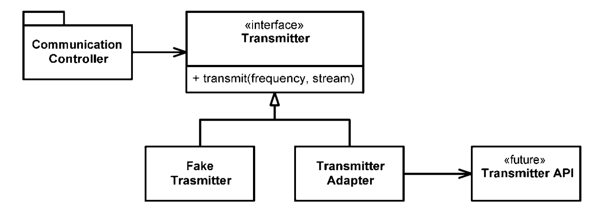

# Boundaries

시스템에 들어가는 모든 소프트웨어를 직접 개발하는 경우는 드물다. 때로는 패키지를 사고, 때로는 오픈 소스를 이용한다. 어떤 식으로든 이 외부 코드를 우리 코드에 깔끔하게 통합해야만 한다. 

## 외부 코드 사용하기

패키지 제공자나 프레임워크 제공자는 적용성을 최대한 넓히려 애쓰지만, 사용자는 자신의 요구에 집중하는 인터페이스를 바란다. 이러한 긴장으로 인해 시스템 경계에서 문제가 생길 소지가 많다.

`java.util.Map`을 살펴보자. `Map`은 다양한 인터페이스로 수많은 기능을 제공한다. 하지만 위험도 크다. 다음 예를 보자. 

* 프로그램에서 `Map`을 만들어 여기저기 넘긴다고 하자. 넘기는 쪽에서는 아무도 `Map` 내용을 삭제하지 않으리라 믿을지도 모른다. 하지만 첫 번째 메서드가 `clear()` 메서드다. 즉, `Map` 사용자라면 누구나 `Map`을 지울 권한이 있다는 의미이다.
* 설계 시 `Map`에 특정 객체 타입만 저장하기로 결정했다고 가정하자. 그렇지만 `Map`은 객체 유형을 제한하지 않는다. 마음만 먹으면 어떠한 객체 유형도 추가할 수 있다.

`Sensor`라는 객체를 담는 `Map`을 만들려면 다음과 같이 `Map`을 생성한다.

```java
Map sensors = new HashMap();
```

`Sensor` 객체가 필요한 코드는 다음과 같이 `Sensor` 객체를 가져온다.

```java
Sensor s = (Sensor)sensors.get(sensorId);
```

`Map`이 반환하는 `Object`를 올바른 유형으로 반환할 책임은 `Map`을 사용하는 클라이언트에 있다. 이는 깨끗한 코드라 보기 어렵다. 게다가 위와 같은 코드는 의도도 분명히 드러나지 않는다.
대신 다음과 같이 제네릭스(Generics)를 사용하면 가독성이 높아진다.

```java
Map<Sensor> sensors = new HashMap<Sensor>(); 
// ...
Sensor s = sensors.get(sensorId);
```

위 방법도 "`Map<String, Sensor>`가 사용자에게 필요하지 않은 기능까지 제공한다"는 문제는 해결하지 못한다.

프로그램에서 `Map<String, Sensor>` 인스턴스를 여기저기로 넘긴다면, `Map` 인터페이스가 변할 경우, 수정할 코드가 상당히 많아진다. 

다음은 `Map`을 좀 더 깔끔하게 사용한 코드이다. `Sensors` 사용자는 제네릭스가 사용되었는지 여부에 신경 쓸 필요가 없다. 제네릭스의 사용 여부는 `Sensors` 안에서 결정한다.

```java
public class Sensors {
    private Map sensors = new HashMap();

    public Sensor getById(String id) {
        return (Sensor) sensors.get(id);
    }
    //snip 
}
```

경계 인터페이스인 `Map`을 `Sensors` 안으로 숨긴다. 따라서 `Map` 인터페이스가 변하더라도 나머지 프로그램에는 영향을 미치지 않는다. 또한 `Sensors` 클래스는 프로그램에
필요한 인터페이스만 제공한다. 그래서 코드는 이해하기 쉽지만 오용하기 어렵다. `Sensors` 클래스는 (나머지 프로그램이) 설계 규칙과 비즈니스 규칙을 따르도록 강제할 수 있다.

`Map`과 같은 경계 인터페이스를 이용할 때는 이를 이용하는 클래스나 클래스 계열 밖으로 노출되지 않도록 주의한다. `Map` 인스턴스를 공개 API의 인수로 넘기거나 반환값으로 사용하지 않는다.

## 경계 살피고 파악하기

외부 코드를 사용하면 적은 시간에 더 많은 기능을 출시하기 쉬워진다. 외부에서 가져온 패키지를 사용하고 싶다면 어떻게 시작해야 좋을까? 외부 패키지의 테스트가 우리 책임은 아니지만, 우리 자신을 위해
사용할 코드를 테스트하는 편이 좋다.

외부 코드를 익히기는 어렵다. 외부 코드를 통합하기도 어렵다. 두 가지를 동시에 하기엔 두 배나 어렵다. 바로 우리쪽 코드를 작성해 외부 코드를 호출하는 대신 먼저 간단한 테스트 케이스를 작성해
외부 코드를 익히는 **학습 테스트**를 수행할 수 있다. 학습 테스트는 프로그램에서 사용하려는 방식대로 외부 API를 호출한다. 학습 테스트는 API를 사용하려는 목적에 초점을 맞춘다.

## log4j 익히기

로깅 기능을 직접 구현하는 대신 아파치의 `log4j` 패키지를 사용하려 한다고 가정하자. 문서를 읽기 전 첫 번째 테스트 케이스를 작성한다. 화면에 "hello"를 출력하는 테스트 케이스이다. 

```java
@Test
public void testLogCreate() {
    Logger logger = Logger.getLogger("MyLogger");
    logger.info("hello"); 
}
```

테스트 케이스를 수행했더니 `Appender`라는 뭔가 필요하다는 오류가 발생한다. 문서를 확인해보니 `ConsoleAppender`라는 클래스가 있다. 이를 생성한 후 테스트 케이스를 다시 돌려본다.

```java
@Test
public void testLogAddAppender() {
    Logger logger = Logger.getLogger("MyLogger"); 
    ConsoleAppender appender = new ConsoleAppender(); 
    logger.addAppender(appender); 
    logger.info("hello");
}
```

이번에는 `Appender`에 출력 스트림이 없다는 사실을 발견한다. 구글을 검색한 후 다음과 같이 시도한다.

```java

@Test
public void testLogAddAppender() {
    Logger logger = Logger.getLogger("MyLogger");
    logger.removeAllAppenders(); 
    logger.addAppender(new ConsoleAppender(
            new PatternLayout("%p %t %m%n"), 
        ConsoleAppender.SYSTEM_OUT)); 
    logger.info("hello");
}
```

조금 더 확인하고 테스트를 돌린 끝에 다음과 같은 목록을 얻었다. 그동안 `log4j`가 돌아가는 방식을 이해했으며 여기서 얻은 지식을 간단한 유닛 테스트 케이스들로 표현했다.

```java
public class LogTest {
    private Logger logger;

    @Before
    public void initialize() {
        logger = Logger.getLogger("logger");
        logger.removeAllAppenders();
        Logger.getRootLogger().removeAllAppenders();
    }

    @Test
    public void basicLogger() {
        BasicConfigurator.configure();
        logger.info("basicLogger");
    }

    @Test
    public void addAppenderWithStream() {
        logger.addAppender(new ConsoleAppender(new PatternLayout("%p %t %m%n"), ConsoleAppender.SYSTEM_OUT));
        logger.info("addAppenderWithStream");
    }

    @Test
    public void addAppenderWithoutStream() {
        logger.addAppender(new ConsoleAppender(new PatternLayout("%p %t %m%n")));
        logger.info("addAppenderWithoutStream");
    }
}
```

지금까지 간단한 콘솔 로거를 초기화하는 방법을 익혔으니, 이제 모든 지식을 독자적인 로거 클래스로 캡슐화한다. 그러면 나머지 프로그램은 `log4j` 경계 인터페이스를 몰라도 된다.

## 학습 테스트는 공짜 이상이다

학습 테스트는 이해도를 높여주는 정확한 실험이다. 학습 테스트는 공짜 이상이다. 투자하는 노력보다 얻는 성과가 더 크다. 패키지 새 버전이 나온다면 학습 테스트를 돌려 차이가 있는지 확인할 수 있다. 
새 버전이 우리 코드와 호환되지 않으면 학습 테스트가 이 사실을 곧바로 밝혀낸다. 

이러한 경계 테스트가 있다면 패키지의 새 버전으로 이전하기 쉬워진다. 그렇지 않다면 낡은 버전을 필요 이상으로 오랫동안 사용하려는 유혹에 빠지기 쉽다.

## 아직 존재하지 않는 코드를 사용하기

경계와 관련해 또 다른 유형은 아는 코드와 모르는 코드를 분리하는 경계다. 때로는 우리 지식이 경계를 너머 미치지 못하는 코드 영역도 있다. 때로는 알려고 해도 알 수가 없다. 때로는 더 이상 내다보지 않기로 결정한다.

필자는 무선통신 시스템에 들어갈 소프트웨어 개발에 참여한다. 송신기(Transmitter)라는 하위 시스템이 있었는데, 필자는 여기에 대한 지식이 거의 없었다. 따라서 송신기 하위 시스템과 먼 부분부터 작업하기 시작했다. 
경계 너머는 무지하여 한치 앞도 내다보기 어려웠지만, 점차 필요한 경계 인터페이스가 무엇인지 알게 되었다. 필자가 송신기 모듈에 원하는 기능은 다음과 같았다.

> 지정한 주파수를 이용해 이 스트림에서 들어오는 자료를 아날로그 신호로 전송하라.

다른 팀이 아직 API를 설계하지 않아 구체적인 방법은 몰랐다. 그래서 구현을 나중으로 미뤘다.

필자 쪽 코드를 진행하고자 자체적으로 인터페이스를 정의했다. `Transmitter`라는 간단한 클래스를 만든 후 `transmit`이라는 메서드를 추가했다. `transmit`은 주파수와 데이터 스트림을 입력으로 받았다. 
이는 필자가 원하는 인터페이스였다. 

<div align="center">

</div>

이렇게 우리가 바라는 인터페이스를 구현하면 우리가 인터페이스를 전적으로 통제한다는 장점이 생긴다. 또한 가독성도 높아지고 코드 의도도 분명해진다. 

통제하지 못하며 정의되지 않은 Transmitter API에서 `CommunicationsController`를 분리했다. 필자에게 필요한 인터페이스를 정의했으므로 `CommunicationsController` 코드는 깔끔했고 깨끗했다.

다른 팀이 Transmitter API를 정의한 후에는 `TransmitterAdapter`를 구현해 간극을 매웠다. ADAPTER 패턴으로 API 사용을 캡슐화해 API가 바뀔 때마다 수정할 코드를 한 곳으로 모았다.

이와 같은 설계는 테스트도 편하다. 적절한 `FakeTransmitter` 클래스를 사용하면 `CommunicationsController` 클래스를 테스트할 수 있다. Transmitter API 인터페이스가 나온 다음 경계 테스트 케이스를
생성해 우리가 API를 올바로 사용하는지 테스트할 수도 있다.

## 깨끗한 경계

경계에서는 흥미로운 일이 많이 벌어진다. 변경이 대표적인 예다. 설계가 우수하다면 변경하는데 많은 투자와 재작업이 필요하지 않다. 

경계에 위치하는 코드는 깔끔히 분리한다. 또한 기대치를 정의하는 테스트 케이스도 작성한다. 우리 코드에서 외부 패키지를 세세하게 알아야 할 필요가 없다. 통제가 불가능한 외부 패키지에 의존하는 대신 통제가 가능한
우리 코드에 의존하는 편이 훨씬 좋다. 

외부 패키지를 호출하는 코드를 가능한 줄여 경계를 관리한다. `Map`에서 봤듯이, 새로운 클래스로 경계를 감싸거나 ADAPTER 패턴을 사용해 우리가 원하는 인터페이스를 패키지가 제공하는 인터페이스로 변경하자. 
어느 방법이든 코드 가독성이 높아지며, 경계 인터페이스를 사용하는 일관성도 높아지며, 외부 패키지가 변했을 때 변경할 코드도 줄어든다.