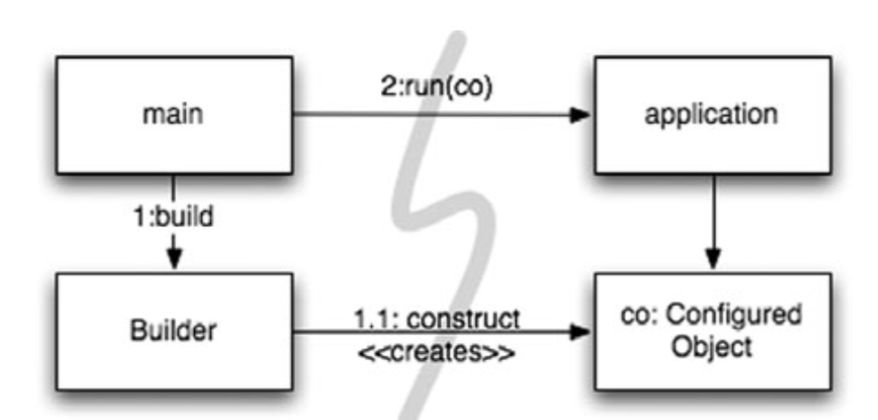
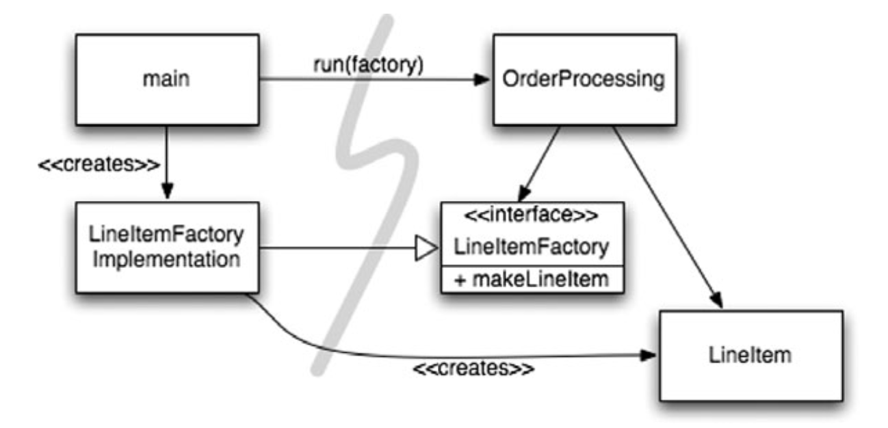
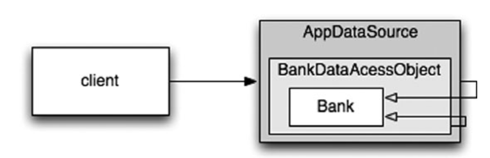

# Systems

> 복잡성은 죽음이다. 개발자에게서 생기를 앗아가며, 제품을 계획하고 제작하고 테스트하기 어렵게 만든다.

## 도시를 세운다면?

도시는 수도 관리 팀, 전력 관리 팀, 치안 관리 팀 등 각 분야를 관리하는 팀이 있기 때문에 도시는 잘 돌아간다. 도시에는 큰 그림을 그리는 사람들도 있으며 작은 사항에 집중하는 사람들도 있다.
도시가 돌아가는 또 다른 이유는 적절한 추상화와 모듈화 때문이다. 그러므로 큰 그림을 이해하지 못해도 개인과 개인이 관리하는 컴포넌트는 효율적으로 돌아간다.

소프트웨어 팀도 도시처럼 구성한다. 깨끗한 코드를 구현하면 낮은 추상화 수준에 관심사를 분리하기 쉬워진다. 

## 시스템 제작과 시스템 사용을 분리하라

제작(construction)은 사용(use)과 다르다는 사실을 명심해야 한다. 

> 소프트웨어 시스템은 (애플리케이션 객체를 제작하고 의존성을 서로 `연결`하는) 준비 과정과 (준비 과정 이후에 이어지는) 런타임 로직을 분리해야 한다.

관심사(concern) 분리는 우리 분야에서 가장 오래되고 가장 중요한 설계 기법 중 하나이다.

불행하게도 대부분의 애플리케이션은 시작 단계라는 관심사를 분리하지 않는다. 준비 과정 코드를 주먹구구식으로 구현할 뿐만 아니라 런타임 로직과 마구 뒤섞는다. 다음 예를 보자.

```java
public Service getService() { 
    if (service == null)
        service = new MyServiceImpl(...); // Good enough default for most cases?
    return service;
}
```

이것이 초기화 지연(Lazy Initialization) 혹은 계산 지연(Lazy Evaluation)이라는 기법이다. 실제 필요할 때까지 객체를 생성하지 않으므로 불필요한 부하가 걸리지 않으며,
어떤 경우에도 `null` 포인터를 반환하지 않는다는 장점이 있다.

하지만 `getService` 메서드가 `MyServiceImpl` 생상자 인수에 명시적으로 의존한다. 런타임 로직에서 `MyServiceImpl` 객체를 사용하지 않더라도 의존성을 해결하지 않으면 컴파일이 
되지 않는다.

테스트도 문제다. `MyServiceImpl`이 무거운 객체라면 단위 테스트에서 `getService` 메서드를 호출하기 전 적절한 테스트 전용 객체(`TEST DOUBLE`이나 `MOCK OBJECT`)를 `service` 필드에
할당해야 한다. 또한 런타임 로직에 객체 생성 로직을 섞어놓은 탓에 모든 실행 경로(`service`가 `null`인 경로와 `null`이 아닌 경로)도 테스트해야 한다. 책임이 둘이라는 말은 메서드가 작업을
두 가지 이상 수행한다는 의미이다. 즉, SRP를 위반한다.

초기화 지연 기법을 한 번 정도 사용한다면 심각한 문제는 아니지만, 많은 애플리케이션이 이러한 기법을 수시로 사용한다. 그래서 전반적인 설정 방식이 애플리케이션 곳곳에 흩어져 있다. 모듈성은 저조하며 대개
중복이 심하다.

체계적이고 탄탄한 시스템을 만들고 싶다면 좀스럽고 손쉬운 기법으로 모듈성을 깨서는 안 된다. 객체를 생성하거나 의존성을 연결할 때도 마찬가지다. 설정 논리는 일반 실행 논리와 분리해야 모듈성이 높아진다.

### Main 분리

시스템 생성과 시스템 사용을 분리하는 한 가지 방법으로, 생성과 관련한 코드는 모두 `main`이나 `main`이 호출하는 모듈로 옮기고, 나머지 시스템은 모든 객체가 생성되었고 모든 의존성이 연결되어 있다고 가정한다.

<div align="center">

</div>

제어 흐름은 `main` 함수에서 시스템에 필요한 객체를 생성한 후 이를 애플리케이션에 넘긴다. 애플리케이션은 그저 객체를 사용할 뿐이다.

모든 화살표가 `main` 쪽에서 애플리케이션 쪽으로 향한다. 즉, 애플리케이션은 `main`이나 객체가 생성되는 과정을 모른다. 단지 모든 객체가 적절히 생성되었다고 가정한다.

### 팩토리

때로는 객체가 생성되는 시점을 애플리케이션이 결정할 필요도 생긴다. 예를 들어, 주문처리 시스템에서 애플리케이션은 `LineItem` 인스턴스를 생성해 `Order`에 추가한다. 이 때는
ABSTRACT FACTORY 패턴을 사용한다. 그러면 `LineItem`을 생성하는 시점은 애플리케이션이 결정하지만 `LineItem`을 생성하는 코드는 애플리케이션이 모른다.

<div align="center">

</div>

여기서도 모든 의존성이 `main`에서 `OrderProcessing` 애플리케이션으로 향한다. `OrderProcessing` 애플리케이션은 `LineItem`이 생성되는 구체적인 방법을 모른다. 
그 방법은 `main` 쪽에 있는 `LineItemFactoryImplementation`이 안다. 그럼에도 `OrderProcessing` 애플리케이션은 `LineItem` 인스턴스가 생성되는 시점을
완벽하게 통제하며, 필요하다면 `OrderProcessing` 애플리케이션에서만 사용하는 생성자 인수를 넘길 수 있다.

### 의존성 주입

생성과 사용을 분리하는 강력한 메커니즘 하나는 의존성 주입(Dependency Injection)이다. 이는 제어 역전(IoC: Inversion of Control) 기법을 의존성 관리에 적용한 메커니즘이다. IoC는 한 
객체가 맡은 보조 책임을 새로운 객체에게 전적으로 떠넘긴다. 새로운 객체는 넘겨받은 책임만 맡으므로 SRP를 지키게 된다. 객체는 의존성 자체를 인스턴스로 만드는 책임을 지지 않고, 대신 이런 책임을
다른 `전담` 메커니즘에 넘겨야 한다. 그렇게 하여 제어를 역전한다. 초기 설정은 시스템 전체에서 필요하므로 대개 `책임질` 메커니즘으로 `main` 루틴이나 특수 컨테이너를 사용한다.

JNDI 검색은 의존성 주입을 부분적으로 구현한 기능이다. 객체는 디렉터리 서버에 이름을 제공하고 그 이름에 일치하는 서비스를 요청한다.

```java
MyService myService = (MyService)(jndiContext.lookup(“NameOfMyService”));
```

호출하는 객체는 실제로 반환되는 객체의 유형을 제어하지 않는다. 대신 호출하는 객체는 의존성을 능동적으로 해결한다.

진정한 의존성 주입은 여기서 한 걸음 더 나간다. 클래스가 의존성을 해결하려 시도하지 않는다. 클래스는 완전히 수동적이다. 대신 의존성을 주입하는 방법으로 `setter` 메서드 또는 `constructor` 인수를 
제공한다. DI 컨테이너는 (대개 요청이 들어올 때마다) 필요한 객체의 인스턴스를 만든 후 `setter`나 `constructor` 인수를 사용해 의존성을 설정한다. 실제 생성되는 객체 유형은 설정 파일에서 지정하거나
특수 생성 모듈에서 코드로 명시한다.

대부분의 DI 컨테이너는 필요할 때까지 객체를 생성하지 않고, 대부분은 계산 지연이나 비슷한 최적화에 쓸 수 있도록 팩토리를 호출하거나 프록시를 생성하는 방법을 제공한다. 즉, 계산 지연 기법이나 이와
유사한 최적화 기법에서 이런 메커니즘을 사용할 수 있다.

## 확장

`처음부터 올바르게` 시스템을 만들 수 있다는 믿음은 미신이다. 대신 오늘 주어진 사용자 스토리에 맞춰 시스템을 구현해야 한다. 내일은 새로운 스토리에 맞춰 시스템을 조정하고 확장하면 된다. 이것이 
반복적이고 점진적인 애자일 방식의 핵심이다. TDD, 리팩터링, 깨끗한 코드는 코드 수준에서 시스템을 조정하고 확장하기 쉽게 만든다.

> 소프트웨어 시스템은 물리적인 시스템과 다르다. 관심사를 적절히 분리해 관리한다면 소프트웨어 아키텍처는 점진적으로 발전할 수 있다.

관심사를 적절히 분리하지 못하는 아키텍처 예를 소개한다. EJB1과 EJB2 아키텍처는 관심사를 적절히 분리하지 못했기에 유기적인 성장이 어려웠다. 영속적으로 저장될 `Bank` 클래스에 필요한
엔티티 빈을 살펴보자. 엔티티 빈은 관계형 자료, 즉 테이블 행을 표현하는 객체로, 메모리에 상주한다.

먼저 클라이언트가 사용할 로컬 인터페이스(프로세스 내)나 원격 인터페이스(다른 JVM에 있는)를 정의해야 한다. 다음은 가능한 지역 인터페이스이다.

```java
package com.example.banking;

import java.util.Collections;
import javax.ejb.*;

public interface BankLocal extends java.ejb.EJBLocalObject {
    String getStreetAddr1() throws EJBException;
    String getStreetAddr2() throws EJBException;
    String getCity() throws EJBException;
    String getState() throws EJBException;
    String getZipCode() throws EJBException;
    void setStreetAddr1(String street1) throws EJBException;
    void setStreetAddr2(String street2) throws EJBException;
    void setCity(String city) throws EJBException;
    void setState(String state) throws EJBException;
    void setZipCode(String zip) throws EJBException;
    Collection getAccounts() throws EJBException;
    void setAccounts(Collection accounts) throws EJBException; 
    void addAccount(AccountDTO accountDTO) throws EJBException;
}
```

위에서 열거하는 속성은 `Bank` 주소, 은행이 소유하는 계좌다. 각 계좌 정보는 `Account` EJB로 처리한다. 다음은 위 인터페이스를 구현한 `Bank` 빈 구현 클래스다.

```java
package com.example.banking;

import java.util.Collections;
import javax.ejb.*;

public abstract class Bank implements javax.ejb.EntityBean { 
    // Business logic...
    public abstract String getStreetAddr1();
    public abstract String getStreetAddr2();
    public abstract String getCity();
    public abstract String getState();
    public abstract String getZipCode();
    public abstract void setStreetAddr1(String street1);
    public abstract void setStreetAddr2(String street2);
    public abstract void setCity(String city);
    public abstract void setState(String state);
    public abstract void setZipCode(String zip);
    public abstract Collection getAccounts();
    public abstract void setAccounts(Collection accounts);
    public void addAccount(AccountDTO accountDTO) {
        InitialContext context = new InitialContext();
        AccountHomeLocal accountHome = context.lookup("AccountHomeLocal");
        AccountLocal account = accountHome.create(accountDTO);
        Collection accounts = getAccounts();
        accounts.add(account);
    }
    // EJB container logic
    public abstract void setId(Integer id);
    public abstract Integer getId();
    public Integer ejbCreate(Integer id) { ... }
    public void ejbPostCreate(Integer id) { ... }
    // The rest had to be implemented but were usually empty: 
    public void setEntityContext(EntityContext ctx) {}
    public void unsetEntityContext() {}
    public void ejbActivate() {}
    public void ejbPassivate() {}
    public void ejbLoad() {}
    public void ejbStore() {}
    public void ejbRemove() {}
}
```

객체를 생성하는 팩토리인 `LocalHome` 인터페이스는 생략했다. 기타 `Bank` 탐색(질의) 메서드도 생략했다.

마지막으로 영구 저장소에서 객체와 관계형 데이터가 매핑되는 방식, 원하는 트랜잭션 동작 방식, 보안 제약조건 등이 들어가는 XML deployment descriptors를 작성해야 한다.

비즈니스 로직은 EJB2 애플리케이션 `컨테이너`에 강하게 결합된다. 클래스를 생성할 때는 컨테이너에서 파생해야 하며 컨테이너가 요구하는 다양한 생명주기 메서드도 제공해야 한다.

이렇듯 비즈니스 논리가 덩치 큰 컨테이너와 밀접하게 결합된 탓에 독자적인 단위 테스트가 어렵다. 따라서 EJB2 코드는 프레임워크 밖에서 재사용하기란 사실상 불가능하다.

결국 객체 지향 프로그래밍이라는 개념조차 뿌리가 흔들린다. 빈은 다른 빈을 상속받지 못한다. 새로운 계정을 추가하기 위한 논리에 주목하자. 일반적으로 EJB2 빈은 DTO를 정의한다. DTO에는 메서드가 없으며
사실상 구조체다. 즉, 동일한 정보를 저장하는 자료 유형이 두 개라는 의미다. 그래서 한 객체에서 다른 객체로 자료를 복사하는 반복적인 코드가 필요하다.

### 횡단(cross-cutting) 관심사

EJB2 아키텍처는 일부 영역에서 관심사를 거의 완벽하게 분리한다. 예를 들어, 원하는 트랜잭션, 보안 일부 영속적인 동작은 소스 코드가 아니라 deployment descriptors에서 정의한다.

영속성과 같은 관심사는 애플리케이션의 자연스러운 객체 경계를 넘나드는 경향이 있다. 모든 객체가 전반적으로 동일한 방식을 이용하게 만들어야 한다. 예를 들어, 특정 DBMS나 독자적인 파일을 사용하고,
테이블과 열은 같은 명명 관례를 따르며, 트랜잭션 의미가 일관적이면 더욱 바람직하다.

현실적으로 영속성 방식을 구현한 코드가 온갖 객체로 흩어진다. 여기서 횡단 관심사라는 용어가 나온다. 영속성 프레임워크 또한 모듈화할 수 있다. 도메인 논리도 (독자적으로) 모듈화할 수 있다. 문제는 이 
두 영역이 세밀한 단위로 겹친다는 점이다.

사실 EJB 아키텍처가 영속성, 보안, 트랜잭션을 처리하는 방식은 AOP(Aspect-Oriented Programming)을 예견했다고 보인다. AOP는 횡단 관심사에 대처해 모듈성을 확보하는 일반적인 방법론이다.
AOP에서 관점(Aspect)이라는 모듈 구성 개념은 `특정 관심사를 지원하려면 시스템에서 특정 지점들이 동작하는 방식을 일관성 있게 바꿔야 한다`라고 명시한다. 명시는 간결한 선언이나 프로그래밍
메커니즘으로 수행한다.

영속성을 예로 들면, 프로그래머는 영속적으로 저장할 객체와 속성을 선언한 후 영속성 책임을 영속성 프레임워크에 위임한다. 그러면 AOP 프레임워크는 대상 코드에 영향을 미치지 않는 상태로 동작 방식을
변경한다. 자바에서 사용하는 관점 혹은 관점과 유사한 메커니즘 세 개를 살펴보자.

## 자바 프록시

자바 프록시는 단순한 상황에 적합하다. 개별 객체나 클래스에서 메서드 호출을 감싸는 경우가 좋은 예다. 하지만 JDK에서 제공하는 동적 프록시는 인터페이스만 지원한다. 클래스 프록시를 사용하려면 GGLIB, ASM,
Javassist 등과 같은 바이트 코드 처리 라이브러리가 필요하다. 

다음은 `Bank` 애플리케이션에서 JDK 프록시를 사용해 영속성을 지원하는 예제이다. 계좌 목록을 가져오고 설정하는 메서드만 소개한다.

```java
// Bank.java (suppressing package names...) 
import java.utils.*;
// The abstraction of a bank. 
public interface Bank {
    Collection<Account> getAccounts();
    void setAccounts(Collection<Account> accounts);
}

// BankImpl.java 
import java.utils.*;

// The “Plain Old Java Object” (POJO) implementing the abstraction. 
public class BankImpl implements Bank {
    private List<Account> accounts;
    public Collection<Account> getAccounts() {
        return accounts;
    }
    public void setAccounts(Collection<Account> accounts) {
        this.accounts = new ArrayList<Account>();
        for (Account account : accounts) {
            this.accounts.add(account);
        }
    }
}

// BankProxyHandler.java 
import java.lang.reflect.*;
import java.util.*;

// “InvocationHandler” required by the proxy API.
public class BankProxyHandler implements InvocationHandler {
    private Bank bank;

    public BankHandler(Bank bank) {
        this.bank = bank;
    }

    // Method defined in InvocationHandler
    public Object invoke(Object proxy, Method method, Object[] args)
            throws Throwable {
        String methodName = method.getName();
        if (methodName.equals("getAccounts")) {
            bank.setAccounts(getAccountsFromDatabase());
            return bank.getAccounts();
        } else if (methodName.equals("setAccounts")) {
            bank.setAccounts((Collection<Account>) args[0]);
            setAccountsToDatabase(bank.getAccounts());
            return null;
        } else {
            // ...
        }
    }

    // Lots of details here:
    protected Collection<Account> getAccountsFromDatabase() { ... }
    protected void setAccountsToDatabase(Collection<Account> accounts) { ... }
}

// Somewhere else...
Bank bank = (Bank) Proxy.newProxyInstance(
        Bank.class.getClassLoader(),
        new Class[] { Bank.class },
        new BankProxyHandler(new BankImpl()));
```

위에서는 프록시로 감쌀 인터페이스 `Bank`와 비즈니스 논리를 구현하는 POJO `BankImpl`을 정의했다.

프록시 API에 `InvocationHandler`를 넘겨 줘야 한다. 넘긴 `InvocationHandler`는 프록시에 호출되는 `Bank` 메서드를 구현하는 데 사용된다. `BankProxyHandler`는 자바 리플렉션 API를 사용해
제네릭스 메서드를 상응하는 `BankImpl` 메서드로 매핑한다.

단순한 예제지만 코드가 많으며 복잡하다. 바이트 조작 라이브러리를 사용하더라도 만만찮게 어렵다. 코드 양과 크기는 프록시의 두 가지 단점이다. 다시 말해, 프록시를 사용하면 깨끗한 코드를 작성하기 어렵다. 또한 
프록시는 (진정한 AOP 해법에 필요한) 시스템 단위로 실행 `지점`을 명시하는 메커니즘도 제공하지 않는다.

## 순수 자바 AOP 프레임워크

다행스럽게도 대부분의 프록시 코드는 판박이라 도구로 자동화할 수 있다. 순수 자바 관점을 구현하는 스프링 AOP, JBoss AOP 등과 같은 여러 자바 프레임워크는 내부적으로 프록시를 사용한다. 스프링은 비즈니스 로직을
POJO로 구현한다. POJO는 순수하게 도메인에 초점을 맞춘다. POJO는 엔터프라이즈 프레임워크에 의존하지 않는다. 따라서 테스트가 쉽고 간단하다. 상대적으로 단순하기 때문에 사용자 스토리를 올바로 구현하기 쉬우며
미래 스토리에 맞춰 코드를 보수하고 개선하기 편하다.

프로그래머는 설정 파일이나 API를 사용해 필수적인 애플리케이션 기반 구조를 구현한다. 여기에는 영속성, 트랜잭션, 보안, 캐시, 장애조치 등과 같은 횡단 관심사도 포함된다. 많은 경우 실제로는 스프링이나 JBoss 
라이브러리의 관점을 명시한다. 이때 프레임워크는 사용자가 모르게 프록시나 바이트코드 라이브러리를 사용해 이를 구현한다. 이런 선언들이 요청에 따라 주요 객체를 생성하고 서로 연결하는 등 DI 컨테이너의 구체적인
동작을 제어한다.

다음은 스프링 V2.5 설정 파일 `app.xml` 일부로, 아주 전형적인 모습이다.

```xml
<beans> 
    ...
    <bean id="appDataSource" 
          class="org.apache.commons.dbcp.BasicDataSource"
          destroy-method="close" 
          p:driverClassName="com.mysql.jdbc.Driver" 
          p:url="jdbc:mysql://localhost:3306/mydb"
          p:username="me"/>
    
    <bean id="bankDataAccessObject" 
          class="com.example.banking.persistence.BankDataAccessObject" 
          p:dataSource-ref="appDataSource"/>
    
    <bean id="bank"
      class="com.example.banking.model.Bank" 
      p:dataAccessObject-ref="bankDataAccessObject"/>
    ... 
</beans>
```

각 빈은 중첩된 `러시아 인형`의 일부분과 같다. `Bank` 도메인 객체는 데이터 접근자 객체(DAO: Data Accessor Object)로 프록시되었으며, DAO 객체는 JDBC 드라이버 데이터 소스로 프록시되었다.

<div align="center">

</div>

클라이언트는 `Bank` 객체에서 `getAccounts()`를 호출한다고 믿지만 실제로는 `Bank` POJO의 기본 동작을 확인한 중첩 DECORATOR 객체 집합의 가장 외곽과 통신한다. 필요하다면 트랜잭션, 캐싱 등에도
DECORATOR를 추가할 수 있다.

애플리케이션에서 DI 컨테이너에게 (XML 파일에 명시된) 시스템 내 최상위 객체를 요청하려면 다음 코드가 필요하다.

```java
XmlBeanFactory bf = 
        new XmlBeanFactory(new ClassPathResource("app.xml", getClass()));
Bank bank = (Bank) bf.getBean("bank");
```

스프링 관련 자바 코드가 거의 필요 없으므로 애플리케이션은 사실상 스프링과 독립적이다. 즉, EJB2 시스템이 지녔던 강한 결합(tight-coupling)이라는 문제가 모두 사라진다.

XML은 장황하고 읽기 어렵다는 문제가 있음에도, 이런 설정 파일에 명시된 `정책`이 겉으로 보이지 않지만 자동으로 생성되는 프록시나 관점 논리보다는 단순하다. 이러한 아키텍처가 너무 매력적이라
스프링 프레임워크는 EJB 버전 3을 완전히 뜯어고치는 계기를 제공했다. EJB3는 XML 설정 파일과 자바 5 어노테이션 기능을 사용해 횡단 관심사를 선언적으로 지원하는 스프링 모델을 따른다.

다음은 EJB3로 `Bank` 객체를 다시 작성한 코드다.

```java
package com.example.banking.model;

import javax.persistence.*;
import java.util.ArrayList;
import java.util.Collection;

@Entity
@Table(name = "BANKS")
public class Bank implements java.io.Serializable {
    @Id
    @GeneratedValue(strategy = GenerationType.AUTO)
    private int id;
    @Embeddable // An object “inlined” in Bank’s DB row 
    public class Address {
        protected String streetAddr1;
        protected String streetAddr2;
        protected String city;
        protected String state;
        protected String zipCode;
    }
    
    @Embedded
    private Address address;
    
    @OneToMany(cascade = CascadeType.ALL, fetch = FetchType.EAGER, mappedBy = "bank")
    private Collection<Account> accounts = new ArrayList<Account>();

    public int getId() {
        return id;
    }

    public void setId(int id) {
        this.id = id;
    }

    public void addAccount(Account account) {
        account.setBank(this);
        accounts.add(account);
    }

    public Collection<Account> getAccounts() {
        return accounts;
    }

    public void setAccounts(Collection<Account> accounts) {
        this.accounts = accounts;
    }
}
```

EJB2 코드보다 위 코드가 더 깨끗하다. 일부 상세한 엔티티 정보는 어노테이션에 포함되어 있어 그대로 남아있지만, 모든 정보가 어노테이션 속에 있으므로 코드 자체는 깔끔하고 깨끗하다. 즉, 그만큼 코드를 테스트하고
개선하고 보수하기 쉬워졌다. 

어노테이션에 들어있는 영속성 정보는 일부든 전부든, 필요하다면 XML deployment descriptor로 옮겨도 괜찮다. 그러면 진짜 순수한 POJO만 남는다. 영속성 매핑 정보가 자주 바뀌지 않는다면 많은 팀이 그냥 
어노테이션을 그대로 유지하는 편을 택할지도 모른다. 그래도 EJB2에 비해 해로운 문제가 발생할 가능성이 훨씬 적다.

## AspectJ 관점

마지막으로, 관심사를 관점으로 분리하는 가장 강력한 도구는 AspectJ 언어다. AspectJ는 언어 차원에서 관점을 모듈화 구성으로 지원하는 자바 언어 확장이다. 스프링 AOP와 JBoss AOP가 제공하는 순수 자바 
방식은 관점이 필요한 상황 중 80-90%에 충분하다. AspectJ는 관점을 분리하는 강력하고 풍부한 도구 집합을 제공하긴 하지만, 새 도구를 사용하고 새 언어 문법과 사용법을 익혀야 한다는 단점이 있다.

최근에 나온 AspectJ "어노테이션 폼"은 새로운 도구와 새로운 언어라는 부담을 어느정도 완화한다. "어노테이션 폼"은 순수한 자바 코드에 자바 5 어노테이션을 사용해 관점을 정의한다. 또한 스프링 프레임워크는
AspectJ에 미숙한 팀들이 어노테이션 기반 관점을 쉽게 사용하도록 다양한 기능을 제공한다.

## 테스트 주도 시스템 아키텍처 구축

관점으로 (혹은 유사한 개념으로) 관심사를 분리하는 방식은 그 위력이 막강하다. 애플리케이션 도메인 로직을 POJO로 작성할 수 있다면, 즉 코드 수준에서 아키텍처 관심사를 분리할 수 있다면, 진정한 테스트 주도 
아키텍처 구축이 가능하다. 그때그때 새로운 기술을 채택해 단순한 아키텍처를 복잡한 아키텍처로 키워갈 수도 있다. BDUF(Big Design Up Front)를 추구할 필요가 없다. 실제로 BDUF는 해롭기까지 하다.

아주 단순하면서도 멋지게 분리된 아키텍처로 소프트웨어 프로젝트를 진행해 결과물을 재빨리 출시한 후, 기반 구조를 추가하며 조금씩 확장해 나가도 괜찮다. 세계 최대 웹 사이트들은 고도의 자료 캐싱, 보안, 가상화 
등을 이용해 아주 높은 가용성과 성능을 효율적이고 유연하게 달성했다. 설계가 최대한 분리되어 각 추상화 수준과 범위에서 코드가 적당히 단순하기 때문이다.

그렇다고 아무 방향 없이 프로젝트에 뛰어들어도 좋다는 의미는 아니다. 프로젝트를 시작할 때는 일반적인 범위, 목표, 일정은 물론이고 결과로 내놓을 시스템의 일반적인 구조도 생각해야 한다. 하지만 변하는
환경에 대처해 진로를 변경할 능력도 반드시 유지해야 한다.

> 최선의 시스템 구조는 각기 POJO (또는 다른) 객체로 구현되는 모듈화된 관심사 영역(도메인)으로 구성된다. 이렇게 서로 다른 영역은 해당 영역 코드에 최소한의 영향을 미치는 관점이나 유사한 도구를 사용해 통합한다.
> 이런 구조 역시 코드와 마찬가지로 테스트 주도 기법을 적용할 수 있다.

## 의사 결정을 최적화하라

모듈을 나누고 관심사를 분리하면 지엽적인 관리와 결정이 가능해진다. 가장 적합한 사람에게 책임을 맡기는 것이 좋다. 우리는 때때로 가능한 마지막 순간까지 결정을 미루는 방법이 최선이라는 사실을 까먹곤 한다. 
최대한 정보를 모아 최선의 결정을 내리기 위해서다. 

> 관심사를 모듈로 분리한 POJO 시스템은 기민함을 제공한다. 이런 기민함 덕분에 최신 정보에 기반해 최선의 시점에 최적의 결정을 내리기가 쉬워진다. 또한 결정의 복잡성도 줄어든다.

## 명백한 가치가 있을 때 표준을 현명하게 사용하라

EJB2는 단지 표준이라는 이름만으로 많은 팀이 사용했다. 가볍고 간단한 설계로 충분했을 프로젝트에서도 EJB2를 채택했다. 업계에서 여러 형태로 아주 과장되게 포장된 표준에 집착하는 바람에 고객 가치가
뒤로 밀려나는 사례가 많다.

> 표준을 사용하면 아이디어와 컴포넌트를 재사용하기 쉽고, 적절한 경험을 가진 사람을 구하기 쉬우며, 좋은 아이디어를 캡슐화하기 쉽고, 컴포넌트를 엮기 쉽다. 하지만 때로는 표준을 만드는 시간이 너무 오래 걸려
> 업계가 기다리지 못한다. 어떤 표준은 원래 표준을 제정한 목적을 잊어버리기도 한다.

## 시스템은 도메인 특화 언어가 필요하다

DSL은 간단한 스크립트 언어나 표준 언어로 구사한 API를 가리킨다. DSL로 짠 코드는 도메인 전문가가 작성한 구조적인 산문처럼 읽힌다. 

좋은 DSL은 도메인 개념과 그 개념을 구현한 코드 사이 존재하는 `의사소통 간극`을 줄여준다. 애자일 기법이 팀과 프로젝트 이해관계자 사이 의사소통 간극을 줄여주듯이 말이다. 도메인 전문가가 사용하는 언어로
도메인 로직을 구현하면 도메인을 잘못 구현할 가능성이 줄어든다.

효과적으로 사용한다면 DSL은 추상화 수준을 코드 관용구나 디자인 패턴 이상으로 끌어올린다. 그래서 개발자가 적절한 추상화 수준에서 코드 의도를 표현할 수 있다.

> DSL을 사용하면 고차원 정책에서 저차원 세부사항에 이르기까지 모든 추상화 수준과 모든 도메인을 POJO로 표현할 수 있다.

## 결론

깨끗하지 못한 아키텍처는 도메인 로직을 흐리며 기민성을 떨어뜨린다. 도메인 로직이 흐려지면 제품 품질이 떨어진다. 버그가 숨어들기 쉬워지고, 스토리를 구현하기 어려워지는 탓이다. 기민성이 떨어지면
생산성이 낮아져 TDD가 제공하는 장점이 사라진다. 

모든 추상화 단계에서 의도는 명확히 표현해야 한다. 그러려면 POJO를 작성하고 관점 혹은 관점과 유사한 메커니즘을 사용해 각 구현 관심사를 분리해야 한다.

시스템을 설계하든 개별 모듈을 설계하든, 실제로 돌아가는 가장 단순한 수단을 사용해야 한다는 사실을 명심하라.