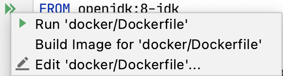

# Docker

이 섹션에서 로컬 또는 선택한 클라우드 제공업체에서 실행할 수 있는 도커 컨테이너에 Ktor 애플리케이션을 배포하는 방법을 알아본다.

도커는 Linux, macOS 및 Windows와 같이 도커를 지원하는 모든 플랫폼에서 실행할 수 있는 형식으로 패키징할 수 있는 컨테이너 시스템이다. 개념적으로 도커는 여러 서비스를 제공하는 계층이 있는 OS이다.

## Clone a sample application

이 튜토리얼에선 [ktor-get-started-sample](https://github.com/ktorio/ktor-get-started-sample)을 사용할 것이다.

## **Getting the application ready**

도커에서 실행하기 위해 애플리케이션에 필요한 모든 파일이 컨테이너에 배포되어 있어야 한다. 첫 번째로 애플리케이션과 디펜던시를 포함하는 zip 파일이 필요하다. 빌드 시스템에 따라 이를 수행하는 다양한 방법들이
있다.

아래의 예제에서 Gradle과 application 플러그인을 사용한다. Maven을 사용하면 어셈블리 기능을 사용해 동일하게 수행할 수 있다.

## Prepare Docker image

앱을 dockerize 하기 위해 [multi-stage builds](https://docs.docker.com/develop/develop-images/multistage-build/)를 사용한다.

* 우선 `gradle`/`maven` 이미지를 사용해 앱 배포를 생성한다.
* 그리고 배포는 `openjdk` 이미지 기반으로 생성된 환경에서 실행된다.

프로젝트의 루트 폴더에 `Dockerfile`을 생성한다.

### Gradle
```
FROM gradle:7-jdk11 AS build
COPY --chown=gradle:gradle . /home/gradle/src
WORKDIR /home/gradle/src
RUN gradle shadowJar --no-daemon

FROM openjdk:11
EXPOSE 8080:8080
RUN mkdir /app
COPY --from=build /home/gradle/src/build/libs/*.jar /app/ktor-docker-sample.jar
ENTRYPOINT ["java","-jar","/app/ktor-docker-sample.jar"]
```

### Maven

```
FROM maven:3-openjdk-11 AS build
COPY . /home/maven/src
WORKDIR /home/maven/src
RUN mvn package

FROM openjdk:11
EXPOSE 8080:8080
RUN mkdir /app
COPY --from=build /home/maven/src/target/*-with-dependencies.jar /app/ktor-docker-sample.jar
ENTRYPOINT ["java","-jar","/app/ktor-docker-sample.jar"]
```

빌드의 두 번째 단계는 다음과 같은 방식으로 동작한다.

* 사용할 이미지를 나타낸다. (`openjdk`)
* 노출되는 포트를 지정한다. (컨테이너를 실행할 때 수행되는 포트를 자동으로 노출하지 않음)
* 빌드 출력의 컨텐츠를 폴더로 복사한다.
* 앱을 실행한다. (`ENTRYPOINT`)

## Build and run the Docker image

다음 단계는 Docker 이미지를 빌드하고 태그를 지정하는 것이다.

```shell
docker build -t my-application .
```

마지막으로 이미지를 시작한다.

```shell
docker run -p 8080:8080 my-application
```

IntelliJ IDEA를 사용하면 `Dockerfile` 내 `Run`을 클릭하여 이 단계를 수행할 수 있다.

<div align="center">

</div>

## References

* [Docker | Ktor](https://ktor.io/docs/docker.html)