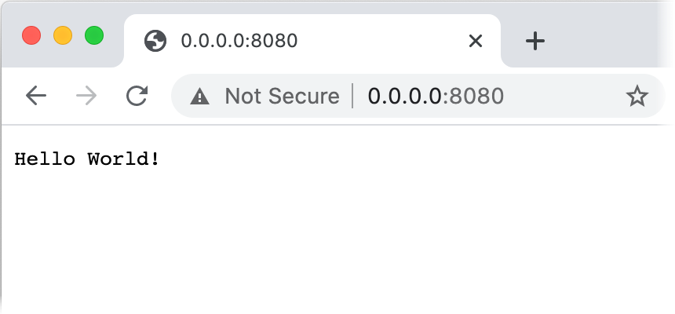

# Gradle Application plugin

Gradle Application 플러그인은 디펜던시와 생성된 시작 스크립트를 포함한 애플리케이션을 패키징하는 기능을 제공한다.

## **Apply the Application plugin and configure the main class**

애플리케이션을 패키징하려면 우선 Application 플러그인을 적용해야 한다.

1. 프로젝트의 `build.gralde(.kts)` 파일을 연다.
2. `build.gradle` 파일에 다음 코드가 포함되어 있는지 확인한다.

```kotlin
plugins {
    application
}

application {
    mainClass.set("io.ktor.server.netty.EngineMain")
}
```

- Application 플러그인은 `plugins` 블록 내 적용되어 있다.
- `mainClass` 속성은 애플리케이션의 메인 클래스를 구성하는데 사용한다. 앱의 main 클래스는 서버를 생성하는 방법에 달려있다.

## **Package the application**

Application 플러그인은 패키징을 위한 다양한 방법을 제공한다. 예를 들어, `installDist` task는 모든 런타임 디펜던시와 시작 스크립트를 사용해 애플리케이션을 설치한다. 전체 배포 아카이브를
생성하려면, `distZip`와 `distTar` task를 사용하면 된다.

`installDist`를 사용해보자.

1. 터미널을 연다.
2. `installDist` task를 실행한다.

```shell
./gradlew :engine-main:installDist
```

Gradle은 `build/install/engine-main` 폴더에 애플리케이션 이미지를 생성한다.

## **Run the application**

패키징된 애플리케이션을 실행하려면

1. 터미널에서 `build/install/engine-main/bin` 폴더로 이동한다.
2. OS에 따라 `ktor-gradle-sample` 또는 `ktor-gradle-sample.bat`을 실행한다.

```shell
./engine-main
```

3. 다음 메시지가 보여질 때까지 대기한다.

```
[main] INFO  Application - Responding at http://0.0.0.0:8080
```

브라우저를 통해 애플리케이션을 열어 동작하는 앱을 확인할 수 있다.

<div align="center">

</div>

## References

* [Gradle Application plugin | Ktor](https://ktor.io/docs/gradle-application-plugin.html#run)