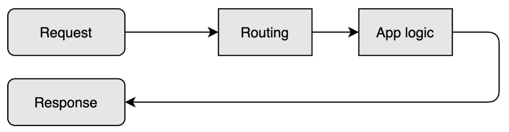
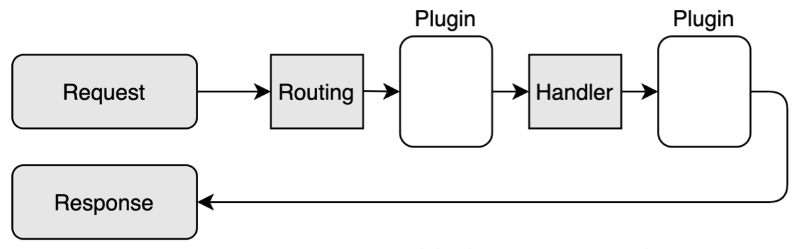
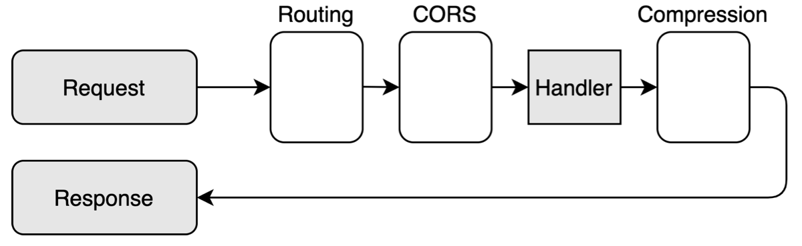

# Plugins

Ktor의 일반적인 요청/응답 파이프라인은 다음과 같다.

<div align="center">

</div>

요청으로 시작해서, 특정 핸들러로 라우트되고, 애플리케이션 로직에 의해 처리되고, 최종적으로 응답된다.

## **Adding functionality with Plugins**

많은 애플리케이션은 애플리케이션의 로직의 범위를 벗어나는 공통 기능이 필요하다. serialization, content encoding, compression, headers, cookie 등. 이 모든 것은
플러그인이라 부르는 것을 통해 Ktor에서 제공된다.

플러그인은 요청/응답과 애플리케이션 로직 사이에 존재한다.

<div align="center">

</div>

요청이 들어오면

- 라우팅 메커니즘으로 일치하는 핸들러로 라우팅된다.
- 핸들러에게 전달되기 전 하나 이상의 플러그인을 거친다.
- 핸들러(애플리케이션 로직)가 요청을 처리한다.
- 클라이언트에 응답하기 전, 하나 이상의 플러그인을 거친다.

## **Routing is a Plugin**

플러그인은 최대의 유연성을 제공하고 요청/응답 파이프라인의 모든 세그먼트에 존재할 수 있도록 디자인되었다. 사실 지금가지 `routing`이라 부르는 것은 플러그인에 불과하다.

<div align="center">

</div>

## Add Plugin dependency

대부분의 플러그인은 디펜던시를 필요로 한다. 예를 들어, `CORS` 플러그인은 `ktor-server-cors` 아티팩트가 필요하다.

```kotlin
implementation("io.ktor:ktor-server-cors:$ktor_version")
```

대안으로 모든 Ktor 서버 플러그인을 포함하는 `ktor-server` 아티팩트를 사용할 수 있다.

```kotlin
implementation("io.ktor:ktor-server:$ktor_version")
```

## **Installing Plugins**

플러그인은 일반적으로 서버 초기화 시 플러그인을 파라미터로 전달하는 `install` 함수를 통해 설정된다. 서버의 생성 방법에 따라 `embeddedServer` 블럭에 플러그인을 설치할 수 있다.

```kotlin
fun main() {
    embeddedServer(Netty, port = 8080) {
        install(CORS)
        install(Compression)
        // ...
    }.start(wait = true)
}
```

또는 특정 모듈에도 설치할 수 있다.

```kotlin
fun Application.module() {
    install(CORS)
    install(Compression)
    // ...
}
```

추가적으로 요청과 응답을 인터셉트하는 것 외에도, 플러그인에는 이 단계에서 구성되는 옵션 구성 섹션이 있을 수 있다.

예를 들어, [Cookies](https://ktor.io/docs/cookie-header.html)를 설치할 때 쿠키를 저장할 위치 또는 이름과 같은 특정 파라미터를 설정할 수 있다.

```kotlin
install(Sessions) {
    cookie<MyCookie>("MY_COOKIE")
}
```

### Install Plugins for specific routes

Ktor에서 지정된 route 에만 플러그인을 설치할 수 있다. 이는 다른 앱 리소스에 대해 다른 플러그인 구성이 필요한 경우 유용할 수 있다. 예를 들어, 다음 예제는 `/index`와 `/profile`
route에 [caching headers](https://ktor.io/docs/caching.html) 구성을 추가하는 방법을 보여준다.

```kotlin
routing {
    route("/index") {
        install(CachingHeaders) {
            options { call, content -> CachingOptions(CacheControl.MaxAge(maxAgeSeconds = 3600)) }
        }
    }
    route("/profile") {
        install(CachingHeaders) {
            options { call, content -> CachingOptions(CacheControl.NoStore(visibility = CacheControl.Visibility.Private)) }
        }
    }
}
```

다음 규칙은 동일한 플러그인의 여러 설치에 적용된다.

* 특정 route에 설치된 플러그인 구성은 전역 구성을 오버라이드한다.
* Routing은 동일한 route에 대한 설치를 병합하고, 마지막 설치를 우선한다. 예를 들어 다음 앱의 경우

```kotlin
routing {
    route("index") {
        install(CachingHeaders) { // First configuration }
            get("a") {
                // ...
            }
        }
        route("index") {
            install(CachingHeaders) { // Second configuration }
                get("b") {
                    // ...
                }
            }
        }
    }
}
```

`/index/a`, `/index/b` 대한 두 호출은 플러그인의 두 번째 설치에서만 처리된다.


## **Default, available, and custom Plugins**

기본적으로 Ktor는 플러그인을 활성화하지 않으므로 애플리케이션이 필요한 기능은 개발자에게 달려있다.

Ktor는 기본적으로 제공되는 다양한 플러그인을 제공한다. [Project Generator Site](https://start.ktor.io/)
또는 [IntelliJ IDEA Wizard](https://ktor.io/docs/intellij-idea.html)에서 전체 목록을 볼 수 있다. 추가로 자체적인 커스텀 플러그인을 작성할 수 있다.

## References

* [Plugins | Ktor](https://ktor.io/docs/plugins.html)