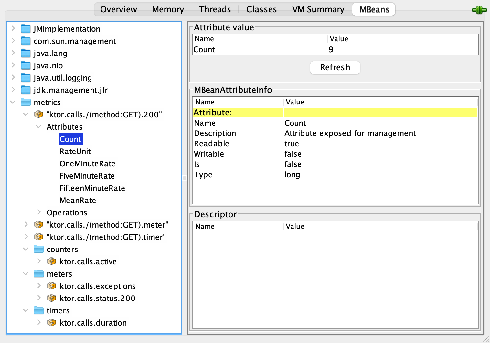

# Dropwizard metrics

[DropwizardMetrics](https://api.ktor.io/ktor-server/ktor-server-plugins/ktor-server-metrics/io.ktor.server.metrics.dropwizard/-dropwizard-metrics.html?_ga=2.167637118.1396641199.1655526702-658241611.1655526702&_gl=1*d9q23z*_ga*NjU4MjQxNjExLjE2NTU1MjY3MDI.*_ga_9J976DJZ68*MTY1NTU0MTcyMi40LjEuMTY1NTU0NDY0Ni4w)
플러그인을 사용하면 서버 및 수신 요청에 대한 유용한 정보를 얻도록 [Metrics](http://metrics.dropwizard.io/4.0.0/)를 구성할 수 있다.

## **Add dependencies**

`DropwizardMetrics`를 활성화하기 위해 다음 아티팩트를 추가한다.

* `ktor-server-metrics` 디펜던시 추가한다.

```kotlin
implementation("io.ktor:ktor-server-metrics:$ktor_version")
```

* 선택적으로 지정된 리포터를 위해 필요한 디펜던시 추가한다. 다음 예제는 JMX를 통해 매트릭스를 보고하는데 필요한 아티팩트를 추가하는 방법이다.

```kotlin
implementation("io.dropwizard.metrics:metrics-jmx:$dropwizard_version")
```

`dropwizard_version`를 `metrics-jmx` 아티팩트의 필수 버전으로 변경할 수 있다.

## Install DropwizardMetrics

`DropwizardMetrics` 플러그인 설치를 위해 이를 `install` 함수에 전달한다. 서버 생성에 따라 2가지 방법으로 나뉜다.

```kotlin
import io.ktor.server.application.*
import io.ktor.server.metrics.dropwizard.*

// ...
fun main() {
    embeddedServer(Netty, port = 8080) {
        install(DropwizardMetrics)
        // ...
    }.start(wait = true)
}
```

```kotlin
import io.ktor.server.application.*
import io.ktor.server.metrics.dropwizard.*

// ...
fun Application.module() {
    install(DropwizardMetrics)
    // ...
}
```

## Configure DropwizardMetrics

`DropwizardMetrics`는 `registry` 속성을 사용해 지원되는 모든 [Metric reporter](http://metrics.dropwizard.io/)를 사용할 수 있다. SLF4J와 JMX
리포터를 어떻게 구성하는지 알아보자.

### SLF4J reporter

SLF4J 리포터를 사용하면 SLF4J에서 지원하는 모든 output 리포트를 주기적으로 내보낼 수 있다. 예를 들어, 10초마다 매트릭스를 출력하려면 다음을 수행한다.

```kotlin
install(DropwizardMetrics) {
    Slf4jReporter.forRegistry(registry)
        .outputTo(this@module.log)
        .convertRatesTo(TimeUnit.SECONDS)
        .convertDurationsTo(TimeUnit.MILLISECONDS)
        .build()
        .start(10, TimeUnit.SECONDS)
}
```

만약 애플리케이션을 실행하고 `http://0.0.0.0:8080`을 열면, 출력 결과는 다음과 같다.

```
[DefaultDispatcher-worker-1] INFO  Application - Responding at http://0.0.0.0:8080
... type=COUNTER, name=ktor.calls.active, count=0
... type=METER, name=ktor.calls./(method:GET).200, count=6, m1_rate=1.2, m5_rate=1.2, m15_rate=1.2, mean_rate=0.98655785084844, rate_unit=events/second
... type=METER, name=ktor.calls./(method:GET).meter, count=6, m1_rate=1.2, m5_rate=1.2, m15_rate=1.2, mean_rate=0.9841134429134598, rate_unit=events/second
... type=METER, name=ktor.calls.exceptions, count=0, m1_rate=0.0, m5_rate=0.0, m15_rate=0.0, mean_rate=0.0, rate_unit=events/second
... type=METER, name=ktor.calls.status.200, count=6, m1_rate=1.2, m5_rate=1.2, m15_rate=1.2, mean_rate=0.9866015088545449, rate_unit=events/second
... type=TIMER, name=ktor.calls./(method:GET).timer, count=6, min=0.359683, max=14.213046, mean=2.691307542732234, stddev=5.099546889849414, p50=0.400967, p75=0.618972, p95=14.213046, p98=14.213046, p99=14.213046, p999=14.213046, m1_rate=1.2, m5_rate=1.2, m15_rate=1.2, mean_rate=0.9830677128229028, rate_unit=events/second, duration_unit=milliseconds
... type=TIMER, name=ktor.calls.duration, count=6, min=0.732149, max=33.735719, mean=6.238046092985701, stddev=12.169258340009847, p50=0.778864, p75=1.050454, p95=33.735719, p98=33.735719, p99=33.735719, p999=33.735719, m1_rate=0.2, m5_rate=0.2, m15_rate=0.2, mean_rate=0.6040311229887146, rate_unit=events/second, duration_unit=milliseconds
```

### JMX reporter

JMX 리포터는 모든 매트릭스를 JMX로 노출할 수 있으므로, `jconsole`을 사용해 해당 매트릭스를 볼 수 있다.

```kotlin
install(DropwizardMetrics) {
    JmxReporter.forRegistry(registry)
        .convertRatesTo(TimeUnit.SECONDS)
        .convertDurationsTo(TimeUnit.MILLISECONDS)
        .build()
        .start()
}
```

애플리케이션을 실행하고 [JConsole](https://docs.oracle.com/en/java/javase/17/management/using-jconsole.html)을 사용해 프로세스를 연결하면 매트릭스는
다음과 같이 보여진다.

<div align="center">

</div>

## Exposed metrics

`DropwizardMetrics`는 다음 매트릭스를 노출한다.

* Ktor-specific과 [JVM metrics](https://ktor.io/docs/dropwizard-metrics.html#jvm-metrics)를 포함하는 [Global metrics](https://ktor.io/docs/dropwizard-metrics.html#global-metrics)
* [Metrics for endpoints](https://ktor.io/docs/dropwizard-metrics.html#endpoint-metrics)

### Global metrics

Global 매트릭스는 다음 Ktor-specific 매트릭스를 포함한다.

* `ktor.calls.active:Count` - 완료도지 않는 활성 요청 수.
* `ktor.calls.duration` - 호출 시간에 대한 정보.
* `ktor.calls.exceptions` - 예외의 수에 대한 정보.
* `ktor.calls.status.NNN` - 지정된 HTTP 상태 코드 `NNN`이 발생한 횟수에 대한 정보.

매트릭스 이름은 `ktor.calls`가 붙은 접두어인 것을 명심하자. `baseName` 속성을 이용해 커스텀할 수 있다.

```kotlin
install(DropwizardMetrics) {
    baseName = "my.prefix"
}
```

### Metrics per endpoint

* `"/uri(method:VERB).NNN"` - 이 경로와 `VERB`에 대해 특정 HTTP 상태 코드 `NNN`이 발생한 횟수에 대한 정보.
* `"/uri(method:VERB).meter"` - 이 경로와 `VERB`에 대한 호출 횟수.
* `"/uri(method:VERB).timer"` - 이 엔드포인트의 지속 시간에 대한 정보.

### JVM metrics

HTTP 매트릭 외에도, Ktor는 JVM을 모니터링하기 위한 매트릭스 셋을 노출한다. `registerJvmMetricSets` 속성을 사용해 이 매트릭스를 비활성화할 수 있다.

```kotlin
install(DropwizardMetrics) {
    registerJvmMetricSets = false
}
```

## References

* [Dropwizard metrics | Ktor](https://ktor.io/docs/dropwizard-metrics.html)