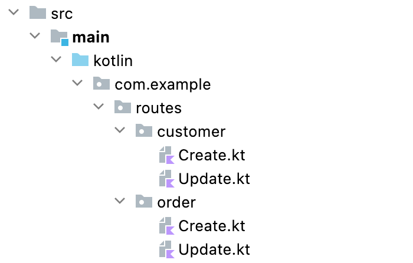
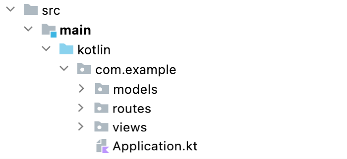
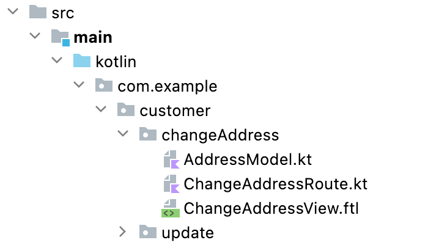

# Application structure

Ktor의 강력한 점은 애플리케이션 구조화하는 면에서 유연성을 제공한다는 것이다. 다른 서버 프레임워크와는 달리, 예를 들어 `CustomerController`라는 단일 클래스 이름에 모든 경로를 배치해야 하는
것과 같은 특정 패턴을 강요하지 않는다. 가능하지만 필수는 아니다.

이 섹션에서 애플리케이션을 구성하는데 필요한 다양한 옵션을 살펴보자.

## **Grouping by file**

관련 있는 route를 그룹핑하여 하나의 파일로 관리한다. 애플리케이션이 Customers와 Orders를 처리하는 경우, `CustomerRoutes.kt`와 `OrderRoutes.kt` 파일로 관리된다.

```kotlin
fun Route.customerByIdRoute() {
    get("/customer/{id}") {

    }
}

fun Route.createCustomerRoute() {
    post("/customer") {

    }
}
```

```kotlin
fun Route.orderByIdRoute() {
    get("/order/{id}") {

    }
}

fun Route.createOrderRoute() {
    post("/order") {

    }
}
```

order 또는 shipment 등 sub-route는 어떻게 될까? 이것들을 리소스로 말할 수 있으며, shipment 자체적으로 리소스가 되기 때문에 `ShipmentRoutes.kt` 파일로 매핑할 수 있다.

## **Grouping routing definitions**

이 접근방식의 이점은 routing 정의와 잠재적인 기능을 파일별로 그룹핑할 수 있다는 것이다. 예를 들어, 위와 같이 파일 레이아웃 별 그룹을 따른다고 가정해보자. route가 다른 파일에 있음에도, 애플리케이션
레벨에 선언해주어야 한다. 앱은 다음과 같아 보일 것이다.

```kotlin
routing {
    customerByIdRoute()
    createCustomerRoute()
    orderByIdRoute()
    createOrderRoute()
}
```

만약 대량의 route가 있다면, 이것은 길어지고 복잡해질 것이다. 그러나 파일별로 그룹화된 경로가 있으므로 이를 활용하고 각 파일에서도 routing을 정의할 수 있다. 이를 위해 `Application` 확장을
생성하고 route를 정의한다.

```kotlin
fun Application.customerRoutes() {
    routing {
        listCustomersRoute()
        customerByIdRoute()
        createCustomerRoute()
        deleteCustomerRoute()
    }
}
```

```kotlin
fun Application.orderRoutes() {
    routing {
        listOrdersRoute()
        getOrderRoute()
        totalizeOrderRoute()
    }
}
```

이제 실제 `Application.module`에서 `routing` 블럭 없이 간단히 함수를 호출할 수 있다.

```kotlin
fun Application.module() {
    // Init....
    customerRoutes()
    orderRoutes()
}
```

이를 한 단계 더 발전시킬 수 있다. 특정 route에 인증 플러그인을 사용하는 경우와 같이 필요에 따라 애플리케이션 별 플러그인을 설치한다. 한 가지 중요한 점은 Ktor는 플러그인이 2번 설치되는 경우
DuplicateApplicationFeatureException` 예외를 throw 한다.

### **A note on using objects**

객체를 사용해 routing 함수를 그룹핑하는 것은, Ktor의 top-level 함수가 한 번에 인스턴스화 되기 때문에 어떠한 성능이나 메모리 이점을 얻을 수 없다. 공통 함수를 공유할 수 있는 일종의 응집력 있는
구조를 제공할 수 있지만, 오버헤드가 걱정되는 경우 객체를 사용하여 그룹핑하는 방식이 필요하지 않다.

## **Grouping by folders**

모든 것을 하나의 파일로 가지는 것은 파일이 커짐에 따라 복잡해질 수 있다. 폴더를 사용해 다른 영역을 정의하고 고유한 파일에 각 route를 가져 이를 완화시킬 수 있다.

<div align="center">

</div>

이는 route 및 개별 작업과 관련하여 멋진 레이아웃의 이점을 제공하지만, "패키지 과부하"로 이어질 수 있으며, 잠재적으로 동일한 파일의 이름이 생겨 탐색이 어려워질 수 있다. 반면에 다음 예에서 볼 수
있듯이, 각 파일에 영역 접두사를 붙일 수도 있다(예, `CustomerCreate.kt`).

## **Grouping by features**

[ASP.NET](http://asp.net/) MVC 또는 Ruby on Rails 같은 프레임워크는 3개의 폴더를 사용하는 애플리케이션 구조 개념을 갖고 있다. Model, View, Controllers (
Routes).

<div align="center">

</div>

이는 자체 패키지/파일에 route를 그룹핑하는 위의 스키마와 크게 다르지 않다. Ktor의 경우 `resources` 폴더에 view가 있으며, HTTP 엔드포인트에 표시하거나 응답할 데이터를 배치하는 패키지
모델을 가지는 것으로부터 방해하는 것은 없다.

이 접근방식은 정상적으로 동작하며 다른 프레임워크와 유사하지만 일부는 기능별로 그룹화하는 것이 더 합리적이라 주장한다. 즉, `OrderProcessPayment`, `CustomerAddressChange` 등.

<div align="center">

</div>

많은 프레임워크에서 이러한 종류의 코드 구성은 기본 컨벤션을 심각하게 해킹하지 않고는 실행 가능하지 않다. 그러나 Ktor는 유연함을 제공하기 때문에, 문제되지 않는다. 한 가지 주의할 점은 템플릿 엔진을 사용할 때
리소스가 문제가 될 수 있다는 것이다. 그러나 이를 어떻게 해결할 수 있는지 보자.

이 문제를 해결하는 방법은 View에 사용되는 항목에 따라 다르다. 애플리케이션이 단순히 HTTP 백엔드이고 클라이언트 측 기술을 사용하는 경우 일바적으로 모든 렌더링은 클라이언트 측에서 실행된다.
Kotlinx.HTML를 사용하면, 아무 곳에서나 배치된 모든 코틀린 파일에서 페이지를 생성할 수 있으므로 문제가 되지 않는다.

이 이슈는 FreeMarker와 같은 템플릿 엔진을 사용할 때 많이 발생한다. 이들은 템플릿 파일이 위치해야 하는 방법과 위치가 독특하다. 운이 좋게도 일부는 템플릿 로드 방법에 유연성을 제공한다.

예를 들어, FreeMarker를 사용하면 MultiTemplateLoader를 사용한 다음 다른 위치에서 템플릿을 로드할 수 있다.

```kotlin
install(FreeMarker) {
    val customerTemplates = FileTemplateLoader(File("./customer/changeAddress"))
    val loaders = arrayOf<TemplateLoader>(customerTemplates)
    templateLoader = MultiTemplateLoader(loaders)
}
```

확실히 이 코드는 다른 것들 사이에서 상대 경로를 사용하기 때문에 이상적이진 않지만 폴더를 통해 이 루프를 실행하고 템플릿을 로드하는 방법을 확인하는 것은 어렵지 않으며, 실행 전 resources 폴더를 view에
복사하는 사용자 정의 빌드 작업이 있다.

이 접근 방식의 장점은 동일한 기능과 관련된 모든 것을 기술/인프라 측면과 달리 기능별로 단일 경로에 그룹화할 수 있다는 것이다.

## References

* [Application structure | Ktor](https://ktor.io/docs/structuring-applications.html)