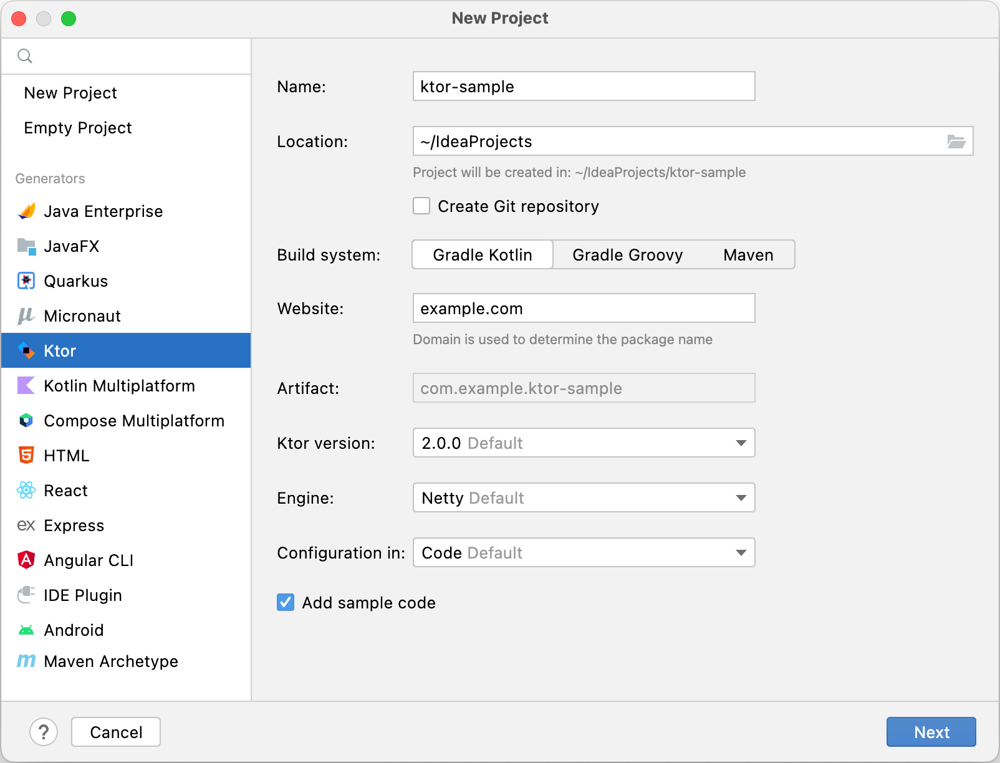
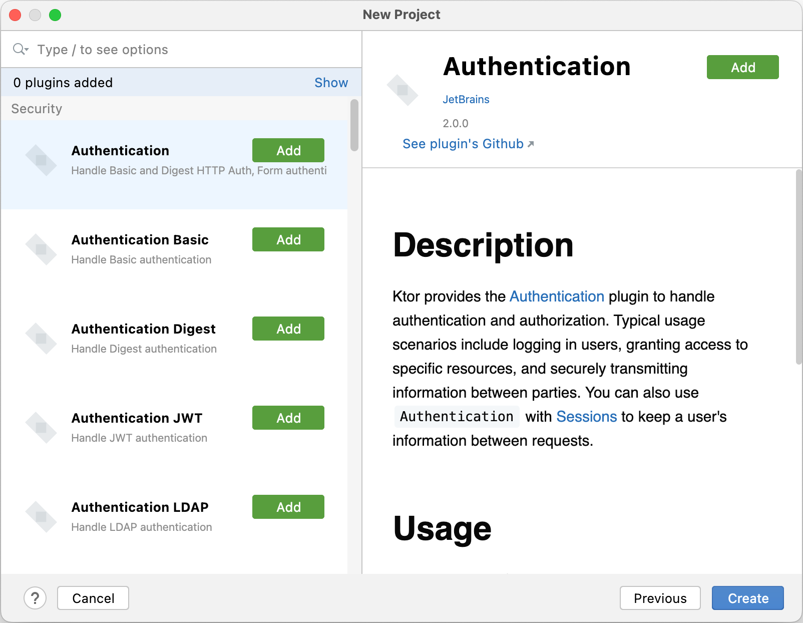
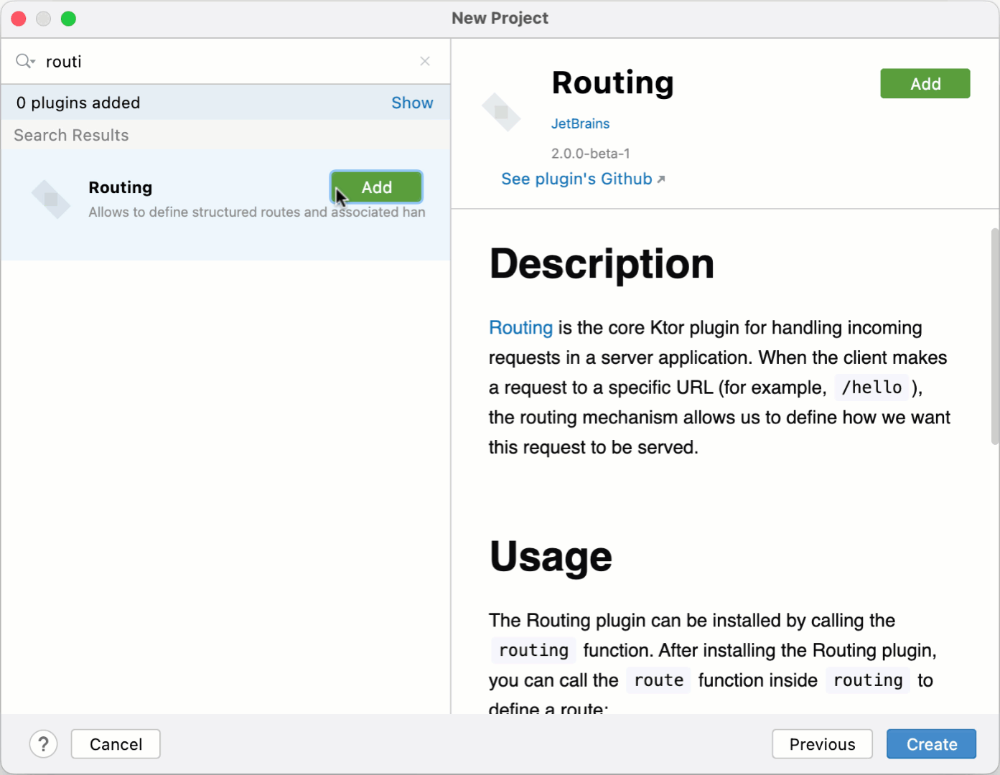
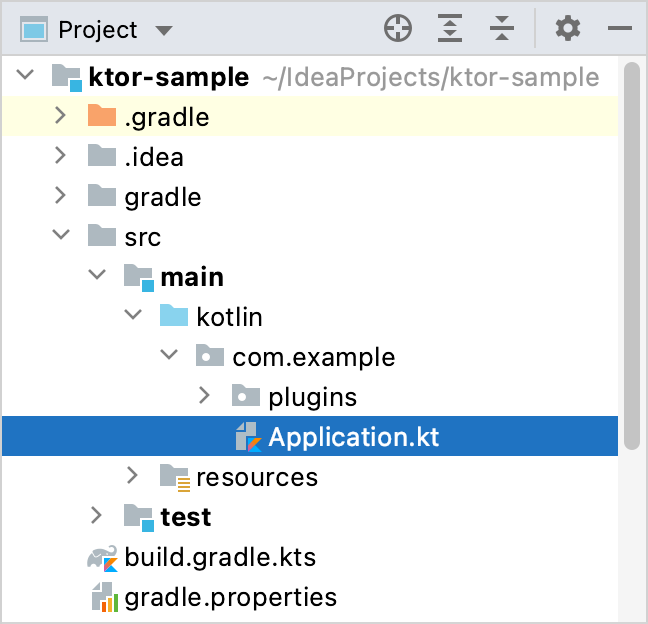
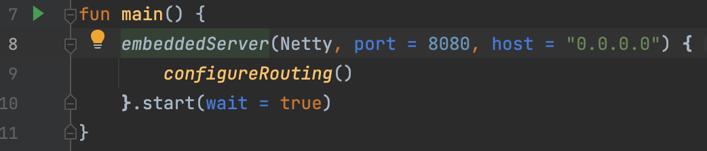
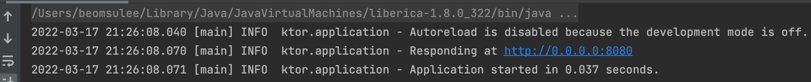
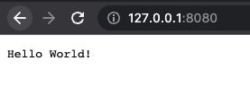
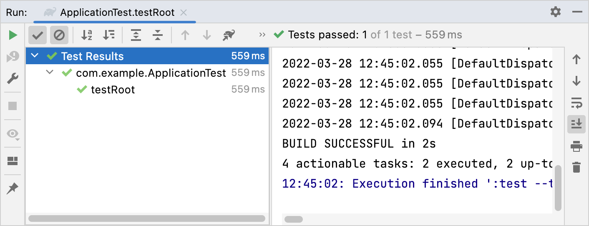

# Creating a new Ktor project

Ktor는 마이크로서비스, 웹 어플리케이션 등을 만들기 위한 비동기 프레임워크이다. IntelliJ IDEA Ultimate 플러그인 또는 web-based project generator를 사용해 Ktor
프로젝트를 만들 수 있다. 이 가이드에선 Ktor 프로젝트 생성 및 간단한 Ktor 애플리케이션을 테스트한다.

## Prerequisites

이 튜토리얼을 시작하기 전

* [IntelliJ IDEA Ultimate](https://www.jetbrains.com/help/idea/installation-guide.html?_ga=2.162985980.1396641199.1655526702-658241611.1655526702&_gl=1*vlmn37*_ga*NjU4MjQxNjExLjE2NTU1MjY3MDI.*_ga_9J976DJZ68*MTY1NTYwMjIzNS42LjEuMTY1NTYwMjgyMC4w)
  설치
    * 커뮤니티 버전을 사용하는
      경우 [web-based project generator](https://start.ktor.io/?_ga=2.162985980.1396641199.1655526702-658241611.1655526702&_gl=1*vlmn37*_ga*NjU4MjQxNjExLjE2NTU1MjY3MDI.*_ga_9J976DJZ68*MTY1NTYwMjIzNS42LjEuMTY1NTYwMjgyMC4w)
      사용
* [Ktor plugin](https://www.jetbrains.com/help/idea/ktor.html?_ga=2.162985980.1396641199.1655526702-658241611.1655526702&_gl=1*vlmn37*_ga*NjU4MjQxNjExLjE2NTU1MjY3MDI.*_ga_9J976DJZ68*MTY1NTYwMjIzNS42LjEuMTY1NTYwMjgyMC4w)
  설치 및 활성화

## Create a new Ktor project

만약 IntelliJ IDEA Community Edition을 사용한다면, [Ktor Project Generator](https://start.ktor.io/)를 사용해 프로젝트를 생성한다.

1. Welcom 스크린에서 New Project를 선택한다.
2. New Project에서 **Ktor**를 선택한다.
3. 그리고 다음과 같이 설정한다.

<div align="center">

</div>

* **Name** : 프로젝트 이름을 지정한다.
* **Location** : 프로젝트에 대한 디렉토리를 지정한다.
* **Build System** : 원하는 빌드 시스템 선택한다. 이는 코틀린을 사용한 Gradle 또는 Groovy DSL 또는 Maven이 될 수 있다.
* **Website** : 생성된 패키지 이름 생성에 사용할 도메인을 지정한다.
* **Artifact** : 생성된 아티팩트 이름을 보여준다.
* **Ktor version** : 필요한 Ktor 버전을 선택한다.
* **Engine** : 서버를 실행하기 위한 엔진을 선택한다.
* **Configuration in** : 코드 또는 HOCON 파일에 서버 파라미터를 지정할지 여부를 선택한다.
* **Add sample code** : 다음 페이지에 추가된 플러그인에 대한 샘플 코드를 추가하려면 이 옵션은 그대로 둔다.

이 튜토리얼에선 기본 값들로 설정한다. **Next**를 클릭하여 다음 페이지로 이동한다.

4. 다음 페이지에서 plugins 셋을 선택 - authentication, serialization, content encoding, compression, cookie support 등 Ktor 앱의 공통
   기능을 제공하는 빌딩 블록

<div align="center">

</div>

지금은 요청을 처리하기 위한 `Routing` 플러그인만 설치한다.

<div align="center">

</div>

## Run a Ktor application

생성된 Ktor 애플리케이션을 실행하기 위해 다음 단계를 따라라.

1. [Project view](https://www.jetbrains.com/help/idea/project-tool-window.html?_ga=2.200808558.1396641199.1655526702-658241611.1655526702&_gl=1*1ov2n3w*_ga*NjU4MjQxNjExLjE2NTU1MjY3MDI.*_ga_9J976DJZ68*MTY1NTYwMjIzNS42LjEuMTY1NTYwMjgyMC4w)
   를 띄우고 `Application.kt` 파일이 다음 위치에 있는지 확인해라.
    * `src/main/kotlin/com/example/Application.kt`

<div align="center">

</div>

2. `Application.kt` 파일에 자동으로 다음 코드가 생성된다.

```kotlin
package com.example

import io.ktor.server.engine.*
import io.ktor.server.netty.*
import com.example.plugins.*

fun main() {
    embeddedServer(Netty, port = 8080, host = "0.0.0.0") {
        configureRouting()
    }.start(wait = true)
}
```

* `embeddedServer` 함수는 코드에 있는 서버 파라미터를 설정하고 애플리케이션을 실행하기 위해 사용된다.

* `configureRouting`은 routing 을 정의하는 확장 함수이다. 이 함수는 분리된 plugins 패키지에 선언되어 있다. (`Routing.kt` 파일)

```kotlin
package com.example.plugins

import io.ktor.server.routing.*
import io.ktor.http.*
import io.ktor.server.application.*
import io.ktor.server.response.*
import io.ktor.server.request.*

fun Application.configureRouting() {

    routing {
        get("/") {
            call.respondText("Hello World!")
        }
    }
}
```

* `routing` 블럭의 `get` 함수는 `/` 경로로 요청되는 GET 요청을 받고 평문 텍스트를 응답한다.

3. `main` 함수의 옆 아이콘을 클릭해 서버를 실행한다.

<div align="center">

</div>

4. 실행 후 다음 로그를 확인할 수 있다.

<div align="center">

</div>

이는 서버가 **http://0.0.0.0:8080**에 대해 요청을 받을 준비가 된 것이다. 기본 브라우저를 통해 확인한다.

<div align="center">

</div>

## **Test a Ktor application**

생성된 프로젝트를 테스트해보자.

1. `src/test/kotlin/com/example/ApplicationTest.kt` 파일을 연다. 이 파일에서 [testApplication](https://ktor.io/docs/testing.html) 함수는
/ 에 대한 GET 요청을 수행하고 응답 상태 및 내용을 확인하는데 사용된다.

2. `testRoot` 함수 옆의 아이콘을 눌러 테스트를 수행한다.

<div align="center">

</div>

3. IntelliJ IDEA가 테스트를 수행하고 결과를 반환할 때까지 대기한다.

<div align="center">

</div>

## References

* [Creating a new Ktor project | Ktor](https://ktor.io/docs/intellij-idea.html)