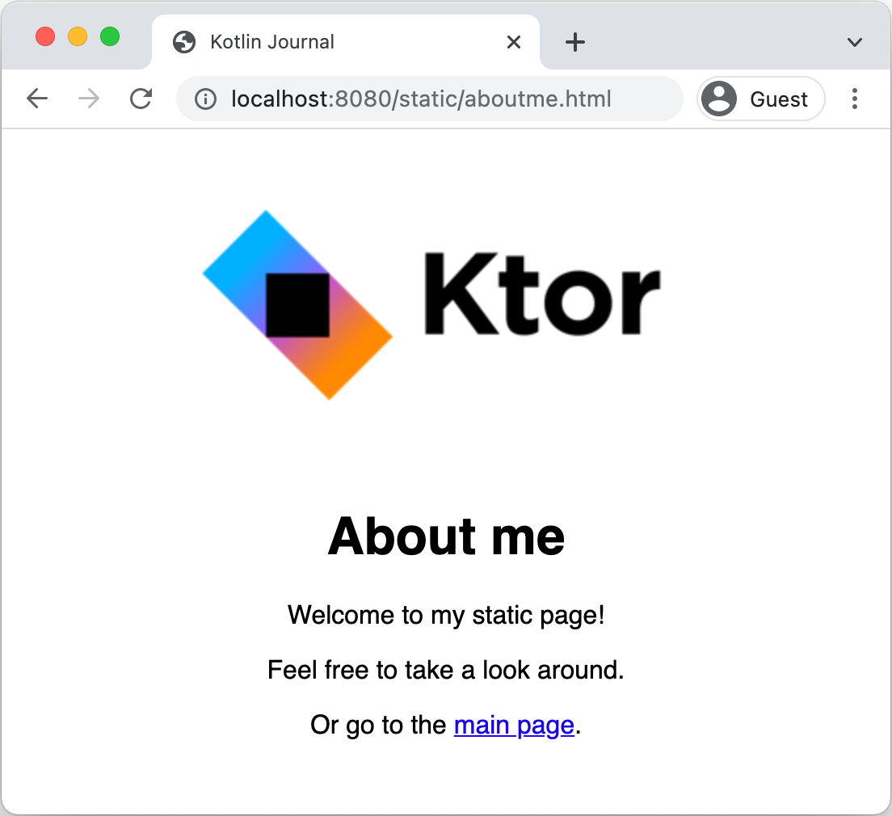

# Creating a static website

이 튜토리얼 시리즈는 Ktor를 통해 간단한 블로그를 생성하는 방법을 보여준다.

* 우선 HTML 페이지와 이미지 같은 static content를 호스팅하는 것을 보여준다.
* 다음 튜토리얼에서 FreeMarker 템플릿 엔진을 사용해 interactive 한 앱을 만들어본다.
* 마지막으로 Exposed 프레임워크를 사용해 웹사이트에 persistense를 추가한다.

<div align="center">

</div>

## Prerequisites

* [IntelliJ IDEA Ultimate](https://www.jetbrains.com/help/idea/installation-guide.html?_ga=2.162985980.1396641199.1655526702-658241611.1655526702&_gl=1*vlmn37*_ga*NjU4MjQxNjExLjE2NTU1MjY3MDI.*_ga_9J976DJZ68*MTY1NTYwMjIzNS42LjEuMTY1NTYwMjgyMC4w)
  설치
    * 커뮤니티 버전을 사용하는
      경우 [web-based project generator](https://start.ktor.io/?_ga=2.162985980.1396641199.1655526702-658241611.1655526702&_gl=1*vlmn37*_ga*NjU4MjQxNjExLjE2NTU1MjY3MDI.*_ga_9J976DJZ68*MTY1NTYwMjIzNS42LjEuMTY1NTYwMjgyMC4w)
      사용
* [Ktor plugin](https://www.jetbrains.com/help/idea/ktor.html?_ga=2.162985980.1396641199.1655526702-658241611.1655526702&_gl=1*vlmn37*_ga*NjU4MjQxNjExLjE2NTU1MjY3MDI.*_ga_9J976DJZ68*MTY1NTYwMjIzNS42LjEuMTY1NTYwMjgyMC4w)
  설치 및 활성화

## Create a new Ktor project

새로운 프로젝트를 생성하는 방법은 [여기서](/contents/ktor/document/getting-started-with-a-ktor-server/creating-a-new-ktor-project) 확인한다.

플러그인의 경우 `Routing`, `Freemarker`, `Static Content`을 추가한다.

## Examine the project

### Dependencies

`build.gradle.kts` 파일을 열고 추가된 디펜던시를 확인하자.

```kotlin
dependencies {
    implementation("io.ktor:ktor-server-core:$ktor_version")
    implementation("io.ktor:ktor-server-netty:$ktor_version")
    implementation("io.ktor:ktor-server-freemarker:$ktor_version")
    implementation("ch.qos.logback:logback-classic:$logback_version")
    testImplementation("io.ktor:ktor-server-test-host:$ktor_version")
    testImplementation("org.jetbrains.kotlin:kotlin-test-junit:$kotlin_version")
}
```

- `ktor-server-core` : Ktor의 코어 컴포넌트를 추가한다.
- `ktor-server-netty` : Netty 엔진 추가한다. 별다른 외부 애플리케이션 컨테이너에 의존 없이 서버 기능을 사용할 수 있게 해준다.
- `ktor-server-freemarker`는 [FreeMarker](https://ktor.io/docs/freemarker.html) 템플릿 엔진을 사용할 수 있도록 허용한다.
- `logback-classic` : 포맷된 로그를 콘솔에 보여준다.
- `ktor-server-test-host`, `kotlin-test-junit`를 사용하면 프로세스 전체 HTTP 스탯을 사용하지 않고도 Ktor 앱의 일부를 테스트할 수 있다. 이를 사용해 프로젝트의 unit
  test를 정의한다.

## Configurations: application.conf and logback.xml

`resources` 디렉토리에 HOCON 포맷의 `application.conf`와 `logback.xml`를 포함하고 있다.

* `application.conf`는 HOCON 포맷의 설정 파일이다. Ktor는 이 파일을 사용해 실행해야하는 포트를 결정하고 앱의 엔트리포인트도 정의한다.

```
ktor {
    deployment {
        port = 8080
        port = ${?PORT}
    }
    application {
        modules = [ com.example.ApplicationKt.module ]
    }
}
```

* `logback.xml`은 서버를 위한 기본적인 로깅 구조를 설정한다.

### Source code

`application.conf`는 앱의 엔트리포인트를 `com.example.ApplicationKt.module`로 설정한다. 이는 `Application.kt` 내 `Application.module()`
함수에 해당한다.

```kotlin
fun main(args: Array<String>): Unit = io.ktor.server.netty.EngineMain.main(args)

fun Application.module() {
    configureRouting()
    configureTemplating()
}
```

이 모듈에서 다음 확장 함수를 호출한다.

* `configureRouting`은 `plugins/Routing.kt`에 정의된 함수이며 현재는 아무것도 하지 않는다.

```kotlin
fun Application.configureRouting() {
    routing {
    }
}
```

* `configureTemplating`은 `plugins/Templating.kt`에 정의된 함수이며 `FreeMarker` 플러그인을 설치 및 구성한다.

```kotlin
fun Application.configureTemplating() {
    install(FreeMarker) {
        templateLoader = ClassTemplateLoader(this::class.java.classLoader, "templates")
    }
}
```

## Static files and pages

동적인 앱을 만들기 전 조금 더 쉽지만 중요한 것부터 알아본다. Ktor 서버가 static 파일들을 제공하도록 해보자. Static 파일로 제공하고자 하는 것들이 많다. (예: 헤더 이미지)

1. `files` 폴더를 `src/main/resources`에 생성한다.
2. `files`
   폴더에 [ktor_logo.png](https://github.com/ktorio/ktor-documentation/blob/main/codeSnippets/snippets/tutorial-website-static/src/main/resources/files/ktor_logo.png)
   이미지 파일을 다운받는다.
3. Static 콘텐츠를 제공하기 위해 [static](https://ktor.io/docs/serving-static-content.html)이라는 이름의 Ktor에 내장된 routing 함수를 사용할 수 있다.
   이 함수는 2개의 파라미터를 취급한다. Static 콘텐츠를 사용할 수 있는 경로와 콘텐츠를 제공해야하는 위치를 정의할 수 있는 람다.

`plugins/Routing.kt` 파일의 `Application.configureRouting()`을 다음과 같이 구현한다.

```kotlin
import io.ktor.server.application.*
import io.ktor.server.http.content.*
import io.ktor.server.routing.*

fun Application.configureRouting() {
    routing {
        static("/static") {
            resources("files")
        }
    }
}
```

이는 Ktor에게 `/static` URL 하위의 모든 것이 `resources` 내부의 `files` 디렉토리를 사용하여 제공되어야 한다고 알려주는 것이다.

### Run the application

우리가 원하는대로 앱이 동작하는지 알아보자. 앱을 실행한 후 `http://localhost:8080/static/ktor_logo.png`로 접근하면 다음과 같이 보여지는 것을 확인할 수 있다.

<div align="center">

</div>

### Add HTML page

이미지에만 제한되지 않는다. HTML, CSS, JavaScript도 정상적으로 동작한다. 이를 이용해 간단한 'About me' 페이지를 추가해보자.

`src/main/resources/files/`에 `aboutme.html`을 생성하고, 다음과 같이 작성한다.

```html
<!DOCTYPE html>
<html lang="en">
<head>
    <meta charset="UTF-8">
    <title>Kotlin Journal</title>
</head>
<body style="text-align: center; font-family: sans-serif">

<h1>About me</h1>
<p>Welcome to my static page!</p>
<p>Feel free to take a look around.</p>
<p>Or go to the <a href="/">main page</a>.</p>
</body>
</html>
```

앱을 실행하고 `http://localhost:8080/static/aboutme.html`로 접근하면 해당 페이지를 볼 수 있다. 여기서 볼 수 있듯 HTML에서 다른 static 파일을 참조할 수 있다.

<div align="center">

</div>

당연히 `files` 하위에 파일들을 구성할 수 있다. Ktor는 이러한 경로를 올바른 URL에 자동으로 매핑한다.

그러나 몇 개의 단락이 포함된 static 페이지는 저널이라 하기 어렵다. 다음 튜토리얼에서 템플릿을 통해 동적인 페이지를 만들어보자.

## References

* [Creating a static website](https://ktor.io/docs/creating-static-website.html)