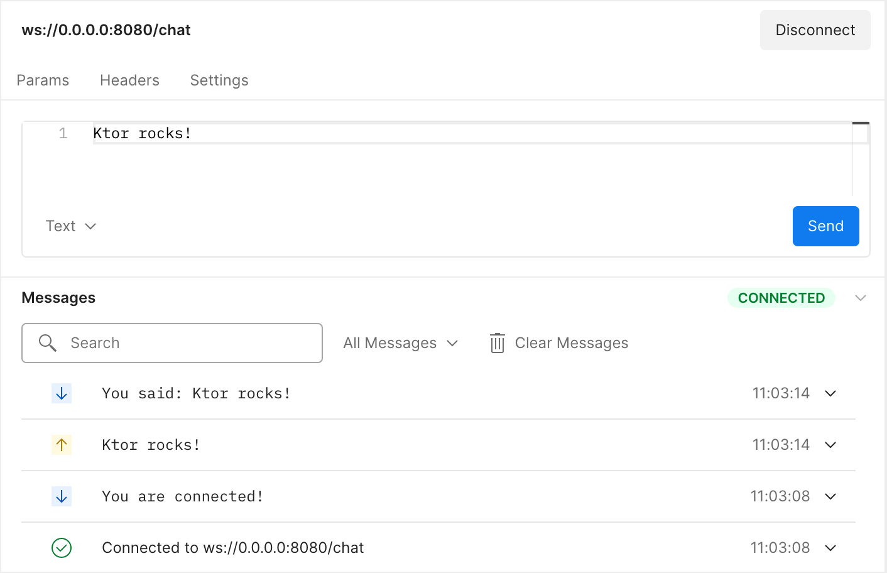
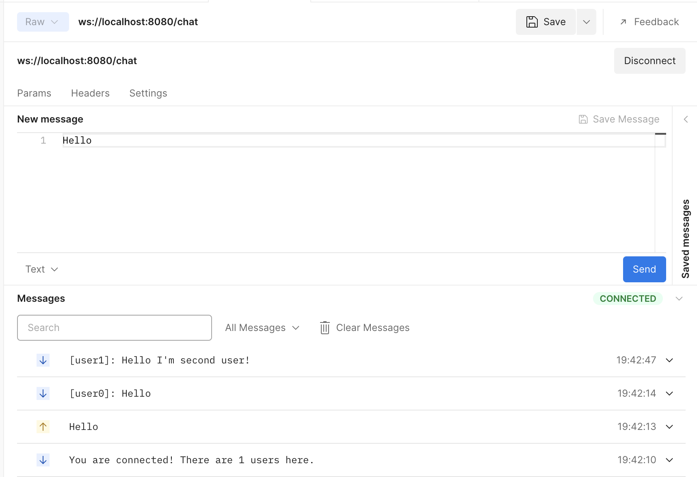
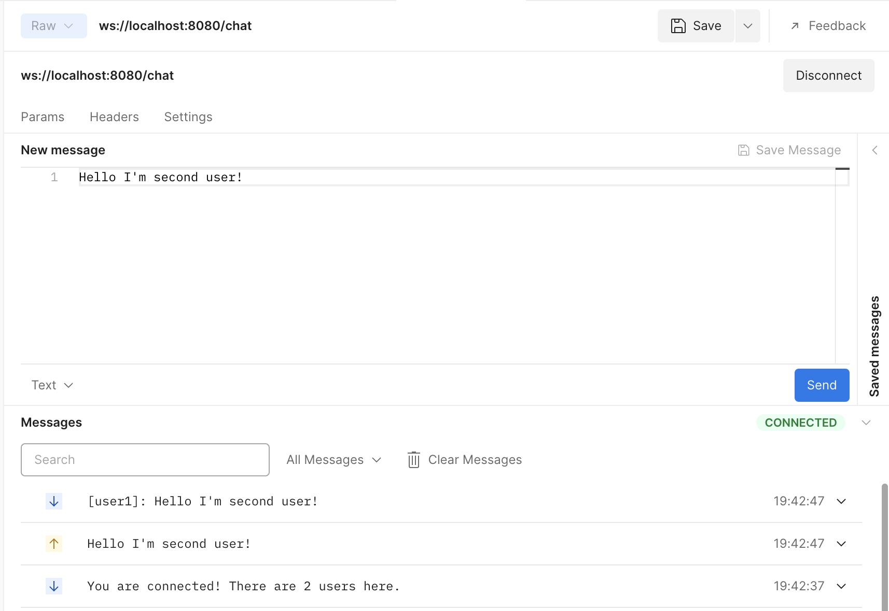

# Creating a WebSocket chat

여기에선 웹소켓을 이용해 간단한 채팅 애플리케이션을 만들어본다. Ktor를 통해 클라이언트와 서버 애플리케이션을 같이 구현한다.

2개의 애플리케이션으로 구성된 간단한 채팅 서비스를 구현할 것이다.

- **chat server application**는 유저의 연결을 수립하고 관리하고, 메시지를 받고 연결된 클라이언트에 전달한다.
- **chat client application**는 유저가 채팅 서버에 조인하고, 다른 유저에게 메시지를 보내고 터미널에서 전달된 메시지를 볼 수 있다.

이 두개의 애플리케이션에서 Ktor가 제공하는 웹소켓을 이용한다. Ktor는 서버, 클라이언트 사이드의 프레임워크이기 때문에 클라이언트를 구현할 때 서버에서 구현한 내용을 재사용할 수 있다.

여기서 Ktor와 코틀린을 사용해 웹소켓을 어떻게 사용하는지 알게 되며, 클라이언트와 서버가 어떻게 정보를 교환하고, 여러 연결을 동시에 관리하는 방법을 알게된다.

## Why WebSockets?

웹소켓은 채팅이나 간단한 게임 같은 애플리케이션을 만들 때 적합하다. 채팅 세션은 보통 길게 유지되며, 클라이언트는 장기간에 걸쳐 다른 참가자로부터 메시지를 수신한다. 채팅 세션은 양방향 연결이다. 클라이언트는
메시지를 전송하며, 다른 사람의 채팅 메시지를 보고 싶어한다.

HTTP 요청과 다르게 웹소켓 연결은 긴 시간 유지할 수 있고, frame 형태의 서버, 클라이언트 데이터 교환을 위한 쉬운 인터페이스를 가지고 있다. 프레임은 다양한 유형(text, binary, close,
ping/pong)이 있다. Ktor는 웹소켓 프로토콜을 통해 고차원의 추상을 제공하기 때문에, 텍스트와 바이너리 프레임에 집중할 수 있으며, 다른 처리들을 프레임워크에 맡길 수 있다.

웹소켓은 널리 지원되는 기술이다. 모든 최신 브라우저는 기본적으로 웹소켓과 함께 작동할 수 있으며, 웹소켓과 함께 작동하는 프레임워크는 많은 프로그래밍 언어와 플랫폼에 존재한다.

## Prerequisites

* [IntelliJ IDEA Ultimate](https://www.jetbrains.com/help/idea/installation-guide.html?_ga=2.162985980.1396641199.1655526702-658241611.1655526702&_gl=1*vlmn37*_ga*NjU4MjQxNjExLjE2NTU1MjY3MDI.*_ga_9J976DJZ68*MTY1NTYwMjIzNS42LjEuMTY1NTYwMjgyMC4w)
  설치
    * 커뮤니티 버전을 사용하는
      경우 [web-based project generator](https://start.ktor.io/?_ga=2.162985980.1396641199.1655526702-658241611.1655526702&_gl=1*vlmn37*_ga*NjU4MjQxNjExLjE2NTU1MjY3MDI.*_ga_9J976DJZ68*MTY1NTYwMjIzNS42LjEuMTY1NTYwMjgyMC4w)
      사용
* [Ktor plugin](https://www.jetbrains.com/help/idea/ktor.html?_ga=2.162985980.1396641199.1655526702-658241611.1655526702&_gl=1*vlmn37*_ga*NjU4MjQxNjExLjE2NTU1MjY3MDI.*_ga_9J976DJZ68*MTY1NTYwMjIzNS42LjEuMTY1NTYwMjgyMC4w)
  설치 및 활성화

## Create a new Ktor project

새로운 프로젝트를 생성하는 방법은 [여기서](contents/ktor/document/getting-started-with-a-ktor-server/creating-a-new-ktor-project) 확인한다.

플러그인의 경우 `Routing`, `WebSockets`을 추가한다.

### Dependencies

`build.gradle.kts`를 열고 추가된 디펜던시를 확인한다.

```kotlin
dependencies {
    implementation("io.ktor:ktor-server-core:$ktor_version")
    implementation("io.ktor:ktor-server-netty:$ktor_version")
    implementation("io.ktor:ktor-server-websockets:$ktor_version")
    implementation("ch.qos.logback:logback-classic:$logback_version")
    testImplementation("io.ktor:ktor-server-test-host:$ktor_version")
    testImplementation("org.jetbrains.kotlin:kotlin-test-junit:$kotlin_version")
}
```

- `ktor-server-core` : Ktor의 코어 컴포넌트를 추가한다.
- `ktor-server-netty` : Netty 엔진 추가한다. 별다른 외부 애플리케이션 컨테이너에 의존 없이 서버 기능을 사용할 수 있게 해준다.
- `ktor-server-websockets`을 사용하면 채팅의 주요 통신 메커니즘인 `Websocket` 플러그인을 사용할 수 있다.
- `logback-classic` : 포맷된 로그를 콘솔에 보여준다.
- `ktor-server-test-host`, `kotlin-test-junit`를 사용하면 프로세스 전체 HTTP 스탯을 사용하지 않고도 Ktor 앱의 일부를 테스트할 수 있다. 이를 사용해 프로젝트의 unit
  test를 정의한다.

### Configurations: application.conf and logback.xml

`resources` 디렉토리에 HOCON 포맷의 `application.conf`와 `logback.xml`를 포함하고 있다.

* `application.conf`는 HOCON 포맷의 설정 파일이다. Ktor는 이 파일을 사용해 실행해야하는 포트를 결정하고 앱의 엔트리포인트도 정의한다.

```
ktor {
    deployment {
        port = 8080
        port = ${?PORT}
    }
    application {
        modules = [ com.example.ApplicationKt.module ]
    }
}
```

* `logback.xml`은 서버를 위한 기본적인 로깅 구조를 설정한다.

### Source code

`application.conf`는 앱의 엔트리포인트를 `com.example.ApplicationKt.module`로 설정한다. 이는 앱 모듈인 `Application.kt`
의 `Application.module()` 함수에 해당한다.

```kotlin
fun main(args: Array<String>): Unit = io.ktor.server.netty.EngineMain.main(args)

fun Application.module() {
    configureRouting()
    configureSockets()
}
```

이 모듈은 다음 확장 함수를 호출한다.

* `configureRouting`는 현재 아무것도 하지 않는 `plugins/Routing.kt`에 정의된 함수이다.

```kotlin
fun Application.configureRouting() {
    routing {
    }
}
```

* `configureSockets`은 `WebSockets` 플러그인을 설치하는 `plugins/Sockets.kt`에 정의된 함수이다.

```kotlin
fun Application.configureSockets() {
    install(WebSockets) {
        pingPeriod = Duration.ofSeconds(15)
        timeout = Duration.ofSeconds(15)
        maxFrameSize = Long.MAX_VALUE
        masking = false
    }
}
```

## A first echo server

### Implementing an echo server

웹소켓 연결을 받아 텍스트 콘텐트를 받고 클라이언트에게 “echo”를 출력해주도록 구현해보자. `Application.configureSockets()` 구현을 `plugins/Sockets.kt`에 추가하여
Ktor로 이 서비스를 구현할 수 있다.

```kotlin
import io.ktor.websocket.*
import io.ktor.server.application.*
import io.ktor.server.routing.*
import io.ktor.server.websocket.*

fun Application.configureSockets() {
    install(WebSockets) {
        // ...
    }
    routing {
        webSocket("/chat") {
            send("You are connected!")
            for (frame in incoming) {
                frame as? Frame.Text ?: continue
                val receivedText = frame.readText()
                send("You said: $receivedText")
            }
        }
    }
}
```

우선 `WebSockets` Ktor 플러그인 설치를 통해 Ktor 프레임워크로 제공되는 웹소켓 관련 기능을 활성화한다. 이는 에웹소켓 프로토콜에 응답하도록 엔드포인트를 정의하는 것을 허용한다. `webSocket`
route 함수의 스코프 내에서, 클라이언트와 상호작용 할 수 있는 다양한 메서드를 사용할 수 있다(`DefaultWebSocketServerSession` receiver type). 이것은 메시지를 전송하고 받은
메시지를 반복하는 편리한 메서드를 포함하고 있다.

text 콘텐트만 받기 때문에 incoming channel에서 텍스트가 아닌 `Frame`은 스킵된다. 받은 텍스트를 읽고 읽은 텍스트를 유저에게 전달한다.

완전한 echo 서버를 만들었다. 이제 테스트해보자.

### Try out the echo server

현재 web-based 웹소켓 클라이언트를 사용해 echo 서버에 연결할 수 있다. 메시지를 보내고 응답을 확인하자.

`fun main` 옆의 실행 아이콘을 눌러 서버를 실행하자. 이제 서비스를 확인하기 위해 Postman을 사용해 `ws://localhost:8080/chat`에 연결하고 테스트해보자.

<div align="center">

</div>

이제 로컬 서버에 메시지를 전송할 수 있다. 메시지를 보내면 메시지 창에 에코 서버가 보낸 echo 메시지가 보여져야 한다.

웹소켓을 통해 양방향 통신을 수행할 수 있다. 이제 여러 참가자를 허용하고 메시지를 공유하는 채팅 서버와 비슷하게 확장해보자.

## Exchange messages

echo 서버를 실제 채팅 서버로 변경해보자! 동일한 유저가 보낸 메시지를 식별하기 위해 username을 태그한다. 또한 메시지가 연결된 다른 유저들에게 브로드캐스트 되도록 만들어야 한다.

### Model connections

이 두 기능 모두 서버가 보유하고 있는 연결을 추적할 수 있어야 한다. 어떤 유저가 메시지를 보냈고, 누구에게 브로드캐스트 해야 하는지 알아야 한다.

Ktor는 웹소켓 연결을 웹소켓을 통해 `incoming`, `outgoing`를 포함해 통신하는데 필요한 것을 모두 포함하고 있는 `DefaultWebSocketSession` 타입의 객체를 사용해 웹소켓 연결을
관리한다. 지금은 사용자 이름 할당 문제를 단순화하고, 카운터를 기반으로 자동으로 생성된 username을 제공할 수
있다. `server/src/main/kotlin/com/jetbrains/handson/chat/server/` 경로에 `Connection.kt` 파일을 생성하고 다음과 같이 작성한다.

```kotlin
package com.example

import io.ktor.websocket.*
import java.util.concurrent.atomic.*

class Connection(val session: DefaultWebSocketSession) {
    companion object {
        var lastId = AtomicInteger(0)
    }
    val name = "user${lastId.getAndIncrement()}"
}
```

카운터에 대한 thread-safe 데이터 구조로 `AtomicInteger`를 사용한다. 동시에 두 유저가 동일한 ID를 갖지 못하는 것을 보장한다.

### Implement connection handling and message propagation

이제 Connection 객체를 추적하고, username이 접두사로 붙은 모든 연결된 클라이언트에 메시지를 보내도록 서버 프로그램을 변경할 수
있다. `plugins/Sockets.kt`의 `routing` 블럭을 다음과 같이 작성한다.

```kotlin
import com.example.*
import io.ktor.websocket.*
import io.ktor.server.application.*
import io.ktor.server.routing.*
import io.ktor.server.websocket.*
import java.time.*
import java.util.*
import kotlin.collections.LinkedHashSet

fun Application.configureSockets() {
    routing {
        val connections = Collections.synchronizedSet<Connection?>(LinkedHashSet())
        webSocket("/chat") {
            println("Adding user!")
            val thisConnection = Connection(this)
            connections += thisConnection
            try {
                send("You are connected! There are ${connections.count()} users here.")
                for (frame in incoming) {
                    frame as? Frame.Text ?: continue
                    val receivedText = frame.readText()
                    val textWithUsername = "[${thisConnection.name}]: $receivedText"
                    connections.forEach {
                        it.session.send(textWithUsername)
                    }
                }
            } catch (e: Exception) {
                println(e.localizedMessage)
            } finally {
                println("Removing $thisConnection!")
                connections -= thisConnection
            }
        }
    }
}
```

서버는 이제 thread-safe한 `Connection` collection을 저장한다. 유저가 연결되면 그들의 `Connection` 객체(고유의 username으로 할당된)를 생성하고, collection에
추가한다. 그런 다음 환영 메시지와 몇명의 유저가 연결되어 있는지 알여준다. 유저로부터 메시지를 받았을 때, `Connection` 객체에서 고유의 이름으로 현재 연결된 사용자에게 전송한다. 연결이 끊났을 때
collection의 `Connection` 객체를 제거한다. incoming channel이 close되거나, 네트워크 연결이 의도치 않게 끊겨 `Exception`이 발생했을 때.

서버에서 동작이 제대로 수행되는 것을 확인하기 위해 Postman으로 확인해본다. username 할당과 연결된 유저에게 메시지를 브로드캐스팅 하는 것을 확인해보자. 2개의 클라이언트를 만들고 테스트한다.

<div align="center" class="column">
<div></div>
<div></div>
</div>

이제 채팅에 참가한 여러 유저들이 메시지를 전송하고 받을 수 있다.

## References

* [Creating a WebSocket chat | Ktor](https://ktor.io/docs/creating-web-socket-chat.html)