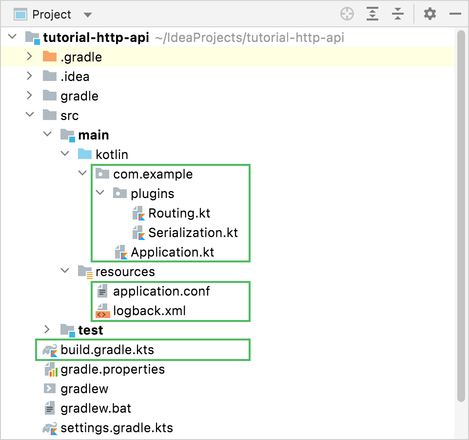
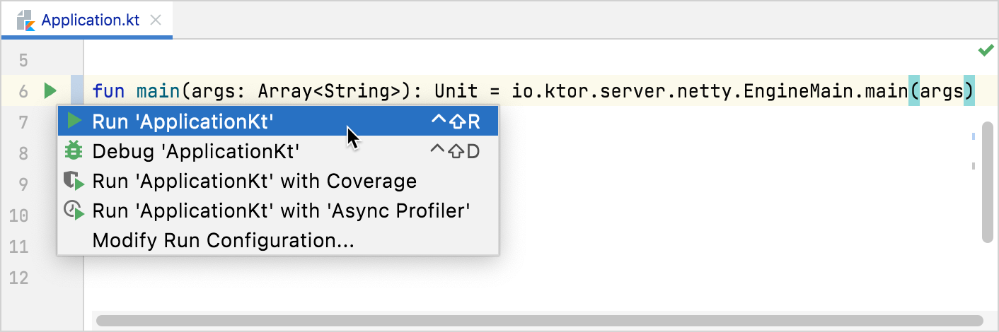

# Creating HTTP APIs

이번 튜토리얼에선 모바일, 웹, 데스크톱, B2B 서비스와 같은 모든 애플리케이션의 백엔드 역할을 수행하는 HTTP API를 만들어본다. Routes가 어떻게 구조되어 있는지, serialization 플러그인이
테스크를 어떻게 간소화하는지, 애플리케이션의 일부를 어떻게 수동 또는 자동으로 테스트하는지 알아보자.

가상 비즈니스의 고객에 대한 JSON API를 응답하도록 구현해볼 것이다. 시스템의 모든 고객 및 주문을 리스팅하며, 각각 고객 및 주문에 대한 정보를 얻고, 새로운 엔트리 추가 및 오래된 엔트리를 제거하는 기능을
제공하는 것을 만들 것이다.

## Prerequisites

* [IntelliJ IDEA Ultimate](https://www.jetbrains.com/help/idea/installation-guide.html?_ga=2.162985980.1396641199.1655526702-658241611.1655526702&_gl=1*vlmn37*_ga*NjU4MjQxNjExLjE2NTU1MjY3MDI.*_ga_9J976DJZ68*MTY1NTYwMjIzNS42LjEuMTY1NTYwMjgyMC4w)
  설치
    * 커뮤니티 버전을 사용하는
      경우 [web-based project generator](https://start.ktor.io/?_ga=2.162985980.1396641199.1655526702-658241611.1655526702&_gl=1*vlmn37*_ga*NjU4MjQxNjExLjE2NTU1MjY3MDI.*_ga_9J976DJZ68*MTY1NTYwMjIzNS42LjEuMTY1NTYwMjgyMC4w)
      사용
* [Ktor plugin](https://www.jetbrains.com/help/idea/ktor.html?_ga=2.162985980.1396641199.1655526702-658241611.1655526702&_gl=1*vlmn37*_ga*NjU4MjQxNjExLjE2NTU1MjY3MDI.*_ga_9J976DJZ68*MTY1NTYwMjIzNS42LjEuMTY1NTYwMjgyMC4w)
  설치 및 활성화

## Create a new Ktor project

새로운 프로젝트를 생성하는 방법은 [여기서](contents/ktor/document/getting-started-with-a-ktor-server/creating-a-new-ktor-project) 확인한다.

플러그인의 경우 `Routing`, `ContentNegotiation`, `kotlinx.serialization`을 추가한다.

## Examine the project

Project view를 띄워 생성된 프로젝트의 구조를 확인한다.

<div align="center">

</div>

* `build.gradle.kts` 파일은 Ktor 서버에 필요한 디펜던시를 포함하고 있다.
* `main/resources` 폴더는 설정 파일을 포함하고 있다.
* `main/kotlin` 폴더는 생성된 소스 코드를 포함하고 있다.

### Dependencies

`build.gradle.kts` 파일을 열고 추가된 디펜던시를 확인하자.

```kotlin
dependencies {
    implementation("io.ktor:ktor-server-core:$ktor_version")
    implementation("io.ktor:ktor-server-netty:$ktor_version")
    implementation("io.ktor:ktor-server-content-negotiation:$ktor_version")
    implementation("io.ktor:ktor-serialization-kotlinx-json:$ktor_version")
    implementation("ch.qos.logback:logback-classic:$logback_version")
    testImplementation("io.ktor:ktor-server-test-host:$ktor_version")
    testImplementation("org.jetbrains.kotlin:kotlin-test-junit:$kotlin_version")
}
```

- `ktor-server-core` : Ktor의 코어 컴포넌트를 추가한다.
- `ktor-server-netty` : Netty 엔진 추가한다. 별다른 외부 애플리케이션 컨테이너에 의존 없이 서버 기능을 사용할 수 있게 해준다.
- `ktor-server-content-negotiation`, `ktor-serialization-kotlinx-json`은 코틀린 객체를 JSON과 같은 serialized form으로 변환시켜주는 편리한
  메커니즘을 제공한다. 이를 사용해 API 출력 형식을 지정하고 JSON으로 구성된 유저 입력을 사용한다. `ktor-serialization-kotlinx-json`을 사용하기
  위해 `ktor-serialization-kotlinx-json` 플러그인도 적용해야 한다.
- `logback-classic` : 포맷된 로그를 콘솔에 보여준다.
- `ktor-server-test-host`, `kotlin-test-junit`를 사용하면 프로세스 전체 HTTP 스탯을 사용하지 않고도 Ktor 앱의 일부를 테스트할 수 있다. 이를 사용해 프로젝트의 unit
  test를 정의한다.

## Configurations: application.conf and logback.xml

`resources` 디렉토리에 HOCON 포맷의 `application.conf`와 `logback.xml`를 포함하고 있다.

* `application.conf`는 HOCON 포맷의 설정 파일이다. Ktor는 이 파일을 사용해 실행해야하는 포트를 결정하고 앱의 엔트리포인트도 정의한다.

```
ktor {
    deployment {
        port = 8080
        port = ${?PORT}
    }
    application {
        modules = [ com.example.ApplicationKt.module ]
    }
}
```

* `logback.xml`은 서버를 위한 기본적인 로깅 구조를 설정한다.

### Source code

`application.conf`는 앱의 엔트리 포인트를 `com.example.ApplicationKt.module`로 설정한다. 이는 앱 모듈인 `Application.kt`
의 `Application.module()` 함수에 해당한다.

이 모듈은 순서대로 다음 확장 함수를 호출한다.

* `configureRouting`은 `plugins/Routing.kt`에 정의된 함수이며 현재는 아무것도 하지 않는다.

```kotlin
fun Application.configureRouting() {
    routing {
    }
}
```

* `configureSerialization`은 `plugins/Serialization.kt`에 정의된 함수이며 `ContentNegotiation`을 설치하고 `json` serializer를 활성화한다.

## Customer routes

애플리케이션의 `Customer` 측을 다뤄보자. 고객과 관련된 데이터 모델을 생성해야 한다. 또한 고객이 추가, 리스팅, 제거되는 엔드포인트가 필요하다.

### The Customer model

1. `com.example` 내 `models` 패키지를 생성한다.
2. `models` 패키지에 `Customer.kt` 파일을 생성한다.

```kotlin
import kotlinx.serialization.Serializable

@Serializable
data class Customer(val id: String, val firstName: String, val lastName: String, val email: String)
```

[kotlinx.serialization](https://github.com/Kotlin/kotlinx.serialization)의 `@Serializable` 어노테이션를 사용한다. 이를 통해 API 응답에 필요한
JSON 표현을 자동으로 생성할 수 있다.

### Create the Customer storage

코드를 복잡하게 하지 않기 위해 in-memory storage를 이용한다. 실제 앱에선 DB를 사용하기 때문에 Ktor를 재시작해도 데이터를 잃지 않는다. `Customer.kt` 파일에 다음 코드를 추가한다.

```kotlin
val customerStorage = mutableListOf<Customer>()
```

`Customer` 클래스와 이 객체에 대한 저장소를 생성했다. 이제 엔드포인트를 만들고 API를 통해 노출시켜보자.

### Define the routing for customers

`/customer` 엔드포인트에서 `GET`, `POST`, `DELETE` 요청에 응답해야 한다. HTTP 메서드에 상응하는 route를 만들자. `CustomerRoutes.kt` 파일을 새로운 routes
패키지에
생성한다.

1. `com.example` 내 `routes` 패키지를 생성한다.
2. `routes` 패키지에 `CustomerRoutes.kt` 파일을 생성한다.

```kotlin
import io.ktor.server.routing.*

fun Route.customerRouting() {
    route("/customer") {
        get {

        }
        get("{id?}") {

        }
        post {

        }
        delete("{id?}") {

        }
    }
}
```

`route` 함수를 사용해 `/customer` 엔드포인트에 대해 그룹핑했다. 그리고 각 메서드별로 블럭을 생성했다. 이런 방식으로 route를 정의한다. `Order` route를 다룰 때는 다른 방식을
사용해본다.

`get`에 대해 2가지 방법으로 응답한다. 하나는 파라미터 없이, 다른 하나는 `{id?}`를 전달한다. 전자는 모든 고객 리스트를 보여주고, 후자는 특정 고객만 보여준다.

### List all customers

모든 고객을 보여주기 위해 `customerStorage` 리스트를 `call.respond` 함수를 통해 반환한다. 코틀린 객체를 지정된 포맷으로 serialized 하여 반환한다. `get` 핸들러는 다음과
같다.

```kotlin
import com.example.models.*
import io.ktor.http.*
import io.ktor.server.application.*
import io.ktor.server.request.*
import io.ktor.server.response.*
import io.ktor.server.routing.*

fun Route.customerRouting() {
    route("/customer") {
        get {
            if (customerStorage.isNotEmpty()) {
                call.respond(customerStorage)
            } else {
                call.respondText("No customers found", status = HttpStatusCode.OK)
            }
        }
    }
}
```

이 작업을 수행하기 위해 `plugins/Serialization.kt`에 `json` serializer가
설치된 [content negotiation](https://ktor.io/docs/serialization.html) 플러그인이 필요하다. content negotiation은 어떤 역할을 할까? 다음 요청을
생각해보자.

```
GET http://127.0.0.1:8080/customer
Accept: application/json
```

클라이언트가 요청을 생성할 때 content negotiation은 서버가 해당 컨텐트의 타입을 제공할 수 있는지 확인하기 위해 `Accept` 헤더를 검사하는 것을 허락한다.

JSON은 kotlinx.serialization[kotlinx.serialization](https://ktor.io/docs/kotlin-serialization.html)에 의해
제공된다. `@Serializable` 어노테이션을 `Customer` 클래스에 추가했는데, 이는 Ktor가 `Customer` 클래스를 어떻게 serialize 하는지를 알려준다.

### Returning a specific customer

다른 route는 ID를 통해 특정 고객을 반환하는 route이다.

```
GET http://0.0.0.0:8080/customer/200
Accept: application/json
```

Ktor에서는 path는 특정 path의 segment와 일치하는 파라미터를 포함할 수 있다. 이 파라미터를 indexed access operator(`call.parameters["myParamName"]`)로
접근할 수 있다. `get(”{id?}”)` 엔트리를 다음과 같이 작성한다.

```kotlin
get("{id?}") {
    val id = call.parameters["id"] ?: return@get call.respondText(
        "Missing id",
        status = HttpStatusCode.BadRequest
    )
    val customer =
        customerStorage.find { it.id == id } ?: return@get call.respondText(
            "No customer with id $id",
            status = HttpStatusCode.NotFound
        )
    call.respond(customer)
}
```

우선 파라미터 `id`가 존재하는지를 검증한다. 존재하지 않는다면 `400 Bad Request` 상태 코드와 에러 메시지를 반환한다. 파라미터가 존재하면 `customerStorage`에 있는 일치하는
레코드를 `find`로 확인한다. 찾은 경우 해당 객체를 반환하며 없을 경우 `404 Not Found` 상태 코드와 에러 메시지를 반환한다.

### Creating a customer

이제 클라이언트 객체의 JSON을 `POST`로 전송하는 옵션을 구현하고 이를 `customerStorage`에 저장한다.

```kotlin
post {
    val customer = call.receive<Customer>()
    customerStorage.add(customer)
    call.respondText("Customer stored correctly", status = HttpStatusCode.Created)
}
```

`call.receive`는 Content Negotiation 플러그인과 통합된다. 제네릭 파라미터에 `Customer`를 전달하면 자동으로 JSON 요청에 대해 `Customer`로 변환한다. 이후 저장소에
고객을 저장하고 `201 Created` 응답 상태를 반환한다.

이 시점에 이 튜토리얼에서 여러 요청이 동시에 스토리지에 접근하는 문제가 있다. 프로덕션에서 동시에 여러 요청/스레드에서 접근할 수 있는 데이터 구조 및 코드는 이러한 경우에 대해 고려해야 한다. 이는 튜토리얼
내용에 벗어나므로 다루지 않는다.

### Delete a customer

고객을 제거하는 코드는 특정 고객을 리스팅하는 코드와 유사하다. `id`를 가져와 `customerStorage`를 수정한다.

```kotlin
delete("{id?}") {
    val id = call.parameters["id"] ?: return@delete call.respond(HttpStatusCode.BadRequest)
    if (customerStorage.removeIf { it.id == id }) {
        call.respondText("Customer removed correctly", status = HttpStatusCode.Accepted)
    } else {
        call.respondText("Not Found", status = HttpStatusCode.NotFound)
    }
}
```

`get`과 유사하게 `id`의 null 여부를 확인한다. `id`가 존재하지 않다면 `400 Bad Request` 에러가 발생한다.

### Register the routes

지금까지 `Rotue`의 확장 함수에 routes를 정의하였다. Ktor는 routes에 대해 알지 못하기 때문에, 이를 등록해주어야 한다. `plugins/Routing.kt` 파일을 열고 다음 코드를 추가한다.

```kotlin
import com.example.routes.*
import io.ktor.server.application.*
import io.ktor.server.routing.*

fun Application.configureRouting() {
    routing {
        customerRouting()
    }
}
```

`configureRouting` 함수는 이미 `Application.kt` 내 `Application.module()` 함수에서 호출되는 것을 알고 있다.

이제 API에서 고객과 관련된 route에 대한 구현을 완료했다.

## Order routes

이제 `Customer` 엔드포인트 API를 가지고 있으니, `Orders`를 구현해보자. 일부 구현은 `Customer`와 유사하지만 개개인의 오더 아이템의 가격을 합하는 route를 포함하여 다른 방식으로
route를 구현할 것이다.

### Create the Order model

시스템에 저장하고자 하는 order는 order number로 식별할 수 있어야 하고, order item의 목록을 포함하고 있어야 한다. 이 order item은 설명, 이 item에 대한 개수 및 가격이 있어야
한다.

`models` 패키지에 `Order.kt` 파일을 생성하고 다음 2개의 data class를 생성한다.

```kotlin
import kotlinx.serialization.Serializable

@Serializable
data class Order(val number: String, val contents: List<OrderItem>)

@Serializable
data class OrderItem(val item: String, val amount: Int, val price: Double)
```

이 주문에 대해 저장할 공간이 필요하다. `POST` route에 대한 정의를 건너뛰기 위해 `orderStorage`를 샘플 주문으로 미리 채울 것이다. `Order.kt` 파일에 정의한다.

```kotlin
val orderStorage = listOf(
    Order(
        "2020-04-06-01", listOf(
            OrderItem("Ham Sandwich", 2, 5.50),
            OrderItem("Water", 1, 1.50),
            OrderItem("Beer", 3, 2.30),
            OrderItem("Cheesecake", 1, 3.75)
        )
    ),
    Order(
        "2020-04-03-01", listOf(
            OrderItem("Cheeseburger", 1, 8.50),
            OrderItem("Water", 2, 1.50),
            OrderItem("Coke", 2, 1.76),
            OrderItem("Ice Cream", 1, 2.35)
        )
    )
)
```

### Define the routing for orders

다음과 같이 3개의 다른 GET 요청에 대해 응답할 것이다.

```
GET http://127.0.0.1:8080/order
Content-Type: application/json

###
GET http://127.0.0.1:8080/order/2020-04-06-01
Content-Type: application/json

###
GET http://127.0.0.1:8080/order/2020-04-06-01/total
Content-Type: application/json
```

첫 번째는 모든 주문 목록을 반환하고, 두 번째는 전달된 `id`의 주문을 반환하며, 세 번째는 주문의 총 가격을 반환한다.

Order의 경우 다른 HTTP 메서드를 `route` 함수에 모든 route를 그룹핑하는 것 대신 개별 함수를 사용한다.

### List all and individual orders

주문 목록을 리스팅하기 위해, customer와 동일한 패턴을 사용한다. 차이점은 하나의 함수에 정의한다는 것이다. `OrderRoutes.kt` 파일을 `routes` 패키지에
생성하고, `listOrderRoute()` 함수를 구현하자.

```kotlin
import com.example.models.*
import io.ktor.server.application.*
import io.ktor.http.*
import io.ktor.server.response.*
import io.ktor.server.routing.*

fun Route.listOrdersRoute() {
    get("/order") {
        if (orderStorage.isNotEmpty()) {
            call.respond(orderStorage)
        }
    }
}
```

개개의 주문을 요청하는 부분에도 동일하게 적용한다. customer와 유사하지만 자체의 함수로 캡슐화되어 있다.

```kotlin
fun Route.getOrderRoute() {
    get("/order/{id?}") {
        val id = call.parameters["id"] ?: return@get call.respondText("Bad Request", status = HttpStatusCode.BadRequest)
        val order = orderStorage.find { it.number == id } ?: return@get call.respondText(
            "Not Found",
            status = HttpStatusCode.NotFound
        )
        call.respond(order)
    }
}
```

### Totalize an order

주문의 총 가격을 구하는 것은 주문 아이템을 반복하고 이를 합산하면 된다. `totalizeOrderRoute` 함수를 구현한다.

```kotlin
fun Route.totalizeOrderRoute() {
    get("/order/{id?}/total") {
        val id = call.parameters["id"] ?: return@get call.respondText("Bad Request", status = HttpStatusCode.BadRequest)
        val order = orderStorage.find { it.number == id } ?: return@get call.respondText(
            "Not Found",
            status = HttpStatusCode.NotFound
        )
        val total = order.contents.sumOf { it.price * it.amount }
        call.respond(total)
    }
}
```

한 가지 주목해야 할 점은 여기서 볼 수 있듯이 중앙 섹션이 파라미터가 될 수 있다는 점이다(`/order/{id}/total`).

### Register the routes

이제 customer와 같이 routes를 등록해주어야 한다. route의 개수가 늘어남에 따라 그룹핑 하는 것이 더 깔끔해진다. `plugins/Routing.kt`에 주문 route를 추가한다.

```kotlin
import com.example.routes.*
import io.ktor.server.application.*
import io.ktor.server.routing.*

fun Application.configureRouting() {
    routing {
        customerRouting()
        listOrdersRoute()
        getOrderRoute()
        totalizeOrderRoute()
    }
}
```

이제 모든 것이 구현되었고, 애플리케이션을 실행하혀 테스트하면 된다.

## Test HTTP endpoints manually

모든 엔드포인트가 준비되었으니, 테스트해볼 시간이다. 어떤 브라우저든 `GET` 요청을 사용할 수 있으나, 다른 메서드를 테스트하려면 다른 도구가 필요하다.

* [IntelliJ IDEA Ultimate Edition](https://www.jetbrains.com/idea/)을 사용하는 경우 요청을 지정하고 실행할 수 있는 `.http` 파일을 지원하는
  클라이언트를 사용해 테스트할 수 있다.
* IntelliJ IDEA Community 버전의 경우 `curl`을 이용해 API를 테스트할 수 있다.

### Create a customer HTTP test file

`CustomerTest.http` 파일을 프로젝트 루트에 생성한다.

```
POST http://127.0.0.1:8080/customer
Content-Type: application/json

{
  "id": "100",
  "firstName": "Jane",
  "lastName": "Smith",
  "email": "jane.smith@company.com"
}


###
POST http://127.0.0.1:8080/customer
Content-Type: application/json

{
  "id": "200",
  "firstName": "John",
  "lastName": "Smith",
  "email": "john.smith@company.com"
}

###
POST http://127.0.0.1:8080/customer
Content-Type: application/json

{
  "id": "300",
  "firstName": "Mary",
  "lastName": "Smith",
  "email": "mary.smith@company.com"
}


###
GET http://127.0.0.1:8080/customer
Accept: application/json

###
GET http://127.0.0.1:8080/customer/200
Accept: application/json

###
GET http://127.0.0.1:8080/customer/500
Accept: application/json

###
DELETE http://127.0.0.1:8080/customer/100

###
DELETE http://127.0.0.1:8080/customer/500
```

파일 내 API에서 지원되는 HTTP 메서드를 사용해 여러 HTTP 요청을 지정했다. IntelliJ IDEA는 이 요청들에 대해 각각 또는 전체를 실행할 수 있다.

### Run API server

`Application.kt` 파일을 열고 **Run** 아이콘을 클릭한다.

<div align="center">

</div>

서버가 실행되면 각 요청에 대해 실행할 수 있다.

<div align="center">

</div>

모든 것이 정상이라면 다음 출력을 볼 수 있다.

<div align="center">

</div>

### Order endpoints

주문 엔드포인트에 대해 동일한 절차를 수행할 수 있다. 프로젝트 루트에 `OrderTest.http` 파일을 생성하고 HTTP 요청을 작성한다.

```
GET http://127.0.0.1:8080/order
Content-Type: application/json

###
GET http://127.0.0.1:8080/order/2020-04-06-01
Content-Type: application/json

###
GET http://127.0.0.1:8080/order/2020-04-06-01/total
Content-Type: application/json
```

이전과 동일하게 이 요청들에 대해 실행하면, 주문 목록, 주문 정보, 주문 총액에 대해 출력된다.

## Automated testing

수동 테스트는 필수적이지만, 자동 테스팅도 의미가 있지만, 엔드포인트에 대한 자동 테스팅도 의미가 있다. Ktor는 `testApplication` 기능을 사용해 엔진(예: Netty)를 시작하지 않고도 엔드포인트를
테스트할 수 있다. 함수에서 기존 Ktor 클라이언트 인스턴스를 사용해 서버에 요청하고 결과를 확인해야 한다.

주문 route가 적절한 JSON으로 포맷된 콘텐츠를 반환하는지 확인하기 위한 unit test를 작성해보자. `src/test/kotlin/com/example/ApplicationTest.kt` 파일을 열고 기존
테스트 클래스를 `OrderRouteTests`로 대체한다.

```kotlin
package com.example

import io.ktor.client.request.*
import io.ktor.client.statement.*
import io.ktor.http.*
import io.ktor.server.testing.*
import kotlin.test.*

class OrderRouteTests {
    @Test
    fun testGetOrder() = testApplication {
        val response = client.get("/order/2020-04-06-01")
        assertEquals(
            """{"number":"2020-04-06-01","contents":[{"item":"Ham Sandwich","amount":2,"price":5.5},{"item":"Water","amount":1,"price":1.5},{"item":"Beer","amount":3,"price":2.3},{"item":"Cheesecake","amount":1,"price":3.75}]}""",
            response.bodyAsText()
        )
        assertEquals(HttpStatusCode.OK, response.status)
    }
}
```

> 프로젝트를 생성할 때 **Configuration in** 옵션을 코드에서 설정한 경우, 모듈을 수동으로 추가해야 한다.
> ```kotlin
> application {
>    configureRouting()
>    configureSerialization()
> }
> ```

문자열에는 키와 값(예: `"number"`) 주위에 많은 더블 쿼터가 포함되어 있기 때문에, `"""`를 사용해 문자열 내 모든 특수문자를 이스케이프하는 수고를 덜어준다.

이제 [run our unit test from the IDE](https://www.jetbrains.com/help/idea/performing-tests.html?_ga=2.100620766.1396641199.1655526702-658241611.1655526702&_gl=1*1n9jjbd*_ga*NjU4MjQxNjExLjE2NTU1MjY3MDI.*_ga_9J976DJZ68*MTY1NTYwMjIzNS42LjEuMTY1NTYwNDE5MS4w)
하고 결과를 보자. 이 엔드포인트에 대해 수행한 것과 같이 다른 모든 엔드포인트를 추가하고 HTTP API 테스트를 자동화할 수 있다.

## References

* [Creating HTTP APIs | Ktor](https://ktor.io/docs/creating-http-apis.html)