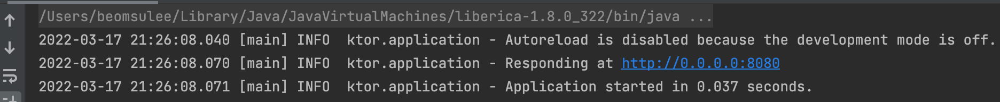

# Creating a new Ktor project

Ktor는 마이크로서비스, 웹 어플리케이션 등을 만들기 위한 비동기 프레임워크이다. IntelliJ IDEA Ultimate 플러그인 또는 web-based project generator를 사용해 Ktor
프로젝트를 만들 수 있다. 이 가이드에선 Ktor 프로젝트 생성 및 간단한 Ktor 애플리케이션을 테스트한다.

## Install the Ktor plugin

시작하기 전 IntelliJ IDEA Ultimate에서 Ktor 플러그인을 설치한다.

## Create a new Ktor project

만약 IntelliJ IDEA Community Edition을 사용한다면, [Ktor Project Generator](https://start.ktor.io/)를 사용해 프로젝트를 생성한다.

## Run a Ktor application

생성된 Ktor 애플리케이션을 실행하기 위해 다음 단계를 따라라.

1. Application.kt 파일을 확인해라.
2. Application.kt 파일에 자동으로 다음 코드가 생성된다.

```kotlin
fun main() {
    embeddedServer(Netty, port = 8080, host = "0.0.0.0") {
        configureRouting()
    }.start(wait = true)
}
```

`embeddedServer` 함수는 코드에 있는 서버 파라미터를 설정하고 애플리케이션을 실행하기 위해 사용된다.

`configureRouting`은 routing 을 정의하는 확장 함수이다. 이 함수는 분리된 plugins 패키지에 선언되어 있다.

 ```kotlin
 fun Application.configureRouting() {

    routing {
        get("/") {
            call.respondText("Hello World!")
        }
    }
}
 ```

`routing` 블럭의 `get` 함수는 `/` 경로로 요청되는 GET 요청을 받고 평문 텍스트를 응답한다.

3. `main` 함수의 옆 아이콘을 클릭해 서버를 실행한다.

<div align="center">

</div>

4. 실행 후 다음 로그를 확인할 수 있다.

<div align="center">

</div>

이는 서버가 **http://0.0.0.0:8080**에 대해 요청을 받을 준비가 된 것이다. 기본 브라우저를 통해 확인한다.

<div align="center">

</div>

## **Test a Ktor application**

생성된 프로젝트를 테스트해보자.

1. **src/test/kotlin/com/example/ApplicationTest.kt 파일을** 연다. 이 파일에서 `handleRequest` 함수는 **/**로 요청되는 GET 요청의 응답 상태와 내용을
   확인한다.
2. `testRoot` 함수 옆의 아이콘을 눌러 테스트를 수행한다.

<div align="center">

</div>

## References

* [Creating a new Ktor project | Ktor](https://ktor.io/docs/intellij-idea.html)