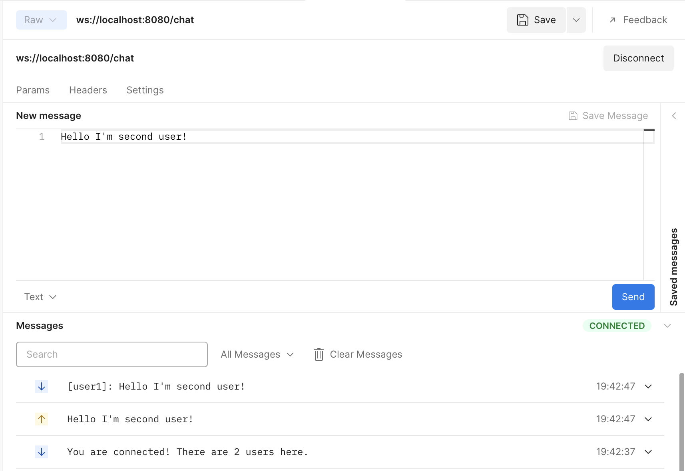

# Creating a WebSocket chat

여기에선 웹소켓을 이용해 간단한 채팅 애플리케이션을 만들어본다. Ktor를 통해 클라이언트와 서버 애플리케이션을 같이 구현한다.

# **What we will build**

2개의 애플리케이션으로 구성된 간단한 채팅 서비스를 구현할 것이다.

- **chat server application**는 유저의 연결을 수립하고 관리하고, 메시지를 받고 연결된 클라이언트에 전달한다.
- **chat client application**는 유저가 채팅 서버에 조인하고, 다른 유저에게 메시지를 보내고 터미널에서 전달된 메시지를 볼 수 있다.

이 두개의 애플리케이션에서 Ktor가 제공하는 웹소켓을 이용한다. Ktor는 서버, 클라이언트 사이드의 프레임워크이기 때문에 클라이언트를 구현할 때 서버에서 구현한 내용을 재사용할 수 있다.

여기서 Ktor와 코틀린을 사용해 웹소켓을 어떻게 사용하는지 알게 되며, 클라이언트와 서버가 어떻게 정보를 교환하고, 여러 연결을 동시에 관리하는 방법을 알게된다.

# **Why WebSockets?**

웹소켓은 채팅이나 간단한 게임 같은 애플리케이션을 만들 때 적합하다. 채팅 세션은 보통 길게 유지되며, 클라이언트는 장기간에 걸쳐 다른 참가자로부터 메시지를 수신한다. 채팅 세션은 양방향 연결이다. 클라이언트는
메시지를 전송하며, 다른 사람의 채팅 메시지를 보고 싶어한다.

HTTP 요청과 다르게 웹소켓 연결은 긴 시간 유지할 수 있고, frame 형태의 서버, 클라이언트 데이터 교환을 위한 쉬운 인터페이스를 가지고 있다. 프레임은 다양한 유형(text, binary, close,
ping/pong)이 있다. Ktor는 웹소켓 프로토콜을 통해 고차원의 추상을 제공하기 때문에, 텍스트와 바이너리 프레임에 집중할 수 있으며, 다른 처리들을 프레임워크에 맡길 수 있다.

웹소켓은 널리 지원되는 기술이다. 모든 최신 브라우저는 기본적으로 웹소켓과 함께 작동할 수 있으며, 웹소켓과 함께 작동하는 프레임워크는 많은 프로그래밍 언어와 플랫폼에 존재한다.

# **Project setup**

2개의 독립된 애플리케이션을 만들기 때문에, 두 개의 분리된 Gradle 프로젝트로 구성해야 한다. 이 두 프로젝트는 완전히
독립적이며, [Ktor Project Generator](https://start.ktor.io/#)
또는 [plugin for IntelliJ IDEA](https://ktor.io/docs/intellij-idea.html)로 생성할 수 있다.

이 구성하는 과정을 스킵하기 위해 미리 준비된 프로젝트를 이용한다.

* [ktor-websockets-chat-sample](https://github.com/ktorio/ktor-websockets-chat-sample)

이 레포지토리는 두 개의 `client`, `server` Gradle 프로젝트를 가지고 있다. 모두 이미 디펜던시들이 설정되어 있어 따로 설정할 필요가 없다.

## **Understanding the project configuration**

두 개의 프로젝트에 각각 설정 파일이 있다.

### **Dependencies for the server project**

서버 애플리케이션은 3개의 디펜던시가 있다.

```groovy
dependencies {
    implementation("io.ktor:ktor-server-netty:$ktor_version")
    implementation("io.ktor:ktor-websockets:$ktor_version")
    implementation("ch.qos.logback:logback-classic:$logback_version")
}
```

- `ktor-server-netty`는 Netty 엔진과 함께 Ktor를 추가한다. 다른 외부 애플리케이션 컨테이너에 의존하지 않고 서버의 기능을 사용할 수 있다.
- `ktor-websockets`은 [WebSocket Ktor plugin](https://ktor.io/docs/websocket.html)을 사용해 주 통신 메커니즘을 구현할 수 있게 해준다.
- `logback-classic`은 포맷된 로그를 콘솔에 출력해준다.

### **Configuration for the server project**

Ktor는 HOCON 설정 파일을 사용해 엔트리 포인트, 포트 등의 기본적인 설정을 정의한다. `server/src/main/resources/application.conf`에서 확인할 수 있다.

```kotlin
ktor {
    deployment {
        port = 8080
    }
    application {
        modules = [com.jetbrains.handson.chat.ApplicationKt.module]
    }
}
```

`logback.xml` 파일도 존재하는데, `logback-classic` 구현을 설정한다.

### **Dependencies for the client project**

클라이언트 애플리케이션은 2개의 디펜던시를 사용한다.

```kotlin
dependencies {
    implementation("io.ktor:ktor-client-websockets:$ktor_version")
    implementation("io.ktor:ktor-client-cio:$ktor_version")
}
```

- `ktor-client-cio`는 코루틴 위의 Ktor의 클라이언트 구현을 제공한다(”Coroutine-based I/O”).
- `ktor-client-websockets`은 `ktor-websockets`의 counterpart이며, 서버와 동일한 API를 사용해 클라이언트에서 웹소켓을 사용할 수 있다.

# **A first echo server**

## **Implementing an echo server**

웹소켓 연결을 받아 텍스트 콘텐트를 받고 클라이언트에게 “echo”를 출력해주도록 구현해보자. `Application.module()`을 다음과 같이 구현한다.

```kotlin
fun Application.module() {
    install(WebSockets)
    routing {
        webSocket("/chat") {
            send("You are connected!")
            for (frame in incoming) {
                frame as? Frame.Text ?: continue
                val receivedText = frame.readText()
                send("You said: $receivedText")
            }
        }
    }
}
```

`WebSockets` Ktor 플러그인 설치를 통해 Ktor 프레임워크로 제공되는 웹소켓 관련 기능을 활성화한다. 이는 에웹소켓 프로토콜에 응답하도록 엔드포인트를 정의하는 것을 허용한다. `webSocket`
route 함수의 스코프 내에서, 클라이언트와 상호작용 할 수 있는 다양한 메서드를 사용할 수 있다(`DefaultWebSocketServerSession` receiver type). 이것은 메시지를 전송하고 받은
메시지를 반복하는 편리한 메서드를 포함하고 있다.

text 콘텐트만 받기 때문에 incoming channel에서 텍스트가 아닌 `Frame`은 스킵된다. 받은 텍스트를 읽고 읽은 텍스트를 유저에게 전달한다.

완전한 echo 서버를 만들었다. 이제 테스트해보자.

## **Trying out the echo server**

현재 web-based 웹소켓 클라이언트를 사용해 echo 서버에 연결할 수 있다. 메시지를 보내고 응답을 확인하자.

`fun main` 옆의 실행 아이콘을 눌러 서버를 실행하자. 이제 서비스를 확인하기 위해 Postman을 사용해 `ws://localhost:8080/chat`에 연결하고 테스트해보자.

<div align="center">

</div>

웹소켓을 통해 양방향 통신을 수행할 수 있다. 이제 여러 참가자를 허용하고 메시지를 공유하는 채팅 서버와 비슷하게 확장해보자.

# **Exchanging messages**

echo 서버를 실제 채팅 서버로 변경해보자! 동일한 유저가 보낸 메시지를 식별하기 위해 username을 태그한다. 또한 메시지가 연결된 다른 유저들에게 브로드캐스트 되도록 만들어야 한다.

## **Modeling connections**

이 두 기능 모두 서버가 보유하고 있는 연결을 추적할 수 있어야 한다. 어떤 유저가 메시지를 보냈고, 누구에게 브로드캐스트 해야 하는지 알아야 한다.

Ktor는 웹소켓 연결을 웹소켓을 통해 `incoming`, `outgoing`를 포함해 통신하는데 필요한 것을 모두 포함하고 있는 `DefaultWebSocketSession` 타입의 객체를 사용해 웹소켓 연결을
관리한다. 지금은 사용자 이름 할당 문제를 단순화하고, 카운터를 기반으로 자동으로 생성된 username을 제공할 수
있다. `server/src/main/kotlin/com/jetbrains/handson/chat/server/` 경로에 `Connection.kt` 파일을 생성하고 다음과 같이 작성한다.

```kotlin
class Connection(val session: DefaultWebSocketSession) {
    companion object {
        var lastId = AtomicInteger(0)
    }

    val name = "user${lastId.getAndIncrement()}"
}
```

카운터에 대한 thread-safe 데이터 구조로 `AtomicInteger`를 사용한다. 동시에 두 유저가 동일한 ID를 갖지 못하는 것을 보장한다.

## **Implementing connection handling and message propagation**

이제 Connection 객체를 추적하고, username이 접두사로 붙은 모든 연결된 클라이언트에 메시지를 보내도록 서버 프로그램을 조절할 수
있다. `server/src/main/kotlin/com/jetbrains/handson/chat/server/Application.kt`의 `routing` 블럭을 다음과 같이 작성한다.

```kotlin
routing {
    val connections = Collections.synchronizedSet<Connection?>(LinkedHashSet())
    webSocket("/chat") {
        println("Adding user!")
        val thisConnection = Connection(this)
        connections += thisConnection
        try {
            send("You are connected! There are ${connections.count()} users here.")
            for (frame in incoming) {
                frame as? Frame.Text ?: continue
                val receivedText = frame.readText()
                val textWithUsername = "[${thisConnection.name}]: $receivedText"
                connections.forEach {
                    it.session.send(textWithUsername)
                }
            }
        } catch (e: Exception) {
            println(e.localizedMessage)
        } finally {
            println("Removing $thisConnection!")
            connections -= thisConnection
        }
    }
}
```

서버는 이제 thread-safe한 `Connection` collection을 저장한다. 유저가 연결되면 그들의 `Connection` 객체(고유의 username으로 할당된)를 생성하고, collection에
추가한다. 그런 다음 환영 메시지와 몇명의 유저가 연결되어 있는지 알여준다. 유저로부터 메시지를 받았을 때, `Connection` 객체에서 고유의 이름으로 현재 연결된 사용자에게 전송한다. 연결이 끊났을 때
collection의 `Connection` 객체를 제거한다. incoming channel이 close되거나, 네트워크 연결이 의도치 않게 끊겨 `Exception`이 발생했을 때.

서버에서 동작이 제대로 수행되는 것을 확인하기 위해 Postman으로 확인해본다. username 할당과 연결된 유저에게 메시지를 브로드캐스팅 하는 것을 확인해보자. 2개의 클라이언트를 만들고 테스트한다.

<div align="center" class="column">
<div></div>
<div></div>
</div>

이제 채팅에 참가한 여러 유저들이 메시지를 전송하고 받을 수 있다.

다음 챕터에서 커맨드라인을 통해 직접 메시지를 전송하고 받을 수 있도록 코틀린 채팅 클라이언트를 만들어본다. 클라이언트도 Ktor를 사용해 구현되므로, 서버 구현에서 사용된 일부분을 재사용할 수 있다.

# Creating the chat client

Ktor Websocket 클라이언트 라이브러리를 사용하기 때문에, 서버에서 사용된 코드와 메서드와 유사하다. 우선 간단하게 메시지를 전달하고 받는 클라이언트를
만들어보자. `client/src/main/kotlin/com/jetbrains/handson/chat/client/ChatClient.kt` 파일을 다음과 같이 작성한다.

```kotlin
fun main() {
    val client = HttpClient {
        install(WebSockets)
    }
    runBlocking {
        client.webSocket(method = HttpMethod.Get, host = "127.0.0.1", port = 8080, path = "/chat") {
            while (true) {
                val othersMessage = incoming.receive() as? Frame.Text ?: continue
                println(othersMessage.readText())
                val myMessage = readLine()
                if (myMessage != null) {
                    send(myMessage)
                }
            }
        }
    }
    client.close()
    println("Connection closed. Goodbye!")
}
```

여기서 먼저 `HttpClient`를 만들고 Ktor의 `WebSocket` 플러그인을 설치한다. 이전 장의 `WebSocket` 플러그인과 설치하는 방법이 유사하다. 네트워크 호출을 담당하는 Ktor의 함수는
코루틴에서 suspend 메커니즘을 사용하므로, 네트워크 연관된 코드를 `runBlocking` 블록으로 감싸준다. `WebSocket` handler 내부에서 incoming 메시지를 처리하고 outgoing
메시지를 전송한다. 텍스트를 포함하고 있지 않은 frame은 무시하고, incoming 텍스트를 읽고 유저 입력을 서버로 전달한다.

그러나 이 “직접적인" 구현은 실제 채팅 클라이언트로 사용하지 못하는 문제가 있다. `readLine()`을 호출할 때 프로그램은 유저가 메시지를 입력할 때까지 기다린다. 이 시간동안, 다른 유저가 입력한 어떠한
메시지도 확인할 수 없다. 비슷하게 메시지를 받고 `readLine()`을 호출해도, 한 번에 하나의 새 메시지만 볼 수 있다.

서버를 실행한 후 2개의 채팅 클라이언트를 생성해 확인할 수 있다. `client/src/main/kotlin/com/jetbrains/handson/chat/client/ChatClient.kt`를 실행하여
확인해보자. `Allow parallel run`을 체크하여 여러 애플리케이션을 실행한다.

<div align="center">

</div>

이 이슈를 더 좋은 방법으로 처리해보자.

## **Improving our solution**

채팅 클라이언트의 더 좋은 구조는 메시지 출력과 입력 메커니즘을 분리하여 동시에 실행되도록 하는 것이다. 메시지가 수신되면 즉시 출력하고, 유저는 새로운 채팅 메시지를 어느때나 입력할 수 있어야 한다.

웹소켓의 incoming channel에서 메시지를 받으면, 커맨드 라인에 출력해야 한다. `ChatClient.kt`에 `outputMessages()` 함수를 작성한다.

```kotlin
suspend fun DefaultClientWebSocketSession.outputMessages() {
    try {
        for (message in incoming) {
            message as? Frame.Text ?: continue
            println(message.readText())
        }
    } catch (e: Exception) {
        println("Error while receiving: " + e.localizedMessage)
    }
}
```

`DefaultClientWebSocketSession`의 컨텍스트 내 함수 연산자 때문에, 확장 함수로 `outputMessages()`를 정의할 수 있다. 새로운 메시지를 사용할 수 없는 동안 `incoming`
채널을 반복하면 코루틴이 suspend 되기 때문에, `suspend` modifier를 추가하는 것을 잊지 말자.

이제 유저 입력을 수행하는 2번째 함수를 만들어보자. `ChatClient.kt`
파일에 `inputMessages()`를 작성한다.

```kotlin
suspend fun DefaultClientWebSocketSession.inputMessages() {
    while (true) {
        val message = readLine() ?: ""
        if (message.equals("exit", true)) return
        try {
            send(message)
        } catch (e: Exception) {
            println("Error while sending: " + e.localizedMessage)
            return
        }
    }
}
```

다시 한 번 `DefaultClientWebSocketSession`의 확장 함수를 선언한다. 이 함수는 커맨드 라인의 텍스트를 읽어 서버로 전송하거나 `exit`를 입력 받았을 경우 종료시킨다.

이전 구현은 입력과 출력을 하나의 루프에서 수행했지만, 이제는 분리되어 독립적인 작업으로 수행한다.

### **Wiring it together**

이 두 함수를 사용해보자! WebSocket handler에서 호출한다.

```kotlin
fun main() {
    val client = HttpClient {
        install(WebSockets)
    }
    runBlocking {
        client.webSocket(method = HttpMethod.Get, host = "127.0.0.1", port = 8080, path = "/chat") {
            val messageOutputRoutine = launch { outputMessages() }
            val userInputRoutine = launch { inputMessages() }

            userInputRoutine.join()
            messageOutputRoutine.cancelAndJoin()
        }
    }
    client.close()
    println("Connection closed. Goodbye!")
}
```

이 새로운 구현은 우리의 앱의 동작을 개선시킨다. 서버와 연결되면, `outputMessages()`, `inputMessages()`를 `launch` 함수를 사용해 새로운 코루틴에서 실행된다(현재 스레드 블락
없이). launch 함수는 `Job` 객체를 반환하며, `exit` 입력이 있거나 네트워크 에러가 발생할 때까지 프로그램을 수행한다. `inputMessages()`가 반환되면, `outputMessages()`
함수를 취소하고, 클라이언트를 `close` 한다.

### **Let's give it a try!**

이제 WebSocket 기반 채팅 클라이언트를 만들었다. 채팅 서버를 실행시키고, 클라이언트 여러 개를 만들어 테스트해보자.

<div align="center">

</div>

# **What's next**

서버, 클라이언트 웹소켓 채팅 애플리케이션을 만들었다.

## Feature requests

이제 서버, 클라이언트의 기본적인 채팅 서비스를 만들 수 있다.

## References

* [Creating a WebSocket chat | Ktor](https://ktor.io/docs/creating-web-socket-chat.html)