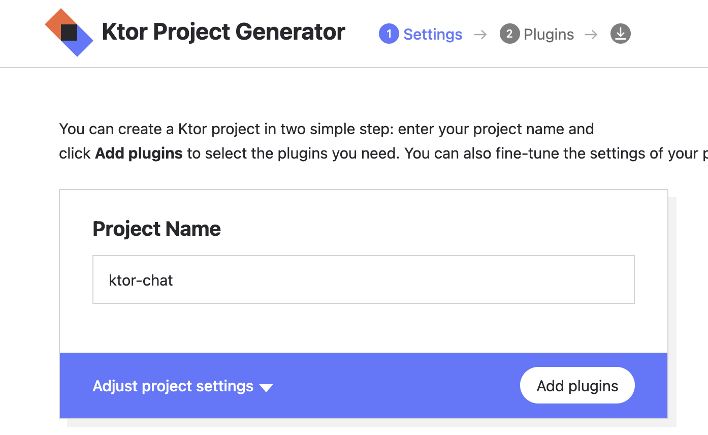
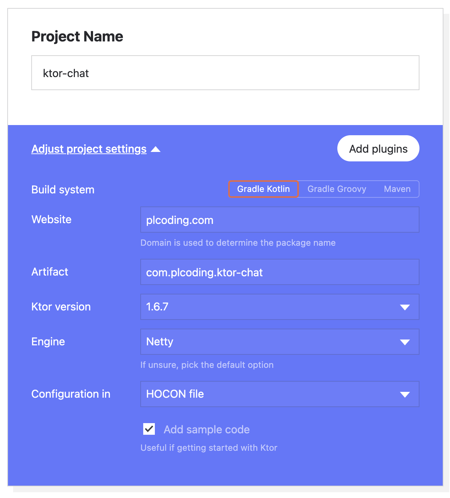
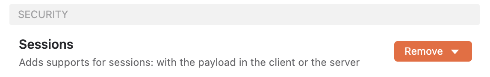
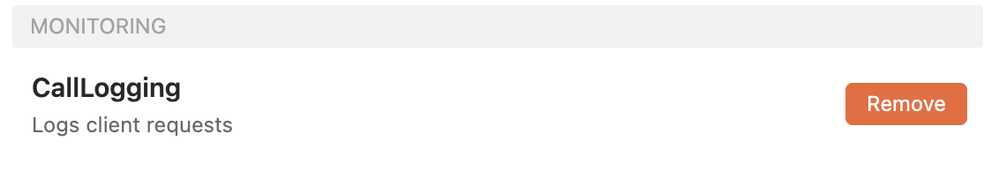
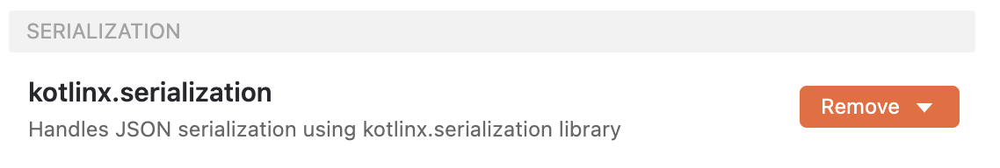
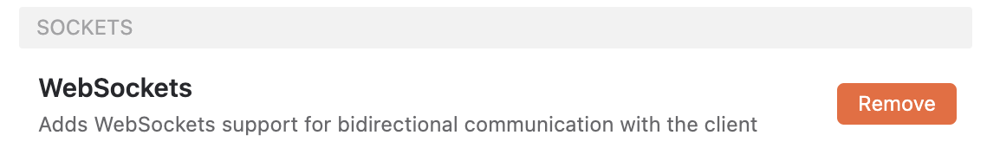
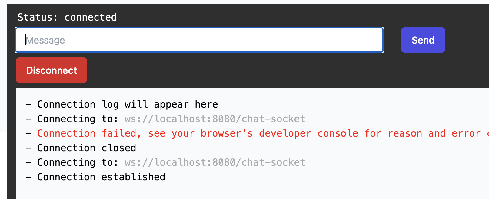
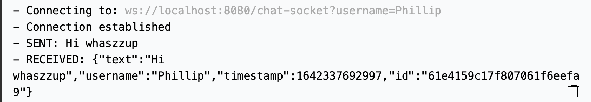
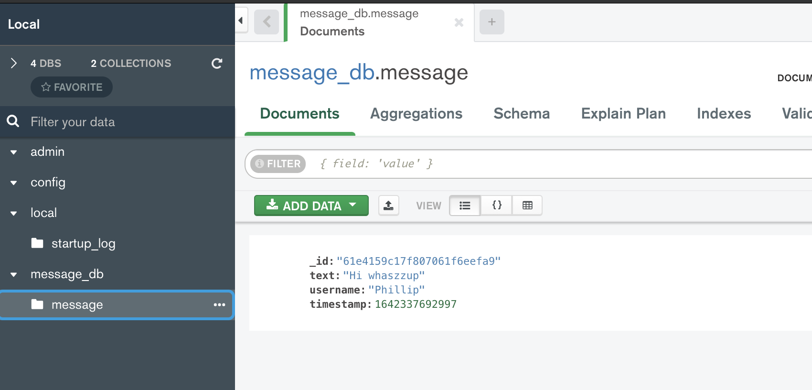

# Building the Server

안드로이드 앱은 [Building the Android App](https://github.com/beomsu317/study/blob/main/contents/android/example/android-chat-app-with-ktor/building-the-android-app.md)를 참고한다.

## Setup Ktor

[여기로](https://start.ktor.io/#/settings?name=ktor-chat&website=example.com&artifact=com.example.ktor-chat&kotlinVersion=1.6.10&ktorVersion=2.0.0-beta-1&buildSystem=GRADLE_KTS&engine=NETTY&configurationIn=CODE&addSampleCode=true&plugins=) 이동해서 다음과 같이 설정한 후 ktor-chat 프로젝트를 생성하자.

<div align="center" class="column">


</div>

다음과 같은 플러그인들을 추가한다.

<div align="center" class="column">




</div>

Intellij를 통해 ktor-chat을 열어보자. `Application.kt` 파일에 entry point가 있다.

```kotlin
fun main(args: Array<String>): Unit =
    io.ktor.server.netty.EngineMain.main(args)

@Suppress("unused") // application.conf references the main function. This annotation prevents the IDE from marking it as unused.
fun Application.module() {
    configureRouting()
    configureSockets()
    configureSerialization()
    configureMonitoring()
    configureSecurity()
}
```

`plugins/Routing.kt` 파일에 `Application.configureRouting()`에 존재하는 `routing` 블럭을 삭제하자.

```kotlin
fun Application.configureRouting() {
    
}
```

`plugins/Serialization.kt` 파일도 동일하게 `routing` 블럭을 제거해준다.

```kotlin
fun Application.configureSerialization() {
    install(ContentNegotiation) {
        json()
    }
}
```

`build.gradle.kts` 파일에 디펜던시를 추가로 작성한다.

```kotlin
val kmongo_version: String by project
val koin_version: String by project
// ...

dependencies {
    // ...

    // KMongo
    implementation("org.litote.kmongo:kmongo:$kmongo_version")
    implementation("org.litote.kmongo:kmongo-coroutine:$kmongo_version")

    // Koin core features
    implementation("io.insert-koin:koin-core:$koin_version")
    implementation("io.insert-koin:koin-ktor:$koin_version")
    implementation("io.insert-koin:koin-logger-slf4j:$koin_version")
}
```

`gradle.properties` 파일에 다음과 같이 kmongo, koin 버전을 작성해주면 에러가 없어지게 된다.

```kotlin
// ...
koin_version=3.1.2
kmongo_version=4.3.0
```

그 다음 gradle 파일을 싱크해준다.

## Setup MongoDB

[여기](https://velog.io/@theagri/macOS-BigSur%EC%97%90-MongoDB-%EC%84%A4%EC%B9%98%ED%95%98%EA%B8%B0)를 보고 Mac에 MongoDB를 설치한다. 그 후 다음 커맨드를 통해 mongodb-community-shell을 설치해준다.

```bash
brew install mongodb-community-shell
```

또한 GUI 툴인 Compass를 설치한다.

## Implementation

`data/model` 패키지를 만들고 `Message` 데이터 클래스를 생성한다.

```kotlin
// json으로 serializable하기 위함
@Serializable
data class Message(
    val text: String,
    val username: String,
    val timestamp: Long,
    @BsonId
    val id: String = ObjectId().toString() // random id
)
```

`data` 패키지 하위에 `MessageDataSource`를 생성해준다.

```kotlin
interface MessageDataSource {

    suspend fun getAllMessages(): List<Message>

    suspend fun insertMessage(message: Message)
}
```

동일한 위치에 위 `MessageDataSource`에 대한 구현을 만들어준다.

```kotlin
class MessageDataSourceImpl(
    private val db: CoroutineDatabase  // mongodb instance
): MessageDataSource {

    // message collection을 만들어주기 위함
    private val messages = db.getCollection<Message>()

    override suspend fun getAllMessages(): List<Message> {
        return messages.find()
            .descendingSort(Message::timestamp)
            .toList()
    }

    override suspend fun insertMessage(message: Message) {
        messages.insertOne(message)
    }
}
```

chat session을 처리하는 room을 만들어주어야 하며 해당 room에 조인한 모든 멤버에 대한 참조를 유지하고 있어야 한다. `room` 패키지를 만들고 하위에 `Member` 데이터 클래스를 생성한다.

```kotlin
data class Member(
    val username: String,
    val sessionId: String,
    // socket은 멤버에게 무언가를 전송하기 위함이며, 안드로이드 앱에서 그 메시지를 받은 후 보여주어야 함
    val socket: WebSocketSession
)
```

유저가 이미 있는 경우 예외처리를 하기 위한 `MemberAlreadyExistsException` 클래스를 생성한다.

```kotlin
class MemberAlreadyExistsException: Exception(
    "There is already a member with that username in the room."
)
```

`room` 디렉토리에 `RoomController`를 생성한다.

```kotlin
class RoomController(
    private val messageDataSource: MessageDataSource
) {
    // ConcurrentHashMap : 오직 하나의 스레드만 write 할 수 있다.
    private val members = ConcurrentHashMap<String, Member>()

    fun onJoin(
        username: String,
        sessionId: String,
        socket: WebSocketSession
    ) {
        if (members.containsKey(username)) {
            throw MemberAlreadyExistsException()
        }
        members[username] = Member(
            username = username,
            sessionId = sessionId,
            socket = socket
        )
    }

    suspend fun sendMessage(senderUsername: String, message: String) {
        members.values.forEach { member ->
            val messageEntity = Message(
                text = message,
                username = senderUsername,
                timestamp = System.currentTimeMillis()
            )
            messageDataSource.insertMessage(messageEntity)

            val parsedMessage = Json.encodeToString(messageEntity)
            // 파라미터로 전달되는 frame은 웹소켓을 통해 보내는 데이터
            member.socket.send(Frame.Text(parsedMessage))
        }
    }

    suspend fun getAllMessages(): List<Message> {
        return messageDataSource.getAllMessages()
    }

    suspend fun tryDisconnect(username: String) {
        members[username]?.socket?.close()
        if (members.containsKey(username)) {
            members.remove(username)
        }
    }
}
```

`plugins` 패키지의 `Security.kt` 파일의 `routing` 블럭을 제거하고 다음과 같이 만들어준다.

```kotlin
fun Application.configureSecurity() {
    data class MySession(val count: Int = 0)
    install(Sessions) {
        cookie<MySession>("MY_SESSION") {
            cookie.extensions["SameSite"] = "lax"
        }
    }
}
```

`session` 패키지를 생성한 후 하위에 `ChatSession` 데이터 클래스를 만들어준다.

```kotlin
data class ChatSession(
    val username: String,
    val sessionId: String
)
```

`Security.kt`를 다음과 같이 `ChatSession`을 통해 생성하도록 작성한다.

```kotlin
fun Application.configureSecurity() {

    install(Sessions) {
        cookie<ChatSession>("MY_SESSION")
    }

    // 실제로 세션을 할당할 위치
    intercept(ApplicationCallPipeline.Features) {
        if (call.sessions.get<ChatSession>() == null) {
            val username = call.parameters["username"] ?: "Guest"
            call.sessions.set(ChatSession(username, generateNonce()))
        }
    }
}
```

`routes`에 2개의 route를 작성해준다.

```kotlin
fun Route.chatSocket(roomController: RoomController) {
    // 클라이언트는 웹소켓을 통해 이 route를 연결한다.
    webSocket("/chat-socket") {
        // 유저에 대한 정보를 얻을 수 있음
        val session = call.sessions.get<ChatSession>()
        if (session == null) {
            close(CloseReason(CloseReason.Codes.VIOLATED_POLICY, "No session."))
            return@webSocket
        }
        try {
            roomController.onJoin(
                username = session.username,
                sessionId = session.sessionId,
                socket = this
            )
            // receive channel
            // 웹소켓에 메시지가 있을 때마다 실행됨
            incoming.consumeEach { frame ->
                if (frame is Frame.Text) {
                    roomController.sendMessage(
                        senderUsername = session.username,
                        message = frame.readText()
                    )
                }
            }
        } catch (e: MemberAlreadyExistsException) {
            call.respond(HttpStatusCode.Conflict)
        } catch (e: Exception) {
            e.printStackTrace()
        } finally {
            roomController.tryDisconnect(session.username)
        }
    }
}

fun Route.getAllMessages(roomController: RoomController) {
    get("/messages") {
        call.respond(
            HttpStatusCode.OK,
            roomController.getAllMessages()
        )
    }
}
```

Koin 설정을 하기 위해 `di` 패키지를 만들고 `MainModule.kt` 파일을 생성한다.

```kotlin
val mainModule = module {
    single {
        KMongo.createClient()
            .coroutine
            .getDatabase("message_db")
    }
    single<MessageDataSource> {
        MessageDataSourceImpl(get())
    }
    single {
        RoomController(get())
    }
}
```

`mainModule`을 파라미터로 전달해 Koin을 설치한다.

```kotlin
@Suppress("unused") // application.conf references the main function. This annotation prevents the IDE from marking it as unused.
fun Application.module() {
    install(Koin) {
        modules(mainModule)
    }
    configureRouting()
    configureSockets()
    configureSerialization()
    configureMonitoring()
    configureSecurity()
}
```

`plugin` 디렉토리의 `Routing.kt`에 다음과 같이 Routing을 추가한다.

```kotlin
fun Application.configureRouting() {
    val roomController by inject<RoomController>()
    install(Routing) {
        chatSocket(roomController)
        getAllMessages(roomController)
    }
}
```

`configureSockets()`와 `configureRouting()` 위치를 바꿔주어야 웹소켓 설치 후 Routing을 설정하기 때문에 오류가 발생하지 않는다.

```kotlin
@Suppress("unused") // application.conf references the main function. This annotation prevents the IDE from marking it as unused.
fun Application.module() {
    install(Koin) {
        modules(mainModule)
    }
    configureSockets()
    configureRouting()
    configureSerialization()
    configureMonitoring()
    configureSecurity()
}
```

`configureSockets`의 `routing` 블럭을 제거해준다.

```kotlin
fun Application.configureSockets() {
    install(WebSockets) {
        pingPeriod = Duration.ofSeconds(15)
        timeout = Duration.ofSeconds(15)
        maxFrameSize = Long.MAX_VALUE
        masking = false
    }
}
```

이제 서버 측 구현은 완료가 되었으며 [여기서](https://www.piesocket.com/websocket-tester) 웹 소켓 테스트를 수행할 수 있다.

<div align="center">

</div>

`username`을 파라미터로 전달한 후 메시지를 보내면 보낸 메시지를 전달받을 수 있다.

<div align="center">

</div>

몽고 디비를 확인해보면 다음과 같이 보낸 메시지를 확인할 수 있다.

<div align="center">

</div>


## References

* [How to Make a Chat App With Ktor - Building the Server - Part 1](https://www.youtube.com/watch?v=Wa-e3IsNEeo&list=PLQkwcJG4YTCSHLKOwFeFvA7XlAGXYa_y0)
